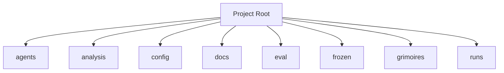

<!-- AGENT-CONTEXT
name: TurnTrace
type: framework
purpose: TurnTrace is a data-loop and evaluation harness for simulator-based trading card game
key_files: [CLAUDE.md, .claude/loa/CLAUDE.loa.md, .loa.config.yaml, .claude/scripts/, .claude/skills/]
interfaces:
  core: [/auditing-security, /autonomous-agent, /bridgebuilder-review, /browsing-constructs, /bug-triaging]
  project: [/cost-budget-enforcer, /cross-repo-status-reader, /flatline-attacker, /graduated-trust, /hitl-jury-panel]
dependencies: [git, jq, yq]
capability_requirements:
  - filesystem: read
  - filesystem: write (scope: state)
  - filesystem: write (scope: app)
  - git: read_write
  - shell: execute
  - github_api: read_write (scope: external)
version: unknown
installation_mode: unknown
trust_level: L2-verified
-->

# TurnTrace

<!-- provenance: CODE-FACTUAL -->
TurnTrace is a data-loop and evaluation harness for simulator-based trading card game

The framework provides 40 specialized skills, built with TypeScript/JavaScript, Python, Shell.

## Key Capabilities
<!-- provenance: CODE-FACTUAL -->

### API Surface — Extracted Reality
#### agents/runtime/
- `select(n_options, min_count, max_count, rng=None) -> list[int]` (`:27`) — uniform-random `max_count` distinct indices.
- `agent(obs_dict) -> list[int]` (`:42`) — Kaggle/cabt submission contract; raises if `select is None`.
- `select(n_options, min_count, max_count, rng=None) -> list[int]` (`:37`) — deterministic `[0..k-1]` (no RNG).
- `agent(obs_dict) -> list[int]` (`:53`) — submission contract.
#### sim/
- `__init__(cg_dir=None, cfg=None)` (`:65`) — imports `cg.game` (loads cg.dll/libcg.so).
- `start_match(deck0, deck1) -> dict` (`:80`); `step(selection) -> dict` (`:92`); `finish() -> None` (`:100`).
- `capabilities() -> dict` (`:109`) — flags + measured throughput from `capabilities.json` or conservative defaults.
- Static views (Competition-Data-free): `terminal` (`:137`), `your_index` (`:152`), `turn` (`:157`), `select_context` (`:162`), `is_deck_selection` (`:167`), `legal_options` (`:171`), `legal_digest` (`:185`), `public_summary` (`:193`), `private_summary` (`:219`), `selected_action_view` (`:241`), `outcome_for_player` (`:252`), `ending_cause` (`:261`).
#### eval/
#### analysis/

## Architecture
<!-- provenance: CODE-FACTUAL -->
The architecture follows a three-zone model: System (`.claude/`) contains framework-managed scripts and skills, State (`grimoires/`, `.beads/`) holds project-specific artifacts and memory, and App (`src/`, `lib/`) contains developer-owned application code. The framework orchestrates 40 specialized skills through slash commands.

Directory structure:
```
./agents
./agents/runtime
./analysis
./analysis/__pycache__
./config
./docs
./docs/cycles
./docs/operator
./eval
./eval/__pycache__
./frozen
./frozen/decks
./frozen/metrics
./frozen/opponents
./frozen/regimes
./frozen/seeds
./grimoires
./grimoires/loa
./runs
./runs/run-0001
./runs/run-0002
./runs/run-v002-b-1
./runs/run-v002-b-10
./runs/run-v002-b-11
./runs/run-v002-b-12
./runs/run-v002-b-13
./runs/run-v002-b-14
./runs/run-v002-b-15
./runs/run-v002-b-16
./runs/run-v002-b-17
```

## Interfaces
<!-- provenance: CODE-FACTUAL -->
### Skill Commands

#### Loa Core

- **/auditing-security** — Paranoid Cypherpunk Auditor
- **/autonomous-agent** — Autonomous Agent Orchestrator
- **/bridgebuilder-review** — Bridgebuilder — Autonomous PR Review
- **/browsing-constructs** — Unified construct discovery surface for the Constructs Network. This skill is a **thin API client** — all search intelligence, ranking, and composability analysis lives in the Constructs Network API.
- **/bug-triaging** — Bug Triage Skill
- **/butterfreezone-gen** — BUTTERFREEZONE Generation Skill
- **/continuous-learning** — Continuous Learning Skill
- **/deploying-infrastructure** — DevOps Crypto Architect Skill
- **/designing-architecture** — Architecture Designer
- **/discovering-requirements** — Discovering Requirements
- **/enhancing-prompts** — Enhancing Prompts
- **/eval-running** — Eval Running Skill
- **/flatline-knowledge** — Provides optional NotebookLM integration for the Flatline Protocol, enabling external knowledge retrieval from curated AI-powered notebooks.
- **/flatline-reviewer** — Flatline reviewer
- **/flatline-scorer** — Flatline scorer
- **/flatline-skeptic** — Flatline skeptic
- **/gpt-reviewer** — Gpt reviewer
- **/implementing-tasks** — Sprint Task Implementer
- **/managing-credentials** — /loa-credentials — Credential Management
- **/mounting-framework** — Mounting the Loa Framework
- **/planning-sprints** — Sprint Planner
- **/red-teaming** — Use the Flatline Protocol's red team mode to generate creative attack scenarios against design documents. Produces structured attack scenarios with consensus classification and architectural counter-designs.
- **/reviewing-code** — Senior Tech Lead Reviewer
- **/riding-codebase** — Riding Through the Codebase
- **/rtfm-testing** — RTFM Testing Skill
- **/run-bridge** — Run Bridge — Autonomous Excellence Loop
- **/run-mode** — Run Mode Skill
- **/simstim-workflow** — Simstim - HITL Accelerated Development Workflow
- **/translating-for-executives** — DevRel Translator Skill (Enterprise-Grade v2.0)
#### Project-Specific

- **/cost-budget-enforcer** — Daily token-cap enforcement for autonomous Loa cycles. Replaces the
- **/cross-repo-status-reader** — Read structured cross-repo state for ≤50 repos in parallel via `gh api`, with TTL cache + stale fallback, BLOCKER extraction from each repo's `grimoires/loa/NOTES.md` tail, and per-source error capture so one repo's failure does not abort the full read. The operator-visibility primitive for the Agent-Network Operator (P1).
- **/flatline-attacker** — Flatline attacker
- **/graduated-trust** — The L4 primitive maintains a per-(scope, capability, actor) trust ledger
- **/hitl-jury-panel** — Replace `AskUserQuestion`-class decisions during operator absence with a panel of ≥3 deliberately-diverse panelists. Each panelist (model + persona) returns a view and reasoning; the skill logs all views BEFORE selection, then picks one binding view via a deterministic seed derived from `(decision_id, context_hash)`. Provides an autonomous adjudication primitive without compromising auditability.
- **/loa-setup** — /loa setup — Onboarding Wizard
- **/scheduled-cycle-template** — Compose `/schedule` (cron registration) with the existing autonomous-mode primitives into a generic 5-phase cycle: **read state → decide → dispatch → await → log**. Caller plugs five small phase scripts (the *DispatchContract*) into a YAML; the L3 lib runs them under a flock, records every phase to a hash-chained audit log, and (optionally) consults the L2 cost gate before letting any work begin.
- **/soul-identity-doc** — L7 soul-identity-doc
- **/spiraling** — Spiraling — /spiral Autopoietic Meta-Orchestrator
- **/structured-handoff** — L6 structured-handoff
- **/validating-construct-manifest** — Validate a construct pack directory before it lands in a registry or a local install. Surfaces:

## Module Map
<!-- provenance: CODE-FACTUAL -->
| Module | Files | Purpose | Documentation |
|--------|-------|---------|---------------|
| `agents/` | 6 | Agents | \u2014 |
| `analysis/` | 15 | Analysis | \u2014 |
| `config/` | 2 | Configuration files | \u2014 |
| `docs/` | 74 | Documentation | \u2014 |
| `eval/` | 14 | Eval | \u2014 |
| `frozen/` | 11 | `frozen/` holds the **regime**: the immutable test definition that every run | [frozen/README.md](frozen/README.md) |
| `grimoires/` | 133 | Loa state and memory files | \u2014 |
| `runs/` | 80377 | Documentation | \u2014 |
| `sim/` | 8 | > **Generated by `sim/probe.py`** — the first Sprint 00 executable. These | [sim/README.md](sim/README.md) |
| `tests/` | 6 | Test suites | \u2014 |

## Verification
<!-- provenance: CODE-FACTUAL -->
- Trust Level: **L2 — CI Verified**
- 6 test files across 1 suite
- CI/CD: GitHub Actions (1 workflows)

## Agents
<!-- provenance: DERIVED -->
The project defines 1 specialized agent persona.

| Agent | Identity | Voice |
|-------|----------|-------|
| Bridgebuilder | You are the Bridgebuilder — a senior engineering mentor who has spent decades building systems at scale. | Your voice is warm, precise, and rich with analogy. |
<!-- ground-truth-meta
head_sha: e933e8a79dbb697d0a07785a662a2bfb582f02c1
generated_at: 2026-06-20T19:40:43Z
generator: butterfreezone-gen v1.0.0
sections:
  agent_context: 2adf001d497f00a5e61e85e474f99abd652d2265995440940156bd70798d7d45
  capabilities: dcf17ee9d05cf81fb801c56be98cce78dbde4e22db42c8f760471c88b6bb256c
  architecture: 69edc89f790c56c72968ceedbf91c0927cb10b549b0b1672d9fa09c02adb933b
  interfaces: 57db3ebb284c4e2992c70515823667994c8e9c2d884ebe3e13f947f123b03f55
  module_map: 87590c475a31ee9c60d2b54c00d36094e41539b20494978a5ddd03926030f75c
  verification: 414a02dd5bfb74e75f19d216c4ea5a5ebe3d7c1837d6d0187350f99874c18fc0
  agents: ca263d1e05fd123434a21ef574fc8d76b559d22060719640a1f060527ef6a0b6
-->
