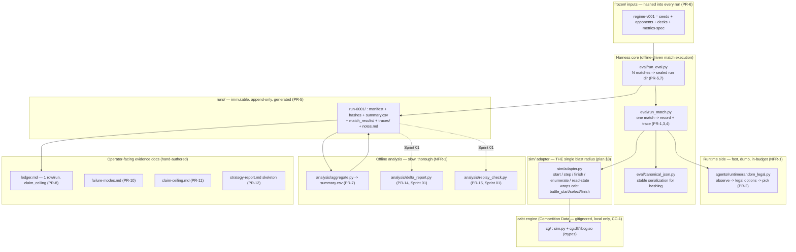
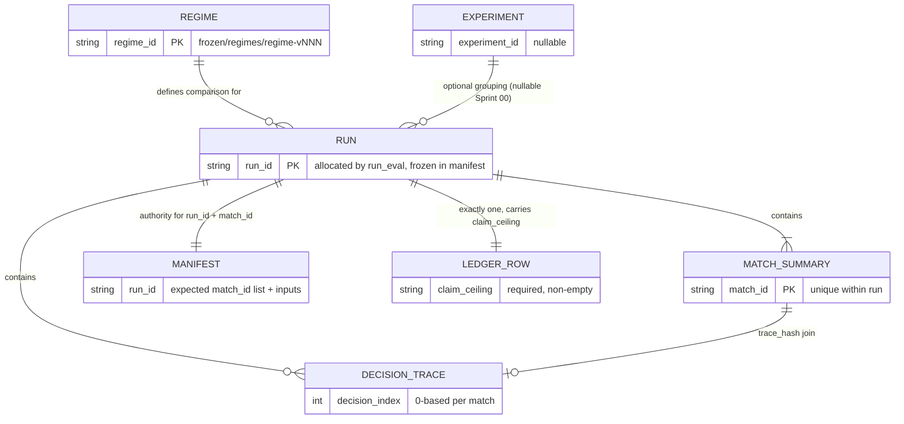

# Software Design Document: TurnTrace

| Field | Value |
|---|---|
| **Version** | 1.0 |
| **Date** | 2026-06-17 |
| **Author** | Architecture Designer Agent |
| **Status** | Draft for review |
| **Cycle** | `cycle-000-bootstrap` |
| **Artifact** | `grimoires/loa/a2a/cycle-000-bootstrap/02-turntrace-sdd.md` |
| **PRD Reference** | `grimoires/loa/a2a/cycle-000-bootstrap/01-turntrace-prd.md` |
| **Primary design source** | Research spike `grimoires/loa/context/Planning/Pokemon TCG AI Battle - Data Loop Plan.md` (the "Data Loop Plan", cited `§N`) |

> **Scope of this cycle.** `cycle-000-bootstrap` produces **planning artifacts only** (PRD → SDD → sprint
> plan). This SDD is a design; it writes **no application code, adds no dependencies, and commits no Kaggle
> files** (operator hard rules; PRD §11.1, CC-1). It translates the PRD's resolved simulator surface (PRD §8)
> and requirements (PRD §6/§7) into a buildable design whose first build is **Sprint 00** (next cycle).
>
> **Grounding.** Design decisions cite the PRD (`prd §N` / `PR-n` / `NFR-n` / `CC-n`), the Data Loop Plan
> (`plan §N`), or the inspected starter kit (`file:Lnn`). Ungrounded claims are tagged `[ASSUMPTION]`; open
> items `[UNKNOWN]` with a fallback. The cabt API docs and rules-differences page are deferred reading for
> the build phase (PRD §17) and are **not** fetched here.

---

## Table of Contents

1. [Project Architecture](#1-project-architecture)
2. [Software Stack](#2-software-stack)
3. [Data Design (schemas & artifacts)](#3-data-design-schemas--artifacts)
4. [Repository Layout — OD-1 Decision](#4-repository-layout--od-1-decision)
5. [Internal Interface Specifications](#5-internal-interface-specifications)
6. [Error Handling Strategy](#6-error-handling-strategy)
7. [Testing Strategy](#7-testing-strategy)
8. [Development Phases](#8-development-phases)
9. [Known Risks and Mitigation](#9-known-risks-and-mitigation)
10. [Open Questions](#10-open-questions)
11. [Appendix](#11-appendix)

> **Template note.** The standard SDD template is web-app-shaped (frontend / relational DB / HTTP API /
> deployment). TurnTrace is a **local, single-process, flat-file CLI evidence harness** with no UI, no
> network service, no server database, and no deployment surface (PRD §7, NFR-7). Those sections are mapped
> to their TurnTrace equivalents: §3 "Database Design" → flat-file artifact schemas; §4 "UI" → repository
> layout & operator-facing files; §5 "API" → the internal `sim/` adapter contract + CLI entrypoints.
> Inapplicable sections are marked **N/A** with the reason rather than padded.

---

## 1. Project Architecture

### 1.1 System Overview

TurnTrace is an **evidence machine** for simulator-based card-game agents (prd §1). It runs matches on the
local `cabt` simulator when available, seals what happened into immutable on-disk artifacts, aggregates
them, and lets two agent versions be compared honestly under a frozen test definition. **It produces
trustworthy evidence about an agent, not a strong agent** (prd §1, §5.2).

The system is a collection of **small Python programs over flat files** — no service, no daemon, no database
engine, no UI. One entrypoint, one config, env-var-driven output directory, flat JSON/CSV/Markdown
(NFR-7). The default answer to any new abstraction is "no, not yet."

### 1.2 Architectural Pattern

**Pattern:** Single-process **pipe-and-filter / batch ETL over an immutable artifact store**, organized as a
**hexagonal (ports-and-adapters) core with one adapter** — the `sim/` adapter that isolates all `cabt` facts.

**Justification.**
- **Batch / flat-file, not service.** Evidence is produced offline between submissions; latency is irrelevant
  and durability + diffability matter. Markdown + CSV + JSON are git-diffable and zero-maintenance; a
  database or dashboard is a maintenance sink producing no new evidence (NFR-7; plan §10 "Overengineering").
- **Immutable artifact store.** Each run is a sealed, append-only directory; writing into a populated run
  directory is a hard error (PR-5, NFR-2). This is what makes a comparison trustworthy weeks later (plan §2).
- **One adapter = one blast radius.** Every `cabt`/simulator-API fact lives behind `sim/` so the rest of the
  system depends on a stable internal contract, not on `cabt` internals. When the live API differs from the
  inspected starter kit, **only `sim/` changes** (plan §3 notes; prd §15 success criterion 2). This is the
  single most important structural rule in the design.
- **Hard runtime/offline separation.** The per-move runtime agent (fast, dumb, in-budget, no scoring
  machinery) and the offline analysis (slow, thorough) **share no code or assumptions** and live in
  physically separate directories and processes (NFR-1; plan §2). This is enforced structurally (§1.6).

### 1.3 Component Diagram



### 1.4 System Components

#### Runtime agent — `agents/runtime/` (PR-2; NFR-1)
- **Purpose:** Select a move inside the per-move budget. Sprint 00 ships **only** `random_legal`.
- **Responsibilities:** Given the observation, read the offered legal option list and return a valid
  selection (indices into `obs.select.option`, count within `[minCount, maxCount]`). `random_legal` =
  `random.sample(range(len(option)), maxCount)` (main.py:L31-38; api.py:L398-409). Pure function of
  (observed state, RNG); **no hidden global state between moves** (plan §2 "Baseline agent(s)").
- **Interfaces:** Exposes `agent(obs_dict) -> list[int]` (the Kaggle/`cabt` contract, main.py) plus a thin
  internal `select(observation) -> selection` the runner calls in-process.
- **Constraints:** No scoring fields, no slow code, no imports from `analysis/` or `sim/` internals beyond the
  observation type, **no network calls** (CC-3 / NFR-8). Optional free-form output goes only in the trace's
  `agent_meta` slot (plan §4.2) — `random_legal` omits it.
- **Dependencies:** the observation object handed in by the runner. Does **not** import `cabt` directly.

#### `sim/` adapter — `sim/adapter.py` (the single blast radius; plan §3)
- **Purpose:** The **only** module that knows `cabt`. Translates between the harness's stable internal types
  and `cabt`'s `battle_start` / `battle_select` / `battle_finish` surface (game.py:L19-66).
- **Responsibilities:** start a match from two 60-card decks; drive alternating selections by
  `state.yourIndex`; expose the legal option list, `minCount`/`maxCount`, observable `State`, the event-log
  stream (`obs.logs`), and the terminal `result`/`reason` (api.py:L318-321, L350-445); surface capability
  facts (seed control, timeout detection, legal-action enumeration) as flags, never as assumptions baked into
  callers.
- **Interfaces:** the internal adapter contract in §5.1 (the harness's "port").
- **Dependencies:** the local `cg/` Competition Data lib (gitignored, CC-1).
- **Rule:** nothing outside `sim/` hard-codes a `cabt` fact. If the live API differs from the starter kit,
  the adapter may split into multiple files **inside `sim/`**, and gaps are logged in `sim/README.md` +
  `failure-modes.md` (plan §3 notes).

#### Match runner — `eval/run_match.py` (PR-1, PR-3, PR-4)
- **Purpose:** Play one match under a fully declared input set and emit one match-summary record + one
  decision-trace sidecar.
- **Responsibilities:** refuse to run if any required input is missing (`agent_a_id`, `agent_b_id`,
  `deck_a_id`, `deck_b_id`, `seed`-or-`match_index`, `regime_id`, `run_id`, `match_id` — plan §2); resolve the
  output path up front; drive the adapter; capture per-decision rows; compute the `trace_hash` over the
  canonical trace; write the record + sidecar.
- **Interfaces:** CLI entrypoint (§5.3) + importable function.
- **Dependencies:** `sim/adapter`, the chosen runtime agent, `eval/canonical_json`.

#### Eval driver — `eval/run_eval.py` (PR-5, PR-7)
- **Purpose:** Drive N matches over `seed-set-v001` into **one** sealed run directory.
- **Responsibilities:** allocate `run_id` + the expected `match_id` list and freeze them into `manifest.json`
  (the authority for ID allocation; plan §4); enforce the immutability guard (refuse to write into a
  populated run dir — hard error, PR-5/NFR-2); build `summary.csv`, `hashes.txt`, `notes.md`; append exactly
  one `ledger.md` row (PR-8).
- **Dependencies:** `run_match`, `frozen/`, `analysis/aggregate`.

#### Canonical serializer — `eval/canonical_json.py`
- **Purpose:** sorted-key, stable-number, no-incidental-whitespace serialization so `trace_hash` is
  reproducible across machines (plan §2 decision-trace; plan §4.2). Shared by runner and offline replay.
- **Note:** in Loa, JCS canonicalization belongs to `lib/jcs.sh` for **audit-chain** writes; that is a
  framework concern and is **not** reused here — TurnTrace artifacts are app-zone evidence files, not L1–L7
  audit-envelope records. The two canonicalizers are independent by design.

#### Offline analysis — `analysis/` (NFR-1)
- `aggregate.py` (PR-7, Sprint 00): roll match records into `summary.csv` (win/draw/error/timeout rates,
  game-length stats, per-matchup breakdown).
- `delta_report.py` (PR-14, **Sprint 01**): compare two run dirs on the same `regime_id`, emit per-metric
  deltas + a "why no change" line per unmoved metric (plan §7.7).
- `replay_check.py` (PR-15, **Sprint 01**): re-hash traces for audit-trail equality; byte-replay only if seed
  control is later proven (NFR-3).

#### Frozen inputs — `frozen/` (PR-6)
- The immutable regime bundle: `seed-set` + `opponent-pool` + `deck-pool` + `metrics-spec` version stamps
  (plan §5.2). A new version is a **new file**, never an edit. Hashed into every run.
- **Competition-Data caveat:** deck *contents* are Pokémon Elements / Competition Data (CC-1/CC-2). `frozen/`
  stores deck **references and content hashes**, not the redistributable card lists themselves (see §4.5).

#### Operator-facing docs — ledger / failure-modes / claim-ceiling / strategy-report
- `ledger.md` (PR-8): the **only** ceiling-bearing artifact; one append-only row per run, each with a
  mandatory `claim_ceiling` and `n` (plan §4.3).
- `failure-modes.md` (PR-10 stub), `claim-ceiling.md` (PR-11 stub), `strategy-report.md` (PR-12 stub):
  seeded skeletons in Sprint 00.

#### Capability probe — first Sprint 00 task (PR-9; OD-4)
- Not a long-lived component but the **first executable**: run one match, dump what the live environment
  actually exposes, and write `sim/README.md` / `sim-notes.md` marking each capability
  **confirmed / unconfirmed / absent** with a fallback (plan §10, §11 Day 1). The harness is shaped against
  the *observed* surface, never assumed.

### 1.5 Data Flow

```mermaid
sequenceDiagram
    participant Op as Operator (CLI)
    participant Eval as run_eval.py
    participant Frozen as frozen/regime-v001
    participant Match as run_match.py
    participant Agent as random_legal
    participant Sim as sim/adapter
    participant Cabt as cabt (cg/)
    participant Run as runs/run-0001/

    Op->>Eval: run_eval --config eval_config.yaml
    Eval->>Frozen: load + hash seeds, opponents, decks, metrics
    Eval->>Run: allocate run_id + match_id list -> manifest.json (immutability guard)
    loop per seed / match_index
        Eval->>Match: run_match(inputs)
        Match->>Sim: battle_start(deck0, deck1)
        loop until terminal
            Sim->>Cabt: battle_select(selection)
            Cabt-->>Sim: observation (State, logs, select.option)
            Sim-->>Match: observation + capability flags
            Match->>Agent: select(observation)
            Agent-->>Match: selection (indices)
            Match->>Match: append canonical trace row
        end
        Sim->>Cabt: battle_finish()
        Cabt-->>Match: result / reason
        Match->>Run: write match_results/Mxxxx.json + traces/Mxxxx.jsonl (trace_hash join)
    end
    Eval->>Run: aggregate -> summary.csv ; write hashes.txt, notes.md
    Eval->>Op: append exactly one ledger.md row (claim_ceiling + n)
```

**Invariants on the flow:** every result-bearing row carries `(regime_id, run_id, agent_version)` as
first-class fields (plan §4); any comparison mixing two `regime_id`s is a bug, not a result (plan §5.5,
NFR-5); a missing capability is logged once and never blocks the loop (NFR-6).

### 1.6 Runtime / Offline Separation (structural enforcement of NFR-1)

The hard separation is enforced by **directory boundaries + a dependency rule**, lint-checkable in the build:

| Side | Lives in | May import | May NOT import |
|---|---|---|---|
| **Runtime** | `agents/runtime/` | the observation type only | `analysis/`, `eval/` internals, anything slow, anything networked (CC-3) |
| **Adapter** | `sim/` | `cabt` (`cg/`) | `agents/`, `analysis/` |
| **Harness core** | `eval/` | `sim/`, `agents/runtime/`, `frozen/` | `analysis/` heavy code on the runtime path |
| **Offline** | `analysis/` | run-dir artifacts (read-only) | `agents/runtime/`, `cabt` directly |

A simple import-direction check (build-time) is the cheapest enforcement; it is added as a Sprint 00 smoke if
trivial, otherwise noted as a convention. The point: **no slow or scoring code can leak onto the per-move
path, and no offline code can reach into `cabt` behind the adapter's back.**

### 1.7 External Integrations

| Integration | Purpose | Type | Notes |
|---|---|---|---|
| `cabt` simulator (`cg/` lib) | Run matches locally | in-process `ctypes` native lib (sim.py:L19-23) | **Competition Data — gitignored, local only, deleted at competition end (CC-1).** Wrapped solely by `sim/`. |
| `kaggle` CLI | Submit / replay / fetch logs | external CLI (out of harness process) | Submission, `kaggle competitions replay/logs` (simulation_competitions.md). Not invoked during episode eval (CC-3). Used by the operator, not the runtime agent. |
| Python runtime | Host language | matches the sim's (Python 3.10+) | No new third-party deps in cycle-000 (operator hard rule; prd §14). |

### 1.8 Deployment Architecture

**N/A — there is nothing to deploy.** TurnTrace runs locally on the engineer's machine; evidence lives in git
(except Competition Data, which never enters git). The competition "deployment" is the operator packaging a
`submission.tar.gz` (`main.py` at top level + `deck.csv` + `cg/`, built `tar -czvf submission.tar.gz *`;
CC-5) and uploading via the `kaggle` CLI — an operator action, not a harness deployment. PR-18 (pre-submission
mirror validation) is the only harness touch-point to that flow and is **Sprint 01+** (PR-18, P1).

### 1.9 Scalability Strategy

Sequential first; sequential is simpler to debug and trace ordering is unambiguous (plan §2). Throughput
(U-2) is **unknown until the capability probe measures it** (PR-9). Fallback if slow: shrink the evaluation-set
N (reduces statistical power, not correctness; prd §8.2 U-2, plan §7.6). Parallel match execution and any
matchmaking beyond "A vs B with these decks" are explicitly deferred (plan §2). RL/self-play stays blocked
until a throughput number exists (prd §11.4).

### 1.10 Security & Compliance Architecture

There is no authentication, no network surface, no secrets, and no PII in TurnTrace — so the usual web
security model is **N/A**. The binding compliance constraints are competition-rule, not infosec:

| Constraint | Design enforcement |
|---|---|
| **CC-1 / CC-2 — Competition Data & Pokémon Elements non-redistributable** | `cg/`, card data, starter `deck.csv`, and raw deck card-lists are **gitignored**; `frozen/` stores references + hashes, not the data (§4.5). A pre-commit hygiene check (build-time) guards against accidental commits (prd §14 risk). |
| **CC-3 / NFR-8 — no ingress/egress during episode eval** | Runtime agent imports nothing networked; the runtime/offline dependency rule (§1.6) keeps it self-contained. |
| **CC-8 — plain-language framing** | No FORGE/Echelon/CORONA in file names, field names, schemas, or competition-facing docs (prd §12). "TurnTrace" is the internal harness name and stays out of submission artifacts. |
| **CC-4 — winner licensing (MIT)** | Repo code is MIT-compatible; Competition Data and Pokémon Elements excluded from any published bundle. |

---

## 2. Software Stack

### 2.1 Language & Runtime

| Category | Technology | Version | Justification |
|---|---|---|---|
| Language | **Python** | **3.10+** | The starter kit is Python over a `ctypes` native lib (sim.py:L19-23); the agent contract is `agent(obs_dict) -> list[int]` (main.py). One language for the repo (plan §3) — Python is fixed, not chosen, by the `cabt` surface. |
| Simulator engine | **`cabt`** (Matsuo Institute) | built for **kaggle-environments 1.14.10** | The competition engine; "same logic as the hosted environment" (prd §8.3). Provenance field, not a dependency we install (CC-1; local only). |

### 2.2 Libraries — Sprint 00 (standard library only; NFR-7, operator hard rule)

No third-party dependencies are added in cycle-000 (prd §14). The first build targets **stdlib only**:

| Need | Stdlib choice | Why (laziness ladder) |
|---|---|---|
| JSON / JSONL read-write | `json` | Native; trace + record format. |
| Canonical serialization | `json.dumps(sort_keys=True, separators=(',',':'))` + normalized number formatting | Stdlib covers sorted-key stable output; a dependency is unjustified for a few lines (plan §4.2). |
| Hashing | `hashlib` (SHA-256) | Flat SHA-256 in a text file is the explicit posture; **no** signing libs (plan §2, §8 deferred). |
| CSV aggregate | `csv` | `summary.csv` is small and flat. |
| Config | `eval_config` as a flat file read with stdlib | Theme/format TBD at build (see §2.4); env-var override for the output dir (NFR-7). |
| CLI args | `argparse` | Stdlib; one entrypoint, env-var-driven output (NFR-7). |
| Timing | `time` / `time.perf_counter` | `decision_latency_ms`, `wall_clock_ms`. |
| Schema validation | a tiny hand-written validator over field lists in `schemas.md` | A schema library is overkill for Sprint 00's field set (plan §7.5 smoke). Revisit only if the schema grows. |

> `[code] → skipped: pydantic/jsonschema/yaml/pandas, add when: the schema set or aggregation outgrows a
> hand-written validator + stdlib csv — not in Sprint 00.`

### 2.3 Config-Format Decision (build input)

`eval_config.*` and the `frozen/` files need a flat, human-diffable format. **Recommendation: JSON** for
machine artifacts (records, traces, manifest, frozen component files) for zero-dependency parsing, and
**Markdown/CSV** for human artifacts (`ledger.md`, `summary.csv`, the doc stubs). YAML is avoided in Sprint 00
to keep the stdlib-only constraint clean (no `pyyaml`). This is a soft default the sprint plan may revisit.

### 2.4 Infrastructure / DevOps

**N/A for the harness.** No cloud, no containers, no orchestration, no CI/CD service is in scope for cycle-000
or Sprint 00 (NFR-7). The only "infra" is the local filesystem and git. (A pre-commit hygiene hook guarding
CC-1 is the single build-time automation, and it is a convention/script, not a service.)

### 2.5 Frontend / UI

**N/A.** No UI is built — flat git-diffable files instead (PR-17 deferred lane; prd §12). See §4 for the
operator-facing file surface that stands in for a UI.

---

## 3. Data Design (schemas & artifacts)

> This replaces the template's "Database Design." TurnTrace has **no database** — its data layer is a set of
> flat-file artifacts linked by a small foreign-key graph (plan §4). The schemas below are the design
> authority; the build writes them verbatim into `schemas.md` (plan §7.2) as plain field lists.

### 3.1 The shared key graph (plan §4)

Five keys link every artifact. Treat them as foreign keys.



| Key | Defined in (authority) | Referenced by |
|---|---|---|
| `regime_id` | `frozen/regimes/regime-vNNN` | match-summary, ledger row, manifest, trace |
| `run_id` | run dir `manifest.json` (allocated by `run_eval`) | match-summary, trace, ledger row |
| `match_id` | `manifest.json` expected-match list (allocated by runner) | match-summary, trace |
| `experiment_id` | ledger (optional grouping) | match-summary (nullable, denormalized) |
| `ablation_id` | ablation-ledger (**later cycle**, §4.4 plan) | failure-modes.md (human cross-ref) |

**ID allocation rule:** `run_id` + `match_id` are assigned at run-setup and frozen into `manifest.json`; leaf
artifacts are **referencers**, never definers (plan §4). The immutability guard checks every written record's
ids against the manifest (PR-5).

**Capability-tolerance rule (NFR-6):** no schema requires a field the simulator cannot provide. Each
capability-dependent field is **nullable** and paired with a capability flag (`seed_controlled`,
`invalid_action_detectable`, `legal_actions_observed`, `own_hidden_state_observable`); the validator accepts
`null` when the flag says the capability is absent, and the gap is logged once in the run's `notes`.

### 3.2 `match-summary.json` (PR-3) — one object per match

`runs/<run_id>/match_results/<match_id>.json`. Cheap, always-available row; powers aggregation; **carries no
claim ceiling** (plan §4.1). Headline + full field list (Sprint 00 must populate all):

| Field | Type | Notes |
|---|---|---|
| `run_id`, `match_id`, `regime_id` | string | FKs; `regime_id` required. |
| `experiment_id` | string \| null | nullable Sprint 00. |
| `agent_id`, `agent_version` | string | provenance (git sha) of agent under test. |
| `opponent_id`, `deck_id` | string | FKs into opponent/deck pool. |
| `opponent_deck_id` | string \| null | nullable if hidden until reveal. |
| `seed` | int \| null | **null + `seed_controlled=false`** if uncontrolled (U-1). |
| `seed_controlled` | bool | default `false` until proven (U-1). |
| `match_index` | int | **always present**; the unseeded-mode identity (plan §7.6). |
| `result` | enum `win`/`loss`/`draw`/`error` | **single source of truth** for outcome (from agent A). No separate w/l/d booleans (FM-01 masquerade guard). |
| `ending_cause` | enum \| null | map from `cabt` `reason`: 1=prize-out, 2=deck-out, 3=no-active, 4=card-effect (api.py:L318-321); `timeout`/`error`/`concede` as applicable. |
| `turns` | int | turns before end. |
| `timeout` | bool \| null | null + soft gate if no budget published (U-3). |
| `invalid_action_count` | int \| null | malformed-selection count (range/count/duplicate, api.py:L609-625); null unless `invalid_action_detectable`. |
| `invalid_action_detectable` | bool | disambiguates `0` from "undetectable" (§5.4 gate guard). |
| `total_decisions` | int \| null | counted by runner; null when `trace_present=false`. |
| `trace_present` | bool | was a sidecar written? |
| `trace_hash` | string \| null | hash of canonical sidecar; the join key; null if absent. |
| `started_at`, `completed_at` | ISO-8601 | wall-clock bounds. |
| `wall_clock_ms` | int | throughput budgeting. |
| `simulator_version`, `sim_version_source` | string / enum `reported`\|`installed-pin` | provenance (NFR-4); `cabt` + kaggle-env 1.14.10. |
| `deck_hash` | string | detect silent deck change. |
| `notes` | string | anomalies, capability gaps. |

**Self-consistency gate (only when `trace_present=true`):** `total_decisions` == count of trace rows with
`player==agent` for this `run_id`+`match_id` (plan §4.1).

### 3.3 `decision-trace.jsonl` (PR-4) — one object per decision

`runs/<run_id>/traces/<match_id>.jsonl`. The single canonical trace model; **optional** (loop still runs on
records alone, `trace_present=false`). Makes a loss **decomposable from observable signals** (plan §4.2). Key
fields: `run_id`, `match_id`, `regime_id`, `decision_index`, `turn`, `player` (`agent`/`opponent`), `phase?`,
`public_state_summary`, `private_state_summary` (**own observable state only** — never leak opponent hand or
own remaining-deck order; api.py shows own hand visible, opponent hand `None`, deck contents hidden),
`legal_actions_count?`, `legal_actions_digest?`, `legal_actions_sample?`, `selected_action`,
`selected_action_type?` (store the sim's raw token verbatim; human categories are a post-probe reconciliation),
`decision_latency_ms`, `random_seed?`, `error` (null on success), `post_decision_observation?`, and the
optional free-form **`agent_meta`** slot (uncalibrated heuristic scores only — **never** a win-probability;
`random_legal` omits it).

- **Opponent rows:** logged as `player==opponent` where `obs.logs` reveals resolved opponent actions
  (api.py:L411-445) — *what they did*, not hidden reasoning. Absent this, loss decomposition degrades to "what
  we did before losing" — stated as the ceiling.
- **Terminal record (mandatory/match):** final outcome, `ending_cause`, final prize counts both sides, last
  `decision_index` — closes the "last decision has no next state" gap.
- **Canonical form** for hashing: sorted keys, stable numbers, no incidental whitespace (`canonical_json`).

### 3.4 `summary.csv` (PR-7) — aggregate per run

Columns (plan §7.2): `regime_id, run_id, agent_version, opponent_id, n_matches, win_rate,
illegal_action_rate, timeout_rate, error_rate, avg_turns, avg_wall_clock_ms`. Aggregated from the single
`result` enum at summary time (no denormalized w/l/d booleans). Per-matchup breakdown is the offline grain.

### 3.5 `manifest.json` + `hashes.txt` + `notes.md` (PR-5; generated, immutable)

- **`manifest.json`** — authority for `run_id`, `regime_id`, the expected `match_id` list, agent ids, deck
  ids, seed/match-index list, opponent-pool id. The immutability guard validates written ids against it.
- **`hashes.txt`** — `git_rev`, `created_at`, `sim_version` + `sim_version_source`, `agent_version`, and
  content hashes of deck-pool / opponent-pool / metrics-spec / seed-list (NFR-4). Flat SHA-256 strings; **no
  signing, no hash chains** (plan §7.3).
- **`notes.md`** — 2-3 lines: what the run is, and `mode = seeded | unseeded` (U-1).

### 3.6 `frozen/regime-v001` (PR-6) — the immutable test definition

The four-component tuple stamp (plan §5.2):
`regime-v001 = { seed_set: seed-set-v001, opponent_pool: opponent-pool-v001, deck_pool: deck-pool-v001,
metrics_spec: metrics-spec-v001, created_at, notes }`. A change to **any** component → a new file
`regime-v002`, never an edit (plan §5.3). A new `cabt`/env version is also a regime trigger (silently changes
outcomes; plan §5.3). **Never compare across regimes** (plan §5.5, NFR-5).

### 3.7 `ledger.md` (PR-8) — the only ceiling-bearing artifact

One append-only row per run. Sprint 00 columns (plan §7.2): `date, run_id, regime_id, git_rev, sim_version,
agent_version, opponent_pool_ref, seed_set_ref, games, win_rate, illegal_action_rate, timeout_rate,
error_rate, avg_turns, mode, hypothesis, claim_ceiling, notes`. `claim_ceiling` is **required and non-empty**.
For run-0001 it is pre-written and trivial: *"measures legality/throughput of random-legal on regime-v001 at
n=N; NO strength claim — win rate here is not evidence of quality (ladder Rung 1)."* A `verdict` of
better/worse may only be written for a same-regime, agent-only comparison with a ceiling + n (plan §4.3,
NFR-5) — not relevant until Sprint 01.

### 3.8 Stub documents (PR-10/11/12 — Sprint 00 seeds)

- `failure-modes.md` (PR-10): human-maintained; **seeded** with FM-01…FM-09 (plan §4.5), especially the
  known unknowns (seed control unverified, legal-action visibility, hidden-state visibility) and the FM-01
  reframe (residual failure = **malformed selection**, since `cabt` only offers legal moves; prd §5.1, §8.3).
- `claim-ceiling.md` (PR-11): what the loop measures / does not measure; the fixed regime inputs; the
  zero-modeling invariant; reproducibility = distribution-stable + audit-trail until seed control is proven
  (NFR-3, prd §9).
- `strategy-report.md` (PR-12): the eight-section skeleton (plan §9), headings + TODO placeholders only.

### 3.9 Backup / migration / caching

**N/A.** Evidence durability = git + immutability guard (no backup system). No migrations (new regime = new
file, not a migration). No cache (flat files are the store). RTO/RPO are N/A — re-running produces a new run
dir.

---

## 4. Repository Layout — OD-1 Decision

> This is the SDD's required resolution of **OD-1** (prd §16): where the data-loop code lives in a
> Loa-mounted repo, and how generated `runs/` and hand-authored `frozen/` map on without colliding with Loa
> zone conventions or committing Competition Data. Presented as an explicit decision with a recommendation.

### 4.1 The constraint: Loa Three-Zone model vs the plan's root-level tree

| Zone | Path | Permission |
|---|---|---|
| System | `.claude/` | NEVER edit |
| State | `grimoires/`, `.beads/`, `.ck/`, `.run/` | Read/Write |
| App | `src/`, `lib/`, `app/` | Confirm writes |

The Data Loop Plan proposes a **root-level** tree (`agents/ sim/ eval/ analysis/ frozen/ runs/ docs/`;
plan §3). The tension: (a) Loa's App Zone is nominally `src/lib/app/`; (b) `runs/` is generated state and
"feels" like State Zone; (c) `cg/` Competition Data must never be committed (CC-1); (d) the plan's
`docs/ledger.md` etc. overlap conceptually with `grimoires/` evidence docs.

### 4.2 Options considered

**Option A — Map everything under `src/` (strict App Zone).** Code → `src/agents`, `src/sim`, `src/eval`,
`src/analysis`; `frozen/` and `runs/` somewhere under `src/` or `grimoires/`.
*Rejected:* fragments the plan's clean physical separation, buries generated `runs/` under source, and the
plan's directory names (which Sprint 00 acceptance checks reference literally — `runs/run-0001/`,
`agents/runtime/`, `match_results/`, `traces/`; plan §7.4) would have to be rewritten, weakening
traceability for no real gain. `src/` is a *nominal* App-Zone marker, not a hard requirement.

**Option B — Generated `runs/` into State Zone (`grimoires/` or `.run/`).**
*Rejected:* `.run/` is Loa autonomous-execution state (sprint-plan-state, bridge-state) — overloading it with
match evidence collides semantically and risks Loa tooling treating evidence as run-mode state. Putting
evidence under `grimoires/` mixes app-generated artifacts with Loa planning memory. Evidence run dirs are
**app output**, not Loa session state.

**Option C (RECOMMENDED) — Keep the plan's root-level tree verbatim; treat the whole data-loop tree as App
Zone; keep `runs/` co-located but gitignored-by-policy for Competition Data only.** The root dirs
`agents/ sim/ eval/ analysis/ frozen/ runs/ config/ docs/` are the App Zone for this project; Loa's
`src/lib/app/` is the *default* App marker, and the Three-Zone model's intent (confirm writes to app code,
never touch `.claude/`, freely use State Zone) is fully honored without forcing a rename.

### 4.3 Recommendation (Option C) — rationale

1. **Preserves the plan's structural guarantees verbatim.** `agents/runtime/` ↔ `analysis/` separation
   (NFR-1) and `sim/` as the single blast radius (plan §3) survive unchanged; Sprint 00 acceptance checks
   reference these literal paths (plan §7.4) and stay valid.
2. **No conflict with Loa zones.** `.claude/` is untouched (System Zone honored). `grimoires/`, `.beads/`,
   `.run/` keep their Loa meaning. The data-loop tree is simply this project's app code + app output — Loa
   does not mandate `src/` specifically; it mandates *not editing `.claude/`* and *treating app writes as
   confirm-required*, both satisfied.
3. **Generated vs hand-authored is explicit and on-disk.** `runs/` is the only generated tree (append-only,
   immutability-guarded). `frozen/`, `agents/`, `sim/`, `eval/`, `analysis/`, `config/`, `docs/` are
   hand-authored. This matches the plan's `(generated)`/`(hand-authored)` markings (plan §3).

### 4.4 Recommended tree (App Zone for TurnTrace)

```
TurnTrace/
├── .claude/                      System Zone — NEVER edited (Loa)
├── grimoires/                    State Zone — Loa planning/memory (PRD, SDD, sprint, NOTES)
├── .gitignore                    must list cg/, card data, starter deck.csv, raw deck lists (CC-1)
│
├── agents/runtime/random_legal.py    (hand-authored) PR-2 — fast, in-budget, no scoring
├── sim/adapter.py                    (hand-authored) THE blast radius — wraps cabt
├── sim/README.md                     (hand-authored) capability findings + fallbacks (PR-9)
├── eval/run_match.py                 (hand-authored) PR-1/3/4
├── eval/run_eval.py                  (hand-authored) PR-5/7
├── eval/canonical_json.py            (hand-authored) trace hashing
├── eval/schemas.md                   (hand-authored) plain field lists (§3)
├── analysis/aggregate.py             (hand-authored) PR-7
├── analysis/delta_report.py          (hand-authored) PR-14  [Sprint 01+]
├── analysis/replay_check.py          (hand-authored) PR-15  [Sprint 01+]
├── config/eval_config.json           (hand-authored) paths, env-var override, budget constant (NFR-7)
├── frozen/                           (hand-authored) immutable regime — new version = new file (PR-6)
│   ├── regimes/regime-v001.json
│   ├── seeds/seed-set-v001.json
│   ├── opponents/opponent-pool-v001.json
│   ├── decks/deck-pool-v001.json     references + hashes ONLY (no card lists; CC-1/CC-2)
│   └── metrics/metrics-spec-v001.json
├── runs/                             (generated) immutable, append-only — NEVER hand-edited (PR-5)
│   └── run-0001/{manifest.json,hashes.txt,summary.csv,notes.md,match_results/,traces/}
├── docs/                             (hand-authored) operator-facing evidence docs
│   ├── ledger.md                     PR-8 — append-only rows, claim_ceiling
│   ├── failure-modes.md              PR-10
│   ├── claim-ceiling.md              PR-11
│   └── strategy-report.md            PR-12
│
└── [LOCAL ONLY, GITIGNORED — never committed (CC-1)]
    cg/                               cabt native lib (cg.dll/libcg.so) + sim.py
    <card data CSV/PDF>, starter deck.csv, raw deck card-lists
```

### 4.5 The gitignore / Competition-Data boundary (CC-1 — the load-bearing rule)

This is the single highest-impact (rules-breach) risk (prd §14). Design enforcement:

1. **`.gitignore` blocks** `cg/`, the card-data CSV/PDF, the Kaggle starter `deck.csv`, and any raw deck
   card-list file. These stay **local only** and are **deleted at competition end** (CC-1).
2. **`frozen/decks/deck-pool-v001.json` stores references + content hashes, not card lists.** The harness
   resolves a `deck_id` to actual cards from the local (gitignored) deck file at runtime; the committed frozen
   file carries only `{deck_id, deck_hash, source_ref}` so deck *drift* is detectable without redistributing
   Pokémon Elements (CC-2).
3. **`sim/` imports `cg/` from its local path; `cg/` is never vendored into the repo.** The blast-radius rule
   doubles as the redistribution boundary.
4. **Build-time pre-commit hygiene check** (a script/hook, not a service) refuses a commit that stages any
   gitignored Competition-Data path — a fence against the accidental-commit risk (prd §14). This is the only
   automation Sprint 00 needs beyond the harness itself.

### 4.6 Operator-facing surface (replaces template "UI Design")

There is no GUI. The operator interacts through: (a) CLI entrypoints (§5.3); (b) the `config/eval_config.json`
file; (c) reading flat artifacts — `summary.csv`, `ledger.md`, the run dirs, and the four `docs/` files. These
are intentionally git-diffable so review and history are free (NFR-7; PR-17 dashboards deferred).

---

## 5. Internal Interface Specifications

> Replaces the template's "API Specifications." TurnTrace exposes **no network API**. The contracts that
> matter are (a) the internal `sim/` adapter port — the design's load-bearing seam — and (b) the CLI
> entrypoints.

### 5.1 The `sim/` adapter contract (the port; the single blast radius)

The harness depends on this internal contract, **never** on `cabt` directly. Shapes are grounded in the
inspected starter kit; the **capability probe (PR-9) confirms them against the live env before the build
relies on them** (prd §8, OD-4). All capability facts are returned as flags, never assumed.

| Operation | Contract (internal) | cabt grounding |
|---|---|---|
| `start_match(deck0, deck1) -> Observation` | Begin a match from two 60-card decks; return first observation. | `battle_start` (game.py:L19-35) |
| `step(selection: list[int]) -> Observation` | Apply a selection (indices into the offered options); return next observation. | `battle_select` (game.py:L60-65) |
| `finish() -> Result` | End the match; return terminal `result` (0/1 winner, 2 draw) + `reason` (1 prize-out / 2 deck-out / 3 no-active / 4 card-effect). | `battle_finish`; api.py:L318-321 |
| `legal_options(obs) -> (options, min_count, max_count)` | The full legal-option list + selection bounds. random-legal samples here. | `obs.select.option` / `minCount`/`maxCount` (main.py:L31-38; api.py:L398-409) |
| `observe(obs) -> State` | Visible board both players; own hand visible, opponent hand `None`, own deck contents hidden (count only). | api.py:L350-379 |
| `event_log(obs) -> list[Event]` | Event stream since last selection (draws/moves/attacks/HP/coin/KO/result) — the RNG audit trail (NFR-3). | `obs.logs`; api.py:L411-445 |
| `capabilities() -> CapabilityFlags` | `seed_controlled`, `invalid_action_detectable`, `legal_actions_observed`, `own_hidden_state_observable`, `timeout_detectable`, plus measured `match_throughput`. Populated by PR-9. | derived (probe) |

**Adapter invariants:** (1) no caller outside `sim/` references a `cabt` symbol; (2) every capability the rest
of the harness reads is a flag from `capabilities()`, defaulting to the conservative value (e.g.
`seed_controlled=false`) until the probe proves otherwise; (3) if the live API diverges, the adapter may split
into multiple files **inside `sim/`** and the gap is recorded in `sim/README.md` + `failure-modes.md` — the
rest of the system is untouched (plan §3).

> **Selected-action encoding `[UNKNOWN]`.** `selected_action_type` stores the sim's **raw token verbatim**;
> the human categories (attach_energy/bench/evolve/attack/retreat/play_supporter/pass) are a post-probe
> reconciliation, not a schema commitment (plan §4.2). The `cabt` action vocabulary is build-phase reading
> (prd §17) — not resolved here.

### 5.2 The runtime-agent contract

`agent(obs_dict) -> list[int]` (the Kaggle/`cabt` external contract; main.py) and an internal
`select(observation) -> selection` the runner calls in-process. The return is indices into the offered options
with count in `[min_count, max_count]`. **Pure function of (observation, RNG); no cross-move state; no
network (CC-3).**

### 5.3 CLI entrypoints

| Entrypoint | Purpose | Exit codes |
|---|---|---|
| `run_match.py` (PR-1) | one (agent, opponent, seed/index) match → record + trace | 0 ok / 1 env-load fail / 2 agent-init fail (plan §7.5) |
| `run_eval.py` (PR-5/7) | drive `seed-set-v001` → sealed `run-0001/`, summary, ledger row | 0 ok / 1 env / 2 agent / 3 immutability-guard refusal (populated dir) |
| capability probe (PR-9) | run one match, dump exposed surface → `sim/README.md` | 0 ok / 1 cannot run one match (the finding to escalate; plan §7.7) |

Each refuses to run on a missing required input (PR-1), resolves the output path up front, and reads the
output dir from an env var (NFR-7).

### 5.4 The metrics gate contract (`metrics-spec-v001`; plan §5.4)

Metrics are defined **per matchup category** (e.g. `vs-random`; finalize labels from the observed pool — do
not hard-code before PR-9). Per category: `win_rate`, `illegal_action_rate`, `timeout_rate`,
`avg_match_length`, `error_rate`. **Composite verdict is worst-case** (any `fail` → run `fail`).
`illegal_action_rate` and `timeout_rate` are **hard gates only as hard as their capability**: if
`invalid_action_detectable=false` or `timeout=null`, the gate **downgrades to a soft warning** —
an undetectable rate is never a pass (plan §5.4, prd §8.2). Sprint 00's metrics-spec may be minimal.

---

## 6. Error Handling Strategy

There are no HTTP status codes here; errors are **process exit codes, the `result=error` enum, capability
flags, and a refuse-don't-corrupt posture.**

### 6.1 Error categories

| Category | Surface | Behavior |
|---|---|---|
| Missing required input | runner refuses to start (PR-1) | exit non-zero before any write; no partial run dir. |
| Immutability violation | writing into a populated run dir | **hard error, not a prompt** (PR-5/NFR-2); exit 3; never overwrite. |
| Environment / sim load failure | adapter cannot load `cg/` | exit 1; record blocker in `notes.md`; **do not fake data** (plan §7.7). |
| Agent init failure | runtime agent cannot start | exit 2. |
| In-match agent error / crash | `result=error` on that match | record the row with `error` populated; **never** silently count an error as a loss (FM-01; plan §4.1). |
| Malformed selection | `invalid_action_count` (api.py:L609-625) | measured, not fixed, in Sprint 00 (count may be >0 for random; acceptance check 8). |
| Missing capability | NFR-6 | log **once** in `notes`, set field null + flag, **never block the loop**. |
| Nondeterminism (seed uncontrolled) | `mode=unseeded` in `notes.md` | honest audit-trail posture; skip determinism smoke (NFR-3). |

### 6.2 Logging strategy

No logging service. The **trace itself is the structured log** (canonical JSONL); the event-log stream
(`obs.logs`) is the RNG audit trail (NFR-3). Correlation is the `(run_id, match_id, decision_index)` key
graph. Anomalies go to the run's `notes.md` and, when recurring, to `failure-modes.md` (PR-10).

### 6.3 The honesty rule (binding)

When something cannot be done (one match won't complete, a capability is absent, seeds are uncontrolled),
**the finding is the output** — record it, never paper over it, never fabricate data (plan §7.7; prd §9
claim-ceiling discipline).

---

## 7. Testing Strategy

### 7.1 Posture

The harness's whole job is verifiable evidence, so its tests are **acceptance + smoke** checks tied directly
to PR/plan acceptance criteria, not a coverage-percentage chase. Non-trivial logic (the immutability guard,
the trace-hash join, the validator) gets a runnable check that fails if it breaks (Karpathy principle 4 /
goal-driven). Trivial glue does not (YAGNI on tests).

### 7.2 Sprint 00 acceptance checks (the definition of done; plan §7.4)

1. `run_eval` runs random-legal over `seed-set-v001` vs one opponent under `regime-v001`, exits 0.
2. `match_results/` has exactly one JSON per seed (count == list length).
3. `traces/` has one sidecar per match; each record's `trace_hash` matches its sidecar (**join exercised**).
4. Every record validates against `schemas.md` (`(UNCERTAIN)` fields accepted null with capability flag set).
5. `summary.csv` exists; its `n_matches` == per-match file count.
6. `hashes.txt` has non-empty `git_rev`, `sim_version`, `seed_list_hash`, `timestamp`.
7. Exactly one new `ledger.md` row for run-0001, tagged `regime-v001`, **non-empty `claim_ceiling`**.
8. `invalid_action_count` + `invalid_action_detectable` populated on every record (count may be >0).
9. Re-running into `run-0001` **refuses to overwrite** (immutability guard) and checks ids vs `manifest.json`.

### 7.3 Smoke tests (plan §7.5)

Single-match smoke; trace-join smoke (recompute `trace_hash`); exit-code smoke (0/1/2); schema smoke (runs
with no flags so it can't be skipped; rejects a mishandled `result==error`); **determinism smoke only if seeds
controllable** (re-run first 5 seeds, assert identical result hashes; else explicitly skipped, `mode=unseeded`
recorded).

### 7.4 What is NOT tested in Sprint 00

No gameplay-quality tests, no ablation tests, no delta-report tests (Sprint 01+), no performance benchmarks
beyond the probe's throughput measurement (plan §7.3).

---

## 8. Development Phases

> cycle-000 is **planning only**; phases below are the **build** roadmap the sprint plan will detail. Hard
> ordering: data first, optimization second — **no rule tuning before the first delta report** (plan §7.7,
> NFR via prd §11.3).

### Phase 0 — cycle-000-bootstrap (THIS cycle): planning artifacts only
- [x] PRD (`01-turntrace-prd.md`)
- [ ] **SDD (this document)** → review
- [ ] Sprint plan (`/sprint-plan`)
- Constraints: no code, no Kaggle files, no dependencies (prd §11.1).

### Phase 1 — Sprint 00 (next cycle): the smallest useful loop
Delivers **PR-1, PR-2, PR-3, PR-4, PR-5, PR-6, PR-7, PR-8, PR-9** + stubs **PR-10/11/12**. Opens with the
**capability probe (PR-9 / OD-4)** before harness code is shaped. Mirrors the plan's 72-hour arc:
- **Day 1** — capability probe → `sim/README.md`; `schemas.md`; empty repo skeleton (plan §11 Day 1).
- **Day 2** — `random_legal` + `run_match` end-to-end; real records + traces with matching `trace_hash`.
- **Day 3** — freeze `regime-v001`; `run_eval` writes sealed `run-0001/`; immutability guard demonstrated;
  one ledger row; smokes pass.
- **Done when** all §7.2 checks pass — *regardless of win rate* (prd §15 bounded build success).
- **Explicitly excluded:** heuristic/scoring agent, search, ablations, delta report, self-play, signing,
  regime-versioning machinery beyond `regime-v001` (plan §7.3).

### Phase 2 — Sprint 01: the first comparison
- **PR-14 delta report**: run-0001 (baseline) vs run-0002 (one deliberate trivial change) under the **same**
  `regime-v001` (prd §11.3, plan §7.7). **PR-15 replay check** (audit-trail equality). **PR-13** scripted
  heuristic baseline (P1). **PR-18** pre-submission mirror validation (P1).
- **Gate:** no deferred-lane work (RL, self-play, deck optimizer, value model, dashboards, tournaments;
  PR-17) starts until this delta report shows a metric moved for an explainable reason (prd §11.4, plan §8).

### Phase 3+ — Deferred lanes (each behind an evidence trigger; plan §8)
PR-16 two-direction ablation ledger (P2); then RL/self-play/LLM-in-loop/deck-optimizer/value-model/
tournament — **none before** the Phase-2 gate clears.

---

## 9. Known Risks and Mitigation

| Risk | Prob. | Impact | Mitigation | Source |
|---|---|---|---|---|
| **Accidental commit of Competition Data** | Med | **High (rules breach)** | `.gitignore` blocks `cg/`+card data+deck lists; `frozen/` stores refs+hashes only; pre-commit hygiene check; `sim/` imports `cg/` locally (§4.5). | CC-1; prd §14 |
| **Live `cabt` API differs from starter kit** | Med | Med | All sim facts behind `sim/`; capability probe (PR-9) confirms before reliance; adapter splits inside `sim/` if needed — single blast radius (§1.4, §5.1). | prd §8, §15 |
| **Seed uncontrollable → no byte-replay** | High | Med | Distribution-stable + audit-trail posture (NFR-3); `mode=unseeded`; event-log RNG trail; larger N; byte-replay deferred. | U-1; prd §9 |
| **Low local throughput** | Unknown | Med | Measure in probe; shrink N (power, not correctness); RL/self-play blocked until a number exists. | U-2 |
| **Time budget unknown/undetectable** | Med | Low-Med | Measure own decision wall-time vs config-constant budget (`budget_source=assumed`); `timeout=null` + soft gate if none published. | U-3; §5.4 |
| **Local/hosted divergence** | Med | Med | Provenance in `hashes.txt` (`sim_version` + `sim_version_source`); track local win% vs leaderboard separately; divergence is a finding. | U-4; prd §10 |
| **Runtime/offline coupling creeps in** | Med | Med | Directory boundary + import-direction rule (§1.6); no scoring fields on the runtime path; `agent_meta` is the only optional slot. | NFR-1 |
| **Overengineering / premature optimization** | Med | Med | Stdlib-only Sprint 00; flat files; deferred-lane gate; data→optimize ordering binding regardless of deadline. | NFR-7; prd §14 |
| **Comparing across regimes (false uplift)** | Med | Med | `regime_id` first-class on every row; any cross-regime comparison is a bug; later ablation validator enforces shared regime. | NFR-5; plan §5.5 |
| **Small-N / narrow pool overclaiming** | High early | Med | Every rate carries n; `claim_ceiling` mandatory; ledger is the only ceiling-bearing artifact. | prd §9 |
| **`cabt` ≠ official Pokémon TCG rules** | Med | Med | Analysis/heuristics follow **cabt behavior**; cabt rules-differences page is build-phase analyst reading (not fetched now). | CC-10; prd §17 |

---

## 10. Open Questions

| ID | Question | Status / Resolution |
|---|---|---|
| **OD-1** | Repo layout / code home in a Loa-mounted repo. | **RESOLVED here (§4): Option C** — keep the plan's root-level tree verbatim as this project's App Zone; `runs/` generated + gitignore-guarded for Competition Data; Loa State/System zones untouched. |
| **OD-4** | Is the capability probe (PR-9) the first build task? | **Recommended yes** (§1.4, §8 Phase 1, prd §16); confirm at sprint plan. |
| **U-1** | Seed / RNG control. | `[ASSUMPTION]` not controllable → distribution-stable + audit-trail (NFR-3). **Probe confirms** (PR-9). |
| **U-2** | Match throughput. | `[UNKNOWN]` → measure in probe; fallback shrink N. |
| **U-3** | Time budget / timeout. | `[UNKNOWN]` → measure own wall-time vs config budget; null + soft gate if none. |
| **U-4** | Local vs hosted parity. | `[ASSUMPTION]` representative → dual-track local vs leaderboard; divergence is a finding. |
| — | `cabt` action vocabulary (for `selected_action_type` categories). | `[UNKNOWN]` → store raw token verbatim; reconcile post-probe; cabt docs are build-phase reading (prd §17). |
| — | Config format (JSON vs YAML). | Soft default **JSON** (stdlib, no `pyyaml`); sprint plan may revisit (§2.3). |
| OD-2 / OD-3 / OD-5 / OD-6 | Strategy track / timeline / repro posture / cycle scope. | **Already resolved** in PRD (§16); no action here. |

---

## 11. Appendix

### A. Glossary

| Term | Definition |
|---|---|
| **regime** | Immutable test definition: `seed-set + opponent-pool + deck-pool + metrics-spec` version stamps. New version = new file (plan §5.2). |
| **run** | One execution of the harness against a regime; one sealed append-only directory (plan §4). |
| **match** | One game inside a run (`match_id`, unique within run). |
| **claim ceiling** | The most a result entitles anyone to claim, given its n and regime; carried only by the ledger (prd §9). |
| **blast radius** | The `sim/` adapter — the single place that knows `cabt`; the only place that changes if the sim API differs (plan §3). |
| **distribution-stable + audit-trail** | The reproducibility baseline: larger-N statistical comparison + logged RNG-affected transitions, used because seed control is unconfirmed (NFR-3). |
| **maturity ladder** | Rung 0 (env not trusted) → 1 (legal completion) → 2 (beats random-legal) → 3 (beats scripted/prior) → 4 (report-ready); claims gated to the rung whose artifacts exist (prd §9, plan §6). |
| **cabt** | The Matsuo Institute simulator engine (kaggle-environments 1.14.10); analysis follows its behavior, not the official rulebook (CC-10). |

### B. References

| Reference | Use |
|---|---|
| `grimoires/loa/a2a/cycle-000-bootstrap/01-turntrace-prd.md` | Requirements source (PR-n / NFR-n / CC-n). |
| `grimoires/loa/context/Planning/Pokemon TCG AI Battle - Data Loop Plan.md` | Schemas (§4), layout (§3), sprint (§7), regime model (§5), ladder (§6). |
| `grimoires/loa/context/Planning/sample_submission/` (`main.py`, `cg/api.py`, `cg/game.py`, `cg/sim.py`) | Inspected `cabt` surface (`file:Lnn` citations). |
| `grimoires/loa/context/Planning/competition-overview.md` | Two-track structure, timeline, scoring, legal-move guarantee. |
| `https://matsuoinstitute.github.io/cabt/` + cabt rules-differences page | **Build-phase reading — not fetched in cycle-000** (prd §17). |

### C. Change Log

| Version | Date | Changes | Author |
|---|---|---|---|
| 1.0 | 2026-06-17 | Initial SDD; resolves OD-1 (Option C). | Architecture Designer Agent |

---

*This SDD is design-level for `cycle-000-bootstrap` (planning only). No application code, dependencies, or
Kaggle/Competition-Data files are created. The next artifact is the sprint plan (`/sprint-plan`), scoping
Sprint 00 to PR-1…PR-9 + stubs with the §7.2 acceptance checks, opening with the capability probe (PR-9), and
forbidding rule tuning until the first delta report.*
