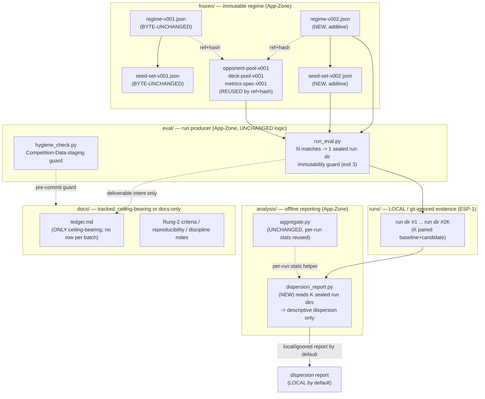
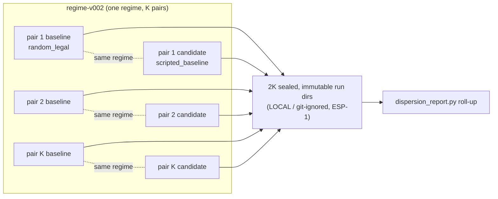
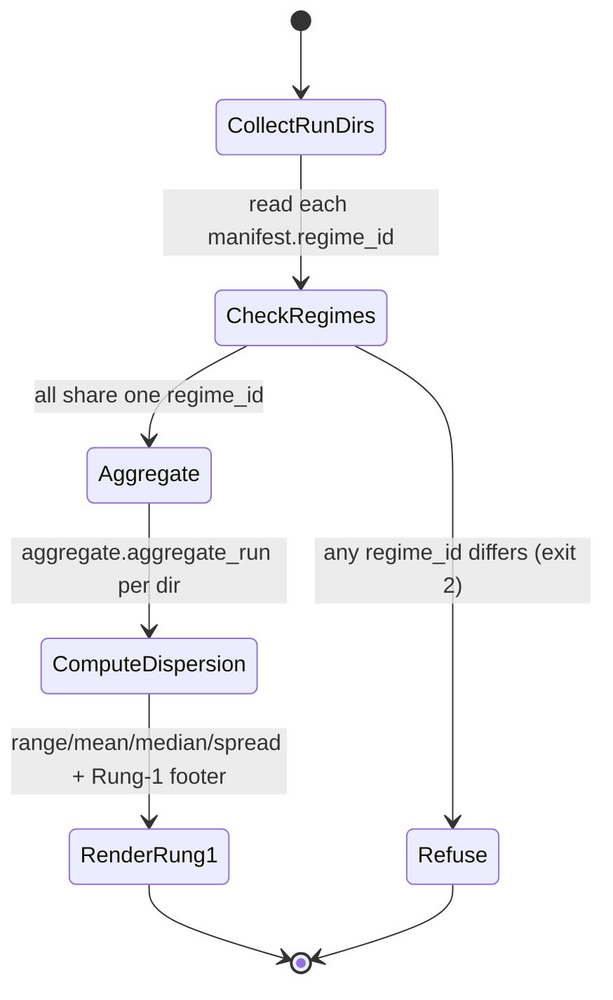

# Cycle-002 SDD — Evaluation Scale + Comparison Confidence

> Architecture artifact (SDD). Status: **DRAFT — design only.** This document opens **NO build gate**.
> Implementation requires a separate, explicit operator build-gate action (OA-2 equivalent) per
> `docs/operator/turntrace-loop-contract.md` §6. This SDD authorizes no code and creates no `/implement`
> prompt; it is the architecture step between the accepted PRD and the sprint plan.
> Binding inputs: `docs/cycles/cycle-002/01-prd.md` (the accepted Cycle-002 PRD) and
> `docs/cycles/cycle-002/00-research-and-planning.md` (the accepted research artifact). Neither opens a gate.
> Sanitized note. No raw traces, card IDs/names, deck lists, simulator logs, PDFs/CSVs, or Competition
> Data appear here (CC-1/CC-2, ESP). Runs are referenced by `run_id`, hashes, sanitized metrics, claim
> ceilings, and local path/status only. The forbidden agent claim words (*strong / competitive / optimal /
> calibrated / complete*) appear only as negated/forbidden language.

| Field | Value |
|---|---|
| **Cycle** | Cycle-002 |
| **Working title** | Evaluation Scale + Comparison Confidence |
| **Type** | Software Design Document (architecture artifact, not a build artifact) |
| **Status** | DRAFT — awaiting operator review; next Golden-Path step is sprint plan, not implementation |
| **Date** | 2026-06-18 |
| **Current main** | `beac070` — *docs: close TurnTrace Cycle 001* |
| **Binding inputs** | `docs/cycles/cycle-002/01-prd.md`; `docs/cycles/cycle-002/00-research-and-planning.md` |
| **Posture** | Improve the EVALUATION HARNESS, not the agent |
| **Claim ceiling** | Rung 1 (unchanged; not raised) |

## 1. Architecture overview

### 1.1 Mission, restated for design

> From `01-prd.md:56-59`: *"Stand up a stable, sanitized, larger same-regime evaluation harness under a new
> `regime-v002`, capable of running repeated same-regime batches cheaply and reporting observed dispersion
> descriptively — with runtime agents frozen, every claim bounded to Rung 1, the ledger preserved as the
> only ceiling-bearing artifact, and no cross-regime comparison."*

This SDD designs **where the net-new capability lives, what artifacts it produces, and which mechanical
guards keep it honest** — without designing the runtime agent, without writing code, and without opening a
build gate. The bright line governs every section: **Cycle-001 held the regime fixed and varied the agent
once; Cycle-002 holds the agents frozen and varies only the evaluation (scale + repetition + reporting)**
(`01-prd.md:41-43`).

### 1.2 The design spine (D → A → C/B, G binding, E/F docs-only)

The PRD's recommended spine (`01-prd.md:61-67`) maps onto the architecture as follows:

| Lane | Design surface | Net-new? | Zone |
|---|---|---|---|
| **D** — run cost / budget first | A measurement *use* of the existing `eval/run_eval.py` against `regime-v002`, emitting a local sanitized budget note | No new module | App-Zone run + State-Zone note |
| **A** — scale via additive `regime-v002` | New **frozen** files only (`seed-set-v002.json` + `regime-v002.json`); reuse the other three components by reference + hash | New frozen artifacts | App-Zone (`frozen/`) |
| **C** — repeated same-regime batches | A *use* of `eval/run_eval.py` with the existing per-`run_id` immutability + idempotency; an optional thin batch orchestration helper around it | At most a thin runner | App-Zone run + State-Zone note |
| **B + reporting** — descriptive dispersion | One new **offline analysis** module (`analysis/dispersion_report.py`) reading K sealed run dirs | New analysis module | App-Zone (`analysis/`) |
| **G** — ledger/report discipline | No code change — codifies the already-enforced no-ledger-by-default path; a tracked docs note | Docs only | tracked docs |
| **E** — Rung 2 readiness criteria | Tracked criteria doc | Docs only | tracked docs |
| **F** — reproducibility reality | Tracked reproducibility note | Docs only | tracked docs |

**The entire net-new code surface of Cycle-002 is two additive things:** (1) additive frozen `regime-v002`
files, and (2) one offline cross-run descriptive-dispersion analysis module. Everything else is *reuse of
existing harness mechanics* or *docs*. This is deliberate — the smallest change that delivers the mission.

### 1.3 Component diagram



### 1.4 Offline / runtime separation (preserved)

`analysis/` imports run-dir artifacts only — never `agents/runtime/`, `cabt`, `sim/`, or harness internals
in `eval/` (`analysis/aggregate.py:12-14`; `analysis/failure_report.py:21-22`). The new
`dispersion_report.py` inherits this rule. The import boundary is resolved precisely in §6.3 below.

## 2. Scope and non-scope

### 2.1 In scope (design only — builds nothing until OA-2)

- **D1** — design the cost/budget dry-run *procedure* and its sanitized note shape (C2-FR-1).
- **A1** — design the additive `regime-v002` files, their schema, paths, and immutability constraints (C2-FR-2).
- **C1** — design the repeated-batch run model: how K paired runs map to run dirs (C2-FR-3; §5).
- **B1** — design the cross-run descriptive-dispersion analysis module: inputs, outputs, refusals, vocabulary (C2-FR-4; §7).
- **G1** — design the ledger/report/storage policy encoding (C2-FR-7; §8).
- **E1/F1** — design the Rung-2 criteria and reproducibility docs (C2-FR-5, C2-FR-6; §9).

### 2.2 Non-scope (binding — carried verbatim from PRD §4)

- **No runtime-agent change of any kind** (NG1). `agents/runtime/` is a frozen *input*, never a design target.
  No tuning, heuristic change, rule change, scoring change, search, RL, self-play, deck optimization, value
  model, win-probability model, ELO, tournament system, or leaderboard work.
- **No claim above Rung 1** (NG2). No gameplay-strength, statistical-significance, cross-regime, leaderboard,
  or calibration design.
- **No inferential statistics** (NG3) — no confidence intervals, p-values, "significant," hypothesis tests,
  or inferential error bars are architected anywhere. Descriptive dispersion only (§7.4).
- **No cross-regime comparison** (NG4). `regime-v002` numbers are never placed beside v001 ledger rows.
- **No per-decision agent-quality scoring/detectors** (NG5). FM-03/04/06/08 stay `detector: forbidden`.
- **No raw-data exposure** (NG6). No raw trace rows, card IDs/names, deck lists, hand contents, simulator
  logs, PDFs/CSVs, or run-dir dumps in any tracked artifact.
- **No `regime-v001` mutation** (NG7). `regime-v001` and its four components are byte-unchanged; a larger
  `n` is an additive `regime-v002`, never an edit.
- **No byte-identical determinism work** while `seed_controlled=false` (NG8). No manufactured seed control.
- **No build gate** (NG10). This SDD authorizes no code.

## 3. Component design

### 3.1 Existing components (frozen inputs / reused, NOT redesigned)

| Component | Role in Cycle-002 | Change |
|---|---|---|
| `eval/run_eval.py` | **The run producer.** Drives N matches → one sealed, immutable run dir; immutability guard (exit 3); deck-drift guard; source-hash provenance; no-ledger-by-default (`eval/run_eval.py:88-296`). Cycle-002 runs `regime-v002` *through this unchanged producer*. | None designed |
| `eval/hygiene_check.py` | The Competition-Data staging guard; path-level pre-commit refusal incl. `runs/<run_id>/…` (`eval/hygiene_check.py:35-45`). Active over every Cycle-002 tracked artifact. | None designed |
| `analysis/aggregate.py` | Per-run aggregation → `summary.csv` + (deliverable-only) one ledger row. Its `aggregate_run()` is the **single source of per-run sanitized stats**; the new dispersion module reuses it as an intra-`analysis/` helper (`analysis/aggregate.py:56-89`). | None designed |
| `analysis/failure_report.py` | The **sanitization-contract reference** the new module mirrors: coarse counts only, presence flags, no raw rows, Rung-1 footer, local `--out` (`analysis/failure_report.py:8-29`). | None designed |
| `analysis/delta_report.py` | The **cross-regime-refusal reference** (`CrossRegimeRefusal` → exit 2; `analysis/delta_report.py:128-143`). The dispersion module's single-regime guard mirrors this shape. | None designed |
| `analysis/replay_check.py` | The reproducibility floor — audit-trail equality always; determinism tier skipped under `seed_controlled=false` (`analysis/replay_check.py:121-146`). Cited by the F-lane reproducibility note. | None designed |
| `agents/runtime/{random_legal,scripted_baseline}.py` | **Frozen agents** — the baseline and candidate. Inputs to the evaluation, never modified (NG1). | None designed |

### 3.2 New components (designed here; built only after OA-2)

| New component | Lane | Kind | Where |
|---|---|---|---|
| `frozen/seeds/seed-set-v002.json` | A | Additive frozen artifact | `frozen/seeds/` |
| `frozen/regimes/regime-v002.json` | A | Additive frozen artifact | `frozen/regimes/` |
| `analysis/dispersion_report.py` | B + reporting | Offline analysis module | `analysis/` |
| (optional) thin batch runner | C | Thin orchestration around `run_eval` | `eval/` *or* operator-driven loop |

`regime-v002`'s other three component references (`opponent-pool-v001`, `deck-pool-v001`,
`metrics-spec-v001`) are **reused by id + content hash** — no new component files (decision **D-3**, §5).

### 3.3 The optional batch runner (design recommendation: keep it thin or omit it)

C2-FR-3 needs **2K sealed run dirs** (§5). Two viable designs:

- **Option C-i (recommended default): no new runner module.** The operator/implementer invokes the existing
  `eval/run_eval.py` 2K times with distinct `--run-id` values, each non-deliverable (no `--deliverable`).
  The per-`run_id` immutability guard + idempotency already carry the discipline (`eval/run_eval.py:138-154`).
  This is the lowest-surface design and the ladder's first holding rung (stdlib + existing tool).
- **Option C-ii: a thin `eval/run_batch.py` wrapper** that loops `run_eval.run_eval()` over a generated list
  of `run_id`s for one `regime-v002`, refusing any non-`v002` regime and never passing `write_ledger=True`.
  Justified **only** if the sprint plan finds the 2K manual invocations error-prone. It must add no new
  evaluation logic — it is a loop, not a new producer.

> `# loa:shortcut: prefer Option C-i (no runner) unless the sprint plan shows manual 2K invocation is
> error-prone; upgrade to the thin wrapper (C-ii) only then, and it stays a loop with no new eval logic.`

The choice is carried to the sprint plan as **OD-B1** (operator-ratified posture, review 2026-06-18):
**C-i is the default; the sprint plan may authorize C-ii only if the chosen K makes 2K manual invocations a
meaningful operator risk.** Any wrapper is a **loop only** — no new evaluation semantics, no agent logic, no
ledger-by-default (`write_ledger` stays False), no runtime/`sim` change, no claim-ceiling movement — and it
refuses any non-`regime-v002` input.

## 4. Data / artifact design

### 4.1 The tracked-vs-local artifact map (resolves architecture decision #2)

This is the authoritative classification. **No raw run contents ever enter tracked docs.**

| Artifact | Path | Tracked? | Why |
|---|---|---|---|
| This SDD | `docs/cycles/cycle-002/02-sdd.md` | **Tracked** | Sanitized design doc |
| Future docs (criteria/reproducibility/discipline) | `docs/cycles/cycle-002/0N-*.md` | **Tracked** | Sanitized docs-only artifacts |
| `regime-v002.json` | `frozen/regimes/regime-v002.json` | **Tracked** (after OA-2) | Refs + hashes only — no Competition Data (`frozen/README.md:20-26`) |
| `seed-set-v002.json` | `frozen/seeds/seed-set-v002.json` | **Tracked** (after OA-2) | Match-index list + metadata — no card data |
| `regime-v001` + its 4 components | `frozen/**` | **Tracked, BYTE-UNCHANGED** | Historical record; never edited (NG7) |
| Full run dirs (2K of them) | `runs/<run_id>/…` | **LOCAL / git-ignored** | ESP-1; `.gitignore: runs/*/`, only `runs/.gitkeep` tracked |
| Budget / dry-run output | local path (e.g. `runs/<run_id>/` + a local note) | **LOCAL / git-ignored** | Non-deliverable; sanitized numbers, but kept local by default (C2-FR-1) |
| Cross-run dispersion report | stdout or local `--out` path | **LOCAL / git-ignored by default** | ESP-1 / OD-7; mirrors `failure_report.py:27-29` |
| Operator-approved sanitized summary (optional, cycle close) | a tracked `docs/cycles/cycle-002/` path **only on explicit SP-6 relaxation** | **Tracked only if operator approves** | OD-7; default is NOT tracked |
| Ledger | `docs/ledger.md` | **Tracked, ceiling-bearing** | The only ceiling-bearing artifact; **no row per batch** (§8) |
| Review/audit/COMPLETED markers | `grimoires/loa/a2a/sprint-N/` | **LOCAL / git-ignored** | State Zone; `.gitignore: grimoires/loa/a2a/` |

**Design rule (binding):** the dispersion report and the budget note default to **local/ignored**. The only
path by which any sanitized run-derived summary becomes tracked is an **explicit operator SP-6 relaxation**
at cycle close, and even then it carries counts/aggregates/dispersion only — never raw rows. The
`eval/hygiene_check.py` pre-commit guard mechanically blocks any `runs/<run_id>/…` path and the
Competition-Data home regardless (`eval/hygiene_check.py:42-44`).

### 4.2 Run-dir shape (unchanged; produced by `run_eval`)

Each of the 2K run dirs is the existing sealed shape (`eval/run_eval.py:175-265`):
`manifest.json` (ID authority + `regime_id` + provenance), `match_results/*.json` (per-match sanitized
summaries), `traces/*.jsonl` (per-decision sidecars — **never read by the dispersion module**),
`hashes.txt` (provenance stamp incl. component hashes), `notes.md`, `summary.csv`. The dispersion module
reads only `manifest.json` + `match_results/*.json` (the same surface `failure_report.py` reads;
`analysis/failure_report.py:11-13`).

## 5. `regime-v002` design

### 5.1 The constraint (the spine)

`n` is the length of the frozen seed-set's `match_indices` (`eval/run_eval.py:121`), and the seed-set is one
of the four `regime-v001` components (`frozen/regimes/regime-v001.json:4-7`). Any component change is a **new
regime, never an edit** (`frozen/regimes/regime-v001.json:9`; `frozen/README.md:11-19`). Therefore a larger
`n` **must** be authored as additive `regime-v002` files.

### 5.2 `seed-set-v002.json` design (additive)

Mirrors `seed-set-v001.json` exactly in schema (`frozen/seeds/seed-set-v001.json`), changing only the scale:

```json
{
  "seed_set_id": "seed-set-v002",
  "mode": "unseeded",
  "rationale": "Additive larger-n seed-set for regime-v002 (Cycle-002 scale lane, C2-FR-2). seed-set-v001 is byte-unchanged. The capability probe still finds no controllable RNG seed (sim/capabilities.json: seed_controlled=false); per NFR-3 this is a fixed, ordered list of MATCH INDICES, not seeds. Reproducibility remains distribution-stable + audit-trail; determinism smoke skipped (mode=unseeded).",
  "match_indices": [1, 2, ..., N],
  "seeds": null,
  "n": N,
  "n_note": "N chosen from the Cycle-002 dry-run budget (C2-FR-1): large enough to show dispersion, small enough to keep K batches cheap and avoid artifact proliferation. Hash-pinned on neutral grounds BEFORE any agent runs (no seed-shopping; risk R2)."
}
```

**Design constraints (binding):**

- `mode` stays `"unseeded"` — the larger seed-set is a longer ordered list of `match_indices`, not seeds
  (`frozen/seeds/seed-set-v001.json:2,6`; C2-NFR-7). `seeds` stays `null`.
- The exact `N` is **not fixed by this SDD** — it is an output of the C2-FR-1 dry-run (OD-4 / **OD-B2**, §14).
  The schema is fixed; the number is data informed by the budget.
- `match_indices` is a contiguous neutral list (e.g. `1..N`); no index is chosen to flatter an agent. The
  seed-set is **hash-pinned before any agent runs** (`01-prd.md` §7.5; risk R2).

### 5.3 `regime-v002.json` design (additive, tuple-by-reference + hash)

Mirrors `regime-v001.json` (`frozen/regimes/regime-v001.json`), changing only the `seed_set` reference and
re-pointing nothing else:

```json
{
  "regime_id": "regime-v002",
  "created_at": "<date>",
  "seed_set": "seed-set-v002",
  "opponent_pool": "opponent-pool-v001",
  "deck_pool": "deck-pool-v001",
  "metrics_spec": "metrics-spec-v001",
  "mode": "unseeded",
  "notes": "Additive larger-n regime (Cycle-002). ONLY the seed-set differs from regime-v001; opponent-pool-v001 / deck-pool-v001 / metrics-spec-v001 are REUSED by reference + content hash (decision D-3). regime-v001 and its four components are byte-unchanged. seed_controlled=false → unseeded; reproducibility is distribution-stable + audit-trail (NFR-3). A change to ANY component, or a new sim/env version, requires a NEW regime — never an edit (frozen/README.md:11-16). NEVER compare regime-v002 results to regime-v001 ledger rows (NFR-5)."
}
```

### 5.4 Component-reuse decision (resolves architecture decision #4 — D-3)

**Design recommendation (adopt as default; carry as ratifiable OD-3):** `regime-v002` **reuses**
`opponent-pool-v001`, `deck-pool-v001`, and `metrics-spec-v001` **by reference + content hash**; only the
seed-set changes to increase `n`.

Grounding for the recommendation:

- The PRD's `[ASSUMPTION]` default is exactly this (`01-prd.md:451-453`, OD-3).
- The probed reality argues for reuse: the opponent pool is a single mirror opponent
  (`frozen/opponents/opponent-pool-v001.json:3-13`), the deck pool is refs + hashes only
  (`frozen/decks/deck-pool-v001.json`), and the metrics-spec gates correctness, not strength
  (`frozen/metrics/metrics-spec-v001.json:32`). None of the three needs to change to scale `n` — changing
  them would alter *what* is measured, not *how much*, and would conflate the scale lane with an evaluation
  redesign that the cycle forbids.
- The harness already hashes all four component files into every run's `hashes.txt`
  (`eval/run_eval.py:239-243`), so reuse-by-reference is provable per run without re-minting.

**Either way it is a new regime.** Reuse changes the *amount* of change (only the seed-set), not the rule.
The operator may re-mint any component, but that is not recommended and is not the default; carried as
**OD-3** for ratification (§14).

### 5.5 Immutability + drift guards (unchanged, must hold)

The deck-drift guard (`eval/run_eval.py:128-134`) and the immutability guard (exit 3;
`eval/run_eval.py:138-154`) operate **unchanged** at the larger `n`. Because `regime-v002` reuses
`deck-pool-v001`, the live deck must still match the frozen `deck_hash`
(`frozen/decks/deck-pool-v001.json:8`) — a changed deck would (correctly) refuse the run. No guard is
modified; they simply apply to the new regime.

## 6. Repeated-batch design

### 6.1 The K-paired model (resolves architecture decision #1)

**Decision (adopt the PRD's preferred interpretation): K paired comparisons = 2K sealed run dirs.**

- Each **pair** `i ∈ {1..K}` contains exactly two sealed run dirs under the **same** `regime-v002`:
  - one **baseline** run (`random_legal`) — e.g. `run-v002-b-<i>`
  - one **candidate** run (`scripted_baseline`) — e.g. `run-v002-c-<i>`
- All 2K runs share one `regime_id = regime-v002`. The agents are frozen; the only thing that repeats is the
  evaluation (`01-prd.md:316-318`).
- Total sealed run dirs = **2K**.

**Run-id naming (operator-ratified, review 2026-06-18):** adopt the descriptive scheme above —
`run-v002-b-<i>` (baseline) / `run-v002-c-<i>` (candidate) — so that with 2K local, non-deliverable run dirs
the id self-documents regime + role + pair index (the early `run-0001`/`run-0002` were deliverable foundation
runs; Cycle-002 batch runs are local/ignored and non-deliverable by default). The run-id is a
**human-readable convenience, not the authority**: `manifest.json` stays the source of truth for `regime_id`,
`agent_id`, and run metadata (`eval/run_eval.py:175-199`); no logic may key off the run-id string in place of
the manifest.



### 6.2 What the roll-up reports from the 2K runs

The dispersion module (§7) reports **per-agent dispersion** across the K runs of each agent (e.g. the K
baseline runs' `win_rate` range/mean/median/spread, and the K candidate runs' separately), and **optional
paired deltas** (candidate-minus-baseline within each pair, then the dispersion of *that* delta across K
pairs). **All output remains descriptive and Rung 1** — a paired-delta dispersion is still a description of
observed spread, never an inferential or strength claim (§7.4). Paired deltas are reported only as observed
spread, framed by §9's unseeded-process caveat, and never narrated as the agent being "better."

### 6.3 The dispersion-report import boundary (resolves architecture decision #3)

**Decision: `analysis/` imports are strictly limited to run-dir artifacts + intra-`analysis/` helpers.**

- **Strictly forbidden imports:** `agents/runtime/`, `cabt`, `sim/`, and **`eval/`**. The dispersion module
  must not reach into runtime agent code, simulator code, or live match execution. This mirrors the existing
  rule on `aggregate.py` (`analysis/aggregate.py:12-14`) and `failure_report.py`
  (`analysis/failure_report.py:21-22`).
- **Allowed:** intra-`analysis/` reuse — specifically `import aggregate` to call `aggregate.aggregate_run()`
  for the per-run sanitized stats, exactly as `delta_report.py` already does
  (`analysis/delta_report.py:47-49`). This keeps a single source of truth for per-run stats and avoids
  re-implementing the sanitized roll-up.
- **On "no `eval/` import" — strict.** The rule is strict: no `eval/` import. Where `analysis/` needs a
  helper that also lives in `eval/` (e.g. canonical hashing), the established pattern is a **stdlib copy
  inside `analysis/`, parity-tested** — exactly what `replay_check.py` does for canonical hashing
  (`analysis/replay_check.py:43-49`, with `tests/test_smokes.py` pinning byte-parity). The dispersion module
  follows this pattern if it ever needs such a helper; it does **not** import from `eval/`.

> `# loa:shortcut: dispersion_report reuses analysis/aggregate.aggregate_run() (intra-zone) and copies any
> eval-shared helper as a parity-tested stdlib local; no eval/ import. Upgrade trigger: none — this is the
> standing offline/runtime separation, not a temporary shortcut.`

The core rule restated: **dispersion analysis is offline-only, reads sealed run-dir artifacts, and never
reaches into runtime/sim/eval code.**

## 7. Cross-run descriptive-dispersion report design

### 7.1 Module: `analysis/dispersion_report.py` (new)

**Inputs:** K (or 2K) sealed run dirs under one `regime-v002`, given as CLI arguments or a directory glob.
The architecture-level CLI shape (detailed in §11):

```
python analysis/dispersion_report.py <run_dir> [<run_dir> ...] [--json] [--out <local-path>]
Exit: 0 report produced · 1 input failure · 2 mixed-regime refusal
```

**Reads (only):** each run dir's `manifest.json` (for `regime_id` authority and agent identity) and
`match_results/*.json` (for the sanitized per-match summaries). It **never** opens `traces/*.jsonl`
sidecars and never reads error-string bodies — the same sanitization surface as `failure_report.py`
(`analysis/failure_report.py:11-19`).

**Per-run stats:** obtained via `aggregate.aggregate_run(run_dir)` (intra-`analysis/` reuse; §6.3), giving
the sanitized metric set already defined in `analysis/aggregate.py:75-89`
(`win_rate`, `illegal_action_rate`, `timeout_rate`, `error_rate`, `avg_turns`, `avg_wall_clock_ms`).

### 7.2 Output (descriptive dispersion per metric)

For each sanitized metric, across the K runs of a given agent (and optionally across the K paired deltas),
the report emits **range (min, max), mean, median, and spread (max − min)**, each statement carrying `n`,
`K`, and `regime_id`. Example output **shape** (descriptive; values illustrative-only, never raw rows):

```
# Dispersion report — regime-v002, n=N, K=K (baseline=random_legal, candidate=scripted_baseline)

## win_rate (across K candidate runs)
| metric | min | max | mean | median | spread |
|---|---|---|---|---|---|
| win_rate | X | Y | Z | M | (Y-X) |

Observed: across K batches of n=N under regime-v002, the observed win_rate ranged from X to Y (mean Z).

**Claim ceiling.** Descriptive dispersion over regime-v002 at n=N, K=K. NO gameplay-strength claim, NO
inferential claim — these are observed-spread diagnostics of the whole unseeded process (Rung 1). The
experiment ledger (docs/ledger.md) is the only ceiling-bearing artifact.
```

### 7.3 The single-regime guard (mirrors the cross-regime refusal)

Before any aggregation, the module asserts **all input run dirs share one `regime_id`** (read from each
`manifest.json`). On mismatch it **hard-refuses** with exit 2 — structurally identical to
`delta_report.py`'s `CrossRegimeRefusal` (`analysis/delta_report.py:128-143`). This enforces NFR-5
mechanically: the report cannot mix regimes, so a v002 number can never be aggregated beside a v001 number.



### 7.4 Descriptive-vs-inferential boundary (resolves architecture decision #5)

**Design rule: descriptive dispersion is mechanically easy; inferential statistics are mechanically absent.**

- **Allowed vocabulary (the only statistics the module computes):** `min`, `max`, `range`, `mean`,
  `median`, `spread`, `count`. These are pure arithmetic over the K per-run metric values
  (`01-prd.md:276`, C2-NFR-6; OD-6 `[ASSUMPTION]` `01-prd.md:459-461`).
- **Forbidden without later explicit design + operator approval:** confidence intervals, p-values, the word
  "significant," hypothesis tests, standard error / inferential error bars, t-tests, or any distributional
  inference. The module **does not compute** these — their absence is structural, not a policy line in prose.
- **Sample standard deviation / variance: deliberately excluded (operator-ratified, review 2026-06-18).**
  They are *descriptive*, not inferential — but Cycle-002 keeps the crispest possible bright line, so the
  module computes neither (which also removes any mechanical path toward standard error / CIs). Reconsidering
  them is a future explicit-design + operator-approval item, alongside any inferential design.
- **Enforcement is two-layered:** (1) the module's computation set is limited to the allowed arithmetic — it
  has no inferential code path to invoke; (2) the audit gate greps tracked outputs for the forbidden terms
  and inferential phrasing (risk R3; `01-prd.md:476`). A Rung-1 footer rides on every report.

This is the bright line the reviewer/auditor enforce; the allowed vocabulary is ratified by the operator as
**OD-6** before build (§14).

### 7.5 Sanitization contract (counts/aggregates only)

The module emits counts, rates, and dispersion of the already-sanitized aggregate metrics — never raw
decision-trace rows, card IDs/names, deck lists, or hand contents (C2-NFR-3; sanitization contract per
`analysis/failure_report.py:8-19`). Error fields, if surfaced at all, are presence-flag counts only, never
string bodies (`analysis/failure_report.py:14-19,101-103`). The output passes `eval/hygiene_check.py`.

## 8. Ledger / report / evidence-storage design

### 8.1 Ledger policy (resolves architecture decision #6)

**Design rule (encoded, not newly coded): scale/variance batches are non-deliverable by default and write
no ledger row.**

- The 2K Cycle-002 batch runs are invoked **without** `--deliverable` / `--ledger`. The existing default is
  exactly this: a bare `run_eval` invocation writes `summary.csv` but **no** ledger row
  (`eval/run_eval.py:281-288,333-336`). The ledger therefore **does not grow a row per batch**.
- A ledger row is written **only** on explicit deliverable intent (`--deliverable` or `--ledger <path>`;
  `eval/run_eval.py:316-318,335`). The policy — at most one deliberately designated deliverable run per
  regime — is confirmed by the operator as **OD-5** (`01-prd.md:457-458`, §14).
- **`docs/ledger.md` remains the only ceiling-bearing artifact** (`docs/claim-ceiling.md:5-6`). The
  dispersion report, the budget note, `summary.csv`, the criteria doc, and this SDD carry **no ceiling**.
- **No code change is needed** to enforce no-ledger-by-default — it is the already-shipped behavior. The
  G-lane deliverable is a tracked *docs* note codifying the policy (C2-FR-7).

### 8.2 Idempotency + append-only (preserved)

If a deliverable run is ever designated, `append_ledger_row` is idempotent per `run_id` and requires a
non-empty `claim_ceiling` (`analysis/aggregate.py:125-140`); rows are append-only and never edited. A
`regime-v002` deliverable row, if written, carries `regime_id = regime-v002` and is **never** narrated
against a v001 row (NFR-5).

### 8.3 Evidence-storage (ESP-1 / SP-6)

Full run dirs and the dispersion/budget reports stay local/git-ignored by default
(`.gitignore: runs/*/`, `grimoires/loa/a2a/`; `analysis/failure_report.py:27-29`). Promotion of any
sanitized summary to tracked status requires an explicit operator SP-6 relaxation at cycle close (OD-7).
Tracked docs reference runs by `run_id` + hashes + sanitized metrics + local path/status only — never embed
raw contents.

## 9. Rung 2 criteria / reproducibility docs design

These are **docs-only** lanes (E/F) — tracked sanitized notes, no code, no claim above Rung 1.

### 9.1 Rung 2 readiness criteria doc (C2-FR-5, Lane E)

A tracked doc stating what a future Rung 2 *consideration* would minimally require (`01-prd.md:219-227`;
research RQ-4):

1. a same-regime baseline-vs-candidate comparison at a justified larger `n` under one regime;
2. an explicitly **designed and operator-approved** inferential procedure;
3. the candidate exceeding the random-legal baseline by a **pre-registered margin** under that design;
4. provenance + audit-trail intact;
5. a deliberate operator-authorized advance of the ledger row's `claim_ceiling`.

The doc **explicitly does not claim Rung 2** and records that the inferential design + ceiling advance is a
separate operator decision. Rung 2 = "beats random-legal" on the maturity ladder
(`docs/cycles/cycle-000-bootstrap/01-turntrace-prd.md:274-276`). No forbidden claim words appear except as
negated language.

### 9.2 Reproducibility-reality note (C2-FR-6, Lane F)

A tracked note that:

- **(a)** confirms/records `seed_controlled=false` (`docs/claim-ceiling.md:42-52`;
  `analysis/replay_check.py:124-132`);
- **(b)** defines "stable" at the larger `n` as **distribution-stable + audit-trail** (not byte-identical) —
  the existing reproducibility floor (`analysis/replay_check.py:69-88`);
- **(c)** documents that, because runs are unseeded, observed dispersion **conflates agent behavior with
  uncontrolled simulator RNG and cannot be separated** into an isolated "agent variance" without seed
  control (research RQ-8). The dispersion report (§7) embeds this caveat inline.

No manufactured or simulated seed control (NG8); byte-identical replay stays a future upgrade only if seed
control is later proven — the determinism path in `replay_check.py` stays a documented dead path under the
probed reality (`analysis/replay_check.py:101-107`).

### 9.3 Ledger/report-discipline note (C2-FR-7, Lane G)

The tracked note codifying §8: no ledger row per batch; only explicitly designated deliverable runs write
rows; larger-run reports stay local/ignored unless operator-approved. Docs/policy only — codifies existing
behavior, requires no code change.

## 10. CLI / interface design (architecture level)

| Interface | Shape | Status |
|---|---|---|
| `eval/run_eval.py` | `--run-id <id> --regime-id regime-v002 --agent {random_legal\|scripted_baseline}` (no `--deliverable`) | **Unchanged.** `--regime-id` already accepts any regime file (`eval/run_eval.py:311,339`); pointing it at `regime-v002` needs no code change. |
| dry-run budget (D) | A single `run_eval` invocation at the larger `n` + a wall-clock/disk measurement, written to a **local** note | A *use* of the existing tool; measurement procedure designed, not new code |
| batch runner (C) | Option C-i: 2K `run_eval` invocations; Option C-ii: thin `eval/run_batch.py` loop (§3.3) | Recommendation = C-i; carried as OD-B1 |
| `analysis/dispersion_report.py` (B) | `dispersion_report.py <run_dir>... [--json] [--out <local-path>]`; exit 0/1/2 (§7.1, §7.3) | **New module**, designed here |

The CLI conventions mirror the existing `analysis/` tools exactly: positional run dirs, optional `--json`,
optional local `--out` (default stdout), exit-2 reserved for the regime-mixing refusal — the same contract a
reviewer already knows from `failure_report.py` and `delta_report.py`.

## 11. Error handling and refusal behavior

| Condition | Behavior | Grounded in |
|---|---|---|
| Mixed `regime_id` across input run dirs | **Hard refuse, exit 2** (single-regime guard; §7.3) | `analysis/delta_report.py:128-143` |
| Empty / missing `match_results` in a run dir | Input failure, exit 1 | `analysis/failure_report.py:64-67` |
| Missing `manifest.json` | Input failure, exit 1 (manifest is the `regime_id` authority) | `analysis/delta_report.py:76-80` |
| Attempt to write into a populated run dir | Immutability refusal, exit 3 (unchanged producer) | `eval/run_eval.py:138-154` |
| Live deck ≠ frozen `deck_hash` | Deck-drift refusal (a changed deck = new regime) | `eval/run_eval.py:128-134` |
| Any `runs/<run_id>/…` or Competition-Data path staged for commit | Pre-commit hard refusal, exit 1 | `eval/hygiene_check.py:42-45` |
| Inferential statistic requested | **Not implemented** — the module has no inferential code path (§7.4) | C2-NFR-6; NG3 |

Refusals are **hard errors, never prompts** — consistent with the harness's existing posture
(`eval/run_eval.py:34`, immutability guard "a HARD error (exit 3), never a prompt"). The dispersion module's
refusal vocabulary is limited to the three exit codes above; it never silently drops a non-conforming run.

## 12. Testing and validation strategy

All tests are stdlib-only and land through `/implement → /review-sprint → /audit-sprint` after OA-2; this
SDD writes none. The acceptance-criteria tests (AC-1..AC-9, `01-prd.md:416-441`) are the runnable checks.

| Target | Test (designed, not written here) | Maps to |
|---|---|---|
| `regime-v002` additivity | Assert `regime-v001.json` + its 4 component files are byte-identical before/after; assert `regime-v002` references the three reused components by id + that `hashes.txt` records their hashes | AC-2; NG7 |
| `seed-set-v002` schema | Assert `mode == "unseeded"`, `seeds == null`, `match_indices` length == `n` | AC-2; §5.2 |
| Single-regime guard | Feed run dirs with two different `regime_id`s → assert exit 2; feed uniform `regime-v002` dirs → assert exit 0 | AC-4; §7.3 |
| Descriptive-only output | Assert the rendered report contains range/mean/median/spread and **none** of {confidence interval, p-value, significant, hypothesis, error bar} | AC-4; §7.4 |
| Sanitization | Assert no raw rows / card IDs / deck lists in output; run `eval/hygiene_check.py --paths <report>` → exit 0 | AC-4; §7.5 |
| Import boundary | Static check: `dispersion_report.py` imports neither `eval`, `sim`, `cabt`, nor `agents/runtime` (intra-`analysis/` `import aggregate` allowed) | AC-4; §6.3 |
| No-ledger-by-default | Assert a non-deliverable batch run appends **no** row to a redirected test ledger | AC-3, AC-7; §8.1 |
| Rung-1 footer | Assert every report/note carries the Rung-1 footer and no forbidden claim word except negated | AC-8; §7.2 |

**Non-trivial logic that MUST leave a runnable check** (per Karpathy principle 4): the single-regime guard
(a branch that refuses), the dispersion arithmetic (range/mean/median/spread over a list), and the
import-boundary static check. Trivial schema mirroring needs no test beyond the additivity/byte-equality
assertion.

## 13. Security / sanitization / Competition-Data boundary

Carried verbatim from Cycle-001 (`docs/operator/turntrace-loop-contract.md:59-77`; PRD §11):

- **Competition Data never enters git** (CC-1/CC-2): the `cg/` SDK, card data CSV/PDF, Kaggle starter
  `deck.csv`, raw deck lists — local-only under git-ignored `grimoires/loa/context/`, enforced by
  `eval/hygiene_check.py` (`eval/hygiene_check.py:42`).
- **No raw traces · no card IDs · no card names · no deck lists · no simulator logs · no PDFs/CSVs · no
  run-dir dumps** in any tracked artifact. The dispersion module never opens `traces/*.jsonl` and never
  reads error-string bodies (§7.5).
- **Frozen components store references + hashes only** — `regime-v002`'s deck reference (via reused
  `deck-pool-v001`) carries a content hash, never a card list (`frozen/decks/deck-pool-v001.json:3`).
- **Full run dirs stay local/git-ignored** (ESP-1; `.gitignore: runs/*/`). The pre-commit guard blocks any
  `runs/<run_id>/…` path (`eval/hygiene_check.py:43`).
- **Review/audit/COMPLETED artifacts** persist to git-ignored State Zone (`grimoires/loa/a2a/sprint-N/`),
  written by the orchestrator after the pure-review skills return — never patching implementation
  (`docs/operator/turntrace-loop-contract.md:85-114`).
- **`.claude/` (System Zone) is never edited.**

## 14. Open decisions carried to the sprint plan

These do not block the SDD; recommended dispositions are marked and carried for the sprint plan / operator.

| ID | Decision | Recommendation (SDD) |
|---|---|---|
| **OD-1** | Open the Cycle-002 build gate (OA-2) before any `/implement`/`/run` | Required before any of D/A/C/B build tasks; this SDD authorizes no code |
| **OD-2** | Confirm the narrow scope + spine (D→A→C/B; E/F/G docs) | Confirm; agent-optimization lane stays closed |
| **OD-3** | `regime-v002` component reuse vs re-mint | **Reuse** opponent/deck/metrics by reference + hash; only the seed-set differs (§5.4) |
| **OD-4 / OD-B2** | Target `n` and batch count K | Chosen from the C2-FR-1 dry-run budget; schema fixed, numbers data |
| **OD-5** | Ledger-row policy for scale/batch runs | No row per batch; at most one deliberately designated deliverable run per regime (§8.1) |
| **OD-6** | Allowed descriptive-statistics vocabulary | **Ratified (2026-06-18):** `min/max/range/mean/median/spread/count`; **std dev/variance** + CIs/p-values/"significant"/hypothesis tests excluded (§7.4) |
| **OD-7** | Where the dispersion report lives | Local/git-ignored by default; a single tracked sanitized summary at cycle close only on explicit SP-6 relaxation (§4.1) |
| **OD-8** | Rung 2 stays criteria-only | Yes — C2-FR-5 defines criteria; Cycle-002 claims no Rung 2 (§9.1) |
| **OD-B1** | Batch runner: reuse `run_eval` 2K× (C-i) vs thin `run_batch.py` (C-ii) | **Ratified (2026-06-18):** C-i default; sprint plan may authorize C-ii only if the chosen K makes 2K manual runs a meaningful risk; any wrapper is loop-only (§3.3) |
| **OD-B3** | Run-id naming for the 2K local runs | **Ratified (2026-06-18):** descriptive `run-v002-b/c-<i>`; `manifest.json` stays authority for `regime_id`/`agent_id`/metadata (§6.1) |
| **OD-9** | `.beads/.br_history/` gitignore housekeeping (CF-04) | Handled separately, not Cycle-002 build scope; `.beads/issues.jsonl` stays unstaged |

## 15. Traceability back to PRD functional requirements

| PRD FR | Title | SDD design section(s) | Acceptance criterion |
|---|---|---|---|
| **C2-FR-1** | Runtime-budget / cost dry-run | §1.2 (Lane D), §3.3, §10 (dry-run), §4.1 (budget note local) | AC-1 |
| **C2-FR-2** | `regime-v002` definition (additive frozen) | §5 (full), §3.2, §4.1, §5.4 (reuse), §5.5 (guards) | AC-2 |
| **C2-FR-3** | Repeated same-regime batches (frozen agents) | §6.1 (2K model), §3.3 (runner), §8.1 (no-ledger), §10 | AC-3 |
| **C2-FR-4** | Cross-run descriptive-dispersion report | §7 (full), §6.2-§6.3 (import boundary), §11 (refusals) | AC-4 |
| **C2-FR-5** | Rung 2 readiness criteria doc | §9.1 | AC-5 |
| **C2-FR-6** | Reproducibility-reality note | §9.2 | AC-6 |
| **C2-FR-7** | Ledger/report-discipline note | §8 (full), §9.3 | AC-7 |
| (cross-cutting) | Rung-1 hold | §7.2, §7.4, §8.1, §13 | AC-8 |
| (cross-cutting) | No cross-regime + loop discipline | §7.3 (single-regime guard), §6.1, §13 | AC-9 |

Every design decision traces to a PRD requirement and a repo-grounded source. The SDD introduces no new
evidence and reuses only sanitized, already-tracked artifacts.

## 16. Risks and mitigations

| # | Risk | Mitigation (designed) |
|---|---|---|
| R1 | **Cross-regime contamination** — v002 narrated against v001 n=12. | §7.3 single-regime guard (exit 2) is a structural copy of `delta_report.py`'s `CrossRegimeRefusal`; every report carries `regime-v002` + `n` + `K`; no v002 number is ever placed beside a v001 row (AC-9). |
| R2 | **Accidental agent optimization** — scale drifts into tuning / seed-shopping. | `agents/runtime/` is a frozen input, never a design target (§2.2); `regime-v002` seed-set is contiguous + neutral + hash-pinned before any agent runs (§5.2); FM-03/04/06/08 stay `detector: forbidden`; review/audit reject any agent-decision-logic touch (NG1, NG5). |
| R3 | **Confidence-language overreach** — descriptive presented as inferential. | The dispersion module has **no inferential code path** (§7.4); allowed vocabulary ratified (OD-6); audit greps for forbidden/inferential terms; Rung-1 footer on every artifact (NG3). |
| R4 | **Claim-ceiling inflation** — larger-`n` win_rate movement read as "better." | Rung-1 hold is an explicit AC (AC-8); ledger stays the sole ceiling-bearer; Rung 2 is criteria-only (§9.1), never claimed; paired deltas reported only as observed spread (§6.2). |
| R5 | **Competition-Data / raw-trace leakage at scale.** | Roll-up restricted to coarse sanitized aggregate metrics (§7.5); `traces/*.jsonl` never opened; `eval/hygiene_check.py` active; reports local/ignored by default (C2-NFR-3; AC-4). |
| R6 | **Storage/cost surprise** — many large batches exhaust disk / slow I/O. | C2-FR-1 dry-run measures wall-clock + disk and sets a safe batch size + storage ceiling **before** the 2K batch commits to K (§1.2, §10; research RQ-5). |
| R7 | **Building before the gate** — this SDD misread as authorization. | This SDD opens no build gate and creates no `/implement` prompt; loop contract §6 reaffirmed; no `/implement`/`/run` until OA-2 (OD-1). |
| R8 | **Unseeded variance misattribution** — dispersion read as isolated agent variance. | The reproducibility note (§9.2) + an inline caveat in every dispersion report frame dispersion as the whole unseeded process, never an isolated agent estimate (NG8; research RQ-8). |
| R9 | **regime-v001 mutation** — larger seed-set written by editing v001. | §5 requires additive new files; AC-2 + the §12 byte-equality test assert v001's four components are byte-unchanged; review/audit verify no `frozen/regime-v001` diff (NG7). |

## 17. Sources and traceability

> **Binding inputs:** `docs/cycles/cycle-002/01-prd.md` (accepted PRD); `docs/cycles/cycle-002/00-research-and-planning.md` (accepted research artifact).
>
> **Prior authorities:** `docs/cycles/cycle-001/closeout.md`; `docs/operator/turntrace-loop-contract.md`
> (§1-§3, §6-§10); `docs/operator/deferred-lane-gate-after-sprint-01.md` (still-closed list, lines 71-97);
> `docs/claim-ceiling.md` (Rung 1; regime rule; reproducibility posture; forbidden words; never-cross-regime,
> lines 5-6, 22-23, 29-35, 42-64); `docs/ledger.md` (only ceiling-bearing artifact; two n=12 rows);
> `frozen/regimes/regime-v001.json` (four-component tuple; new-regime rule, lines 4-9);
> `frozen/seeds/seed-set-v001.json` (n=12 match-indices; unseeded; raise-N-in-v002 rationale);
> `frozen/README.md` (freeze rules, lines 10-26); `frozen/opponents/opponent-pool-v001.json` (single mirror
> opponent); `frozen/decks/deck-pool-v001.json` (refs + hashes only); `frozen/metrics/metrics-spec-v001.json`
> (correctness gates, no strength gate, line 32).
>
> **Implementation design inputs (read, never edited):** `eval/run_eval.py` (run producer; immutability/deck-drift
> guards 128-154; source-hash provenance 158-173; component hashing 239-243; no-ledger default 281-288, 333-336);
> `analysis/aggregate.py` (per-run stats 56-89; idempotent append-only ledger 125-140); `analysis/delta_report.py`
> (cross-regime refusal 128-143; intra-zone `import aggregate` 47-49); `analysis/failure_report.py` (sanitization
> contract 8-29; local `--out` 27-29); `analysis/replay_check.py` (reproducibility floor 69-146; stdlib-copy
> pattern 43-49; determinism dead path 101-107); `eval/hygiene_check.py` (path-level guard 35-45).
>
> **Traceability rule:** every SDD design decision (§15) cites its PRD functional requirement and its
> repo-grounded source. This SDD introduces no new evidence, designs no runtime-agent change, opens no build
> gate, and reuses only sanitized, already-tracked artifacts.
