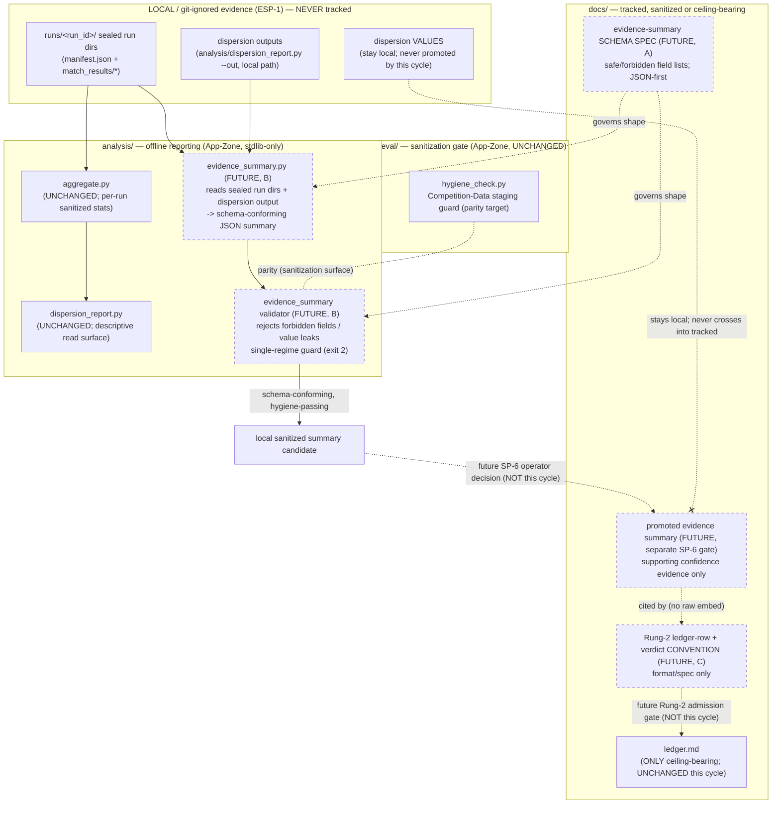

# Cycle-003 SDD — Rung-2 Admission Readiness: Tracked Evidence Summary + Ledger Plumbing

> Architecture artifact (SDD). Status: **DRAFT — design only.** This document opens **NO build gate**.
> Implementation of any specified artifact (schema file, generator/validator code, finalized ledger-row
> convention) requires a separate, explicit operator build-gate action (OA-2 equivalent) per
> `docs/operator/turntrace-loop-contract.md` §6, and lands only through `/architect → /sprint-plan →
> /implement → /review-sprint → /audit-sprint → operator acceptance`. This SDD authorizes no code and
> creates no `/implement` prompt; it is the architecture step between the accepted PRD and the sprint plan.
> Binding input: `docs/cycles/cycle-003/01-prd.md` (the Cycle-003 PRD). It opens no gate.
> Sanitized note. No raw traces, card IDs/names, deck lists, hand contents, simulator logs, PDFs/CSVs,
> `deck.csv` rows, run-dir dumps, Pokémon Elements, or Competition Data appear here (CC-1/CC-2, ESP).
> **No dispersion metric values appear here** — local evidence is referenced qualitatively only and its
> values stay local/gitignored. Runs are referenced by `run_id`, hashes, sanitized metric *names*, claim
> ceilings, and local path/status only. The forbidden agent claim words (*strong / competitive / optimal /
> calibrated / complete*) appear only as negated/forbidden language.

| Field | Value |
|---|---|
| **Cycle** | Cycle-003 |
| **Working title** | Rung-2 Admission Readiness: Tracked Evidence Summary + Ledger Plumbing |
| **Type** | Software Design Document (architecture artifact, not a build artifact) |
| **Status** | DRAFT — awaiting operator review; next Golden-Path step is sprint plan, not implementation |
| **Date** | 2026-06-19 |
| **Current main** | `811fa1a` — *docs: add TurnTrace Cycle-003 PRD* |
| **Binding input** | `docs/cycles/cycle-003/01-prd.md` (accepted-for-architecture Cycle-003 PRD) |
| **Posture** | Design the Rung-2 admission **plumbing** (schema/convention/proposal), **not** the admission |
| **Claim ceiling** | Rung 1 (held for the whole cycle; not raised) |

## 1. Architecture overview

### 1.1 Mission, restated for design

> From `01-prd.md:84-90`: *"Specify — claim-safely and without building — (a) a **tracked sanitized
> evidence-summary schema** for K-batch dispersion evidence, (b) a **generator/validator shape** that
> produces hygiene-passing summaries from existing local outputs, (c) the **Rung-2 ledger-row + verdict
> convention** (format/spec only, no row written), and (d) an **OD-6 / criterion-2 resolution proposal**
> … plus (e) a **FunSearch forward-compatibility appendix**."*

This SDD designs **where each eventual artifact lives, what shape it has, and which mechanical guards keep
it honest** — without writing code, without promoting any value, without writing a ledger row, and without
opening a build gate. The bright line governs every section, restated from the PRD: **Cycle-002 produced
the larger-`n` data and the descriptive-dispersion *machinery*; Cycle-003 specifies/designs the *tracked
sanitized evidence-summary schema*, the *Rung-2 ledger-row + verdict convention*, and the
*OD-6/criterion-2 resolution proposal* — so a future Rung-2 admission becomes a single pre-specified
operator decision — and Cycle-003 stops short of that decision** (`01-prd.md:57-60`).

The PRD boundary this SDD preserves verbatim (`01-prd.md:35-55`): **no build gate opened; no schema file,
generator/validator code, tracked metric summary, or ledger row created; Rung 1 held; no live dispersion
value promoted; `docs/ledger.md` unchanged; OD-6 unrelaxed; runtime-agent lane, broad optimization, Kaggle
submission automation, evidence hardening, and FunSearch implementation/scaffolding all remain closed.**

### 1.2 The design spine (A → B → C/D, E docs-only, all spec/proposal)

The PRD's five lanes (`01-prd.md:178-231`) map onto the architecture as follows. **None is a build.**

| Lane | Design surface | Net-new at build time? | Zone (when later built) |
|---|---|---|---|
| **A** — tracked sanitized evidence-summary schema (C3-FR-1) | A field-list spec + JSON-first schema document defining safe/forbidden fields | New tracked spec doc + (later) schema file | tracked `docs/` (spec) + App-Zone (schema artifact) |
| **B** — generator / validator shape (C3-FR-2) | One offline `analysis/`-class generator + one validator, stdlib-only, single-regime guard, no sidecar reads | New `analysis/` module(s) | App-Zone (`analysis/`) |
| **C** — Rung-2 ledger-row + verdict convention (C3-FR-3) | A format/spec convention doc; no row written | New tracked convention doc | tracked `docs/` |
| **D** — OD-6 / criterion-2 resolution proposal (C3-FR-4) | A proposal section recommending descriptive disjoint-bands; `M` unset | Authored as SDD/PRD content | tracked `docs/` |
| **E** — FunSearch forward-compatibility appendix (C3-FR-5) | Notes-only architecture guidance | Docs only | tracked `docs/` |

**The entire eventual net-new code surface of the later build cycle is one offline analysis component**
(the generator + its validator, B) plus **tracked documents** (the schema spec, the ledger-row convention,
the proposal, and the appendix). Everything is reuse of the existing read surface
(`analysis/dispersion_report.py`, `analysis/aggregate.py`) and the existing sanitization gate
(`eval/hygiene_check.py`), or docs. This is deliberate — the smallest design that delivers the mission.

### 1.3 Component diagram (target architecture, when later built)



Dashed nodes/edges are **future, separately-authorized** actions. The two double-dashed gates
(`OUT → SUMMARY` and `CONV → LED`) are the only places a value or a ceiling could ever advance, and both
are explicit later operator decisions outside Cycle-003 (§7, §9).

### 1.4 Offline / runtime separation (preserved)

The future generator/validator (B) is `analysis/`-class. It imports run-dir artifacts and intra-zone
helpers only — never `cabt`, `sim/`, `agents/runtime/`, or `eval/` — inheriting the standing separation
that `dispersion_report.py` already enforces (`analysis/dispersion_report.py:44-46`). The import boundary
is resolved precisely in §4.3.

## 2. Scope and non-scope

### 2.1 In scope (design only — builds nothing until OA-2)

- **A** — design the tracked sanitized evidence-summary **schema** (safe + forbidden field sets, JSON-first
  shape, placement) (C3-FR-1; §3, §4).
- **B** — design the **generator/validator shape** (inputs, outputs, import boundary, refusals, vocabulary,
  hygiene parity) (C3-FR-2; §4, §5, §6).
- **C** — design the **Rung-2 ledger-row + verdict convention** (columns, semantics, verdict rule,
  separation from the summary, placement) (C3-FR-3; §7).
- **D** — design how the SDD preserves the **OD-6 / criterion-2 disjoint-bands procedure shape** without
  choosing `M` and without relaxing OD-6 (C3-FR-4; §8).
- **E** — design the **FunSearch forward-compatibility** notes-only guidance (C3-FR-5; §10).

### 2.2 Out of scope (Non-Goals carried verbatim from the PRD)

Carried from `01-prd.md:143-171` (NG1–NG13). The hard exclusions this SDD must never cross:

- **No Rung-2 admission, no claim-ceiling advance, no `docs/ledger.md` mutation** (NG1–NG3).
- **No SP-6 issuance / no live-value promotion** — the schema is designed; values stay local/gitignored
  (NG4).
- **No artifacts or code built** — no schema file, no generator/validator code, no application code (NG5).
- **No numeric margin `M`; no inferential results; OD-6 not relaxed** (NG6).
- **No runtime-agent work; no broad optimization; no Kaggle submission automation** (NG7–NG9).
- **No FunSearch implementation/scaffolding** — appendix is notes-only (NG10).
- **No `regime-v001`/`regime-v002` mutation; no cross-regime comparison** (NG11).
- **No evidence hardening** (K=50 top-up, new eval runs, S02-T4 paired-delta tooling) — mention as future
  options only (NG12).
- **No forbidden claims** — forbidden agent words appear only as negated/forbidden language (NG13).

## 3. Artifact placement (resolves OD-C3-4)

The PRD defers placement to the SDD (`01-prd.md:373-376`, OD-C3-4). Placement follows the existing project
convention, established by `eval/schemas.md`: a **tracked plain field-list spec is the design authority**,
and **the machine-checkable form pairs with it** (`eval/schemas.md:1-4` — *"The machine-checkable form lives
in `eval/validate.py`; this doc and that validator must agree"*). Cycle-003 mirrors that split.

| Artifact | Placement | Tracked? | Rationale |
|---|---|---|---|
| **Evidence-summary schema spec** (the field-list design authority + JSON-first shape) (A) | `docs/cycles/cycle-003/` (e.g. a `03-evidence-summary-schema.md` authored in the later build cycle) | tracked | Sanitized spec; durable design authority, same class as `eval/schemas.md`. The cycle dir keeps the spec with its originating cycle (precedent: every `docs/cycles/cycle-00N/` holds that cycle's tracked specs). |
| **Machine-readable schema artifact** (the JSON-first schema file the validator checks against) (A) | App-Zone, paired with the validator under `analysis/` (e.g. `analysis/evidence_summary_schema.json` or an in-module constant) | tracked iff sanitized + no values | Pairs with the validator the way `eval/validate.py` pairs with `eval/schemas.md`. Carries field names/types only — **never any value** — so it is sanitized by construction. **Created only in the later build cycle.** |
| **Generator + validator code** (B) | `analysis/` (e.g. `analysis/evidence_summary.py`) | tracked (code, no values) | Offline analysis-class, alongside `dispersion_report.py` / `delta_report.py` / `aggregate.py`. **Created only in the later build cycle.** |
| **Rung-2 ledger-row + verdict convention** (C) | `docs/cycles/cycle-003/` (e.g. a `04-rung-2-ledger-convention.md`), cross-referencing `docs/ledger.md` | tracked | Format/spec doc, same class as `06-ledger-report-discipline.md`. Lives with the cycle; **does not edit `docs/ledger.md`**. |
| **OD-6 / criterion-2 proposal** (D) | This SDD (§8) and/or a cycle-003 proposal doc | tracked | Proposal content; resolves the tension *in shape* only. |
| **FunSearch forward-compat appendix** (E) | This SDD (§10) | tracked | Notes-only. |
| **Local run evidence, dispersion outputs, dispersion VALUES** | `runs/<run_id>/`, `--out` local paths | **NEVER tracked** | ESP-1; gitignored (`.gitignore` `runs/*/`); `eval/hygiene_check.py:43` mechanically refuses `runs/<run_id>/...`. |
| **State Zone working notes** (`grimoires/loa/NOTES.md`, `.beads/`) | State Zone | **NOT in tracked docs commits** unless explicitly authorized | Operator constraint; OD-9 keeps `.beads/issues.jsonl` unstaged (`07-operator-decision-register.md` OD-9). |

**System Zone untouched.** No file under `.claude/` is read, suggested, or edited at any point (zone-system
rule; PRD operator constraint). All placement decisions land in the tracked docs surface (`docs/`) or App-Zone
(`analysis/`) only.

## 4. Evidence-summary schema design (C3-FR-1 / A)

### 4.1 Safe fields (exactly the PRD's enumerated set)

The schema's safe surface is **exactly** the descriptive surface already produced by
`analysis/dispersion_report.py` plus identity/provenance fields (`01-prd.md:180-189`, `256-261`). The schema
**adds no new metric and no new statistic** (`01-prd.md:259-260`).

| Field | Source / authority | Notes |
|---|---|---|
| `regime_id` | each run dir `manifest.json` (`dispersion_report.py:126-141`) | single value; the single-regime guard guarantees one |
| `n` | per-run `n_matches` (`aggregate.py`) | the sample size; explicit, always present |
| `K` | count of runs per agent (`dispersion_report.py:184`) | the batch count |
| `agent_id` / `agent_version` | manifest authority + per-run stats (`dispersion_report.py:153,173`) | identity only |
| per-metric **descriptive vocabulary**: `count`, `min`, `max`, `range`, `mean`, `median`, `spread` | `dispersion_report.py:76` `STAT_COLUMNS` | the seven allowed statistics (OD-6) — and **nothing else** |
| `run_id` list | `dispersion_report.py:175` `run_ids` | provenance; references runs, embeds no content |
| per-run / batch content `hashes` | run-dir `hashes.txt` / manifest | integrity; no raw content |
| `mode` (`= unseeded`) | reproducibility posture (`05-reproducibility-reality.md` §1) | always `unseeded` |
| unseeded-process caveat string | `dispersion_report.py:226-231,251-254` | travels with every summary (NFR-6) |
| Rung-1 footer | `dispersion_report.py:233-239` | "this report carries no ceiling of its own" |

Metrics dispersed are exactly `dispersion_report.py:69-72` `DISPERSION_METRICS`
(`win_rate`, `illegal_action_rate`, `timeout_rate`, `error_rate`, `avg_turns`, `avg_wall_clock_ms`);
`avg_wall_clock_ms` is environment-sensitive throughput, reported but never a comparison metric
(`dispersion_report.py:67-68`).

### 4.2 Forbidden fields (enumerated and validator-enforced)

The forbidden set is **enumerated and mechanically enforced by the validator**, not merely documented
(`01-prd.md:262-263`). A summary carrying any of these **fails validation and can never be promoted**.

| Forbidden class | Examples | Rule basis |
|---|---|---|
| Raw decision rows / trace bodies | per-decision sidecar contents, trace JSON | CC-1/CC-2; `dispersion_report.py:16-19` never opens sidecars |
| Competition Data | card IDs/names, deck lists, hand contents, simulator logs | CC-1/CC-2; `hygiene_check.py:36-44` |
| File-form Competition Data | PDFs/CSVs, `deck.csv` rows, run-dir dumps | `hygiene_check.py:39-44` |
| Pokémon Elements | type matchups, deck recipes, names | ESP; `eval/schemas.md:13-15` |
| Inferential statistics | `std-dev`, `variance`, CIs, p-values, "significance", hypothesis tests, inferential error bars | OD-6 (`07-operator-decision-register.md` §2); `dispersion_report.py:31-34` |
| Cross-regime fields / comparisons | any field comparing two `regime_id`s; any v002-vs-v001 figure | NFR-5; `frozen/regimes/regime-v001.json:9` |
| Affirmative forbidden agent words | *strong / competitive / optimal / calibrated / complete* as affirmatives | `docs/claim-ceiling.md:54-59` |

### 4.3 Sanitization parity and read surface

The schema's read surface is identical to `dispersion_report.py`'s: **manifest + `match_results/*` only,
never the per-decision sidecars** (`01-prd.md:188-189`; `dispersion_report.py:11-19`). The validator (§6)
must reach **sanitization parity with `eval/hygiene_check.py`** (`01-prd.md:189`) — it refuses the same
carrying paths (`hygiene_check.py:35-45`) and additionally refuses the value-bearing and inferential leaks
that hygiene_check (a path-based staging gate) does not check.

### 4.4 JSON-first shape

The summary's machine-readable JSON form is **primary** (FunSearch forward-compat, §10); a human-readable
rendering is **derived, never the source of truth** (`01-prd.md:264-265, 227-228`). This mirrors
`dispersion_report.py`'s existing `render_json` (machine-readable) vs `render` (Markdown) split
(`dispersion_report.py:243-255` vs `197-240`) — the JSON carries `regime_id`, `n`, `K`, the per-agent
dispersion, the `claim_ceiling` framing string, and the `unseeded_caveat` string. **No FunSearch
dependency, interface, or scaffold is introduced** (NG10); JSON-first is an existing-pattern choice, not a
FunSearch coupling.

## 5. Generator shape (C3-FR-2 / B)

The generator is an offline `analysis/`-class component that:

1. **reads** existing local sealed run dirs (`manifest.json` + `match_results/*` via
   `aggregate.aggregate_run`) and the local dispersion output, exactly the `dispersion_report.py` read
   surface (`dispersion_report.py:11-19`);
2. **emits** a schema-conforming (A) sanitized JSON summary (the safe-field set of §4.1, in JSON-first form
   of §4.4);
3. **never opens** the per-decision sidecars — structurally, by containing no reference to that directory
   (`dispersion_report.py:16-19`).

Required properties (`01-prd.md:196-199`; NFR-5):

- **Import boundary**: `analysis/`-class — **no `cabt`, no `sim/`, no `agents/runtime/`, no `eval/` import**
  (the standing offline/runtime separation; `dispersion_report.py:44-46`).
- **stdlib-only** (NFR-7) unless the SDD explicitly justifies otherwise. **This SDD finds no justification
  to deviate** — the read surface is JSON + arithmetic, which stdlib (`json`, `statistics`, `pathlib`)
  covers, exactly as `dispersion_report.py` does (`dispersion_report.py:52-58`). Any future dependency
  proposal is a separate operator decision, not assumed here.
- **Single-regime guard** (§6.2): hard-refuse mixed `regime_id`.
- **No value promotion**: the generator writes to a **local path by default** (mirroring
  `dispersion_report.py --out`, `dispersion_report.py:268-270`, "local/git-ignored by default"). Promotion
  to tracked status is a separate SP-6 operator decision (§9), never a generator side effect.

The generator **reuses** `aggregate.aggregate_run` and the descriptive-stat helpers rather than
recomputing them, inheriting the proven sanitized surface (`dispersion_report.py:63, 147`).

## 6. Validator shape (C3-FR-2 / B)

The validator is the mechanical barrier that makes the forbidden-field set (§4.2) enforceable rather than
advisory (`01-prd.md:191-199, 262-263`). It runs **before any summary could ever be promoted**.

### 6.1 What it rejects

- Any field outside the safe-field allow-list of §4.1 (allow-list, not deny-list — unknown fields fail
  closed).
- Any inferential statistic name or value (`std-dev`, `variance`, CI, p-value, "significant", etc.) — OD-6.
- Any Competition-Data / Pokémon-Element token, reaching **sanitization parity with
  `eval/hygiene_check.py`** (`hygiene_check.py:35-45`) plus the value/inferential checks hygiene_check does
  not perform.
- Any cross-regime field or comparison (NFR-5).
- Any affirmative forbidden agent word.

### 6.2 Single-regime guard (mirrors existing exit-code discipline)

The validator (and generator) **hard-refuse mixed `regime_id` inputs, mirroring the existing exit-code
discipline — exit 2** (`01-prd.md:198`). This mirrors `dispersion_report.py`'s `MixedRegimeRefusal`
(`dispersion_report.py:79-80, 133-140, 275-277`, *"refusing to disperse across regimes … exit 2"*) and
`delta_report.py`'s `CrossRegimeRefusal` (`delta_report.py:128-143`). The `regime_id` authority is each run
dir's `manifest.json`, read **first, before any aggregation** (`dispersion_report.py:126-141`); no logic
keys off the run-id string (`07-operator-decision-register.md` §2, *"ID authority: manifest.json …"*).

### 6.3 Exit-code contract (design level)

Mirroring `dispersion_report.py:48-49` and `delta_report.py`:

| Exit | Meaning |
|---|---|
| `0` | summary validates clean (schema-conforming, sanitized, single-regime) |
| `1` | input failure (missing manifest, malformed run dir) |
| `2` | **mixed-regime refusal** (the hard single-regime guard) |
| (forbidden-field leak) | a forbidden field/value/word found → **non-zero, fail-closed** (the build cycle fixes the exact code; the contract is: never exit 0 on a leak) |

### 6.4 Hygiene parity

The validator's sanitization checks are a **superset-parity** with `eval/hygiene_check.py`: it refuses the
same carrying paths/tokens (`hygiene_check.py:35-45`) and additionally enforces the value-bearing,
inferential, cross-regime, and forbidden-word checks that a path-based staging gate cannot express. The two
gates compose: hygiene_check guards the *staging boundary* (what may be committed); the validator guards the
*summary content* (what a summary may contain) before it is ever a promotion candidate.

## 7. Rung-2 ledger-row + verdict convention (C3-FR-3 / C, format-only)

### 7.1 Row schema (adds no column)

A future deliverable Rung-2 row follows the **existing append-only ledger schema** verbatim, adding **no
column** (`01-prd.md:203-211`; `docs/ledger.md:9`): `date`, `run_id`, `regime_id`, `git_rev`,
`sim_version`, `agent_version`, `opponent_pool_ref`, `seed_set_ref`, `games`/`n`, `win_rate`,
`illegal_action_rate`, `timeout_rate`, `error_rate`, `avg_turns`, `mode`, `hypothesis`, `claim_ceiling`,
`notes`. The `claim_ceiling` field is **where a Rung-2 ceiling would one day be recorded — by a separate
operator decision, never by this cycle** (`01-prd.md:272-274`).

### 7.2 Verdict rule

A `verdict` of better/worse is written **only** for a **same-regime, agent-only** comparison carrying a
**ceiling and an `n`**, and **never across regimes** (`docs/ledger.md:5-8`; `06-ledger-report-discipline.md`
§4; NFR-5). The existing `run-0002` vs `run-0001` row demonstrates the shape at Rung 1
(`docs/ledger.md` row 2 notes: *"same-regime agent-only comparison … NO strength claim (ladder Rung 1)"*).

### 7.3 Separation of concerns (the load-bearing distinction)

This is the architectural heart of Lane C (`01-prd.md:208-211, 276-279`):

- The **ledger row is the only future ceiling-bearing verdict artifact**. It carries the verdict, the
  ceiling, and the `n`.
- The **evidence summary (A) is supporting confidence evidence only** — it carries the K-batch spread, no
  ceiling of its own (parity with `dispersion_report.py:36-37`, *"carries no ceiling of its own … the
  ledger is the only ceiling-bearing artifact"*).
- The convention specifies how a future row would **cite a promoted evidence summary** (by reference + hash)
  **without embedding raw content** (`06-ledger-report-discipline.md` §7).

### 7.4 No row written

`docs/ledger.md` **stays at its two Rung-1 `regime-v001` rows; this cycle changes nothing in it** (NG3;
`01-prd.md:280-281`). The convention is format/spec only. Per the operator constraint, **`docs/ledger.md` is
not edited by this planning cycle**, and no `run-v002` / Rung-2 row is written until a separate Rung-2
admission gate.

## 8. OD-6 / criterion-2 resolution — procedure shape (C3-FR-4 / D)

### 8.1 The tension (restated)

Rung-2 criterion 2 requires *"an explicitly designed and operator-approved **inferential** procedure"*
(`04-rung-2-readiness-criteria.md` §2.2); OD-6 **forbids** inferential statistics
(`07-operator-decision-register.md` §2). They cannot both hold unchanged (`01-prd.md:284-287`).

### 8.2 Recommended resolution — pre-registered descriptive disjoint-bands (procedure shape only)

The SDD preserves the PRD's recommended **disjoint-bands procedure shape** without choosing a numeric `M`
(`01-prd.md:213-222, 288-293`). The rule shape:

> *"candidate `min` > baseline `max` by ≥ M across K ≥ 20 same-regime batches"*

expressed using **only the allowed descriptive vocabulary** (`min`, `max`, `range`, `mean`, `median`,
`spread`, `count`) — **no `std-dev`, no `variance`, no inferential statistic** (OD-6 unrelaxed). The
quantities `candidate min`, `baseline max`, and `K` are all already in the evidence-summary safe set (§4.1),
so the procedure consumes the schema with **no new field**. This satisfies criterion 3's *pre-registered
margin* and reinterprets criterion 2's spirit (*pre-registered, operator-approved, not chosen after the
fact*) **without crossing OD-6**.

### 8.3 OD-6 stays unrelaxed

The SDD keeps **OD-6 unrelaxed: descriptive vocabulary only**, unless a later operator decision says
otherwise (`01-prd.md:54-55, 152-154`). The alternative — relaxing OD-6 for a genuine inferential test — is
**presented, not recommended, and not decided here** (`01-prd.md:294-295`).

### 8.4 Pre-registration procedure

The rule and its margin `M` are fixed **before** the comparison numbers are read as the verdict
(`01-prd.md:293`). The SDD specifies the *procedure*; it **does not choose `M`** (NG6).

### 8.5 The exact later operator seam (resolves the OD-C3 deferrals)

The SDD identifies the **single later seam** where an operator chooses, in order, the four irreversible
acts the PRD keeps separate (`01-prd.md:296-298, 367-382`). These do **not** happen in Cycle-003:

| Seam step | Operator decision | PRD ref | Cycle-003 status |
|---|---|---|---|
| **8a** | Descriptive disjoint-bands rule **vs** OD-6 relaxation | OD-C3-1 | proposed in shape; **not decided** |
| **8b** | Numeric margin `M` | OD-C3-2 | **deferred** — fixed before numbers read, at the later gate |
| **8c** | SP-6 live-value promotion | OD-C3-3 | **deferred** — schema designed; no value promoted (§9) |
| **8d** | Rung-2 ledger row / ceiling advance | OD-C3-1 (criterion 5), OD-C3-7 | **deferred** — separate Rung-2 admission gate |

These four are **conjunctive** and **all governance/design, not data** (`01-prd.md:103-107`). Bundling them
into one cycle is the highest-consequence, hardest-to-walk-back path (`01-prd.md:120-123`); the project's
discipline is to build readiness, then advance as a separate explicit decision
(`04-rung-2-readiness-criteria.md` §2.5).

## 9. No-values / no-ledger mechanical protections

The architecture provides four mechanical protections so the future implementation can define schema and
convention **without promoting live values** (`01-prd.md:266-268, 384-396`):

1. **Allow-list schema (fail-closed).** The validator (§6) accepts only the §4.1 safe fields; any
   value-bearing or inferential field fails closed. A leak cannot pass silently.
2. **Generator writes local by default.** The generator (§5) writes to a local/git-ignored path by default
   (mirroring `dispersion_report.py --out`); it never writes to tracked `docs/`. Tracking is a deliberate
   `git add`, gated by `eval/hygiene_check.py` at the staging boundary.
3. **SP-6 is a separate later operator decision.** Defining the **schema** is in scope (OD-C3-3,
   recommended); **promoting live values** into a tracked summary is **not** (NG4). The schema specifies
   *what a promoted summary may contain*; **issuing SP-6 to actually promote values is a separate later
   operator decision** (§8.5 step 8c; `06-ledger-report-discipline.md` §6).
4. **`docs/ledger.md` is the only ceiling-bearing artifact, unchanged.** The ledger row is the **only future
   ceiling-bearing verdict artifact**; the evidence summary is **supporting confidence evidence only** (§7.3).
   **`docs/ledger.md` remains unchanged in this cycle** (NG3); **no Rung-2 row is written until a separate
   Rung-2 admission gate** (§8.5 step 8d).

## 10. FunSearch forward-compatibility (C3-FR-5 / E, notes-only)

Architecture guidance only — **no dependency, interface, scaffolding, candidate-search code, or
runtime-agent heuristic surface is added** (NG10; `01-prd.md:224-231`):

- TurnTrace should remain a **clean scalar-per-candidate, regime-stamped evaluator signal** in the future.
  The evidence-summary JSON (§4.4) already carries the `regime_id` stamp and per-metric scalars; this is the
  property a future automated evaluator would consume.
- The schema stays **JSON-first / machine-readable** (§4.4) to avoid assumptions that would block a future
  automated consumer — a forward-compat property, not a FunSearch coupling.
- A future candidate-search loop would require a **runtime-agent heuristic surface first (currently closed)**
  and an evaluator that **averages over enough matches/batches to clear the unseeded RNG noise floor**
  (`05-reproducibility-reality.md` §3). Both are out of scope and remain closed.

## 11. Risks and mitigations (architecture level)

Carried and sharpened from `01-prd.md:384-396` (R1–R8); the architectural mitigation is named per row.

| ID | Risk | Architectural mitigation |
|---|---|---|
| **R1** | **Value leak into tracked docs** — a dispersion value reaches a tracked artifact | Allow-list schema + fail-closed validator (§4.2, §6.1); hygiene_check parity (§6.4); generator writes local by default (§9.2); this SDD carries no values; NG4. |
| **R2** | **Forbidden-field leakage** — an inferential stat / Competition-Data token / forbidden word slips into a summary | Enumerated forbidden set, validator-enforced as a superset-parity of hygiene_check (§4.2, §6.4); unknown fields fail closed (§6.1). |
| **R3** | **Cross-regime contamination** — a v002 figure aggregated beside / compared to a v001 figure | Single-regime guard, exit 2, manifest authority read first (§6.2); mirrors `dispersion_report.py` / `delta_report.py`; NFR-5. |
| **R4** | **Accidental ledger mutation** — a row written / ceiling advanced in this cycle | Ledger-row convention is format/spec only (§7.4); `docs/ledger.md` not edited; row written only at a separate Rung-2 admission gate (§8.5 step 8d); NG3. |
| **R5** | **Scope-creep into admission** — the cycle drifts into asserting Rung 2 / choosing `M` / promoting values | Rung 1 held (§1.1); proposal is shape-only with `M` unset (§8.4); SP-6 deferred (§9.3); the four irreversible acts are a single later seam (§8.5); NG1–NG2, NG6. |
| **R6** | **Runtime-agent creep** — agent tuning/planning beyond "closed lane" | Generator import boundary excludes `agents/runtime/` (§4.3, §5); agents frozen; lane closed; NG7. |
| **R7** | **Evidence-hardening creep** — K=50 top-up / new eval runs / paired-delta tooling sneak in | No eval run and no tooling build designed; the generator reads *existing* local outputs only (§5); follow-ups recorded as future options (OD-C3-5); NG12. |
| **R8** | **FunSearch creep** — a dependency/scaffold/heuristic surface is added | Appendix is notes-only (§10); JSON-first is an existing-pattern choice; NG10. |
| **R9** | **Premature implementation** — schema/code built inside a planning cycle | Spec/design only (NFR-8); no schema file, generator/validator code, or ledger row created; building needs a separate `/implement` under OA-2 (OD-C3-6); NG5. |

## 12. Later-build acceptance posture (design level only — no tests written now)

These are **design-level acceptance checks** for the later build cycle; **no test or code file is written
now** (`01-prd.md:347-363`, AC-1…AC-7; NG5). Listed as a planning-only matrix per the architecture skill's
goal-driven-execution discipline — runnable checks land only inside a later `/implement`.

| Check | Verifies | Maps to |
|---|---|---|
| **Schema lint** | a summary conforms to the §4.1 safe-field allow-list; JSON-first | AC-1 |
| **Validator rejects forbidden fields** | every §4.2 forbidden class is refused fail-closed; hygiene parity | AC-1, AC-2 |
| **Mixed-regime refusal** | exit 2 on mixed `regime_id`, before any aggregation | AC-2 |
| **No sidecar reads** | the generator/validator never opens per-decision sidecars (structural) | AC-2 |
| **No ledger mutation** | `docs/ledger.md` byte-unchanged; no Rung-2 row | AC-3, AC-6 |
| **No promoted values** | no dispersion value promoted to tracked status; SP-6 not issued | AC-6 |
| **Hygiene parity** | the validator refuses the same paths/tokens as `eval/hygiene_check.py`, plus value/inferential checks | AC-1, AC-2 |
| **Proposal authored, `M` unset** | disjoint-bands recommended; OD-6 unrelaxed; no inferential result | AC-4 |
| **FunSearch appendix present** | notes-only; no dependency/scaffold | AC-5 |
| **Cadence** | work lands through `/implement → /review-sprint → /audit-sprint → operator acceptance`; EDD min met | AC-7 |

## 13. Designed-now vs later-authorized (the explicit handoff)

The PRD requires an explicit statement of what is designed now versus what remains a later authorized
implementation/admission action (`01-prd.md:347-363`). The full admission handoff chain
(`01-prd.md:84-90, 379-382`):

```
sanitized evidence-summary SCHEMA (designed now, A/§4)
  → generated/validated summary        (built later under OA-2, B/§5-§6)
    → promoted evidence summary         (later SP-6 operator decision, §8.5 step 8c)
      → Rung-2 ledger ROW               (later Rung-2 admission gate, §7, §8.5 step 8d)
        → Rung-2 admission DECISION     (operator; never in Cycle-003)
```

| Phase | Status in Cycle-003 |
|---|---|
| Schema spec, generator/validator shape, ledger-row convention, OD-6/criterion-2 proposal shape, FunSearch appendix | **Designed now** (this SDD; spec/proposal only — no file, no code, no row) |
| Schema file + generator/validator code | **Later** — separate `/implement` under OA-2 (OD-C3-6) |
| Live-value promotion (SP-6) | **Later** — separate operator decision (§8.5 step 8c; OD-C3-3) |
| Numeric margin `M`; disjoint-bands vs OD-6-relaxation choice | **Later** — operator at the admission gate (§8.5 steps 8a/8b; OD-C3-1/2) |
| Rung-2 ledger row + claim-ceiling advance + Rung-2 admission | **Later** — separate Rung-2 admission gate (§8.5 step 8d; OD-C3-1 criterion 5, OD-C3-7) |
| K=50 confidence top-up / S02-T4 paired-delta tooling | **Out of scope** — future option only (OD-C3-5; NG12) |

**Rung 1 remains held. `docs/ledger.md` is unchanged. No value is promoted. No build gate is opened by this
SDD.**

## 14. Open decisions carried to the sprint plan

Carried from `01-prd.md:365-382` (OD-C3-1…OD-C3-7), with this SDD's disposition:

| ID | Decision | SDD disposition |
|---|---|---|
| **OD-C3-1** | OD-6 / criterion-2 resolution (disjoint-bands vs OD-6 relaxation) | Disjoint-bands procedure shape designed (§8.2); decision left to operator at the later seam (§8.5 step 8a). |
| **OD-C3-2** | Numeric margin `M` | Deferred; pre-registration procedure designed, `M` unset (§8.4; §8.5 step 8b). |
| **OD-C3-3** | SP-6 schema authorization | Schema designed (§4); live-value promotion deferred (§9.3; §8.5 step 8c). |
| **OD-C3-4** | Artifact placement | **Resolved by this SDD** (§3). |
| **OD-C3-5** | Optional future evidence hardening | Recorded as future option only; out of scope (§11 R7; NG12). |
| **OD-C3-6** | Build authorization (OA-2 equivalent) | This SDD opens no gate; build is a separate later operator action (§13). |
| **OD-C3-7** | Admission timing | Not decided here; carried to the later Rung-2 admission gate (§8.5 step 8d). |

## 15. Traceability back to PRD functional requirements

| PRD FR | SDD section(s) |
|---|---|
| **C3-FR-1** — tracked sanitized evidence-summary schema | §3 (placement), §4 (safe/forbidden fields, parity, JSON-first) |
| **C3-FR-2** — generator/validator shape | §4.3, §5 (generator), §6 (validator, exit codes, hygiene parity) |
| **C3-FR-3** — Rung-2 ledger-row + verdict convention | §7 (row schema, verdict rule, separation of concerns, no row written) |
| **C3-FR-4** — OD-6 / criterion-2 resolution proposal | §8 (disjoint-bands shape, OD-6 unrelaxed, `M` unset, later seam) |
| **C3-FR-5** — FunSearch forward-compatibility appendix | §10 (notes-only) |
| **NFR-1…NFR-8** | §1.1 (claim-safety/spec-only), §4.3/§6.4 (sanitization), §6.2 (same-regime), §4.1/§8 (descriptive vocab), §4.3/§5 (offline separation), §4.1 (reproducibility caveat), §3 (zone discipline) |
| **G6 / no-values / no-ledger** | §9 (mechanical protections), §13 (designed-now vs later) |

## 16. Sources and traceability

> **Binding input:** `docs/cycles/cycle-003/01-prd.md` (the Cycle-003 PRD).
> **Tracked sources (durable grounding):** `docs/cycles/cycle-002/closeout.md`;
> `docs/cycles/cycle-002/04-rung-2-readiness-criteria.md`; `docs/cycles/cycle-002/05-reproducibility-reality.md`;
> `docs/cycles/cycle-002/06-ledger-report-discipline.md`; `docs/cycles/cycle-002/07-operator-decision-register.md`;
> `docs/cycles/cycle-002/02-sdd.md` (style/reference); `docs/claim-ceiling.md`; `docs/ledger.md`;
> `docs/operator/turntrace-loop-contract.md`; `docs/operator/deferred-lane-gate-after-sprint-01.md`;
> `docs/cycles/cycle-000-bootstrap/01-turntrace-prd.md` (maturity ladder);
> `analysis/dispersion_report.py` (the read surface + exit-code discipline + descriptive vocabulary);
> `analysis/delta_report.py` (`CrossRegimeRefusal`); `analysis/aggregate.py` (per-run sanitized stats);
> `eval/hygiene_check.py` (sanitization staging gate / parity target); `eval/schemas.md` (spec-pairs-with-validator
> placement precedent); `frozen/regimes/regime-v00{1,2}.json`; `frozen/seeds/seed-set-v002.json`.
> Current main at authoring: `811fa1a`. Claim ceiling: **Rung 1 (unchanged).** This SDD opens no build gate,
> creates no schema file or code, writes no ledger row, and promotes no value.
