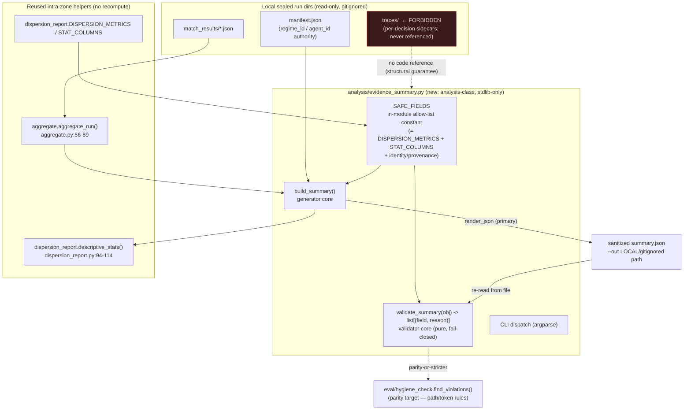
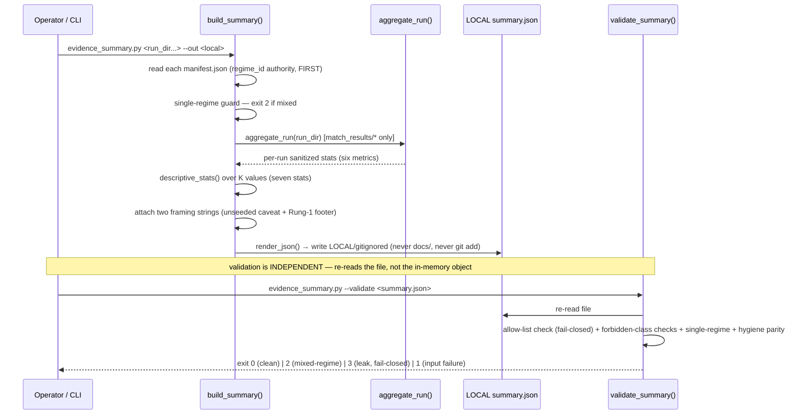

# Cycle-004 SDD — OA-2 Build: Offline Evidence-Summary Generator + Validator

> Software Design Document (planning artifact). Status: **DRAFT — awaiting operator review.** This SDD
> translates the accepted Cycle-004 PRD (`docs/cycles/cycle-004/01-prd.md`) into a concrete build design for
> **one** offline `analysis/`-class module — `analysis/evidence_summary.py` — that generates a sanitized,
> JSON-first K-batch evidence summary from existing local sealed run dirs and validates such a summary
> mechanically. The SDD **opens no implementation gate**; building lands only through
> `/sprint-plan → /implement → /review-sprint → /audit-sprint → operator acceptance`
> (`docs/operator/turntrace-loop-contract.md` §6). Cycle-004 is **build-only**: it relaxes Cycle-003
> non-goal **NG5 only** (`docs/cycles/cycle-003/01-prd.md:151`); every other Cycle-003 bright line holds.
>
> **Sanitized note.** No raw traces, card IDs/names, deck lists, hand contents, simulator logs, PDFs/CSVs,
> `deck.csv` rows, run-dir dumps, Pokémon Elements, or Competition Data appear here (CC-1/CC-2, ESP).
> **No dispersion metric values appear here** — local evidence is referenced qualitatively only; its values
> stay local/gitignored. Runs are referenced by `run_id`, hashes, sanitized metric *names*, claim ceilings,
> and local path/status only. The forbidden agent words (*strong / competitive / optimal / calibrated /
> complete*) and the inferential terms (*std-dev / variance / CI / p-value / significance / hypothesis-test /
> error-bar*) appear only as the negated/forbidden language they are. **Rung 1 held** throughout.

## 0. State verified (2026-06-19, before drafting)

The PRD's §0 baseline (`01-prd.md:22-36`) was re-verified at this SDD's authoring HEAD. All findings hold;
none contradicts the accepted PRD; none forces a stop.

| Assumption to verify | Result |
|---|---|
| Current HEAD / branch | `main` @ `73c13ee` — *docs: complete TurnTrace Cycle-003 Sprint 00 specs* (Cycle-003 closed) |
| `docs/ledger.md` byte-unchanged from Cycle-003 close | **byte-unchanged**; `git diff --exit-code -- docs/ledger.md` clean; `git hash-object docs/ledger.md = 2a2f1c2dc540b6d7e7a68aad5ab3c6b109dcee4b` (matches PRD baseline) |
| Claim ceiling still Rung 1 | **Rung 1** (`docs/claim-ceiling.md`; ladder unchanged) |
| `analysis/evidence_summary*.py` / `.json` exists? | **absent** — Cycle-003 built no code; this checkout confirms it |
| Staged files | **none staged** (`git diff --cached --name-only` empty) |
| `.beads/issues.jsonl`, `grimoires/loa/NOTES.md` dirty | both modified, **unstaged** (pre-existing State-Zone housekeeping); this cycle does not stage or touch them |
| `.claude/` (System Zone) | **untouched / no drift**; `integrity_enforcement: strict` → no HALT |
| Local sealed K-batch run dirs present (for the §10 exercise) | **present** — `runs/run-v002-b-1` … and `runs/run-v002-c-1` … exist; each run dir contains `manifest.json`, `match_results/`, `summary.csv`, `hashes.txt`, **and a `traces/` sidecar dir** (the forbidden read surface — confirmed present, so the structural no-reference guarantee is load-bearing, not hypothetical) |

**Citation re-validation at this HEAD (NFR-9 precondition for the sprint).** The line anchors the PRD and
Cycle-003 docs 04/05/06 carry were re-checked against the source files at `73c13ee` and are accurate as
used in this SDD:

| Citation (as used here) | Verified at HEAD `73c13ee` |
|---|---|
| `analysis/dispersion_report.py` read surface (manifest + `match_results/*`, never sidecar) | docstring **`:11-19`** ✓ |
| `dispersion_report.py` import boundary (`analysis/` imports intra-zone only; no `cabt`/`sim`/`runtime`/`eval`) | docstring **`:44-46`** ✓ (full statement spans `:39-46`) |
| `dispersion_report.py` CLI + exit codes (0/1/2) | **`:48-49`** ✓ |
| `DISPERSION_METRICS` (six metric names) | **`:69-72`** ✓ |
| `STAT_COLUMNS` (seven descriptive statistics) | **`:76`** ✓ |
| `descriptive_stats` helper | **`:94-114`** ✓ |
| `MixedRegimeRefusal` (exit 2) | class **`:79-80`**, raised **`:133-140`**, mapped to exit 2 **`:275-277`** ✓ |
| `render_json` (JSON-first) vs `render` (Markdown derived) | `render_json` **`:243-255`**; `render` **`:197-240`** ✓ |
| local-by-default `--out` | **`:268-270`** (+ write logic `:283-287`) ✓ |
| `analysis/aggregate.py:aggregate_run` (reads `match_results/*` only) | **`:56-89`** ✓ |
| `analysis/delta_report.py:CrossRegimeRefusal` | class **`:128-129`**, raised **`:138-143`** ✓ |
| `eval/hygiene_check.py` path rules | `_RULES` **`:35-45`** ✓ |
| `eval/hygiene_check.py:find_violations` returns `(path, reason)` pairs | **`:52-62`** ✓ |
| `eval/validate.py` "no third-party schema library" idiom + in-module `_MATCH_SPEC` | idiom **`:11-12`** (cited as `:13` in PRD; statement spans `:11-13`); `_MATCH_SPEC` **`:27`** ✓ |
| `eval/schemas.md` spec↔validator-must-agree contract | **`:1-5`** ✓ |
| `tests/test_import_direction.py` `ALLOWED["analysis"] = set()`; `eval` may import `analysis` | `ALLOWED` block **`:32-37`** ✓; auto-glob of `analysis/*.py` **`:69`** ✓ |
| `docs/ledger.md` 18-column schema incl. `hypothesis` text column | header **`:9`**; two Rung-1 rows **`:11-12`** ✓ |
| `aggregate.py` `LEDGER_COLUMNS` (the same 18 columns, incl. `hypothesis`) | **`:35-40`** ✓ |
| `.gitignore` gitignores `grimoires/loa/a2a/` | line for `grimoires/loa/a2a/` present ✓ |

> **Minor anchor note for the sprint (NFR-9).** The PRD cites the import-boundary statement as
> `dispersion_report.py:44-46`; at this HEAD the human-readable statement spans `:39-46` (the
> `# loa:shortcut:` block `:39-42` plus the boundary sentence `:44-46`). The mechanical enforcement is in
> `tests/test_import_direction.py:32-37,69`, which is unaffected. `/implement` MUST re-validate all anchors
> against the **build-time** HEAD before relying on them and make the in-module allow-list **agree** with
> doc 04 §2 (the `eval/schemas.md:1-5` contract); citations accurate now may desync if source files move.

**Posture: implementation remains un-authorized** until the operator accepts this SDD and the cycle proceeds
through `/sprint-plan → /implement`. This SDD writes only `docs/cycles/cycle-004/02-sdd.md`; it stages
nothing, commits nothing, mutates no ledger, promotes no value, and edits no `.claude/`.

| Field | Value |
|---|---|
| **Cycle** | Cycle-004 |
| **Working title** | OA-2 Build: Offline Evidence-Summary Generator + Validator |
| **Type** | Software Design Document (planning artifact for a build cycle) |
| **Status** | DRAFT — awaiting operator review; next Golden-Path step is `/sprint-plan` |
| **Date** | 2026-06-19 |
| **Authoring HEAD** | `73c13ee` — *docs: complete TurnTrace Cycle-003 Sprint 00 specs* |
| **Input PRD** | `docs/cycles/cycle-004/01-prd.md` (accepted; opens OA-2 at acceptance) |
| **Design authorities** | Cycle-003 docs 04 (`04-evidence-summary-schema-spec.md`) + 05 (`05-generator-validator-shape.md`); + docs 06/07/08 for boundary/seam context |
| **Posture** | **Build-only.** Relax NG5 only; build the generator + validator + in-module schema constant + tests; run a local exercise; hold every other bright line |
| **Claim ceiling** | **Rung 1** (held for the whole cycle; not raised) |

## 1. System overview

### 1.1 What is being built

Cycle-003 specified the schema (doc 04) and the generator/validator *shape* (doc 05) without building
anything (NG5). **Cycle-004 builds exactly those two and stops before the admission seam.** The deliverable
is one offline analysis module plus its test suite:

- `analysis/evidence_summary.py` — a new sibling of `analysis/dispersion_report.py` /
  `analysis/aggregate.py` / `analysis/delta_report.py`, with **two cores in one module** (decision D-2,
  OD-C4-1 finalized in §6.1): a **generator** core and an **independent fail-closed validator** core,
  sharing one in-module schema constant; the CLI dispatches by flag.
- `tests/test_evidence_summary.py` — a stdlib plain-Python test module (`main()` → exit 0/1, mirroring
  `tests/test_import_direction.py`) proving every property in §9.

The generator turns existing **local sealed run dirs** into a sanitized, JSON-first, schema-conforming
K-batch evidence summary, written **local-by-default**. The validator re-reads such a summary file and
mechanically enforces doc 04 §3's forbidden-field/content classes — making the forbidden set *enforceable
rather than advisory* (`04-evidence-summary-schema-spec.md` §3; `05-generator-validator-shape.md` §2). The
local end-to-end exercise (§10) runs the pair against the existing local K=20+20 dirs to a gitignored path,
promoting nothing.

### 1.2 What is NOT being built (admission-deferred posture)

This is the **bridge**, not the crossing. The module produces no Rung-2 verdict, writes no ledger row,
chooses no numeric margin `M`, advances no claim ceiling, and issues no SP-6 promotion. Those four
conjunctive seam decisions (8a disjoint-bands-vs-OD-6, 8b `M`, 8c SP-6, 8d Rung-2 row / ceiling-advance;
`07-od6-criterion-2-proposal.md` §5) stay **open by design** and are decided only at a separate later
admission gate (expected Cycle-005; `01-prd.md` Posture, D-4). See §13.

### 1.3 Component diagram



> **Rendered (optional).** GitHub renders the Mermaid block above natively. No external preview URL is
> generated (visual-communication v2.0).

### 1.4 Data flow (generate then validate)



## 2. Component design — `analysis/evidence_summary.py`

### 2.1 Module placement and class

A new file `analysis/evidence_summary.py`, an **`analysis/`-class offline module** — a sibling of
`dispersion_report.py`. Like its siblings it begins with a module docstring that states its read surface,
import boundary, exit-code contract, and the structural no-sidecar guarantee (mirroring
`dispersion_report.py:11-49`). It is tracked **App Zone** code; its *outputs* are local/gitignored (§8).

### 2.2 Public surface (the two cores + the shared constant)

| Symbol | Kind | Role |
|---|---|---|
| `SAFE_FIELDS` (+ helpers) | module constant | The in-module machine-checkable allow-list — single source of truth (§5). Built from the reused `DISPERSION_METRICS`/`STAT_COLUMNS` plus the identity/provenance/framing field names. |
| `build_summary(run_dirs) -> dict` | generator core | Reads the run dirs, runs the single-regime guard, reuses `aggregate_run` + `descriptive_stats`, returns the JSON-first summary dict (§3). Pure of I/O side effects except reading run dirs; writing is the CLI's job. |
| `validate_summary(obj) -> list[tuple[str, str]]` | validator core | **Pure** function over an arbitrary dict: returns a list of `(field_or_token, reason)` violations; empty list ⇒ valid. No I/O, no global state — testable in isolation (§4). |
| `render_json(summary) -> str` | renderer | JSON-first serialization (mirrors `dispersion_report.py:243-255`); the primary form. |
| `main(argv=None) -> int` | CLI | argparse dispatch by flag; maps outcomes to the exit-code table (§6). |

Rationale for one module (D-2 / OD-C4-1 finalized **one-module**, §6.1): the generator and validator share
the `SAFE_FIELDS` constant; splitting them into two files would either duplicate the constant (a drift
surface, contradicting the DRY rationale of D-1) or force a third shared module for one constant — more
files for no benefit. The independence the validator needs (FR-2.1) is **behavioural** (it re-reads from a
file), not **physical** (a separate `.py`); §4.1 secures it by construction. No concrete architectural
blocker forces two modules, so the PRD's recommended single-module shape stands.

## 3. Generator design (C4-FR-1)

### 3.1 Read surface — exactly the `dispersion_report.py` surface

`build_summary` reads, per run dir, **only**:

1. `manifest.json` — read **first**, the authority for `regime_id` and `agent_id`
   (`dispersion_report.py:126-141`; `aggregate.py:87-88`). The single-regime guard keys off the manifest,
   **never** off the run-id string (`05-generator-validator-shape.md` §2.2;
   `07-od6-criterion-2-proposal.md` §2 "ID authority: `manifest.json`").
2. `match_results/*.json` — only via `aggregate.aggregate_run` (`aggregate.py:56-89`), the single source of
   per-run sanitized stats. The generator never parses match files itself.

This is **identical to `dispersion_report.py:11-19`**. It runs **no eval** and **creates no run dir**
(NG12): it reads existing local outputs only.

### 3.2 Forbidden read — the `traces/` sidecar (structural guarantee)

The module **contains no reference to the `traces/` sidecar directory** — the same structural guarantee as
`dispersion_report.py:16-19` ("The module contains no reference to that sidecar directory, so it *cannot*
read raw decision rows"). This is not a runtime check; it is a property of the source text, asserted by a
test that greps the module source for any `traces` reference (§9.4). The `traces/` dir is **confirmed
present** in the local run dirs (§0), so the guarantee is load-bearing.

### 3.3 Reuse, not recompute

`build_summary` **reuses** rather than reimplements the sanitized surface:

- per-run stats: `aggregate.aggregate_run` (`aggregate.py:56-89`) — inherits the proven six-metric boundary
  (`win_rate`, `illegal_action_rate`, `timeout_rate`, `error_rate`, `avg_turns`, `avg_wall_clock_ms`;
  `aggregate.py:75-89`, `dispersion_report.py:69-72`).
- cross-batch dispersion: `dispersion_report.descriptive_stats` (`dispersion_report.py:94-114`) — inherits
  the seven-statistic boundary (`count`, `min`, `max`, `range`, `mean`, `median`, `spread`;
  `dispersion_report.py:76`).

Because no new metric or statistic is computed in this module, **none can enter through the generator**
(doc 04 §2.2-§2.3; OD-6). `avg_wall_clock_ms` carries through as reported-but-never-a-comparison throughput
(`dispersion_report.py:67-68`).

> **Import note (NFR-5).** `descriptive_stats` and `DISPERSION_METRICS`/`STAT_COLUMNS` live in
> `analysis/dispersion_report.py` — an **intra-zone** import, allowed by the offline/runtime separation
> (`tests/test_import_direction.py:32-37` `ALLOWED["analysis"] = set()`; intra-zone is always allowed via
> `allowed | {zone}` at `:68`). The reuse follows `dispersion_report.py`'s own pattern of importing the
> sibling `aggregate` via `sys.path` (`dispersion_report.py:60-63`). **No `eval/` import** — `eval` may
> import `analysis` (`:35`), so `analysis` must not import `eval` (would create a cycle and violate
> direction). Any eval-shared helper is copied as a parity-tested stdlib local, exactly as
> `dispersion_report.py:39-42` does. See §7.

### 3.4 Emit — JSON-first, sanitized, two framing strings

The generator builds the doc 04 §2 / §4 summary shape: the JSON form is **primary** (`render_json`,
mirroring `dispersion_report.py:243-255`); any markdown is **derived** (mirroring `dispersion_report.py`
`render` `:197-240`). Every summary carries the **two mandatory framing strings** verbatim-in-intent from
the existing report (`dispersion_report.py:226-239,251-254`; doc 04 §2.4):

- the **unseeded-process caveat** (`mode=unseeded`; observed dispersion is the whole unseeded process, not
  an isolated agent-only quantity); and
- the **Rung-1 footer** (descriptive observed-spread diagnostic; no gameplay-strength claim; no inferential
  claim; **carries no ceiling of its own** — the ledger is the only ceiling-bearing artifact; a
  `regime-v002` number is never compared to a `regime-v001` ledger row).

The emitted JSON shape matches doc 04 §4.1's value-free illustrative shape (`regime_id`, `n`, `K`, `mode`,
per-agent `metrics` of the seven statistics over the six metric names, `hashes`, `unseeded_caveat`,
`claim_ceiling`).

### 3.5 Write — local-by-default, never a promotion side effect

`main` writes via `--out` to a **local/gitignored** path (mirroring `dispersion_report.py:268-270,283-287`).
With no `--out` it prints to stdout. The generator **never** writes to `docs/`, never `git add`s, never
appends a ledger row — promotion to tracked status is a separate later SP-6 operator decision, **never a
generator side effect** (NG4; `05-generator-validator-shape.md` §1.5). Default exercise path: §8.

## 4. Validator design (C4-FR-2)

### 4.1 Independence (genuine gate, not a tautology)

`--validate <summary.json>` **re-reads the named file from disk** into a fresh dict and runs
`validate_summary` over it. It does **not** validate the in-memory object the generator just produced — so
the gate is genuine: a hand-edited or hostile summary file is checked on its own merits, not waved through
because "the generator only emits safe fields" (`05-generator-validator-shape.md` §2.1). `validate_summary`
is a **pure function of its dict argument** (no I/O), which is exactly what lets a test feed it a poisoned
dict directly (§9).

### 4.2 Allow-list, fail-closed

`validate_summary` accepts **only** the doc 04 §2 safe-field set encoded in `SAFE_FIELDS` (§5). The check is
an **allow-list**, not a deny-list: any field (at any nesting level the schema defines) **outside** the
allow-list yields a `(field, reason)` violation and a fail-closed non-zero exit. Per-class explicit reasons
are produced (mirroring `hygiene_check.find_violations`'s `(item, reason)` pairs,
`hygiene_check.py:52-62`) so a near-miss leak is refused with a clear, named reason rather than a generic
"invalid":

| Forbidden class (doc 04 §3) | Validator rule | Reason basis |
|---|---|---|
| Field outside the safe allow-list | any key not in `SAFE_FIELDS` → reject | allow-list fail-closed (`05-…` §2.1) |
| Raw decision rows / trace bodies | reject any value that looks like a per-decision/trace body | doc 04 §3; `dispersion_report.py:16-19` |
| Competition Data (card IDs/names, deck lists, sim logs) | reject by token + path parity with hygiene rules | CC-1/CC-2; `hygiene_check.py:35-45` |
| File-form Competition Data (PDF/CSV, `deck.csv`, run-dir dump) | reject by path parity with hygiene rules | `hygiene_check.py:39-44` |
| Pokémon Elements (type matchups, deck recipes, names) | reject by token | ESP; `eval/schemas.md:13-15` |
| **Inferential statistics** (`std-dev`, `variance`, CI, p-value, "significance", hypothesis-**test**, error-bar) | reject by token — **with the §4.4 benign exception** | OD-6 (`07-…` §2); `dispersion_report.py:31-34` |
| **Cross-regime** field / comparison (any `regime-v002`-vs-`regime-v001` figure) | reject any cross-regime field; plus the §4.3 single-regime guard | NFR-5; `docs/claim-ceiling.md:62-65` |
| **Affirmative forbidden agent word** (*strong/competitive/optimal/calibrated/complete*) | reject when used as an affirmative agent-quality descriptor | `docs/claim-ceiling.md:54-59` |

### 4.3 Single-regime guard → exit 2

Inputs spanning more than one `regime_id` are **hard-refused with exit 2** — both in the generator (over the
manifests it reads) and in the validator (over a summary that somehow carries more than one regime). This
mirrors `dispersion_report.py`'s `MixedRegimeRefusal` (`:79-80,133-140`, mapped to exit 2 `:275-277`) and
`delta_report.py`'s `CrossRegimeRefusal` (`:128-143`). `regime_id` authority is the **manifest**, read first,
never the run-id string. A `regime-v002` number can therefore never be aggregated beside a `regime-v001`
number.

### 4.4 Benign `hypothesis` text-field exception

The validator MUST **allow** the ledger `hypothesis` **text-field** context while still **rejecting** an
inferential **hypothesis-test**. The ledger's `hypothesis` column is the experiment-hypothesis *prose* field
(`aggregate.py:39` `LEDGER_COLUMNS`; `docs/ledger.md:9,11-12`; `06-rung-2-ledger-convention.md` §1) — not an
inferential statistic. Implementation: a **benign-exception allow-rule**, not a blanket `hypothesis` token
ban. The rule recognizes the benign provenance context (a value-free citation of the ledger's `hypothesis`
column) and does **not** flag it, while the inferential-statistics rule still rejects "hypothesis test",
"hypothesis-test", p-values, "significance", etc. Test §9.8 proves accept-column / reject-test.

> **Conservative default for the sprint (finalizable detail).** The recommended encoding is: the
> inferential rule matches the *compound* phrase `hypothesis[\s\-]?test(ing)?` (and the other inferential
> terms), so the bare word `hypothesis` standing alone in a recognized provenance field is not a leak. The
> sprint may tighten this (e.g. only allow `hypothesis` inside a named provenance sub-field), but MUST keep
> both halves: accept the column reference, reject the test.

### 4.5 Hygiene parity — superset of `eval/hygiene_check.py`

The validator is **sanitization-parity-or-stricter** with `eval/hygiene_check.py`: it refuses every path/
token `find_violations` refuses (`hygiene_check.py:35-45`) and **adds** the value-bearing, inferential,
cross-regime, and forbidden-word content checks a path-based staging gate cannot express
(`05-generator-validator-shape.md` §2.5, §3). The two **compose**: `eval/hygiene_check.py` guards the
*staging boundary* (which paths may be committed); the validator guards the *summary content* (what a
summary may contain) before it could ever be a promotion candidate. Neither replaces the other. Parity is
achieved by the validator **calling `find_violations` on any path-shaped value it inspects** — but note this
is **not** an `eval/` *import* (it would be a copied-or-shelled parity, see §7) so the import-direction rule
holds; the SDD's recommended encoding is to **re-implement the hygiene path rules as a parity-tested stdlib
local constant** in `analysis/evidence_summary.py`, exactly as `dispersion_report.py:39-42` copies
eval-shared helpers, with test §9.5 asserting parity against `hygiene_check.find_violations` at test time
(tests live in `tests/`, which may reference both).

## 5. Schema design (C4-FR-3, decision D-1)

### 5.1 In-module constant as single source of truth

The machine-readable schema artifact is an **in-module Python allow-list constant** (e.g. `SAFE_FIELDS`),
**not** a standalone hand-maintained `analysis/evidence_summary_schema.json`. It is composed from existing
in-code constants plus the identity/provenance/framing field names:

```
SAFE_FIELDS  =  identity/provenance field names (regime_id, n, K, agent_id, agent_version,
                run_ids, hashes, mode, unseeded_caveat, claim_ceiling)
             +  dispersion_report.DISPERSION_METRICS   (the six metric names; :69-72)
             +  dispersion_report.STAT_COLUMNS         (the seven statistic names; :76)
```

This follows the settled project idiom — every TurnTrace validator carries field knowledge **in-module**
(`eval/validate.py:_MATCH_SPEC` at `:27`; `dispersion_report.DISPERSION_METRICS`/`STAT_COLUMNS`) and there
is **no** standalone `*.schema.json` in the TurnTrace app (the only schema files + `jsonschema` usage in the
repo are under `.claude/`, the Loa framework, which Cycle-004 does not touch). It is explicitly sanctioned by
the Cycle-003 SDD ("… or an in-module constant", `02-sdd.md:170`) and avoids a `jsonschema`/`pydantic`
dependency (NFR-5; `eval/validate.py:11-13`).

### 5.2 Agreement with doc 04 §2 (the spec↔validator contract)

Doc 04 §2 is the **plain authority** the constant **must agree with** — the same
`eval/schemas.md:1-5 ↔ eval/validate.py` contract ("this doc and that validator must agree"). Test §9.9
asserts the in-module allow-list **equals** doc 04 §2's field list; a divergence fails the build. `/implement`
makes the constant agree with doc 04 §2 at build-time HEAD (NFR-9).

### 5.3 No hand-maintained `.schema.json`; optional derived `--print-schema`

No `.json` schema file is created (creating one would force a schema-library dependency or hand-rolled
Draft-07 interpretation — both contradicting `eval/validate.py:11-13`). "JSON-first" (doc 04 §4) governs the
**emitted summary**, not the schema-definition format. An optional `--print-schema` mode MAY emit the schema
as a **derived dump from the in-module constant** (single source of truth in code; no drift surface) — never
a hand-maintained file.

> **OD-C4-5 finalized: DEFER `--print-schema`.** It is not required by any FR or AC; YAGNI applies (the
> ladder: build the minimum that solves the request). The constant + the doc↔schema-agreement test (§9.9)
> already satisfy the "machine-readable schema artifact" requirement. If a future consumer needs a dumped
> schema, add `--print-schema` then as a one-line derived dump. Sprint plan SHOULD record this as deferred,
> not omitted-by-oversight.

## 6. CLI / interface design

### 6.1 Modes (module shape finalized — OD-C4-1)

**One module**, CLI dispatches by flag (mirroring `dispersion_report.py` CLI `:48` + `hygiene_check.py`
modes `:20-21`):

```
# generate (default mode): existing sealed run dirs → JSON-first summary, local-by-default
python analysis/evidence_summary.py <run_dir> [<run_dir> ...] [--json] [--out <local-path>]

# validate an existing summary file (independent, fail-closed gate)
python analysis/evidence_summary.py --validate <summary.json>

# (DEFERRED — not built this cycle) optional derived schema dump
# python analysis/evidence_summary.py --print-schema
```

- `--json` — emit JSON (the primary form) explicitly; default generate-mode output is JSON-first regardless
  (any markdown is derived).
- `--out <local-path>` — write to a local/gitignored path instead of stdout (§8); never a tracked path.
- `--validate <summary.json>` — switch to the independent validator over a re-read file.

### 6.2 Exit-code contract (OD-C4-2 finalized)

Mirroring `dispersion_report.py:48-49` and extending it with an explicit leak code:

| Exit | Meaning |
|---|---|
| `0` | summary generated, or `--validate` found a clean, schema-conforming, sanitized, single-regime summary |
| `1` | input failure (missing `manifest.json`, malformed run dir, unreadable/!-JSON summary file) |
| `2` | **mixed-regime refusal** (the hard single-regime guard, §4.3) |
| **`3`** | **forbidden-field/value/word leak** — allow-list miss or any doc 04 §3 forbidden class found → **fail-closed, non-zero** |

> **OD-C4-2 decided: leak code = `3`.** The doc 05 §2.4 contract requires only "never `0` on a leak"; this
> SDD finalizes `3` so a leak is distinguishable from input-failure (`1`) and mixed-regime (`2`) in scripts
> and tests. Rationale: `0/1/2` are already taken by the `dispersion_report.py` discipline; `3` is the next
> free code and reads as "content-policy refusal" distinct from "couldn't read the input". The sprint MUST
> map every allow-list miss and every forbidden-class hit to exit `3` (never `0`).

## 7. Import and dependency design

### 7.1 Import boundary (NFR-5; mechanically enforced)

`analysis/evidence_summary.py` is **`analysis/`-class**: it imports run-dir artifacts + **intra-zone**
helpers only.

| Allowed | Forbidden |
|---|---|
| stdlib: `json`, `statistics`, `pathlib`, `argparse`, `sys`, `re` (for token/path checks) | `cabt` / `cg` |
| intra-zone siblings: `analysis.aggregate` (`aggregate_run`), `analysis.dispersion_report` (`descriptive_stats`, `DISPERSION_METRICS`, `STAT_COLUMNS`) — via the existing `sys.path` sibling-import pattern (`dispersion_report.py:60-63`) | `sim/` |
| — | `agents/runtime/` |
| — | **`eval/`** — `eval` may import `analysis` (`tests/test_import_direction.py:35`), so `analysis` must **not** import `eval` (direction + cycle). Hygiene-parity rules are a copied parity-tested stdlib local, not an `eval/` import (§4.5). |
| — | any third-party dependency (`jsonschema`, `pydantic`, etc.) |

This is **mechanically enforced** by `tests/test_import_direction.py`: `ALLOWED["analysis"] = set()`
(`:32-37`) auto-globs `analysis/*.py` (`:69`), so the moment `analysis/evidence_summary.py` lands it is
covered without editing that test. stdlib-only matches `dispersion_report.py:52-58` and the
`eval/validate.py:11-13` "no third-party schema library" idiom.

### 7.2 No runtime path coupling

The module is offline analysis: no per-move runtime concern, no `cabt`/`sim` handle, no agent invocation.
It reads sealed artifacts and does arithmetic the stdlib already covers.

## 8. Read-surface and write-surface design

| Surface | Allowed | Forbidden |
|---|---|---|
| **Read** | each run dir's `manifest.json` (regime/agent authority); each run dir's `match_results/*.json` **via `aggregate_run` only**; a summary `.json` file passed to `--validate` | `runs/<run_id>/traces/` (per-decision sidecars) — **never referenced in source** (§3.2); `cg/` SDK; `deck.csv` / card data; `grimoires/loa/context/`; any Competition-Data file-form |
| **Write** | the `--out` **local/gitignored** path; stdout; the local exercise output (§10) | `docs/` (esp. `docs/ledger.md`); any tracked path; any `git add`; any ledger row; `.claude/` (System Zone) |

**Local/gitignored exercise output path (OD-C4-3 finalized).** Default `--out` for the §10 exercise is
**`grimoires/loa/a2a/cycle-004/evidence-summary-local.json`**. `grimoires/loa/a2a/` is gitignored
(`.gitignore`), so the output is local by construction; additionally `eval/hygiene_check.py:43` mechanically
refuses any `runs/<id>/…` path from staging, so a `runs/`-adjacent path would also be safe. The exercise
output is **never `git add`-ed** and creates **no tracked value artifact** (D-6, NG4).

## 9. Test strategy (C4-FR-4 — `tests/test_evidence_summary.py`)

A stdlib plain-Python test module (`main()` → exit 0/1, mirroring `tests/test_import_direction.py:82-93`),
using **synthetic/fixture run dirs** for determinism (OD-C4-4: tests use fixtures, **not** the gitignored
real data; the §10 exercise uses the real local dirs). Every non-trivial behaviour (the allow-list, the
refusals, the single-regime guard, the benign exception) leaves at least one runnable check that fails if
the logic breaks (Karpathy goal-driven). Each row below is a required check:

| # | Test | Asserts |
|---|---|---|
| 1 | **Allow-list fail-closed** | a summary with any field outside doc 04 §2 → `(field, reason)` violation, exit `3` (never `0`) |
| 2 | **Forbidden-content rejection** (one case each) | raw decision/trace body; Competition-Data token; Pokémon-Element token; **inferential statistic**; **cross-regime** field; **affirmative forbidden agent word** — each rejected with its reason, exit `3` |
| 3 | **Mixed-regime refusal → exit 2** | inputs spanning two `regime_id`s hard-refused before aggregation |
| 4 | **No-sidecar-read (structural)** | the module **source text** contains **no reference** to the `traces/` sidecar dir (grep-style assertion, like the `dispersion_report.py:16-19` guarantee) |
| 5 | **Hygiene parity (superset)** | every path/token `hygiene_check.find_violations` (`:52-62`) refuses is also refused by the validator, **plus** the content checks the path gate cannot express |
| 6 | **No-ledger-mutation** | after a full generate run, `git diff --exit-code -- docs/ledger.md` is clean (generator writes local-by-default, never to `docs/`) |
| 7 | **No-value-promotion** | generator default output goes to local `--out`; the emitted summary carries the Rung-1 footer + unseeded caveat and **no ceiling of its own** |
| 8 | **Benign `hypothesis` exception** | validator **accepts** a summary citing the ledger `hypothesis` text-field context, while **rejecting** an inferential hypothesis-test (§4.4) |
| 9 | **Doc↔schema agreement** | the in-module allow-list **equals** doc 04 §2's field list; divergence fails (§5.2) |
| 10 | **JSON-first round-trip** | generator output validates clean (exit `0`) against its own `--validate`; any markdown is derived from the JSON |
| 11 | **Sanitization smoke** | a poisoned input (a planted forbidden token) is **refused**, never surfaced in any output |
| 12 | **Import-direction / stdlib-only** | auto-covered by `tests/test_import_direction.py` (globs `analysis/*.py`, `:69`); no `cabt`/`sim`/`runtime`/`eval` import; no third-party dependency. The sprint SHOULD also run `test_import_direction.py` in CI for this cycle. |

**Operator hard-checks for the sprint** (mirroring Cycle-003): `python eval/hygiene_check.py --paths <any
tracked artifact>` → exit `0`; `git hash-object docs/ledger.md` = `2a2f1c2…` (byte-unchanged);
`frozen/` / `runs/` / `agents/` / `.claude/` untouched; no forbidden agent word as an affirmative in any
tracked file; no dispersion value in any tracked file. These meet `.loa.config.yaml: edd.min_test_scenarios`
(the sprint confirms the count).

## 10. Local end-to-end exercise (C4-FR-5, decision D-3)

Demonstrate the built pair on the existing local evidence **without promoting it**:

1. Generate: `python analysis/evidence_summary.py runs/run-v002-b-1 … runs/run-v002-c-1 --out
   grimoires/loa/a2a/cycle-004/evidence-summary-local.json` (single `regime-v002`; frozen `random_legal`
   baseline + candidate). The §0 check confirms the dirs are present this checkout.
2. Validate: `python analysis/evidence_summary.py --validate
   grimoires/loa/a2a/cycle-004/evidence-summary-local.json` → exit `0`.

**Promotes nothing.** The summary is gitignored (the path is under `grimoires/loa/a2a/`;
`hygiene_check.py:43` also mechanically refuses any `runs/<id>/…` staging), is **not** `git add`-ed, writes
**no** ledger row, advances **no** ceiling, and chooses **no** `M`. It is evidence the machinery works — not
a Rung-2 verdict. If the local run dirs are unavailable in a given checkout, the exercise is **deferred
without blocking the build** (the tests use fixtures, §9, and do not depend on gitignored data).

## 11. Security and sanitization design

| Boundary | Design |
|---|---|
| **Competition Data / Pokémon Elements** | Never enter git (CC-1/CC-2, ESP). The validator refuses Competition-Data tokens/paths and Pokémon-Element tokens at content level (§4.2); `eval/hygiene_check.py` remains the staging gate; the validator is parity-or-stricter (§4.5). The generator reuses `aggregate_run`, whose output is already sanitized (card-identity signals are SHA-256 digests/counts only; `eval/schemas.md:13-15`). |
| **Raw runs / traces** | The generator reads `manifest.json` + `match_results/*` only; it **never references** the `traces/` sidecar dir (§3.2, test §9.4). Raw run trees stay local/gitignored (`hygiene_check.py:43`). |
| **Dispersion values** | Stay local/gitignored — the generator writes local-by-default; the exercise output is gitignored and never tracked (§8, §10). No value reaches tracked status (NG4). No dispersion value appears in this SDD. |
| **`.claude/` (System Zone)** | **Never edited** by this cycle. Build code is App Zone (`analysis/`, `tests/`); the SDD is Docs/State Zone. |
| **State-Zone files** | The pre-existing dirty `.beads/issues.jsonl` and `grimoires/loa/NOTES.md` remain **unstaged**; this cycle does not stage, touch, or commit them. |

## 12. Risks and mitigations

| ID | Risk | Mitigation |
|---|---|---|
| **R1** | **Value leak into a tracked artifact** during the exercise | Fail-closed validator (§4); hygiene parity (§4.5); generator local-by-default; §10 output gitignored, never `git add`-ed (NG4). |
| **R2** | **Scope-creep into admission** — build drifts into asserting Rung 2 / advancing the ceiling / writing a row | NG1-NG3 held; no `M` chosen; admission deferred (D-4); seam 8a-8d untouched (§13). |
| **R3** | **Citation rot** — docs 04/05 anchors desync from source before build | NFR-9: `/implement` re-validates anchors at build-time HEAD; allow-list made to agree with doc 04 §2; the §0 anchor note flags the one minor drift (`:44-46` statement now spans `:39-46`). |
| **R4** | **`hypothesis` false-positive** — a naive inferential-term grep trips on the ledger column | Benign-exception allow-rule matching the compound phrase, not the bare word (§4.4); test §9.8. |
| **R5** | **Sidecar-read creep** — the generator reaches into `traces/` (present this checkout) | Structural no-reference guarantee (§3.2); source-grep test §9.4. |
| **R6** | **Dependency creep** — a `jsonschema`/`pydantic` import via a `.schema.json` | In-module constant (D-1, §5); stdlib-only (§7); import-direction test §9.12; `eval/validate.py:11-13`. |
| **R7** | **Cross-regime contamination** — a v002 figure aggregated beside a v001 figure | Single-regime guard exit 2 (§4.3); `manifest.json` regime authority; test §9.3. |
| **R8** | **Value-promotion creep (SP-6)** — the exercise output gets tracked | No SP-6 (NG4); local-by-default; §10 output gitignored; test §9.7. |
| **R9** | **Build beyond scope** — K=50 / paired-delta / FunSearch / runtime sneak in | NG12/NG10/NG7 held (D-5); reads existing runs only; runs no eval; §13. |
| **R10** | **Hygiene parity drift** — copied path rules diverge from `eval/hygiene_check.py` over time | Test §9.5 asserts parity against `hygiene_check.find_violations` at test time; if it ever diverges the test fails. |

## 13. Non-goals and admission-deferred posture (binding)

Cycle-004 relaxes **NG5 only**. Reaffirmed verbatim from the PRD (`01-prd.md:168-200`), every other
Cycle-003 non-goal holds. The hard boundaries this SDD preserves:

- **Build-only.** No admission capstone is designed.
- **Rung 1 held** for the whole cycle (no ceiling advance — NG2).
- **No Rung-2 admission** (NG1); **no "beats random-legal" verdict.**
- **No `docs/ledger.md` mutation** (NG3); **no Rung-2 row** — `docs/ledger.md` stays byte-unchanged at its
  two Rung-1 `regime-v001` rows.
- **No SP-6 live-value promotion** (NG4).
- **No numeric margin `M`; OD-6 not relaxed; no inferential statistic computed** (NG6) — the validator
  *rejects* inferential terms, it does not produce them.
- **No new eval runs, no K=50 top-up, no paired-delta tooling** (NG12) — reads existing local runs only.
- **No runtime-agent work** (NG7); **no broad optimization** (NG8); **no Kaggle automation** (NG9).
- **No FunSearch implementation/scaffolding/dependency/surface** (NG10).
- **No `regime` mutation; no cross-regime comparison** (NG11).
- **No sidecar trace reads** (§3.2); **no `.claude/` edits**; **no tracked evidence-value artifact.**

The four conjunctive seam decisions (8a disjoint-bands-vs-OD-6, 8b `M`, 8c SP-6, 8d Rung-2 row /
ceiling-advance; `07-od6-criterion-2-proposal.md` §5) stay **open by design** and are decided **only** at a
separate later admission gate (the **expected Cycle-005** gate label — not something Cycle-004 plans in
detail). Cycle-004 builds the tool a later gate would use; it advances nothing.

## 14. Operator decisions finalized by this SDD

| ID | PRD status | SDD decision |
|---|---|---|
| **OD-C4-1** — module shape | recommended one-module (D-2) | **One module** `analysis/evidence_summary.py` (`build_summary` + pure `validate_summary` + shared `SAFE_FIELDS`); CLI dispatches by flag (§2.2, §6.1). No architectural blocker forces two modules. |
| **OD-C4-2** — leak exit code | "never `0` on a leak" only | **Exit `3`** for any allow-list miss / doc 04 §3 forbidden-class leak (§6.2). |
| **OD-C4-3** — exercise output path | default `grimoires/loa/a2a/cycle-004/` | **`grimoires/loa/a2a/cycle-004/evidence-summary-local.json`** — gitignored; never tracked (§8). |
| **OD-C4-4** — test fixtures | synthetic recommended | **Synthetic/fixture run dirs** for the test suite (determinism, no gitignored dependency); the §10 exercise uses the real local dirs (§9, §10). |
| **OD-C4-5** — `--print-schema` | build-now vs defer | **Defer** — not built this cycle; the in-module constant + doc↔schema-agreement test satisfy the requirement; add later as a derived dump if needed (§5.3). |
| `M` / SP-6 / Rung-2 row | deferred | **Reaffirmed deferred** to the later admission gate (seam 8b/8c/8d) — **none in Cycle-004** (§13). |

## 15. SDD acceptance criteria (gate to proceed to `/sprint-plan`)

This SDD is accepted when:

- **SDD-AC-1** — It translates all five PRD FRs (C4-FR-1…C4-FR-5) into a concrete, build-safe design:
  generator (§3), validator (§4), in-module schema constant (§5), CLI/exit codes (§6), import/zone
  boundaries (§7-§8), test strategy (§9), exercise (§10).
- **SDD-AC-2** — It finalizes the PRD's open design details: OD-C4-1 (one module), OD-C4-2 (leak exit `3`),
  OD-C4-3 (gitignored exercise path), OD-C4-4 (synthetic fixtures), OD-C4-5 (defer `--print-schema`) — §14.
- **SDD-AC-3** — It preserves every hard boundary: **Rung 1 held**; `docs/ledger.md` byte-unchanged
  (`2a2f1c2…`); no value promoted; no `M`/SP-6/Rung-2 row; stdlib-only / analysis-only imports; no
  sidecar read; `.claude/` untouched; State-Zone files unstaged (§11, §13).
- **SDD-AC-4** — It re-validated the doc 04/05/06 + source citations against authoring HEAD `73c13ee` and
  flagged the one minor anchor drift for the sprint (§0; NFR-9).
- **SDD-AC-5** — It opens no implementation gate and stages/commits nothing; the next Loa step is
  `/sprint-plan`, then `/implement → /review-sprint → /audit-sprint → operator acceptance`.

## 16. Sources and traceability

> **Input PRD:** `docs/cycles/cycle-004/01-prd.md` (FRs C4-FR-1…5; decisions OA-2/D-1…D-6; open decisions
> OD-C4-1…5; §0 baseline; §16 risk register).
> **Tracked Cycle-003 design authorities:** `04-evidence-summary-schema-spec.md` (§2 safe fields, §2.4
> framing strings, §3 forbidden classes + `hypothesis` note, §4 JSON-first + value-free shape, §5 read
> surface/hygiene parity); `05-generator-validator-shape.md` (§1 generator, §2.1 allow-list, §2.2
> single-regime exit 2, §2.3 import boundary/stdlib-only, §2.4 exit codes, §2.5/§3 hygiene parity superset);
> `06-rung-2-ledger-convention.md` (§1 verbatim schema incl. `hypothesis` text column, §3-§4 ledger
> byte-unchanged, separation of ceiling-bearing row from confidence-bearing summary);
> `07-od6-criterion-2-proposal.md` (§2 ID-authority=manifest, §5 seam 8a-8d); `08-funsearch-forward-compat.md`
> (JSON-first is not a FunSearch coupling — NG10).
> **Tracked code (canonical patterns, re-validated at `73c13ee` — §0):** `analysis/dispersion_report.py`
> (read surface `:11-19`; import boundary `:39-46`; exit codes `:48-49`; `DISPERSION_METRICS` `:69-72`;
> `STAT_COLUMNS` `:76`; `descriptive_stats` `:94-114`; `MixedRegimeRefusal` `:79-80,133-140,275-277`;
> sibling-import pattern `:60-63`; `render_json` `:243-255` / `render` `:197-240`; local `--out`
> `:268-270,283-287`); `analysis/aggregate.py` (`aggregate_run` `:56-89`; `LEDGER_COLUMNS` incl.
> `hypothesis` `:35-40`); `analysis/delta_report.py:128-143` (`CrossRegimeRefusal`);
> `eval/hygiene_check.py:35-45` (path rules) `,52-62` (`find_violations` `(path, reason)`);
> `eval/validate.py:11-13` (no third-party schema lib) `,27` (`_MATCH_SPEC`); `eval/schemas.md:1-5,13-15`
> (spec↔validator contract; sanitization rule); `tests/test_import_direction.py:32-37,68-69`
> (`ALLOWED["analysis"]=set()`, auto-glob); `docs/ledger.md:9,11-12` (18-column schema; two Rung-1 rows);
> `docs/claim-ceiling.md:54-65` (forbidden words; never compare across regimes); `.gitignore`
> (`grimoires/loa/a2a/` gitignored).
> **Local decision input (gitignored State Zone, NOT a tracked dependency):**
> `grimoires/loa/a2a/cycle-004/pre-prd-research.md` (research input only).
> Authoring HEAD: `73c13ee`. Claim ceiling: **Rung 1 (unchanged).** This SDD opens no implementation gate,
> builds no code, mutates no ledger, promotes no value, edits no `.claude/`, and stages/commits nothing.
