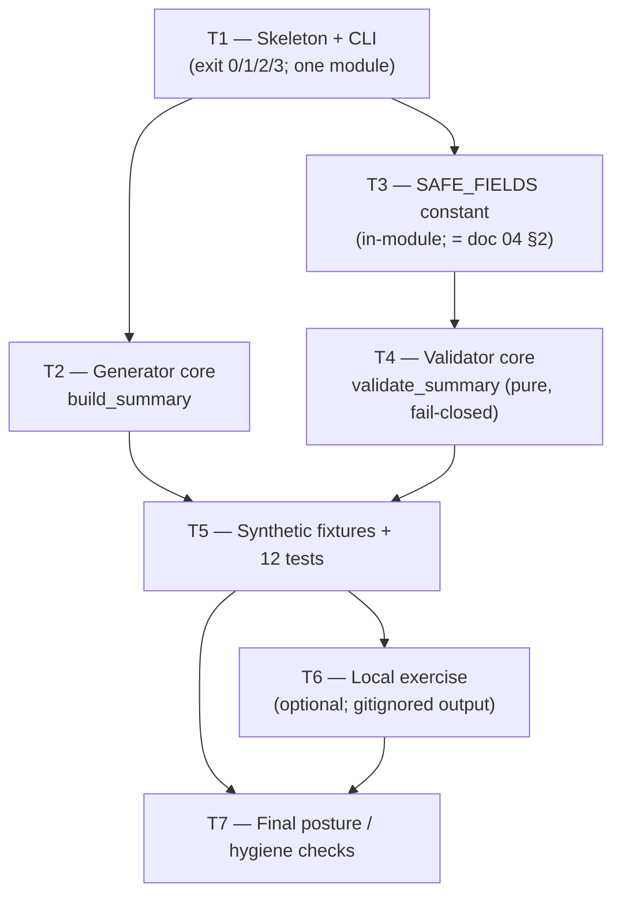

# Cycle-004 Sprint Plan — OA-2 Build: Offline Evidence-Summary Generator + Validator

> Sprint plan (planning artifact). Status: **DRAFT — awaiting operator review.** This plan translates the
> accepted Cycle-004 PRD (`docs/cycles/cycle-004/01-prd.md`) and SDD (`docs/cycles/cycle-004/02-sdd.md`) into
> implementation tasks for **one** offline `analysis/`-class module plus its test suite. The plan **opens no
> implementation gate**: building lands only through `/implement → /review-sprint → /audit-sprint → operator
> acceptance` (`docs/operator/turntrace-loop-contract.md` §6). Cycle-004 is **build-only**: it relaxes
> Cycle-003 non-goal **NG5 only** (`docs/cycles/cycle-003/01-prd.md:151`); every other Cycle-003 bright line
> holds.
>
> **Sanitized note.** No raw traces, card IDs/names, deck lists, hand contents, simulator logs, PDFs/CSVs,
> `deck.csv` rows, run-dir dumps, Pokémon Elements, or Competition Data appear here (CC-1/CC-2, ESP).
> **No dispersion metric values appear here** — local evidence is referenced qualitatively only; its values
> stay local/gitignored. Runs are referenced by `run_id`, hashes, sanitized metric *names*, claim ceilings,
> and local path/status only. The forbidden agent words (*strong / competitive / optimal / calibrated /
> complete*) and the inferential terms (*std-dev / variance / CI / p-value / significance / hypothesis-test /
> error-bar*) appear only as the negated/forbidden language they are. **Rung 1 held** throughout.

| Field | Value |
|---|---|
| **Cycle** | Cycle-004 |
| **Working title** | OA-2 Build: Offline Evidence-Summary Generator + Validator |
| **Type** | Sprint Plan (planning artifact for a build cycle) |
| **Status** | DRAFT — awaiting operator review; next Golden-Path step is `/implement sprint-01` |
| **Date** | 2026-06-19 |
| **Authoring HEAD** | `73c13ee` — *docs: complete TurnTrace Cycle-003 Sprint 00 specs* |
| **Input PRD / SDD** | `docs/cycles/cycle-004/01-prd.md` · `docs/cycles/cycle-004/02-sdd.md` (both accepted) |
| **Sprint count** | **1** (Sprint 01 — single focused sprint; see §"Sprint shape rationale") |
| **Posture** | **Build-only.** Relax NG5 only; build the generator + validator + in-module schema constant + tests; run a local exercise; hold every other bright line |
| **Claim ceiling** | **Rung 1** (held for the whole cycle; not raised) |

---

## 0. Current-state verification (2026-06-19, before authoring this plan)

The PRD §0 (`01-prd.md:22-36`) and SDD §0 (`02-sdd.md:20-34`) baselines were **re-verified at this plan's
authoring HEAD**. All findings hold; none contradicts the accepted PRD/SDD; none forces a stop.

| Assumption to verify | Command | Result |
|---|---|---|
| Current HEAD / branch | `git rev-parse HEAD` / `--abbrev-ref HEAD` | `main` @ `73c13ee` (Cycle-003 closed) |
| No staged files | `git diff --cached --name-only` | **empty** — none staged |
| `docs/ledger.md` byte-unchanged from baseline | `git hash-object docs/ledger.md` | **`2a2f1c2dc540b6d7e7a68aad5ab3c6b109dcee4b`** — matches PRD/SDD baseline exactly |
| `docs/ledger.md` clean | `git diff --exit-code -- docs/ledger.md` | **clean** (exit 0); two Rung-1 `regime-v001` rows only |
| Claim ceiling still Rung 1 | read `docs/claim-ceiling.md` | **Rung 1** (ladder unchanged) |
| `.claude/` (System Zone) | `git status --porcelain .claude/` | **no drift**; `integrity_enforcement: strict` → no HALT |
| `analysis/evidence_summary*.py` / `.json` exists? | `git ls-files "analysis/evidence_summary*"` | **absent** — Cycle-003 built no code; this checkout confirms |
| `tests/test_evidence_summary*` exists? | `git ls-files "tests/test_evidence_summary*"` | **absent** |
| State-Zone dirty files | `git status --porcelain` | `.beads/issues.jsonl` + `grimoires/loa/NOTES.md` modified, **unstaged** (pre-existing housekeeping); this cycle does not stage or touch them. `docs/cycles/cycle-004/` untracked (this plan + the accepted PRD/SDD) |
| Local sealed K-batch run dirs present (for the §exercise) | `ls -d runs/run-v002-b-* runs/run-v002-c-*` | **present** — 20 `run-v002-b-*` + 20 `run-v002-c-*` (K=20+20). Sample `run-v002-b-1` contains `manifest.json`, `match_results/`, `summary.csv`, `hashes.txt`, `notes.md`, **and a `traces/` sidecar** (the forbidden read surface — confirmed present, so the structural no-reference guarantee is load-bearing) → the local end-to-end exercise is **feasible** this checkout |
| `edd.min_test_scenarios` | `grep min_test_scenarios .loa.config.yaml` | **3** — the 12-check suite (§T5) far exceeds the floor |
| `grimoires/loa/a2a/` gitignored | read `.gitignore:17` | **gitignored** — the exercise output path is local by construction |

**All assumptions hold. No finding forces a stop.** Implementation remains un-authorized until the operator
accepts this plan and runs `/implement sprint-01`. This plan writes only
`docs/cycles/cycle-004/03-sprint-plan.md`; it stages nothing, commits nothing, mutates no ledger, promotes no
value, and edits no `.claude/`.

> **NFR-9 carry-forward for `/implement` (binding).** The PRD/SDD citations are line-anchored to source at
> `73c13ee`. `/implement` MUST re-validate every anchor it relies on against the **build-time HEAD** before
> coding, and make the in-module allow-list **agree** with doc 04 §2 (the `eval/schemas.md:1-5` contract).
> The SDD flags one known minor drift to re-check: the import-boundary statement the PRD cites as
> `dispersion_report.py:44-46` now spans `:39-46` (the `# loa:shortcut:` block `:39-42` plus the boundary
> sentence `:44-46`); the mechanical enforcement in `tests/test_import_direction.py:32-37,69` is unaffected
> (`02-sdd.md:62-67`).

---

## 1. Sprint shape rationale (single focused sprint)

The SDD's implementation surface is **one module + one test file** (`02-sdd.md:88-99`). The generator and
validator share a single `SAFE_FIELDS` constant (decision D-1 / OD-C4-1, `02-sdd.md:204-209`); splitting the
work across sprints would either duplicate that constant or create an artificial boundary mid-module. The
twelve required test checks (§T5) all exercise the same module. There is **no architectural seam** that
justifies two sprints. Per the operator brief's stated preference ("Prefer a single focused sprint unless the
SDD's implementation surface proves too large"), this plan uses **one sprint, Sprint 01**, sized **LARGE**
(7 task groups; within the 7–10 task ceiling).

---

## 2. Sprint 01 — Evidence Summary Generator + Validator

### Sprint Goal

> Build, under OA-2 and through the full `/implement → /review-sprint → /audit-sprint` cadence, the single
> offline `analysis/evidence_summary.py` module (generator core + independent fail-closed validator core +
> in-module schema constant) and its stdlib test suite `tests/test_evidence_summary.py`, prove every property
> in SDD §9, run the local end-to-end exercise on existing K=20+20 dirs (deferred if absent) — while holding
> Rung 1, leaving `docs/ledger.md` byte-unchanged, choosing no `M`, issuing no SP-6, and promoting no value.

### Scope

**LARGE** — 7 task groups (T1–T7); within the 7–10 task-group ceiling. One new module, one new test file, no
edits to existing tracked code by default.

### Goal traceability (PRD goals → tasks)

The PRD enumerates six goals G1–G6 (`01-prd.md:148-166`). Mapping (full table in Appendix C):

| Goal | Tasks |
|---|---|
| **G1** — Generator built | T1, T2 |
| **G2** — Independent fail-closed validator built | T1, T4 |
| **G3** — In-module machine-checkable schema constant | T3 |
| **G4** — Test suite proves every required property | T5 |
| **G5** — Local end-to-end exercise (no promotion) | T6 |
| **G6** — Rung 1 held; ledger byte-unchanged; no value promoted (hard) | T5 (checks 6, 7), T7 |

---

### Task list

Task IDs are `C4-S01-Tn`. Each non-trivial behaviour leaves at least one runnable check (Karpathy
goal-driven; the §T5 acceptance-criteria tests satisfy this floor).

#### T1 — Module skeleton + CLI dispatch  → **[G1, G2]**

Build the `analysis/evidence_summary.py` skeleton: module docstring (read surface, import boundary,
exit-code contract, structural no-sidecar guarantee — mirroring `dispersion_report.py:11-49`); `argparse`
CLI; the four-way exit-code mapping; the public surface stubs (`SAFE_FIELDS`, `build_summary`,
`validate_summary`, `render_json`, `main`) per SDD §2.2.

- **CLI modes** (SDD §6.1):
  - generate (default): `python analysis/evidence_summary.py <run_dir> [<run_dir> ...] [--json] [--out <local-path>]`
  - validate: `python analysis/evidence_summary.py --validate <summary.json>`
  - `--json` — emit JSON explicitly (generate-mode is JSON-first regardless; any markdown derived).
  - `--out <local-path>` — write to a local/gitignored path instead of stdout; never a tracked path.
- **No `--print-schema` this cycle** — OD-C4-5 finalized **DEFER** (`02-sdd.md:391-395`). Record it as
  *deferred, not omitted-by-oversight*; if a future consumer needs it, add a one-line derived dump from the
  constant then.
- **Exit codes 0/1/2/3** (SDD §6.2, OD-C4-2): `0` clean/valid · `1` input failure · `2` mixed-regime refusal
  · **`3`** forbidden-field/value/word leak (fail-closed; never `0` on a leak).
- **One module** (OD-C4-1, `02-sdd.md:573`): `build_summary` + pure `validate_summary` + shared `SAFE_FIELDS`;
  CLI dispatches by flag. Do **not** create `analysis/evidence_summary_validate.py`.

Verification: `python analysis/evidence_summary.py --help` runs; the four exit codes are reachable by the
T5 tests.

#### T2 — Generator core (`build_summary`)  → **[G1]**

Implement the generator core (SDD §3):

1. **Reads `manifest.json` first** — the authority for `regime_id` / `agent_id`, per run dir
   (`dispersion_report.py:126-141`; never keyed off the run-id string).
2. **Reads `match_results/*` only via `analysis/aggregate.py:aggregate_run`** (`aggregate.py:56-89`) — the
   single source of per-run sanitized stats. The generator never parses match files itself.
3. **Reuses `dispersion_report.descriptive_stats`** (`dispersion_report.py:94-114`) and the metric/stat
   constants `DISPERSION_METRICS` (`:69-72`) / `STAT_COLUMNS` (`:76`) — **reuse, not recompute**, so no new
   metric or statistic can enter through the generator (doc 04 §2.2-§2.3; OD-6).
4. **Single-regime guard from manifest authority** — raise on mixed `regime_id` (→ exit 2), structurally
   identical to `MixedRegimeRefusal` (`dispersion_report.py:79-80,133-140`).
5. **No eval invocation; no run-dir creation** (NG12) — reads existing local outputs only.
6. **No `traces/` / sidecar reference** anywhere in source (structural; SDD §3.2) — the module contains no
   reference to that directory, mirroring `dispersion_report.py:16-19`.
7. **JSON-first output** — `render_json` primary (mirror `dispersion_report.py:243-255`); any markdown is
   derived (mirror `render` `:197-240`).
8. **Two mandatory framing strings** carried verbatim-in-intent (doc 04 §2.4;
   `dispersion_report.py:226-239,251-254`): the unseeded-process caveat **and** the Rung-1 footer (states the
   summary "carries no ceiling of its own"; the ledger is the only ceiling-bearing artifact; a `regime-v002`
   number is never compared to a `regime-v001` ledger row).
9. **Local-by-default write** via `--out` (mirror `dispersion_report.py:268-270,283-287`); stdout with no
   `--out`. **Never** writes to `docs/`, never `git add`s, never appends a ledger row — promotion is never a
   generator side effect (NG4).
10. **Emitted JSON shape** matches doc 04 §4.1's value-free illustrative shape (`regime_id`, `n`, `K`,
    `mode`, per-agent `metrics` of the seven statistics over the six metric names, `hashes`,
    `unseeded_caveat`, `claim_ceiling`).

Verification: T5 checks 3, 7, 10; the §exercise (T6).

#### T3 — In-module schema / allow-list constant (`SAFE_FIELDS`)  → **[G3]**

Implement the in-module machine-checkable allow-list (SDD §5, decision D-1):

- **Single source of truth in code** — `SAFE_FIELDS = identity/provenance field names (regime_id, n, K,
  agent_id, agent_version, run_ids, hashes, mode, unseeded_caveat, claim_ceiling) + DISPERSION_METRICS (the
  six metric names) + STAT_COLUMNS (the seven statistic names)` (`02-sdd.md:362-367`).
- **No standalone `.schema.json`** — creating one would force a `jsonschema`/`pydantic` dependency, which
  contradicts the stdlib-only idiom (`eval/validate.py:11-13`; SDD §5.3, NFR-5).
- **Agrees with doc 04 §2** — the constant **must equal** doc 04 §2's field list (the `eval/schemas.md:1-5`
  spec↔validator contract); enforced by T5 check 9. `/implement` makes the constant agree at build-time HEAD
  (NFR-9).
- Includes **identity/provenance/framing** fields plus the **allowed metrics + stat columns** — and nothing
  else.

Verification: T5 check 9 (doc↔schema agreement); a divergence fails the build.

#### T4 — Validator core (`validate_summary`)  → **[G2]**

Implement the validator core (SDD §4):

1. **Pure function** `validate_summary(obj) -> list[(field, reason)]` — no I/O, no global state; empty list ⇒
   valid (SDD §2.2, §4.1). Testable in isolation by feeding it a poisoned dict directly.
2. **Independent `--validate` re-read from file** — `--validate <summary.json>` re-reads the named file from
   disk into a fresh dict and validates *that*, **not** the in-memory generator output, so the gate is
   genuine (SDD §4.1; `05-…` §2.1).
3. **Allow-list, fail-closed** — accepts **only** the `SAFE_FIELDS` set; any field outside it → `(field,
   reason)` violation → exit `3` (SDD §4.2; `05-…` §2.1). Per-class explicit reasons (mirroring
   `hygiene_check.find_violations`'s `(item, reason)` pairs, `hygiene_check.py:52-62`).
4. **Forbidden-class rejection** (one rule each, SDD §4.2 table / doc 04 §3): raw decision/trace body;
   Competition-Data token + path; file-form Competition Data (PDF/CSV/`deck.csv`/run-dir dump); Pokémon
   Element token; **inferential statistic** (`std-dev`/`variance`/CI/p-value/`significance`/hypothesis-**test**/
   error-bar); **cross-regime** field/comparison; **affirmative forbidden agent word**.
5. **Single-regime guard → exit 2** — a summary somehow carrying more than one `regime_id` is hard-refused
   (SDD §4.3); `regime_id` authority is the manifest, never the run-id string.
6. **Leak → exit 3** — any allow-list miss or doc 04 §3 forbidden-class hit maps to exit `3` (never `0`;
   OD-C4-2, `02-sdd.md:429-435`).
7. **Hygiene parity-or-stricter** — refuses every path/token `eval/hygiene_check.find_violations` refuses
   (`hygiene_check.py:35-45`) **plus** the value-bearing/inferential/cross-regime/forbidden-word content
   checks a path gate cannot express (SDD §4.5, §3). **Encoding (SDD §4.5):** re-implement the hygiene path
   rules as a **parity-tested stdlib local constant** in the module (exactly as `dispersion_report.py:39-42`
   copies eval-shared helpers) — **not** an `eval/` import (which would violate import direction). T5 check 5
   asserts parity against `hygiene_check.find_violations` at test time (tests may reference both).
8. **Benign ledger `hypothesis` text-field exception** — the validator MUST **allow** the ledger
   `hypothesis` text-field context (the experiment-hypothesis prose field; `aggregate.py:39`
   `LEDGER_COLUMNS`; `docs/ledger.md:9,11-12`; doc 06 §1) while **rejecting** an inferential
   **hypothesis-test** (SDD §4.4). Implement as a benign-exception allow-rule, **not** a blanket `hypothesis`
   token ban. **Conservative default (SDD §4.4):** the inferential rule matches the *compound* phrase
   `hypothesis[\s\-]?test(ing)?` (and the other inferential terms), so the bare word `hypothesis` in a
   recognized provenance context is not a leak. The sprint MAY tighten (e.g. only allow `hypothesis` inside a
   named provenance sub-field) but MUST keep **both halves**: accept the column reference, reject the test.
9. **Reject inferential hypothesis-test language** — per #4 and #8; the validator *rejects* inferential
   terms, it never *computes* them (OD-6; NG6).

Verification: T5 checks 1, 2, 3, 5, 8.

#### T5 — Synthetic fixtures + test suite (`tests/test_evidence_summary.py`)  → **[G4, G6]**

Build a stdlib plain-Python test module (`main()` → exit 0/1, mirroring `tests/test_import_direction.py:82-93`)
using **synthetic/fixture run dirs** for determinism (OD-C4-4: tests use fixtures, **not** gitignored real
data, `02-sdd.md:576`). The exercise (T6) uses the real local dirs; the tests do **not** depend on them.
Every row below is a required check (SDD §9):

| # | Test | Asserts |
|---|---|---|
| 1 | **Allow-list fail-closed** | any field outside doc 04 §2 → `(field, reason)`, exit `3` (never `0`) |
| 2 | **Forbidden-content rejection** (one case each) | raw decision/trace body; Competition-Data token; Pokémon-Element token; inferential statistic; cross-regime field; affirmative forbidden agent word — each rejected with its reason, exit `3` |
| 3 | **Mixed-regime refusal → exit 2** | inputs spanning two `regime_id`s hard-refused before aggregation |
| 4 | **No-sidecar-read (structural)** | the module **source text** contains **no reference** to the `traces/` sidecar dir (grep-style assertion, like the `dispersion_report.py:16-19` guarantee) |
| 5 | **Hygiene parity (superset)** | every path/token `hygiene_check.find_violations` (`:52-62`) refuses is also refused by the validator, **plus** the content checks the path gate cannot express |
| 6 | **No-ledger-mutation** | after a full generate run, `git diff --exit-code -- docs/ledger.md` is clean (generator writes local-by-default, never to `docs/`) |
| 7 | **No-value-promotion** | generator default output goes to local `--out`; the emitted summary carries the Rung-1 footer + unseeded caveat and **no ceiling of its own** |
| 8 | **Benign `hypothesis` exception** | validator **accepts** a summary citing the ledger `hypothesis` text-field context, while **rejecting** an inferential hypothesis-test (§T4.8) |
| 9 | **Doc↔schema agreement** | the in-module allow-list **equals** doc 04 §2's field list; divergence fails (§T3) |
| 10 | **JSON-first round-trip** | generator output validates clean (exit `0`) against its own `--validate`; any markdown is derived from the JSON |
| 11 | **Sanitization smoke** | a poisoned input (a planted forbidden token) is **refused**, never surfaced in any output |
| 12 | **Import-direction / stdlib-only** | auto-covered by `tests/test_import_direction.py` (globs `analysis/*.py`, `:69`); no `cabt`/`sim`/`runtime`/`eval` import; no third-party dependency. The sprint SHOULD also run `test_import_direction.py` in CI for this cycle |

**Fixture discipline:** synthetic run dirs are constructed in a temp dir (e.g. `tempfile`) inside the test;
they carry **no** Competition Data, **no** real card/deck/trace content — only the minimal
`manifest.json` + `match_results/*.json` fields `aggregate_run` reads (`aggregate.py:56-89`;
`eval/schemas.md` §`match-summary.json`). Fixtures are **never** written to a tracked path. Test count (12)
satisfies `.loa.config.yaml: edd.min_test_scenarios: 3`.

Verification: `python tests/test_evidence_summary.py` → exit 0; `python tests/test_import_direction.py` →
exit 0.

#### T6 — Local end-to-end exercise (no promotion)  → **[G5]**

Run the built pair on the **existing local** K=20+20 sealed run dirs (SDD §10, decision D-3). **This step is
OPTIONAL/DEFERRED** — run it **only if** the local dirs are present (§0 confirms they are, this checkout).

1. **Generate** to the gitignored local path (OD-C4-3, `02-sdd.md:575`):
   ```
   python analysis/evidence_summary.py runs/run-v002-b-1 ... runs/run-v002-c-20 \
     --out grimoires/loa/a2a/cycle-004/evidence-summary-local.json
   ```
   (single `regime-v002`; frozen `random_legal`-class baseline + candidate.)
2. **Validate** the output → exit `0`:
   ```
   python analysis/evidence_summary.py --validate grimoires/loa/a2a/cycle-004/evidence-summary-local.json
   ```

> **NON-PROMOTION WARNING (binding).** The exercise output is evidence the machinery works — **not** a Rung-2
> verdict. It **promotes nothing**: the path is under `grimoires/loa/a2a/` (gitignored, `.gitignore:17`; and
> `hygiene_check.py:43` mechanically refuses any `runs/<id>/…` staging). The output is **never `git add`-ed**,
> writes **no** ledger row, advances **no** ceiling, and chooses **no** `M`. Do not stage it. Do not cite its
> values in any tracked artifact.

**If the local run dirs are absent in a given checkout:** record the exercise as **deferred** (in the
implementation report and `grimoires/loa/NOTES.md`) **without blocking the build**. The T5 tests use
synthetic fixtures and do **not** depend on gitignored data, so the build and all gates still pass.

#### T7 — Final posture / hygiene checks  → **[G6]**

Run the closing posture checks (SDD §9 "Operator hard-checks"; PRD §14.2 AC-7). All MUST pass before the
sprint is review-ready:

- **`docs/ledger.md` hash unchanged**: `git hash-object docs/ledger.md` == `2a2f1c2dc540b6d7e7a68aad5ab3c6b109dcee4b`.
- **`git diff --exit-code -- docs/ledger.md`** → clean (exit 0).
- **No `.claude/` drift**: `git status --porcelain .claude/` → empty.
- **No `frozen/` / `runs/` / `agents/` / `sim/` / runtime-agent changes**: `git status --porcelain` shows
  none of these tracked-tree paths modified.
- **No raw traces or values in tracked docs**: `python eval/hygiene_check.py --paths <each tracked artifact>`
  → exit `0`; no dispersion value appears in any tracked file.
- **No affirmative forbidden agent word** (*strong/competitive/optimal/calibrated/complete*) as an
  affirmative in any tracked file.
- **No inferential statistic** computed anywhere in the module (structural — the module reuses
  `descriptive_stats` and adds no statistic).
- **Import-direction test passes**: `python tests/test_import_direction.py` → exit 0.
- **Hygiene check passes for tracked artifacts**: `python eval/hygiene_check.py --paths analysis/evidence_summary.py tests/test_evidence_summary.py` → exit 0.

Verification: all commands above exit as stated.

---

## 3. Authorized file-touch matrix

`/implement` MAY create/modify **only** these tracked paths:

| Path | Operation | Authority |
|---|---|---|
| `analysis/evidence_summary.py` | **create** | C4-FR-1/2/3; SDD §2-§7 |
| `tests/test_evidence_summary.py` | **create** | C4-FR-4; SDD §9 |
| `docs/cycles/cycle-004/04-implementation-report.md` *(or the standard Loa implementation-report path for this cycle)* | **create** | **Authorized by this sprint plan** — the standard Loa implementation/review/audit report artifacts under `docs/cycles/cycle-004/` MAY be written by `/implement → /review-sprint → /audit-sprint` as those skills normally produce them. No other tracked artifact. |

**Local/gitignored (non-tracked) write — authorized, never staged:**

| Path | Operation | Authority |
|---|---|---|
| `grimoires/loa/a2a/cycle-004/evidence-summary-local.json` | **create (local only)** | T6 exercise output; OD-C4-3; gitignored (`.gitignore:17`); **never `git add`-ed** |

**Existing-helper imports (read/import only — NOT edits):** `analysis/aggregate.py` (`aggregate_run`) and
`analysis/dispersion_report.py` (`descriptive_stats`, `DISPERSION_METRICS`, `STAT_COLUMNS`) are **imported**
by the new module (intra-zone; allowed by `tests/test_import_direction.py:32-37,68`). **Editing those files is
not authorized by default.** If `/implement` finds a *concrete* need to edit them (e.g. a re-validated citation
proves a required symbol moved or is unexported), it MUST surface the need explicitly in the implementation
report and keep the edit minimal and surgical — but the default is **no edits** to existing `analysis/` files.

---

## 4. Forbidden file-touch matrix

`/implement` MUST NOT create, modify, stage, or commit any of these:

| Path / class | Why forbidden |
|---|---|
| `docs/ledger.md` | NG3 — byte-unchanged, hard AC; no Rung-2 row |
| `docs/claim-ceiling.md` | NG2 — no ceiling advance |
| `frozen/**` | regime/frozen-component change is a new regime, never an in-place edit |
| `runs/**` | NG12 — no new run dir; raw run trees are local/gitignored evidence |
| `agents/**` | NG7 — runtime-agent lane closed; agents frozen |
| `sim/**` | offline/runtime separation; no simulator change |
| `eval/run_eval.py` | NG12 — no eval invocation, no new runs |
| `eval/run_match.py` | NG12 — no match execution |
| `.claude/**` | System Zone — never edited (use `.claude/overrides/` or `.loa.config.yaml`) |
| raw Competition Data paths (`cg/`, `deck.csv`, card CSV/PDF, `grimoires/loa/context/`) | CC-1/CC-2, ESP — never enters git |
| any raw trace / card / deck artifact (`runs/<id>/traces/`) | CC-1/CC-2; structural no-sidecar-read |
| a new `analysis/evidence_summary_schema.json` (or any `*.schema.json`) | D-1 — in-module constant only; no schema-library dependency |
| `analysis/evidence_summary_validate.py` (a second module) | OD-C4-1 — one module only |
| any third-party dependency (`jsonschema`, `pydantic`, …) / new `requirements`/`pyproject` entry | NFR-5 — stdlib-only |

**No edits by default** (surgical-need exception per §3): `analysis/aggregate.py`,
`analysis/dispersion_report.py`, `analysis/delta_report.py`, `eval/hygiene_check.py`, `eval/validate.py`,
`eval/schemas.md`, `tests/test_import_direction.py`.

---

## 5. Acceptance criteria (Sprint 01)

Maps to PRD §14.2 (`01-prd.md:444-459`) and SDD §15.

- **AC-1 — Generator** conforms to C4-FR-1 / SDD §3: reads `manifest.json` + `match_results/*` via
  `aggregate_run` only; never references the sidecar dir; emits JSON-first doc 04 §2 safe fields; carries the
  two framing strings; writes local-by-default.
- **AC-2 — Validator** conforms to C4-FR-2 / SDD §4: pure `validate_summary`; independent `--validate`
  re-read; allow-list/fail-closed; rejects every doc 04 §3 class with a reason; single-regime exit 2; leak
  exit 3; benign `hypothesis` exception (accept column / reject test); hygiene-parity-or-stricter.
- **AC-3 — Schema artifact** is the in-module `SAFE_FIELDS` constant agreeing with doc 04 §2 (C4-FR-3 / SDD
  §5); no `.schema.json`; no third-party dependency.
- **AC-4 — Tests** (§T5, all 12) pass, including structural no-sidecar-read (4), no-ledger-mutation (6),
  no-value-promotion (7), benign-`hypothesis` (8), and doc↔schema-agreement (9); count ≥
  `.loa.config.yaml: edd.min_test_scenarios` (3) — satisfied (12).
- **AC-5 — Local exercise** (§T6) produces a gitignored validated summary (exit 0), **or** is recorded
  deferred if local dirs absent; promotes nothing.
- **AC-6 — Citations re-validated** against build-time HEAD (NFR-9); the in-module allow-list made to agree
  with doc 04 §2.
- **AC-7 — Posture held (hard):** Rung 1 held; `docs/ledger.md` byte-unchanged (`2a2f1c2…`); no value
  promoted; stdlib-only / analysis-only imports; no `M` / SP-6 / Rung-2 row; no `.claude/` drift; State-Zone
  files unstaged.
- **AC-8 — Cadence:** lands through `/implement → /review-sprint → /audit-sprint → operator acceptance`.

---

## 6. Tests / check commands

The exact commands `/implement` and `/review-sprint` run:

```bash
# 1. The new test suite (the 12 §T5 checks)
python tests/test_evidence_summary.py            # exit 0

# 2. Import-direction / stdlib-only (auto-covers analysis/evidence_summary.py)
python tests/test_import_direction.py            # exit 0

# 3. Hygiene gate on the tracked artifacts
python eval/hygiene_check.py --paths analysis/evidence_summary.py tests/test_evidence_summary.py   # exit 0

# 4. Ledger byte-unchanged (HARD)
git hash-object docs/ledger.md                   # == 2a2f1c2dc540b6d7e7a68aad5ab3c6b109dcee4b
git diff --exit-code -- docs/ledger.md           # exit 0 (clean)

# 5. No System-Zone / frozen / runs / agents / sim drift
git status --porcelain .claude/ frozen/ runs/ agents/ sim/   # empty

# 6. Local end-to-end exercise (OPTIONAL — only if runs/run-v002-* present; output is gitignored, never staged)
python analysis/evidence_summary.py runs/run-v002-b-1 [...] runs/run-v002-c-20 \
  --out grimoires/loa/a2a/cycle-004/evidence-summary-local.json
python analysis/evidence_summary.py --validate grimoires/loa/a2a/cycle-004/evidence-summary-local.json   # exit 0
```

---

## 7. Review checklist (`/review-sprint`)

Validate **actual code**, not just the report:

- [ ] Generator reads `manifest.json` first, then `match_results/*` via `aggregate_run` only — no other read.
- [ ] **No `traces` / sidecar reference** anywhere in `analysis/evidence_summary.py` source (grep confirms).
- [ ] `descriptive_stats` + `DISPERSION_METRICS` + `STAT_COLUMNS` are **reused** (imported), not reimplemented
      — no new metric, no new statistic.
- [ ] `validate_summary` is a **pure** function; `--validate` re-reads the file from disk (independent gate,
      not the in-memory object).
- [ ] Allow-list is **fail-closed**: an unknown field yields a reasoned violation → exit `3`.
- [ ] All seven doc 04 §3 forbidden classes have an explicit rejection rule with a per-class reason.
- [ ] Single-regime guard → exit `2`; leak → exit `3`; input failure → exit `1`; clean → exit `0`.
- [ ] Benign `hypothesis` exception present: accepts the ledger column reference, rejects the inferential
      hypothesis-test (both halves).
- [ ] Hygiene parity is a **copied parity-tested stdlib local**, **not** an `eval/` import.
- [ ] `SAFE_FIELDS` equals doc 04 §2's field list (T5 check 9 green).
- [ ] Two framing strings (unseeded caveat + Rung-1 footer) present in every emitted summary.
- [ ] Generator writes local-by-default; never to `docs/`; never `git add`s; no ledger row.
- [ ] stdlib-only imports; no `cabt`/`sim`/`runtime`/`eval`; no third-party dependency.
- [ ] All 12 §T5 tests pass; `test_import_direction.py` passes.
- [ ] Only the authorized tracked paths (§3) changed; no forbidden path (§4) touched.
- [ ] Citations re-validated against build-time HEAD (NFR-9); the one flagged anchor drift re-checked.

---

## 8. Audit checklist (`/audit-sprint`)

Final security/quality gate before the sprint COMPLETED marker:

- [ ] **Sanitization:** no Competition Data / Pokémon Element / raw trace / card / deck content in any tracked
      artifact; `hygiene_check --paths` exit 0 on each.
- [ ] **No value promotion (HARD):** no dispersion value in any tracked file; the exercise output is
      gitignored and unstaged; no SP-6 issued.
- [ ] **Ledger byte-unchanged (HARD):** `git hash-object docs/ledger.md` == `2a2f1c2…`;
      `git diff --exit-code -- docs/ledger.md` clean; no Rung-2 row.
- [ ] **Claim ceiling:** Rung 1 held; no ceiling advance; no "beats random-legal" verdict; no `M` chosen.
- [ ] **No forbidden agent word** as an affirmative; **no inferential statistic** computed.
- [ ] **Import boundary:** analysis-only / stdlib-only; `test_import_direction.py` green.
- [ ] **Structural no-sidecar-read** proven by test (4) and source grep.
- [ ] **System Zone untouched:** no `.claude/` drift; no `frozen/`/`runs/`/`agents/`/`sim/` change.
- [ ] **State-Zone discipline:** `.beads/issues.jsonl` and `grimoires/loa/NOTES.md` remain unstaged; this
      cycle did not stage or commit them.
- [ ] **Scope:** only the authorized artifacts (§3) exist as new tracked files; no admission, no Rung-2 row,
      no second module, no `.schema.json`, no dependency.

---

## 9. Rollback / failure handling

- **A test fails or a posture check trips** → the sprint is **not** review-ready. Fix forward within
  `/implement`; do not stage. Nothing is committed until all gates pass and the operator accepts (AC-8).
- **The ledger hash drifts** (`git hash-object docs/ledger.md` ≠ `2a2f1c2…`) → **HALT**. Investigate the
  source of the mutation; `git checkout -- docs/ledger.md` to restore; the generator must never write to
  `docs/`. Re-run the full check suite.
- **`.claude/` shows drift** → **HALT** (System Zone; `integrity_enforcement: strict`). Revert the drift; do
  not proceed.
- **A forbidden path (§4) was touched** → revert that change; re-scope to the authorized matrix (§3).
- **A `.schema.json` or third-party dependency appeared** → remove it; the schema is the in-module constant
  (D-1); stdlib-only (NFR-5).
- **The local exercise output got staged** → `git restore --staged grimoires/loa/a2a/cycle-004/evidence-summary-local.json`;
  it must never be tracked (NG4).
- **Local run dirs absent** → record the exercise **deferred** (not failed); the synthetic-fixture tests still
  prove every property; the build and gates still pass.
- **Nothing irreversible happens in this cycle.** No ledger row is written, no ceiling advanced, no value
  promoted — so rollback is always "revert the working-tree change," never "undo an admission."

---

## 10. Artifact discipline

- **This sprint plan writes only** `docs/cycles/cycle-004/03-sprint-plan.md`. It stages nothing, commits
  nothing.
- **`/implement` creates only** `analysis/evidence_summary.py` + `tests/test_evidence_summary.py`, plus the
  standard cycle implementation/review/audit report artifacts under `docs/cycles/cycle-004/` (authorized §3).
- **All evidence-value outputs stay local/gitignored** — the generator's `--out` and the T6 exercise output
  default to `grimoires/loa/a2a/cycle-004/` (gitignored), and are **never `git add`-ed** (NFR-7, NG4).
- **State-Zone files stay unstaged** — `.beads/issues.jsonl`, `grimoires/loa/NOTES.md`, and any other dirty
  State-Zone file are not staged or touched by this cycle unless explicitly authorized.
- **`.claude/` is never touched.**

---

## 11. Claim-ceiling boundary (binding)

The loop sits at **ladder Rung 1 — legal completion / throughput / audit-trail**, and **Cycle-004 keeps the
ceiling at Rung 1** for the whole cycle (`docs/claim-ceiling.md`):

```
Rung 0  env not trusted
Rung 1  legal completion                         ← current, and held for all of Cycle-004
Rung 2  beats random-legal                       ← machinery BUILT here; never claimed; admission = a later gate (expected Cycle-005)
Rung 3  beats scripted / prior best, ablation-backed
Rung 4  stable, report-ready
```

**Allowed claim form** — relative, local, descriptive, carrying its `n`, `K`, and `regime_id`. **Forbidden
claim forms** (negated-only): gameplay strength; statistical significance; cross-regime uplift; leaderboard
quality; calibration; optimality; competitiveness. Only the ledger, advanced by a separate explicit later
operator decision, can carry a higher rung. **This sprint advances nothing; it builds the tool a later gate
would use.**

---

## 12. Explicit note — Rung-2 admission is NOT in this sprint

> **Rung-2 admission is a separate, later, explicit gate — expected Cycle-005, not planned in detail here.**
> Building the machinery does **not** admit Rung 2. The four conjunctive seam decisions stay **open by
> design** and are decided **only** at that later gate (`07-od6-criterion-2-proposal.md` §5):
>
> - **8a** — descriptive disjoint-bands rule vs OD-6 relaxation — **not decided.**
> - **8b** — numeric margin `M` — **not chosen** (no numeric `M` appears anywhere in this cycle).
> - **8c** — SP-6 live-value promotion — **not issued.**
> - **8d** — Rung-2 ledger row / claim-ceiling advance — **not written; ceiling stays Rung 1.**
>
> This sprint produces **no** Rung-2 verdict, **no** "beats random-legal" claim, **no** ledger mutation, **no**
> value promotion, **no** OD-6 relaxation, **no** inferential statistic, **no** new eval run, **no** K=50
> top-up, **no** paired-delta tooling, **no** runtime-agent work, **no** broad optimization, **no** Kaggle
> automation, **no** FunSearch surface, **no** cross-regime comparison, **no** regime mutation, **no** sidecar
> read, **no** `.claude/` edit, and **no** tracked evidence-value artifact.

---

## Appendix A — Task dependency flow



> GitHub renders the Mermaid block natively. No external preview URL is generated.

---

## Appendix B — Risk register (carried from PRD §16 / SDD §12)

| ID | Risk | Mitigation (sprint task) |
|---|---|---|
| **R1** | Value leak into a tracked artifact during the exercise | Fail-closed validator (T4); hygiene parity (T4.7); generator local-by-default (T2.9); T6 output gitignored, never `git add`-ed (T6 warning) |
| **R2** | Scope-creep into admission | NG1-NG3 held; no `M`; §12; forbidden matrix §4 |
| **R3** | Citation rot — anchors desync before build | NFR-9 re-validation (§0 note); allow-list made to agree with doc 04 §2 (T3) |
| **R4** | `hypothesis` false-positive | Benign-exception allow-rule matching the compound phrase, not the bare word (T4.8); test 8 |
| **R5** | Sidecar-read creep (traces present this checkout) | Structural no-reference (T2.6); source-grep test 4 |
| **R6** | Dependency creep via a `.schema.json` | In-module constant (T3); stdlib-only; import test 12; forbidden matrix §4 |
| **R7** | Cross-regime contamination | Single-regime guard exit 2 (T2.4 / T4.5); manifest authority; test 3 |
| **R8** | Value-promotion creep (SP-6) | No SP-6; local-by-default; T6 output gitignored; test 7 |
| **R9** | Build beyond scope (K=50 / paired-delta / FunSearch / runtime) | NG12/NG10/NG7 held; reads existing runs only; runs no eval; forbidden matrix §4 |
| **R10** | Hygiene parity drift over time | Test 5 asserts parity against `hygiene_check.find_violations` at test time |

---

## Appendix C — Goal-to-task traceability

PRD goals G1–G6 (`01-prd.md:148-166`) — all mapped; no goal without a contributing task:

| Goal | Description | Contributing tasks | Verifying checks |
|---|---|---|---|
| **G1** | Generator built | T1, T2 | T5 checks 3, 7, 10; T6 |
| **G2** | Independent fail-closed validator built | T1, T4 | T5 checks 1, 2, 3, 5, 8 |
| **G3** | In-module machine-checkable schema constant | T3 | T5 check 9 |
| **G4** | Test suite proves every required property | T5 | `tests/test_evidence_summary.py` exit 0 (all 12) |
| **G5** | Local end-to-end exercise (no promotion) | T6 | exercise generate + `--validate` exit 0 (or deferred) |
| **G6** | Rung 1 held; ledger byte-unchanged; no value promoted (hard) | T5 (6, 7), T7 | `git hash-object` == `2a2f1c2…`; `git diff --exit-code`; hygiene exit 0 |

**End-to-end goal validation:** T6 (the local exercise, generate → validate clean) plus T7 (the posture
checks) together constitute the end-to-end validation for this build-only cycle — they demonstrate the built
pair works end-to-end **and** that no bright line moved. (There is no separate `Task N.E2E` because this cycle
admits nothing; T6 + T7 are the E2E equivalent, and the **only** "verdict" is "the machinery works and
promoted nothing.")

- ⚠️ No goal lacks a contributing task.
- ⚠️ E2E validation present (T6 + T7) — appropriate for a build-only, admission-deferred cycle.

---

## Appendix D — Sources and traceability

> **Input PRD / SDD:** `docs/cycles/cycle-004/01-prd.md` (FRs C4-FR-1…5; goals G1-G6 `:148-166`; decisions
> OA-2/D-1…D-6 `:422-431`; AC-1…8 `:444-459`; risks `:486-496`); `docs/cycles/cycle-004/02-sdd.md` (component
> design §2; generator §3; validator §4; schema §5; CLI/exit codes §6; import/zone §7-§8; test strategy §9;
> exercise §10; OD-C4-1…5 finalized §14; SDD-AC §15).
> **Tracked Cycle-003 design authorities:** `04-evidence-summary-schema-spec.md` (§2 safe fields, §2.4 framing,
> §3 forbidden classes + `hypothesis` note, §4 JSON-first); `05-generator-validator-shape.md` (§1 generator,
> §2.1 allow-list, §2.2 single-regime exit 2, §2.3 import boundary, §2.4 exit codes, §2.5/§3 hygiene parity);
> `06-rung-2-ledger-convention.md` (§1 verbatim schema incl. `hypothesis` text column, §4 ledger
> byte-unchanged); `07-od6-criterion-2-proposal.md` (§5 seam 8a-8d); `08-funsearch-forward-compat.md`
> (JSON-first is not a FunSearch coupling — NG10).
> **Tracked code (canonical patterns, re-validated at `73c13ee`):** `analysis/dispersion_report.py` (read
> surface `:11-19`; import boundary `:39-46`; exit codes `:48-49`; `DISPERSION_METRICS` `:69-72`;
> `STAT_COLUMNS` `:76`; `descriptive_stats` `:94-114`; `MixedRegimeRefusal` `:79-80,133-140`; sibling-import
> `:60-63`; `render_json` `:243-255` / `render` `:197-240`; local `--out` `:268-270,283-287`);
> `analysis/aggregate.py` (`aggregate_run` `:56-89`; `LEDGER_COLUMNS` incl. `hypothesis` `:35-40`);
> `analysis/delta_report.py:128-143` (`CrossRegimeRefusal`); `eval/hygiene_check.py:35-45` (path rules)
> `,52-62` (`find_violations` `(path, reason)`); `eval/validate.py:11-13` (no third-party schema lib) `,27`
> (`_MATCH_SPEC`); `eval/schemas.md:1-5` (spec↔validator contract); `tests/test_import_direction.py:32-37,68-69`
> (`ALLOWED["analysis"]=set()`, auto-glob); `docs/ledger.md:9,11-12` (18-column schema; two Rung-1 rows);
> `docs/claim-ceiling.md:54-65` (forbidden words; never compare across regimes); `.gitignore:17`
> (`grimoires/loa/a2a/` gitignored).
> **Local decision input (gitignored State Zone, NOT a tracked dependency):**
> `grimoires/loa/a2a/cycle-004/pre-prd-research.md` (research input only).
> Authoring HEAD: `73c13ee`. Claim ceiling: **Rung 1 (unchanged).** This sprint plan opens no implementation
> gate, builds no code, mutates no ledger, promotes no value, edits no `.claude/`, and stages/commits nothing.
