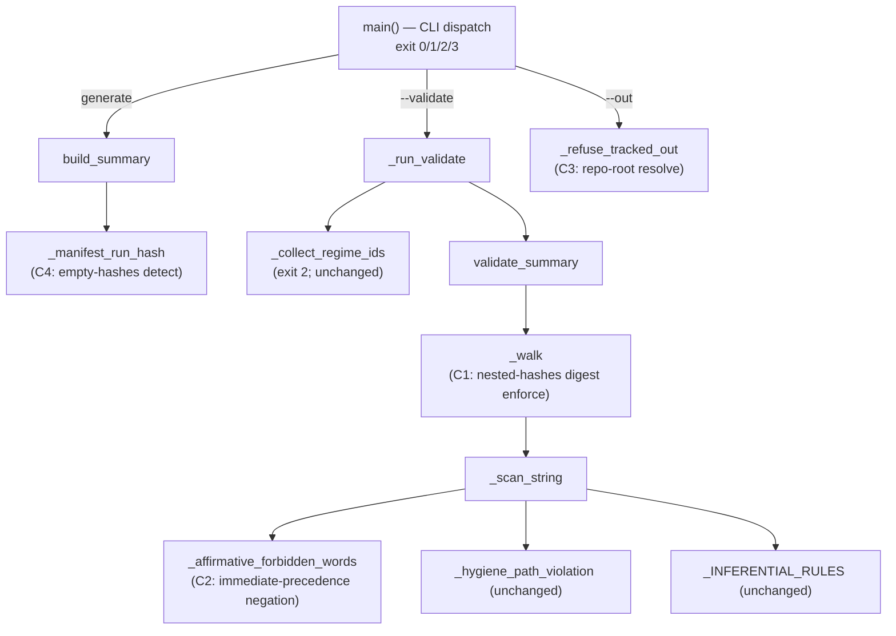

# Cycle-005 SDD — Promotion-Gate Hardening (C1–C4)

> Planning artifact (SDD). Status: **DRAFT — awaiting operator acceptance + build gate.** This SDD is the
> technical blueprint for the Cycle-005 **hardening** of the Cycle-004 evidence-summary
> generator/validator (`analysis/evidence_summary.py` + `tests/test_evidence_summary.py`). The SDD
> **opens no implementation gate**: code lands only through
> `/architect → /sprint-plan → /implement → /review-sprint → /audit-sprint → operator acceptance`
> (`docs/operator/turntrace-loop-contract.md` §6, the OA-2-class build gate). **Cycle-005 attempts no Rung 2,
> promotes no value, and mutates neither the ledger nor the claim ceiling.**
>
> **Sanitized note.** No raw traces, card IDs/names, deck lists, hand contents, simulator logs, PDFs/CSVs,
> `deck.csv` rows, run-dir dumps, Pokémon Elements, Daily-Top-Episode data, or Competition Data appear here
> (CC-1/CC-2, ESP, SP-6/SP-9). **No dispersion metric values appear here.** Runs are referenced by `run_id`
> pattern, count, hashes, sanitized metric *names*, claim ceilings, and local path/status only. The forbidden
> agent words (*strong / competitive / optimal / calibrated / complete*) and the inferential terms (*std-dev /
> variance / CI / p-value / significance / hypothesis-test / error-bar*) appear only as the negated/forbidden
> language they are.

| Field | Value |
|---|---|
| **Cycle** | Cycle-005 |
| **Working title** | Promotion-Gate Hardening (C1–C4) |
| **Type** | Software Design Document (technical blueprint for one hardening sprint) |
| **Status** | DRAFT — awaiting operator acceptance; next Golden-Path step is `/sprint-plan` |
| **Date** | 2026-06-19 |
| **Current main** | `337fc4f` — *docs: record TurnTrace competition findings* (== `origin/main`) |
| **Primary authority** | `docs/cycles/cycle-005/01-prd.md` (operator-accepted planning basis) |
| **Posture** | **Hardening-only.** Modify exactly `analysis/evidence_summary.py` + `tests/test_evidence_summary.py` for C1–C4; hold every other bright line. |
| **Claim ceiling** | **Rung 1** (held for the whole cycle; not raised). |

---

## 1. Current-state verification

Verified before drafting (`git`, source read at HEAD `337fc4f`):

| Assumption | Result |
|---|---|
| HEAD / branch | `main` @ `337fc4f` (== `origin/main`; not behind) |
| `docs/ledger.md` byte-unchanged | hash `2a2f1c2dc540b6d7e7a68aad5ab3c6b109dcee4b`; `git diff --exit-code` clean |
| Claim ceiling | **Rung 1** (`docs/claim-ceiling.md:22-23`) |
| Build target present | `analysis/evidence_summary.py` (511 lines) + `tests/test_evidence_summary.py` (289 lines, 12 checks) tracked + accepted |
| `eval/hygiene_check.py` present | yes (the staging gate referenced by NFR-7) |
| Python | 3.14.0 local; module is stdlib-only |
| Protected-path drift (`.claude/ frozen/ runs/ agents/ sim/ analysis/ tests/`) | **none** |
| Pre-existing dirty State-Zone | `.beads/issues.jsonl`, `grimoires/loa/NOTES.md` modified-unstaged; untracked `docs/cycles/cycle-005/` (PRD); not staged/committed by this cycle |

**Source mechanics confirmed (the four gaps, line-anchored at `337fc4f`):**

- **C1** — `_walk` (`analysis/evidence_summary.py:333-350`) descends into a `hashes`-keyed dict with
  `keys_are_fields=False` (`:344`); it scans the child dict's *keys* (run_ids) as data via `_scan_string`
  (`:342`) but **never enforces digest-shape on the values at that nested position**. The digest-shape rule runs
  **top-level only** via `obj.get("hashes")` (`:369-379`). `SAFE_FIELDS` is a flat field-name allow-list
  (`:83-88`). A nested `hashes` map carrying a clean non-digest token therefore passes (audit §7 C1, reproduced).
- **C2** — `_affirmative_forbidden_words` (`:298-306`) suppresses a forbidden word if **any** negation token
  appears within the preceding 36 chars (`_NEG_WINDOW = 36`, `:263`; `_NEGATION_RE`, `:262`). An unrelated
  negation suppresses an affirmative forbidden word (audit §7 C2, reproduced).
- **C3** — `_refuse_tracked_out` (`:410-421`) tests `_norm_path` (`:282-283`), which only normalizes slashes and
  strips a leading `./`. It checks `parts[0] == "docs"` and a `ledger.md` basename. An **absolute** path into
  the repo's `docs/` for a non-ledger file does not have `parts[0] == "docs"` and slips the prefix check; the
  ledger basename guard still catches the ledger on any path (audit §7 C3, reproduced partial).
- **C4** — `_manifest_run_hash` (`:117-132`) returns `None` when no 64-hex `*_hash` is present; `hashes[run_id]`
  is then never set (`:181-182`); `hashes` degrades to `{}`; `validate_summary` accepts `{}` cleanly (`:369-370`)
  (audit §7 C4 NOTE, confirmed).

**All assumptions hold. No finding forces a stop.**

---

## 2. Architecture overview

### 2.1 Design philosophy (binding)

The validator becomes **strictly more conservative, not looser** (PRD NFR-1). Every change either rejects more
inputs or rejects the same set; no change accepts an input the current validator rejects. The Cycle-004
one-module / in-module-constant / stdlib-only posture is preserved (PRD D-4): **no `.schema.json`, no second
validator module, no third-party dependency.** The read surface (`manifest.json` + `match_results/*` via
`aggregate_run`, plus the `--validate` file) is unchanged (PRD NFR-4); no `hashes.txt`, no sidecar/`traces/`.

### 2.2 Component map (unchanged shape; four surgical hardenings)



Touched functions: `_walk` (C1), a new digest-shape helper invoked from `_walk` (C1),
`_affirmative_forbidden_words` (C2), `_refuse_tracked_out` (C3), `build_summary` + `_manifest_run_hash`-adjacent
logic (C4). Untouched: `SAFE_FIELDS`, `validate_summary`'s top-level digest block (kept for back-compat parity),
`_collect_regime_ids`, `aggregate_run`/`descriptive_stats` reuse, hygiene/inferential/cross-regime rules.

### 2.3 What the cycle does NOT introduce

No `--promotion-check` mode (OD-C5-3 — deferred); no new exit code (OD-C5-5); no schema file; no second module;
no dependency; no read-surface change; no cross-regime field; no inferential output; no ledger/claim-ceiling
write; no value promotion; no new eval run.

---

## 3. File-level design

| File | Zone | Change | Authority |
|---|---|---|---|
| `analysis/evidence_summary.py` | App (tracked) | C1, C3, C4 hardenings + C2 negation tightening | PRD §5, D-1 |
| `tests/test_evidence_summary.py` | App (tracked) | Add C1–C4 regression checks; preserve all 12 existing checks | PRD AC-5, OD-C5-4 |
| `docs/cycles/cycle-005/04-implementation-report.md` | Docs/State | Standard implementation report (written under `/implement`) | loop contract |
| `docs/cycles/cycle-005/05-review-report.md` | Docs/State | Standard review report (written under `/review-sprint`) | loop contract |
| `docs/cycles/cycle-005/06-audit-report.md` | Docs/State | Standard audit report (written under `/audit-sprint`) | loop contract |

**No other tracked file is authorized for change** (see §11). The only two App-Zone code files touched are the
two evidence-summary artifacts. The standard cycle reports under `docs/cycles/cycle-005/` are State/Docs Zone and
written by the corresponding skills, not the implementer's code patch.

---

## 4. Function-level design (per changed function)

### 4.1 C1 — nested-`hashes` digest-shape enforcement (OD-C5-1)

**Decision (OD-C5-1): traversal-based enforcement, in-module, no schema rewrite.** During validation traversal,
**every `hashes`-keyed dict at any depth** has its values enforced to SHA-256 digest shape (or fails closed,
exit 3). The flat `SAFE_FIELDS` allow-list is preserved; the top-level digest block in `validate_summary` is
preserved for back-compat (it becomes redundant-but-harmless once traversal enforcement runs, and keeps the
existing top-level test path green). See OD-C5-1 rationale in §6.

**New helper** (placed beside `_scan_string`, mirroring its `out.append((field, reason))` contract):

```text
def _enforce_hashes_digest(field_path, hashes_dict, out):
    # Every value in a `hashes`-keyed dict must be a SHA-256 digest string.
    for rid, hv in hashes_dict.items():
        if not (isinstance(hv, str) and _SHA256_RE.match(hv)):
            out.append((f"{field_path}.{rid}",
                        "card-identity must be a SHA-256 digest, not raw content "
                        "(Competition-Data / Pokemon-Element leak; eval/schemas.md:13-15)"))
```

**`_walk` change (`:333-350`):** when a key `k == "hashes"` and its value `v` is a dict, call
`_enforce_hashes_digest(kp, v, out)` *in addition to* the existing recursive descent. The existing
`keys_are_fields=(k != "hashes")` recursion (`:344`) is retained so the child dict's keys (run_ids) are still
scanned as data — C1 adds value-shape enforcement that the current `_walk` omits. The reason string is identical
to the existing top-level message so test assertions keyed on `"Pokemon-Element"` / `"SHA-256 digest"` still
match at any position.

**Conservative-only proof:** C1 adds rejections (nested non-digest values now fail) and removes none. A nested
`hashes` value that *is* a valid digest still passes; the generator emits `hashes` only at top-level
(`build_summary`, `:211`), so no generator output regresses.

### 4.2 C2 — immediate-precedence negation (OD — PRD C5-FR-2)

**`_affirmative_forbidden_words` change (`:298-306`):** replace the 36-char window scan with an
**immediate-precedence** rule: a forbidden word is suppressed only when a negation token is the **immediately
preceding token** (allowing intervening whitespace/punctuation but no intervening content word). Concretely,
inspect the token directly before the match (e.g. match `(?:\b(no|not|never|non|without|neither|nor)\b|n't)\s*$`
against the text immediately preceding the word, rather than searching a 36-char span). `_NEG_WINDOW` is removed
or repurposed; `_NEGATION_RE` token set is preserved.

**Preserve legitimate examples (PRD C5-FR-2.3, R4):** report phrasings like `"NO strength claim"`,
`"never strong"`, `"not optimal"` and validator-rejection examples remain suppressed (the negation *is*
immediately precedent). An unrelated negation earlier in the sentence (`"claim not made; agent strong"`) **no
longer** suppresses — `strong` is now flagged (exit 3).

**Conservative-only proof:** the tighter rule suppresses a **subset** of what the 36-char window suppressed, so
it flags a **superset** of affirmative forbidden words — strictly stricter. The risk is over-tightening a
legitimate negated example (R4); the regression checks in §5 pin both the affirmative-catch and the
legitimate-negation-pass.

### 4.3 C3 — repo-root-resolved `--out` guard (OD — PRD C5-FR-3)

**`_refuse_tracked_out` change (`:410-421`):** before the prefix check, resolve `out_path` against the repo root
and test whether it lands inside the tracked `docs/` tree. Use `REPO_ROOT` (already defined, `:57`) and
`Path.resolve()`:

```text
def _refuse_tracked_out(out_path):
    resolved = Path(out_path).resolve()
    docs_root = (REPO_ROOT / "docs").resolve()
    # inside tracked docs/ (relative OR absolute) -> refuse
    if resolved == docs_root or docs_root in resolved.parents:
        raise ValueError("refusing to write to a tracked docs path ... local-by-default (NG4)")
    # ledger basename guarded independently, on any path (kept verbatim)
    if Path(_norm_path(str(out_path))).name == "ledger.md":
        raise ValueError("refusing to write a ledger file ... never mutates docs/ledger.md (NG3)")
```

The existing relative-`docs/` rejection and the `ledger.md` basename guard are **both preserved** (the existing
test cases `docs/x.json` and `a/b/ledger.md` must still raise — §5 AC). C3 *adds* rejection of an absolute path
into repo `docs/`; it removes no existing rejection.

**`docs/ledger.md` protection (PRD C5-FR-3.3, R5):** unchanged and independent — the primary control is
`git diff --exit-code -- docs/ledger.md` byte-unchanged, which holds regardless of this guard. The basename
guard is defense-in-depth.

**Conservative-only proof:** strictly more paths refused; no previously-refused path becomes allowed. (Note:
`Path.resolve()` is filesystem-relative; a relative `docs/...` invoked from a cwd outside the repo would still
be caught by the preserved basename guard for the ledger and by the resolved-tree check when run from the repo —
the cycle runs from repo root by construction, matching all existing tests.)

### 4.4 C4 — empty-`hashes` warning posture (OD-C5-2, OD-C5-5)

**Decision (OD-C5-2): warning-only in normal generate/validate; no silent acceptance; no promotion mode this
cycle.** Since Cycle-005 implements **no** promotion mode (OD-C5-3 deferred), the strictest behaviour that does
not break existing tests is: the **generator emits a stderr warning** when the assembled `hashes` map is empty,
and `validate_summary` continues to accept an empty `hashes` at **exit 0** (it is structurally valid, just
un-stamped). The binding floor — *no future promotion mode may silently accept empty `hashes`* — is satisfied by
making the empty condition **visible** now and **documenting** that a future promotion-check (Cycle-006+) must
treat empty `hashes` as a hard failure.

**Decision (OD-C5-5): no new exit code; warning rides exit 0.** The existing contract `0/1/2/3` is preserved
verbatim (see §7). An empty-`hashes` warning is **not** a leak (exit 3 is reserved for
forbidden-field/value/word leaks), **not** an input failure (exit 1), and **not** a mixed-regime refusal
(exit 2). It is a non-fatal provenance warning -> **exit 0 with a stderr warning line**. Inventing a new exit
code is explicitly avoided (PRD §12 OD-C5-5; SDD adds none).

**`build_summary` change (`:181-214`):** after assembling `hashes`, if `hashes == {}` (no manifest carried a
64-hex `*_hash` for any run), record that condition. Emission of the warning happens at the CLI boundary (`main`,
generate branch) to keep `build_summary` pure-ish and stdout JSON-first; the warning goes to **stderr** so the
JSON-first stdout contract is untouched. Manifest-only sourcing is preserved — `_manifest_run_hash` is **not**
changed to read any new source; **no `hashes.txt` read** is introduced (PRD C5-FR-4.1, NFR-4).

**Implementation shape:** `build_summary` returns the summary dict unchanged in structure; the
generate branch in `main` (`:485-507`) checks `if not summary.get("hashes"):` and prints a stderr warning
(`evidence_summary: WARNING — empty hashes (no manifest integrity stamp found); a future promotion gate must
reject this`). Exit code stays 0. No tracked artifact is produced (generator output stays local/gitignored).

**Conservative-only proof:** behaviour for non-empty `hashes` is byte-identical; the empty case gains a stderr
warning but the same exit 0 and same emitted JSON shape. No existing check regresses (the round-trip checks 6/10
use fixtures with valid `manifest_hash`, so `hashes` is non-empty there).

---

## 5. Exact C1–C4 implementation plan + test plan

### 5.1 Implementation plan (surgical, ordered)

1. **C1 (priority):** add `_enforce_hashes_digest`; wire it into `_walk` at the `k == "hashes"` dict branch.
2. **C2:** rewrite `_affirmative_forbidden_words` negation test to immediate-precedence; remove/repurpose
   `_NEG_WINDOW`.
3. **C3:** rewrite `_refuse_tracked_out` to repo-root-resolve before the prefix check; keep the basename guard.
4. **C4:** add the empty-`hashes` stderr warning in `main`'s generate branch; preserve `validate_summary`
   exit-0 acceptance of empty `hashes`.

Each anchor MUST be re-validated against the build-time HEAD by `/implement` (PRD NFR-9) — anchors accurate at
`337fc4f` may desync if the file moves.

### 5.2 Test plan (OD-C5-4)

**Layout decision (OD-C5-4):** add the new regression checks as **a new numbered block (`# --- 13. C1–C4
hardening ---`) inside `run_checks(tmp)`** in `tests/test_evidence_summary.py`, after the existing block 12, and
update `main()`'s summary line from "all 12 required checks" to the new total. The new checks reuse the existing
`good` summary fixture, `validate_file_exit`, `make_run_dir`, and `_HEX64` digest constant — **stdlib-only
synthetic temp-dir fixtures, no dependency on local K-batch runs, no raw data** (PRD AC-5, NFR-3). The **12
existing checks are preserved unmodified** (PRD AC-5).

| Check | Asserts | Maps to |
|---|---|---|
| **13a C1 — nested non-digest rejected** | Inject `good["agents"][0]["hashes"] = {"r": "clean-non-digest"}`; `validate_summary` returns a violation at a nested `hashes.*` path; `validate_file_exit == 3`. | AC-1, C5-FR-1 |
| **13b C1 — nested valid digest passes** | Inject `good["agents"][0]["hashes"] = {"r": _HEX64}`; if the shape is allow-listable, validates clean OR (if `hashes` nested under `agents` is allow-list-rejected) the rejection reason is the allow-list reason, **not** a digest false-negative. (Confirms C1 adds digest enforcement without breaking valid digests.) | AC-1, NFR-1 |
| **13c C1 — top-level digest still enforced** | Existing top-level non-digest case still `exit 3` (regression guard for the preserved top-level block). | AC-1 |
| **13d C2 — unrelated negation no longer suppresses** | `claim_ceiling = "claim not made; agent strong"` -> flagged `strong`; `validate_file_exit == 3`. | AC-2, C5-FR-2 |
| **13e C2 — immediate negation still suppresses** | `claim_ceiling = "POISON probe (asserted-rejected): NO strong claim"` style / `"never strong"` -> validates clean (legitimate negated example preserved). | AC-2, C5-FR-2.3, R4 |
| **13f C2 — affirmative still rejected** | `"agent is strong"` -> flagged (parity with existing behaviour). | AC-2 |
| **13g C3 — absolute repo-docs path refused** | `_refuse_tracked_out((REPO_ROOT / "docs" / "x.json"))` raises `ValueError`. | AC-3, C5-FR-3 |
| **13h C3 — relative docs + ledger basename still refused** | Existing `docs/x.json` and `a/b/ledger.md` still raise (regression guard). | AC-3 |
| **13i C3 — safe local path still allowed** | A gitignored local temp path does **not** raise. | AC-3, NFR-1 |
| **13j C4 — empty hashes warns, exits 0** | Run generate with a manifest carrying **no** 64-hex `*_hash` (new fixture variant: `manifest_hash` omitted / non-hex); capture stderr; assert a `WARNING`/`empty hashes` line appears AND exit code is 0 AND `docs/ledger.md` byte-unchanged. | AC-4, OD-C5-5 |
| **13k C4 — non-empty hashes does NOT warn** | Existing valid-`manifest_hash` fixture: no empty-hashes warning emitted; exit 0. | AC-4, NFR-1 |
| **13l C4 — no `hashes.txt` read** | Source-grep: `"hashes.txt"` absent from `analysis/evidence_summary.py` (read-surface guarantee). | AC-4, NFR-4 |

**Existing-suite guards (unchanged, must stay green):** all 12 current checks; `tests/test_import_direction.py`
(`tid.check() == []`, check 12); doc<->schema agreement (check 9, `SAFE_FIELDS` unchanged); no-sidecar source
property (check 4).

**The C4 empty-hashes fixture** requires a `make_run_dir` variant whose manifest carries no 64-hex `*_hash`
(e.g. pass a non-hex `manifest_hash` or add an `agent_source_hash=""` path). The implementer adds this as a
keyword-only option to `make_run_dir` or a small inline manifest in block 13 — stdlib-only, synthetic, no raw
data.

---

## 6. OD-C5-1 … OD-C5-6 decisions (resolved)

| OD | Decision | Rationale |
|---|---|---|
| **OD-C5-1 — C1 mechanism** | **Traversal-based nested-`hashes` digest-shape enforcement.** Keep one module, in-module `SAFE_FIELDS`, no `.schema.json`, no dependency. Add `_enforce_hashes_digest`; call it from `_walk` for every `hashes`-keyed dict at any depth; preserve the top-level digest block + flat allow-list. Add a regression test proving a nested clean non-digest token is rejected and a nested valid digest is not falsely rejected. | A full structural-schema rewrite is a **broad refactor** the PRD forbids (§4, D-4) and would risk loosening the gate (R1). Traversal enforcement is the **shortest conservative-only diff** that closes the positional blind spot while preserving every Cycle-004 invariant. Both options satisfy C5-FR-1; this one minimizes blast radius. |
| **OD-C5-2 — empty-hashes severity** | **Warning-only** in normal generate (stderr) + **exit 0** acceptance in `--validate`; **no silent acceptance** (the condition is now visible); **no promotion mode** this cycle. Floor preserved: a future promotion gate MUST reject empty `hashes` (documented as deferred to Cycle-006+). | Cycle-005 implements no promotion (OD-C5-3); the strictest behaviour that does not break existing local/generator tests is to surface the condition without changing the exit contract or rejecting structurally-valid summaries. Manifest-only sourcing preserved; no `hashes.txt`. |
| **OD-C5-3 — promotion-mode shape** | **Do NOT introduce `--promotion-check` in Cycle-005.** Harden `--validate` + generation only. Record a future promotion-check (which would hard-fail on empty `hashes` and re-run the full validator) as **deferred to the Rung-2 attempt cycle (Cycle-006+)**. | Cycle-005 promotes nothing; adding a promotion-mode CLI surface would blur scope and risk drifting toward the admission seam (R2). The existing `--validate` becoming stricter (C1) is sufficient pre-promotion hardening. |
| **OD-C5-4 — test layout** | New `# --- 13. C1–C4 hardening ---` block inside `run_checks(tmp)`, after block 12; update `main()` total line. Reuse existing fixtures/helpers; **preserve all 12 existing checks**; stdlib-only synthetic temp dirs; no K-batch dependency; no raw data. | Smallest cohesive placement; keeps the single-file plain-Python test runner; keeps the 12 green as a regression floor (AC-5). |
| **OD-C5-5 — CLI exit behaviour for warnings** | **No new exit code.** Empty-`hashes` warning rides **exit 0** with a stderr `WARNING` line. The `0/1/2/3` contract is preserved verbatim. | A warning is neither a leak (3), input failure (1), nor mixed-regime refusal (2). The PRD bars inventing a new code unless explicitly justified; no justification exists, so none is added. |
| **OD-C5-6 — carry-forward documentation language** | Implementation/review/audit reports MUST state, verbatim in intent: *C1 fixed and tested (nested-`hashes` digest-shape enforced; nested non-digest rejected, exit 3); C2 fixed and tested (immediate-precedence negation; unrelated negation no longer suppresses; legitimate negated examples preserved); C3 fixed and tested (repo-root-resolved `--out` guard; absolute repo-docs path refused; ledger byte-unchanged); C4 warning behaviour defined and tested (empty `hashes` warns, exit 0; no silent acceptance; no `hashes.txt` read); **Rung 2 still deferred; no value promoted; C1–C4 closed only as hardening, not as admission.*** | Fixes the reporting language so review/audit cannot drift into admission framing; binds the closeout to the hardening-only posture. |

**Reaffirmed (not decided in Cycle-005):** `M` unset; SP-6 not issued; OD-6 not relaxed; the four Rung-2 seam
decisions 8a–8d stay open; Rung-2 admission = a separate later gate.

---

## 7. CLI / exit-code contract (unchanged)

```
generate:  python analysis/evidence_summary.py <run_dir> [<run_dir> ...] [--json] [--out <local-path>]
validate:  python analysis/evidence_summary.py --validate <summary.json>

Exit codes (PRESERVED VERBATIM — no new code added):
  0  clean / valid          (now: may also carry a stderr WARNING for empty hashes — still exit 0)
  1  input failure
  2  mixed-regime refusal
  3  forbidden-field/value/word leak (fail-closed; never 0 on a leak)
```

C1 strengthens the exit-3 leak path (nested non-digest now -> 3). C2 strengthens exit-3 (affirmative forbidden
word now caught despite an unrelated negation). C3 strengthens the generate-mode `--out` refusal (absolute
repo-docs path -> the same input-failure path that already returns exit 1 in `main`, `:499-501`). C4 adds a
stderr warning on exit 0. **No exit code changes meaning; none is added.**

---

## 8. Read / write surface (unchanged)

**Read surface (PRD NFR-4):** each run dir's `manifest.json` (regime authority) + `match_results/*` via
`aggregate.aggregate_run`; the `--validate` file re-read from disk. **No** sidecar/`traces/` reference; **no**
`hashes.txt`; the structural no-sidecar guarantee holds (check 4). C4 does **not** add a hash source.

**Write surface:** stdout (JSON-first) or a **local/gitignored** `--out` path. Never `docs/`, never a ledger
row, never a tracked artifact. C3 strengthens the `--out` refusal (absolute repo-docs path now refused).
Generator exercise output (if any) stays gitignored/unstaged/uncited (PRD §11).

---

## 9. Sanitization and hygiene posture

- **Validator stays sanitization-parity-or-stricter** with `eval/hygiene_check.py` (PRD NFR-7); C1–C4 only
  strengthen the content gate. The hygiene path rules (`:231-241`) and inferential rules (`:246-257`) are
  **unchanged**.
- **Competition Data / Pokémon Elements never enter git** (CC-1/CC-2, ESP). The new tests use synthetic
  fixtures only; no raw traces, card names/IDs, deck lists, simulator logs, or Daily-Top-Episode data.
- **`eval/hygiene_check.py` remains the mechanical staging gate.** This SDD itself is run through
  `python eval/hygiene_check.py --paths docs/cycles/cycle-005/02-sdd.md` (see post-write checks).
- **Forbidden agent words** appear in this SDD only as negated/forbidden language; C2 strengthens, never
  weakens, that posture.
- **Simulator-authoritative (SP-8 / FM-10):** no verdict logic is built; the constraint is carried as a standing
  note only (PRD NFR-8).

---

## 10. Claim-ceiling posture

Loop sits at **ladder Rung 1**; **Cycle-005 holds Rung 1 for the whole cycle** (`docs/claim-ceiling.md`).
`docs/ledger.md` stays **byte-unchanged** (`2a2f1c2…`, two Rung-1 `regime-v001` rows). `docs/claim-ceiling.md`
is unchanged. No `M`, no SP-6, no Rung-2 row, no same-regime admission verdict, no cross-regime comparison. The
summary continues to carry **no ceiling of its own** (the ledger is the only ceiling-bearing artifact). Cycle-005
**advances nothing; it hardens the tool a later gate would use.**

---

## 11. Forbidden paths (no change authorized)

The implementer MUST NOT change any of:

`docs/ledger.md` · `docs/claim-ceiling.md` · `.claude/**` · `runs/**` · `agents/**` · `sim/**` · `frozen/**` ·
raw data paths (`grimoires/loa/context/**`, `deck.csv`, episode datasets) · `analysis/aggregate.py` ·
`analysis/dispersion_report.py` · `eval/**` · dependency/manifest files (`requirements*.txt`, `pyproject.toml`,
`setup.cfg`, etc.).

No `.schema.json`. No second validator module (`analysis/evidence_summary_validate.py`). No third-party
dependency. No State-Zone cleanup (pre-existing dirty `.beads/issues.jsonl` + `grimoires/loa/NOTES.md` stay
unstaged, untouched). **Only `analysis/evidence_summary.py` + `tests/test_evidence_summary.py` are
code-authorized**; only the standard Cycle-005 reports under `docs/cycles/cycle-005/` are doc-authorized.

If repo reality forces another file, the implementer MUST stop and surface a concrete repo-reality reason before
touching it; this SDD authorizes none.

---

## 12. Acceptance criteria

- **AC-1 — C1 (priority):** a **nested** `hashes` map carrying a clean non-digest token is **rejected**
  (fail-closed, exit 3); digest-shape is enforced at every position; a nested valid digest is not falsely
  rejected as a digest violation; the top-level digest path still rejects non-digests.
- **AC-2 — C2:** an unrelated negation no longer suppresses an affirmative forbidden word (`strong` now flagged);
  an immediate negation (and legitimate negated/forbidden-language examples) still validate; no affirmative
  quality claim is admitted.
- **AC-3 — C3:** an absolute path into repo `docs/` (non-ledger) is **refused**; relative `docs/` + ledger
  basename still refused; a safe local path still allowed; `docs/ledger.md` byte-unchanged.
- **AC-4 — C4:** an empty `hashes` is **not silently accepted** — generate emits a stderr `WARNING` and exits 0;
  non-empty `hashes` emits no warning; manifest-only sourcing preserved; **no `hashes.txt` read**.
- **AC-5 — Tests:** each of C1–C4 has at least one runnable regression check (block 13); **all existing 12 checks
  remain green**; `tests/test_import_direction.py` green; `python eval/hygiene_check.py --paths …` exit 0 on
  tracked artifacts.
- **AC-6 — Conservative-only / compatible:** the validator is strictly stricter-or-equal; generator behaviour
  stays compatible (only the empty-`hashes` warning is additive).
- **AC-7 — Posture held (hard):** Rung 1 held; `docs/ledger.md` byte-unchanged (`2a2f1c2…`);
  `docs/claim-ceiling.md` unchanged; no value promoted; stdlib-only / analysis-only imports; no `M`/SP-6/Rung-2
  row; no `.claude/` drift; State-Zone files unstaged; no second module / `.schema.json` / dependency; no new
  exit code.
- **AC-8 — Cadence:** lands through `/implement → /review-sprint → /audit-sprint → operator acceptance`, so the
  hardened gate is **reviewed and audited before any Rung-2 attempt**.

---

## 13. Reviewer / auditor checklist

- [ ] **C1** — nested non-digest token under any `hashes`-keyed dict -> exit 3, reason cites SHA-256 digest /
      Pokémon-Element; nested valid digest not falsely flagged; top-level digest path unchanged.
- [ ] **C2** — `"claim not made; agent strong"` -> flagged; `"never strong"` / `"NO strength claim"` -> clean;
      `"agent is strong"` -> flagged. No legitimate negated example broken (R4).
- [ ] **C3** — absolute repo-docs path refused; relative `docs/` + `ledger.md` basename still refused; local path
      allowed; `git diff --exit-code -- docs/ledger.md` clean.
- [ ] **C4** — empty `hashes` warns on stderr, exit 0; non-empty silent; `"hashes.txt"` absent from source.
- [ ] **Conservative-only** — no input the Cycle-004 validator rejected is now accepted; 12 existing checks green.
- [ ] **Posture** — Rung 1 held; ledger hash `2a2f1c2…`; claim-ceiling unchanged; no `M`/SP-6/Rung-2 row; no new
      exit code; in-module constant / one-module / stdlib-only preserved; no `.schema.json` / second module /
      dependency.
- [ ] **Sanitization** — no raw Competition Data / Pokémon Elements / traces / card names / deck lists /
      simulator logs / Daily-Top-Episode data in code, tests, or reports; hygiene-check exit 0.
- [ ] **Zone** — only the two evidence-summary code files + standard `docs/cycles/cycle-005/` reports changed;
      forbidden paths (§11) untouched; State-Zone files unstaged; `.claude/` untouched.
- [ ] **Reporting language (OD-C5-6)** — C1–C4 closed as **hardening, not admission**; Rung 2 deferred; no value
      promoted.

---

## 14. Risks and mitigations

| ID | Risk | Mitigation |
|---|---|---|
| **R1** | **C1 fix loosens the gate** (a restructure accidentally accepts something previously rejected). | Traversal enforcement (not a schema rewrite); top-level digest block + flat allow-list preserved; 12 existing checks green (AC-5); nested-rejection check 13a (AC-1). |
| **R2** | **Scope-creep into admission** — hardening drifts into a verdict / `M` / promotion / promotion-mode. | OD-C5-3 defers promotion-mode; §4 non-goals; no `M`/SP-6/Rung-2 row; seam 8a–8d untouched; OD-C5-6 reporting language. |
| **R3** | **Citation rot** — the C1–C4 line anchors desync from source before build. | NFR-9: `/implement` re-validates anchors at build-time HEAD (§5.1). |
| **R4** | **C2 over-tightening** — a legitimate negated/forbidden-language example wrongly flagged. | Immediate-precedence (subset suppression); checks 13e/13f pin both the affirmative-catch and the legitimate-negation-pass. |
| **R5** | **Ledger / docs mutation** via the generator's `--out`. | C3 repo-root guard; ledger basename guard; `git diff --exit-code -- docs/ledger.md` byte-unchanged (AC-3/AC-7); independent of the guard. |
| **R6** | **Dependency / second-module / `.schema.json` creep** during the C1 work. | OD-C5-1 traversal-in-module; §11 forbidden paths; import-direction test (check 12); in-module constant preserved. |
| **R7** | **C4 false warning / break of round-trip checks** (a valid-hash fixture trips the warning). | Warning only on `hashes == {}`; checks 6/10 use valid `manifest_hash` fixtures (non-empty); check 13k pins no-warning-on-non-empty. |
| **R8** | **C3 `Path.resolve()` cwd-sensitivity** — a relative path resolved from outside the repo. | Cycle runs from repo root by construction; basename ledger guard preserved on any path; existing relative-`docs/` test preserved (check 13h). |
| **R9** | **FM-11 (top-episode overfitting / contaminated evidence).** | No episode ingest; synthetic fixtures only; raw-data-in-git mechanically caught by `eval/hygiene_check.py` + validator hygiene parity. |

---

## 15. Explicit non-goals

Cycle-005 does **not**: attempt Rung 2; admit Rung 2; write a Rung-2 ledger row; advance the claim ceiling;
choose `M`; issue SP-6; relax OD-6; write a same-regime admission verdict; run new eval runs; do a K=50 top-up;
do paired-delta tooling; do runtime-agent work; do gameplay-heuristic / broad-optimization work; ingest Daily
Top Episodes; do FunSearch work; do a broad refactor; add a `.schema.json`; add a second validator module; add a
third-party dependency; edit `.claude/`; do State-Zone cleanup; add raw Competition Data / Pokémon Elements /
traces / card names / deck lists / simulator logs; introduce a `--promotion-check` mode; add a new exit code;
mutate the ledger or claim ceiling. **Rung 1 remains held for the whole cycle.**

---

## 16. Deferred items for the Cycle-006+ Rung-2 attempt

- **Promotion-mode CLI surface** (e.g. `--promotion-check`) that hard-fails on empty `hashes` (OD-C5-3,
  OD-C5-2 floor) and re-runs the full hardened validator before any promotion.
- **The four Rung-2 seam decisions 8a–8d** (8a disjoint-bands-vs-OD-6; 8b numeric `M`; 8c SP-6; 8d Rung-2 row /
  ceiling-advance) — governance decisions the operator owns
  (`docs/cycles/cycle-003/07-od6-criterion-2-proposal.md` §5).
- **A defensible pre-registration of `M`** that avoids post-hoc thresholding on the already-generated K=20+20
  bands (PRD §8.3).
- **The five conjunctive Rung-2 readiness criteria** (`docs/cycles/cycle-002/04-rung-2-readiness-criteria.md`
  §2), all required before a Rung-2 *consideration*.
- A Rung-2 attempt may proceed **only after** Cycle-005 passes review/audit **and** an explicit operator gate
  opens.

---

## 17. Sources and traceability

> **Primary authority:** `docs/cycles/cycle-005/01-prd.md` (operator-accepted).
> **Cycle-004 carry-forwards:** `06-audit-report.md` §7/§9 (C1–C4 reproduced + recommendations);
> `05-review-report.md` §9; `07-closeout.md` §8; `04-implementation-report.md` §4 (local exercise).
> **Tracked code (hardening target, anchors at `337fc4f`):** `analysis/evidence_summary.py`
> (`SAFE_FIELDS` `:83-88`; `_manifest_run_hash` `:117-132`; `build_summary` hashes set `:181-182`,
> return `:205-214`; `_norm_path` `:282-283`; `_affirmative_forbidden_words` `:298-306` + `_NEG_WINDOW` `:263`;
> `_walk` `:333-350`; `validate_summary` digest-shape `:369-379`; `_refuse_tracked_out` `:410-421`;
> hygiene rules `:231-241`); `tests/test_evidence_summary.py` (the 12 checks; `make_run_dir` `:49-72`;
> `validate_file_exit` `:75-80`).
> **Cycle-003 design authorities:** `04-evidence-summary-schema-spec.md`; `05-generator-validator-shape.md`;
> `06-rung-2-ledger-convention.md` (§3 row cites summary by reference + hash — the C4 motivation);
> `07-od6-criterion-2-proposal.md` (§3 pre-registration, §5 seam 8a–8d); `08-funsearch-forward-compat.md`.
> **Posture docs:** `docs/cycles/cycle-002/04-rung-2-readiness-criteria.md` §2;
> `docs/cycles/cycle-000-bootstrap/04-operator-decisions.md` (SP-6/SP-8/SP-9); `docs/failure-modes.md`
> (FM-10/FM-11); `docs/claim-ceiling.md` (Rung 1; forbidden words); `docs/ledger.md` (hash `2a2f1c2…`);
> `docs/operator/turntrace-loop-contract.md` (§6 build gate; §7-§8 hygiene/claim language);
> `docs/operator/cycle-005-planning-inputs.md` (carry-forward index).
> Current main at authoring: `337fc4f`. Claim ceiling: **Rung 1 (unchanged).** This SDD opens no implementation
> gate, builds no code, mutates no ledger, advances no ceiling, promotes no value, and edits no `.claude/`.
