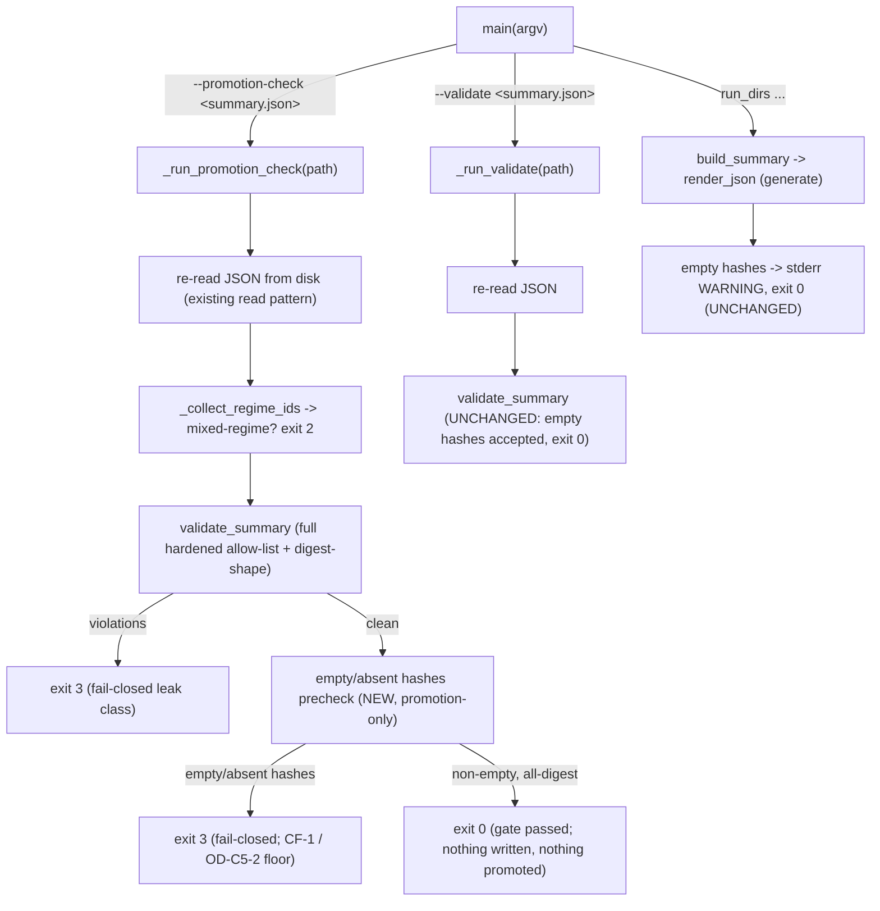

# Cycle-006 SDD — Rung-2 Admission-Seam Preparation: Pre-Register the Rule and Build the Promotion Gate

> Planning artifact (SDD). Status: **DRAFT — awaiting operator acceptance + a separate build gate.** This SDD
> is the technical blueprint for the **one narrow hardening-class sprint** of Cycle-006 — adding a
> `--promotion-check` mode to `analysis/evidence_summary.py` plus regression tests in
> `tests/test_evidence_summary.py` — and the placement of the cycle's governance/design deliverables. It
> translates the accepted Cycle-006 PRD (`docs/cycles/cycle-006/01-prd.md`) into a settled design. **This SDD
> opens no build gate and authorizes no code:** code lands only through
> `/sprint-plan → /implement → /review-sprint → /audit-sprint → operator acceptance`
> (`docs/operator/turntrace-loop-contract.md` §1, §6). **Cycle-006 attempts no Rung 2, applies no
> PASS/FAIL/INCONCLUSIVE verdict, promotes no value, generates no fresh evidence, chooses no `M`, issues no
> SP-6, writes no Rung-2 ledger row, and mutates neither `docs/ledger.md` nor `docs/claim-ceiling.md`.**
>
> **Sanitized note.** No raw traces, card IDs/names, deck lists, hand contents, simulator logs, PDFs/CSVs,
> `deck.csv` rows, run-dir dumps, Pokémon Elements, Daily-Top-Episode data, or Competition Data appear here
> (CC-1/CC-2, ESP). **No dispersion metric values appear here.** **No numeric margin `M` is chosen.** The
> forbidden agent words (*strong / competitive / optimal / calibrated / complete*) and the inferential terms
> (*std-dev / variance / CI / p-value / significance / hypothesis-test / error-bar*) appear only as the
> negated/forbidden language they are.

| Field | Value |
|---|---|
| **Cycle / Type** | Cycle-006 — Software Design Document (planning artifact for a preparation + one-sprint hardening cycle) |
| **Status** | DRAFT — awaiting operator acceptance; next Golden-Path step is `/sprint-plan` |
| **Date** | 2026-06-19 |
| **Binding input** | `docs/cycles/cycle-006/01-prd.md` (accepted; OD-C6-1 ratified) |
| **Build-time HEAD (citation anchor)** | `561fb92` — *docs: close TurnTrace Cycle-005 Sprint 01* (== `origin/main`) |
| **Tracked code touched (later sprint)** | `analysis/evidence_summary.py` + `tests/test_evidence_summary.py` **only** |
| **Claim ceiling** | **Rung 1** (held for the whole cycle; not raised) |
| **Ledger invariant** | `docs/ledger.md` byte-unchanged; hash `2a2f1c2dc540b6d7e7a68aad5ab3c6b109dcee4b` |

---

## 1. Architecture overview

Cycle-006 has two tracks; this SDD designs both at the level each requires.

**Track A — governance/design deliverables (this SDD; no code).** Four reversible-safe seam-half artifacts —
the ratified-8a record, the `M` pre-registration procedure (no `M`), the Cycle-007 fresh-evidence batch design,
and the pre-registered PASS/FAIL/INCONCLUSIVE rule + fail-state language. Their placement is resolved in §10
(OD-C6-6): they live **inside this SDD** (§8–§9, §11) to minimize artifact count, with the §16.3 verdict rule
of the PRD imported by reference. No companion docs are created.

**Track B — the `--promotion-check` hardening sprint (designed here; built later under a build gate).** A new
CLI mode on the existing single module `analysis/evidence_summary.py` that **re-reads a candidate summary from
disk, re-runs the full hardened validator, and additionally hard-fails an empty/absent `hashes` integrity
stamp** — a *gate* a future promotion must pass, which itself **promotes nothing and writes nothing**.

The promotion-check mode is a thin CLI seam over machinery that already exists at `561fb92`:



The promotion-check path **reuses** `_run_validate`'s re-read-from-disk + mixed-regime + full-validator
semantics verbatim and **adds exactly one promotion-only precheck** (empty/absent `hashes`). `--validate` and
`generate` mode are left byte-untouched in behavior, preserving the OD-C5-2-floor asymmetry the Cycle-005 audit
ratified: `--validate` accepts a structurally-valid empty `hashes` at exit 0; **promotion** does not.

---

## 2. Current module / source grounding at HEAD `561fb92`

Anchors below are line-anchored to `analysis/evidence_summary.py` and `tests/test_evidence_summary.py` at
`561fb92`. **NFR-9 / R6:** `/implement` MUST re-validate every anchor against the build-time HEAD before
coding — anchors accurate now may desync if the files move.

| Surface | Location (`561fb92`) | Promotion-check relevance |
|---|---|---|
| CLI dispatch + arg parsing | `analysis/evidence_summary.py:509` (`main`), args `:518-527` | `--promotion-check` is added here as a third dispatch branch (OD-C6-2). |
| `--validate` driver (re-read + mixed-regime + validate) | `_run_validate` `:477-506` | The promotion path reuses this shape; the empty-hashes precheck is the only delta. |
| Pure allow-list validator | `validate_summary` `:392-420` | Re-run **unchanged** by promotion-check (full hardened semantics). |
| Mixed-regime collector (exit 2) | `_collect_regime_ids` `:423-442`; used `:489-494` | Preserved; promotion-check inherits exit 2. |
| Nested digest-shape enforcement (C1) | `_enforce_hashes_digest` `:347-363`; wired in `_walk` `:380-381` | Already runs inside `validate_summary`; promotion-check inherits it (a non-digest `hashes` value → exit 3 via the existing path). |
| Top-level `hashes` digest block | `validate_summary` `:408-419` | Existing top-level check; the CF-2 double-report lives here (§6 / OD-C6-4). |
| Generate-mode empty-`hashes` WARNING (C4) | `:552-555` | **Preserved at exit 0** — promotion-check does not touch generate mode. |
| `--validate` empty-`hashes` acceptance | `validate_summary` returns `[]` for empty `hashes` map; exit 0 | **Preserved** — the precheck is promotion-only, not in `validate_summary`. |
| Tracked-`--out` guard (C3) | `_refuse_tracked_out` `:449-474` | Untouched; promotion-check writes nothing, so it never reaches this guard. |
| Exit-code set | `0/1/2/3` (`:45-46`; `_run_validate` returns) | Preserved; the empty-hashes hard-fail rides exit 3 (OD-C6-3). |
| `hashes.txt` absence | grep = 0 (`:551,554` are warning *text*, not a read) | Preserved; promotion-check reads no `hashes.txt`. |
| `--promotion-check` token | **absent** (only `:551,554` forward-reference warning text) | This sprint introduces the mode. |

**Test harness (reusable for the new block).** `tests/test_evidence_summary.py` exposes, at `561fb92`:
`check(name, cond, detail)` `:36`; `make_run_dir(..., manifest_hash="")` for empty-hashes fixtures `:49-72`
(used by 13j `:339-342`); `validate_file_exit(obj, tmp, name)` `:75-80`; the clean `good` fixture and `_HEX64`
digest `:33`; `es.main([...])` CLI driver. Block 13 (C1–C4) ends at **13l** (`:366-368`); a new block 14 fits
immediately after it. Existing **12 + block-13** checks must remain green (AC-6 / NFR-2).

---

## 3. CLI and exit-code design

### 3.1 CLI surface (resolves OD-C6-2, CLI half)

```
python analysis/evidence_summary.py --promotion-check <summary.json>
```

- A new mutually-distinct mode alongside `generate` (positional `run_dirs`) and `--validate`. Added as one
  `argparse` argument `--promotion-check`, `metavar="summary.json"`, `default=None`, mirroring the existing
  `--validate` argument shape (`:520-521`).
- Help text (design-level): *"promotion gate: re-read this summary, re-run the full hardened validator, and
  additionally hard-fail empty/absent hashes; writes nothing, promotes nothing."*
- Dispatch precedence in `main` (`:529-531`): `--promotion-check` is checked in the same dispatch block as
  `--validate`. If both `--promotion-check` and `--validate` are supplied, the implementation prefers
  `--promotion-check` (stricter) and may note the redundancy on stderr; the sprint plan fixes the exact
  precedence (a single, documented choice — not a behavior change to either existing mode).
- It takes exactly one path argument and **re-reads that file from disk** (NFR-4; §4 step 1) — it never trusts
  an in-memory object, mirroring the independent-gate posture of `_run_validate` (`:478`).

### 3.2 Exit-code contract (resolves OD-C6-3)

**Decision: the empty/absent-`hashes` promotion hard-fail rides the existing exit 3 (fail-closed leak class).
No new exit code is introduced.** The `0/1/2/3` contract is preserved.

| Exit | Meaning under `--promotion-check` | Source path |
|---|---|---|
| `0` | gate passed: re-read OK, single-regime, full validator clean, **and** `hashes` non-empty + all SHA-256 digests | clean fall-through |
| `1` | input failure (file unreadable / not JSON) | reuse `_run_validate`'s read-failure block `:482-487` |
| `2` | mixed-regime refusal (single-regime guard) | reuse `_collect_regime_ids` `:489-494` |
| `3` | **fail-closed:** a forbidden field/value/word leak (full validator) **OR** an empty/absent `hashes` integrity stamp (the promotion-only precheck) | `validate_summary` violations **or** the new precheck |

**Rationale (OD-C6-3).** Exit 3 is the module's established *"fail-closed; never 0 on a leak"* class
(`analysis/evidence_summary.py:45-46`; `05-generator-validator-shape.md` §2.4). CF-1 frames an empty integrity
stamp as un-stamped provenance that a promotion *must not trust* (`06-audit-report.md` §11) — semantically the
same "this must not be promoted, fail closed" posture as a leak. A nested or top-level **non-digest** `hashes`
value already exits 3 today via `_enforce_hashes_digest`; making **empty** `hashes` also exit 3 keeps the
fail-closed class coherent and adds no code to learn. The PRD floor (C6-FR-5.4, §11) is *"a non-zero,
fail-closed exit; never exit 0 on empty `hashes` in promotion mode"* — exit 3 satisfies it without expanding
the contract. **A new exit code is permitted only if the sprint surfaces a strong reason; this SDD finds none,
so exit 3 is the binding default.**

---

## 4. Validator flow design (resolves OD-C6-2, internal-shape half)

**Decision: `--promotion-check` calls `validate_summary` wholesale (the full hardened validator, re-read from
disk) and layers exactly one promotion-only empty-`hashes` precheck on top. It does NOT compose a separate
single pass and does NOT modify `validate_summary`.** This preserves the full hardened validator semantics,
preserves `generate`/`--validate` behavior, and preserves the one-module posture.

Designed control flow of `_run_promotion_check(path_str) -> int` (a new sibling of `_run_validate`):

1. **Re-read from disk.** Load `path_str` as JSON with the *same* try/except shape as `_run_validate`
   (`:480-487`): `FileNotFoundError`/`OSError`/`json.JSONDecodeError` → stderr message, **exit 1**. (No new
   read surface; no `hashes.txt`, no sidecar, no trace — NFR-4.)
2. **Mixed-regime guard.** `_collect_regime_ids(summary)`; `> 1` distinct regime → stderr REFUSED, **exit 2**
   (`:489-494`, reused). (NFR-5; never compares a `regime-v002` band to a `regime-v001` band.)
3. **Full hardened validator.** `violations = validate_summary(summary)` (`:496`, reused **unchanged**). Any
   violation (forbidden field/value/word, cross-regime marker, inferential term, malformed `hashes` value,
   non-digest `hashes`) → print the same per-violation block as `_run_validate` (`:498-502`), **exit 3**.
4. **Empty/absent-`hashes` promotion precheck (NEW; this is the only added logic).** After the full validator
   is clean, evaluate the integrity stamp:
   - `h = summary.get("hashes")`
   - **Hard-fail (exit 3)** when `h` is *empty or absent*: `h is None`, `h == {}`, or `h` is not a non-empty
     dict. Print a fail-closed message naming CF-1 / OD-C5-2 (e.g. *"PROMOTION REFUSED — empty/absent hashes:
     provenance is un-stamped; a promotion candidate must carry a manifest integrity stamp (CF-1 / OD-C5-2
     floor)"*).
   - The *per-value digest shape* of a non-empty `hashes` map is **already enforced** by `validate_summary`
     (step 3, via `_enforce_hashes_digest` `:347-363` and the top-level block `:408-419`), so the precheck need
     only assert **non-emptiness**; it does not re-implement digest matching.
5. **Pass.** If steps 1–4 all pass, print a VALID/gate-passed message and **exit 0**. Write nothing. Promote
   nothing.

**Why wholesale-`validate_summary`, not a single composed pass (OD-C6-2).** `validate_summary` is the audited,
load-bearing hardened validator (C1–C4; `06-audit-report.md` §4). Re-implementing its checks inside a composed
promotion pass would (a) risk divergence from the audited semantics, (b) duplicate the digest/allow-list/word
logic, and (c) violate the one-module/minimal-diff posture. Calling it wholesale guarantees promotion-check is
**parity-or-stricter** with `--validate` by construction (NFR-1): it rejects a superset of what `--validate`
rejects — exactly `--validate`'s rejections **plus** empty-`hashes`. No input `--validate` rejects becomes
accepted under promotion-check.

---

## 5. Empty-hashes hard-fail design

The asymmetry this sprint creates, stated precisely:

| Mode | Empty `hashes` | Source / why |
|---|---|---|
| `generate` | stderr **WARNING**, **exit 0** | un-stamped provenance is surfaced, not fatal (C4; `:552-555`). **Preserved.** |
| `--validate` | structurally **accepted**, **exit 0** | a structurally-valid empty `hashes` is schema-conforming (`validate_summary` returns `[]`). **Preserved.** |
| `--promotion-check` | **hard-fail, exit 3** | a Rung-2 row cites the promoted summary *by reference + content hash* (`06-rung-2-ledger-convention.md` §3); a silently-empty stamp is unacceptable **at promotion** (CF-1 / OD-C5-2 floor; `06-audit-report.md` §11). **NEW.** |

This is the precise realization of CF-1: *"a future promotion gate MUST hard-fail empty `hashes`."* The floor
lives in **promotion mode only** — `validate_summary` is **not** changed, so `--validate`'s exit-0 acceptance
of a valid empty `hashes` (which the Cycle-005 audit confirmed correct) is untouched. "Absent" `hashes` (the
key missing entirely) is treated identically to "empty" — both mean no integrity stamp — and both hard-fail in
promotion mode.

**Conservative-only proof obligation (NFR-1, for the reviewer/auditor).** The change set must demonstrate that
the set of inputs `--promotion-check` accepts is a strict subset of what `--validate` accepts: identical except
that the empty/absent-`hashes` summaries `--validate` accepts are *rejected* by `--promotion-check`. No
`--validate`-rejected input is `--promotion-check`-accepted.

---

## 6. CF-2 dedupe design (resolves OD-C6-4)

**Decision: top-level duplicate-violation dedupe is NOT required, because `--promotion-check` keys solely on
the exit code, never on the programmatic violation count.** Recorded as **not required** per the PRD's
conditional (C6-FR-5 / §13 / CF-2).

Grounding: a top-level non-digest `hashes` value is reported **twice** — once by the preserved top-level block
(`:408-419`) and once by the new traversal (`_enforce_hashes_digest` via `_walk` `:380-381`) — so
`len(violations)` over-counts that one case by 1 (`06-audit-report.md` §7, CF-2; cosmetic). `--promotion-check`
branches on `if violations:` (truthiness) → exit 3, and on the empty-`hashes` precheck → exit 3; it **never
consumes `len(violations)` as a programmatic signal** and never emits the count to a downstream consumer. The
human-facing printed count may over-count by 1 in the one top-level-digest-leak case — identical cosmetic
behavior to `--validate` today, and the gate's decision (exit 3) is unaffected. **Therefore no dedupe is
introduced in this sprint.** (If a *later* cycle makes the count programmatic, dedupe becomes required then —
out of Cycle-006 scope.)

**CF-3 (C2 word-adjacency).** Cycle-006 does **not** revisit the C2 negation rule; `_affirmative_forbidden_words`
/ `_NEGATION_RE` (`:307-320,271-272`) are untouched. Per the PRD (§13), the C2 "word-adjacency, not
character-adjacency" semantics need a documentation note **only if** C2 is touched. It is not. **No CF-3 note is
required this cycle.**

---

## 7. Test strategy (resolves OD-C6-5)

**Decision: the new regression checks live in a new block 14 in `tests/test_evidence_summary.py`, immediately
after the existing block-13 (C1–C4) checks (which end at 13l, `:366-368`). Fixtures are stdlib-only synthetic,
reusing the existing harness — no K-batch dependency, no raw Competition Data, no run-dir dependency.**

Reused harness (all present at `561fb92`): `check()` `:36`; `make_run_dir(..., manifest_hash="")` for
empty-hashes summaries (the 13j pattern `:339-342`); `validate_file_exit()` `:75-80` (extended or paralleled by
a `promotion_check_file_exit` helper that calls `es.main(["--promotion-check", path])`); the clean `good`
fixture; `_HEX64` digest `:33`; `es.main([...])` CLI driver; the `REPO_ROOT/docs/ledger.md` byte-compare
pattern (13j `:344-356`).

Block-14 checks (each a runnable regression; maps to AC-1…AC-5):

| Check | Asserts | AC |
|---|---|---|
| 14a | `--promotion-check` on a clean **non-empty-`hashes`** `good` summary → **exit 0** | AC-1 |
| 14b | `--promotion-check` on a structurally-valid **empty-`hashes`** summary (built via `make_run_dir(..., manifest_hash="")`) → **exit 3** (non-zero, fail-closed) | AC-2 |
| 14b' | the same empty-`hashes` summary under **`--validate`** still → **exit 0** (preservation guard for the asymmetry) | AC-4 |
| 14c | `--promotion-check` on a summary carrying a forbidden field/value/word (e.g. affirmative `strong`, an inferential term, a cross-regime marker, a non-digest `hashes` value) → **exit 3** (full validator re-run) | AC-3 |
| 14d | generate-mode empty-`hashes` still emits the stderr **WARNING at exit 0** (re-assert the 13j invariant under the new code) | AC-4 |
| 14e | `--promotion-check` writes nothing; `docs/ledger.md` byte-unchanged before/after a promotion-check run (byte-compare, mirroring 13j) | AC-5 |
| 14f | `--promotion-check` on a **mixed-regime** summary → **exit 2** (single-regime guard inherited) | AC-3 / NFR-5 |

All **12 + block-13** existing checks remain green (NFR-2 / AC-6). `tests/test_import_direction.py` remains
green (no new import; NFR-3). `eval/hygiene_check.py` remains exit 0 on the two tracked artifacts (NFR-7 /
AC-6).

---

## 8. `M` pre-registration procedure (Track A; recorded here, no `M` chosen)

Recorded as a governance deliverable per OD-C6-6; **no numeric `M` appears.** The procedure (grounded in
`07-od6-criterion-2-proposal.md` §3; `04-rung-2-readiness-criteria.md` §2.3):

1. The operator ratifies the rule (8a — already ratified: the descriptive disjoint-bands rule, §9 / OD-C6-1)
   and **fixes the numeric margin `M` in advance**, as part of the approved design, recorded and dated.
2. `M` is fixed **before** any fresh band is generated or read as a verdict — so the threshold cannot be chosen
   after seeing the numbers.
3. `M` **must not** be fixed against the already-observed K=20+20 bands (the Cycle-004 exercise set;
   `01-prd.md` §10 contamination rule; C6-FR-2.3). Fixing `M` against an already-observed set is post-hoc
   thresholding — the in-house analogue of FM-11 (contaminated evidence; `docs/failure-modes.md:142-160`).
4. Fixing `M`, generating fresh evidence, and applying the rule are **Cycle-007** acts behind a separate
   explicit operator gate. **Cycle-006 chooses no `M`** (binding; any numeric `M` in any Cycle-006 artifact is
   a posture violation → HALT).

---

## 9. Fresh-evidence batch design + verdict rule (Track A; designed, not generated/applied)

**8a posture (settled input, OD-C6-1).** The **pre-registered descriptive disjoint-bands rule** —
*"candidate `min` > baseline `max` by ≥ `M` across `K ≥ 20` same-regime batches"* — expressed using only the
allowed descriptive vocabulary (`count / min / max / range / mean / median / spread`), adding **no field and no
statistic** to the schema, keeping **OD-6 unrelaxed** (`07` §2; `04-evidence-summary-schema-spec.md` §2.2). OD-6
relaxation is **not adopted**. The SDD treats this as settled and computes **no** inferential result.

**Cycle-007 fresh-evidence batch design (designed here; generated only in Cycle-007).** A clean Rung-2 attempt
requires (grounded in `04-rung-2-readiness-criteria.md` §2; `01-prd.md` C6-FR-3):
- a **justified larger `n`** with explicit noise-floor reasoning — average over enough matches/batches to clear
  the unseeded RNG noise floor before a per-candidate signal is stable (`08-funsearch-forward-compat.md` §3,
  referenced; criterion 1);
- a **K ≥ 20 same-regime** batch under a single frozen `regime-vNNN` (a larger `n` is a *new* regime, never an
  edit; NFR-5);
- the **never-observed-band requirement** — generated only *after* `M` and the verdict rule are pre-registered,
  distinct from the already-observed K=20+20 set;
- **provenance/audit-trail** intact — source-hash provenance, per-decision canonical traces, `trace_hash`,
  regime-tuple stamp (criterion 4); these are exactly what `--promotion-check` will gate on (non-empty `hashes`,
  full-validator-clean).

Generating this batch is **new eval scope** and a **separate Cycle-007 operator decision** — never executed in
Cycle-006 (C6-FR-3.3; R10 → HALT if attempted).

**Pre-registered PASS / FAIL / INCONCLUSIVE rule + fail-state language.** Pre-registered for **Cycle-007**,
applied **never** in Cycle-006. The binding text is `docs/cycles/cycle-006/01-prd.md` §16.3 (PASS / FAIL /
INCONCLUSIVE criteria + fail-state language), imported here **by reference** to avoid divergence; this SDD adds
no competing wording. Key invariants it carries: a FAIL or INCONCLUSIVE attempt **advances no ceiling, promotes
no value, writes no Rung-2 row**, regresses nothing, and is recorded honestly at Rung 1; `M` or the rule is
**never** re-picked post-hoc to manufacture a PASS; the verdict is a **same-regime** TurnTrace descriptive
delta, never episode-derived (FM-11). The `--promotion-check` gate this SDD designs is the integrity precondition
named in the PASS criterion (*"passes `--validate` and `--promotion-check`"*).

---

## 10. Artifact / write-surface strategy (resolves OD-C6-6)

**Decision on governance-artifact placement.** The four Track-A deliverables live **inside this SDD**:
- ratified-8a record → §9 (settled input; OD-C6-1);
- `M` pre-registration procedure (no `M`) → §8;
- fresh-evidence batch design → §9;
- pre-registered PASS/FAIL/INCONCLUSIVE rule + fail-state language → §9, **by reference** to PRD §16.3.

**No companion docs are created.** The PRD allows companion docs *only if the design explicitly requires them*
and prefers minimizing artifacts (task scope; PRD §15 OD-C6-6). The verdict rule already exists in tracked form
(PRD §16.3); duplicating it into a companion doc would invite drift. The single sprint-implemented artifacts
remain `docs/cycles/cycle-006/03-sprint-plan.md` (later) and the two code files. The reporting language binding
all of it to the prep-only posture is the boundary banner at the head of this SDD.

**Write surface of the code sprint (NFR-4; AC-5).** `--promotion-check` **writes nothing** — no stdout artifact
file, no `--out`, no tracked `docs/` path, **never** `docs/ledger.md`, never `docs/claim-ceiling.md`. The
existing C3 `_refuse_tracked_out` guard (`:449-474`) is untouched and is never reached by promotion-check (which
has no write path). The only tracked files the sprint mutates are `analysis/evidence_summary.py` and
`tests/test_evidence_summary.py`.

---

## 11. Sanitization & claim-ceiling constraints

- **Read surface unchanged (NFR-4).** Generate reads `manifest.json` + `match_results/*` via `aggregate_run`;
  `--validate`/`--promotion-check` re-read the passed summary `.json` only. **No `hashes.txt`** read; no
  sidecar/`traces/` reference (the structural no-sidecar guarantee at `:21-24` is preserved). `--promotion-check`
  adds no new read source.
- **Stdlib-only / analysis-only imports (NFR-3).** No `cabt`/`cg`, `sim/`, `agents/runtime/`, or `eval/`
  import; no third-party dependency; no `*.schema.json`; no second validator module. The in-module `SAFE_FIELDS`
  allow-list stays the single source of truth. `tests/test_import_direction.py` green.
- **Sanitization parity-or-stricter (NFR-7).** The validator (re-run by `--promotion-check`) stays parity-or-
  stricter with `eval/hygiene_check.py`; `eval/hygiene_check.py` remains the mechanical staging gate for tracked
  artifacts.
- **Claim-ceiling invariance (NFR-11, hard).** `docs/ledger.md` byte-unchanged (`2a2f1c2…`);
  `docs/claim-ceiling.md` unchanged; **Rung 1 held** for the whole cycle; the ledger remains the only
  ceiling-bearing artifact; the evidence summary carries **no ceiling of its own**
  (`04-evidence-summary-schema-spec.md` §1).
- **Claim-safety (NFR-6).** Forbidden agent words negated-only; **no inferential result produced** — the
  validator *rejects* inferential terms, and the ratified disjoint-bands rule is descriptive, not inferential.
- **Simulator-authoritative (NFR-8 / SP-8 / FM-10).** No verdict logic is built this cycle; the standing
  constraint (verdict-relevant logic follows simulator-offered legal options + terminal result) is carried into
  the Cycle-007 design.
- **No raw data (NFR-7).** Tests use stdlib-only synthetic fixtures; no Competition Data / Pokémon Elements /
  Daily-Top-Episode data enters git.

---

## 12. Risk register

| ID | Risk | Mitigation (design-level) |
|---|---|---|
| **R1** | Scope-creep into admission — prep drifts into a verdict / `M` / promotion / ceiling advance. | §8 no `M`; §9 verdict rule pre-registered-not-applied; `--promotion-check` promotes nothing and writes nothing (§4 step 5, §10); §13 non-goals. |
| **R2** | Pre-registration contamination — `M` chosen against the already-observed K=20+20 bands. | §8.3 forbids it; no `M` in any Cycle-006 artifact; fresh never-observed evidence required for Cycle-007 (§9). |
| **R3** | `--promotion-check` loosens or duplicates the gate. | §4 wholesale-`validate_summary` (parity-or-stricter by construction); §5 conservative-only proof obligation; 14a–14f + 12 + block-13 green (§7). |
| **R4** | Ledger/docs mutation via promotion-check or `--out`. | §10 promotion-check writes nothing; C3 guard untouched; 14e byte-compare (AC-5). |
| **R5** | Dependency / second-module / `.schema.json` creep. | §11 NFR-3; one new sibling function, no new module; import-direction test green. |
| **R6** | Citation rot — anchors desync before build. | NFR-9: `/implement` re-validates every `:line` anchor at build-time HEAD before coding. |
| **R7** | Exit-contract drift — a new exit code expands `0/1/2/3`. | §3.2 OD-C6-3: empty-hashes rides exit 3; new code only on a strong sprint-surfaced reason (none found). |
| **R8** | CF-2 over-count consumed programmatically. | §6 OD-C6-4: promotion-check keys on exit code only; dedupe not required; count never emitted to a consumer. |
| **R9** | FM-11 (contaminated evidence) / FM-10 (rule-assumption mismatch). | §8/§9/§11: no episode ingest; episodes hypothesis-only; simulator-authoritative; in-house contamination rule; hygiene parity. |
| **R10** | Premature fresh-evidence generation in a prep cycle. | §9: generation is new eval scope, a separate Cycle-007 operator decision; HALT if attempted. |

---

## 13. Implementation boundaries & explicit non-goals

**Boundaries (the sprint MUST stay inside these).**
- Tracked code touched: `analysis/evidence_summary.py` + `tests/test_evidence_summary.py` **only**.
- One new CLI mode (`--promotion-check`), one new driver function (`_run_promotion_check`), one new test block
  (14). `validate_summary`, `_run_validate`, `build_summary`, generate mode, and `_refuse_tracked_out` are
  **behavior-unchanged**.
- App Zone code (`analysis/`, `tests/`); Track-A artifacts are Docs/State Zone; `.claude/` never touched;
  pre-existing dirty State-Zone files (`.beads/issues.jsonl`, `grimoires/loa/NOTES.md`) stay unstaged and
  untouched.

**Explicit non-goals (Cycle-006 does NOT do any of these).**
- No Rung-2 admission attempt; **no PASS/FAIL/INCONCLUSIVE verdict applied**; no "beats random-legal" verdict.
- **No numeric `M`** — and no `M` chosen against the already-observed K=20+20 bands.
- **No SP-6**; no value promoted to tracked status.
- **No Rung-2 ledger row**; `docs/ledger.md` byte-unchanged. **No claim-ceiling advance**;
  `docs/claim-ceiling.md` unchanged.
- **No fresh-evidence generation; no new eval runs; no K=50 top-up; no K expansion.**
- No cross-regime comparison; no inferential statistic computed; no OD-6 relaxation executed.
- No `*.schema.json`; no second validator module; no third-party dependency; no new exit code; no promotion
  mode that writes any tracked path.
- No `hashes.txt` read; no sidecar/trace read; no edit to `analysis/aggregate.py` or
  `analysis/dispersion_report.py`.
- **No paired-delta tooling** except as a future-only design note for Cycle-007 (not built this cycle).
- No runtime-agent work; no gameplay-heuristic work; no broad optimization (RL, self-play, deck optimizer,
  value/win-probability model, search/MCTS, ELO/tournament, dashboard, leaderboard).
- No FunSearch work. No Daily-Top-Episodes ingest; no Kaggle episode ingest.
- No raw Competition Data / Pokémon Elements in tracked artifacts. **No edit to `.claude/`.**

---

## 14. SDD decisions table

| ID | Decision | Resolution |
|---|---|---|
| **OD-C6-2** (internal shape) | wholesale-`validate_summary` + empty-hashes precheck **vs** single composed pass | **Wholesale-`validate_summary`**, re-read from disk, plus exactly one promotion-only empty/absent-`hashes` precheck. Full hardened validator semantics, `generate`/`--validate` behavior, and one-module posture all preserved. (§4) |
| **OD-C6-3** (exit code) | empty-hashes hard-fail rides exit 3 **vs** new code | **Rides existing exit 3** (fail-closed leak class). `0/1/2/3` contract preserved; no exit 0 on empty hashes in promotion mode; new code only on a strong reason — none found. (§3.2) |
| **OD-C6-4** (CF-2 dedupe) | dedupe required? | **Not required.** `--promotion-check` keys solely on exit code; violation count never consumed/emitted programmatically. (§6) |
| **OD-C6-5** (test layout) | where new regression checks live | **New block 14** in `tests/test_evidence_summary.py`, after block-13 (13l). Stdlib-only synthetic fixtures; reuse `check`/`make_run_dir`/`validate_file_exit`/`good`/`_HEX64`. No K-batch / raw-data / run-dir dependency. (§7) |
| **OD-C6-6** (artifact placement) | where governance/design deliverables live | **In this SDD** (§8 `M` procedure; §9 ratified-8a + fresh-evidence design + verdict rule by reference to PRD §16.3). **No companion docs created.** (§10) |
| **OD-C6-1** (8a posture) | (settled operator decision, not an SDD decision) | **Ratified input:** the pre-registered descriptive disjoint-bands rule; OD-6 relaxation not adopted. The SDD assumes this. (§9) |
| **CF-3** (C2 word-adjacency note) | needed? | **Not needed this cycle** — C2 is not revisited. (§6) |
| Reaffirmed (deferred to Cycle-007) | `M` / SP-6 / Rung-2 row / ceiling advance / fresh evidence | **Unset / not issued / not written / not advanced / not generated** — none in Cycle-006. (§13) |

---

## 15. Sprint-plan handoff

`/sprint-plan` consumes this SDD to produce `docs/cycles/cycle-006/03-sprint-plan.md`. The handoff:

- **One sprint, one lane.** A single hardening-class sprint: add `--promotion-check` to
  `analysis/evidence_summary.py` (one new CLI arg + one new `_run_promotion_check` driver; §3–§4) and block 14
  to `tests/test_evidence_summary.py` (§7). Tracked code touched is exactly those two files.
- **Test-first.** The block-14 checks (14a–14f, §7) are the acceptance harness; they map 1:1 to AC-1…AC-5 of the
  PRD (§16.2). Write the failing checks, then make them pass, leaving every check runnable (Goal-Driven
  Execution). The 12 + block-13 existing checks stay green throughout.
- **Acceptance criteria (PRD §16.2, AC-1…AC-8), carried verbatim-in-intent:** AC-1 good non-empty-hashes →
  exit 0; AC-2 empty-hashes → non-zero fail-closed (exit 3); AC-3 forbidden field/value/word leak → non-zero
  (full validator re-run); AC-4 generate-warning exit 0 + `--validate` empty-hashes exit 0 preserved + `0/1/2/3`
  held; AC-5 writes nothing, `docs/ledger.md` byte-unchanged; AC-6 all existing tests green +
  `test_import_direction` green + `eval/hygiene_check.py` exit 0 on tracked artifacts; AC-7 posture held (Rung 1,
  no `M`/SP-6/Rung-2 row, stdlib-only, no second module / `.schema.json` / dependency / ledger write); AC-8 lands
  through `/implement → /review-sprint → /audit-sprint → operator acceptance`.
- **Build-gate dependency.** The sprint does not start until the operator opens the OA-2-class build gate for
  the `--promotion-check` sprint, scoped to the two files (`turntrace-loop-contract.md` §6; PRD §18). This SDD
  self-authorizes nothing.
- **Citation revalidation (NFR-9 / R6).** `/implement` re-validates every `analysis/evidence_summary.py:line`
  and `tests/test_evidence_summary.py:line` anchor in §2 against the build-time HEAD before coding.
- **Track A.** The governance deliverables are complete in this SDD (§8–§10); no further planning artifact is
  required for them. `/sprint-plan` scopes Track B only.

> **Sources:** `docs/cycles/cycle-006/01-prd.md` (binding product input; OD-C6-1 ratified; FRs C6-FR-1…5; ACs
> §16.2; verdict rule §16.3; OD-C6-2…6 §15); `docs/cycles/cycle-005/07-closeout.md` (Rung 1 held; CF-1/2/3;
> admission seam) + `06-audit-report.md` §11 (CF-1: promotion gate MUST hard-fail empty `hashes`; CF-2; CF-3);
> `analysis/evidence_summary.py` @ `561fb92` (`main:509`; `_run_validate:477`; `validate_summary:392`;
> `_collect_regime_ids:423`; `_enforce_hashes_digest:347`; top-level digest block `:408-419`;
> `_refuse_tracked_out:449`; empty-hashes WARNING `:552-555`; exit set `0/1/2/3`; no `--promotion-check` token);
> `tests/test_evidence_summary.py` @ `561fb92` (`check:36`; `make_run_dir:49`; `validate_file_exit:75`;
> block 13 13a–13l `:256-368`); `docs/cycles/cycle-003/04-evidence-summary-schema-spec.md` (§2 safe fields;
> §3 forbidden classes; summary carries no ceiling); `05-generator-validator-shape.md` (§2 allow-list /
> single-regime exit 2 / exit-code contract / hygiene parity; NG12); `06-rung-2-ledger-convention.md` (§3 row
> cites summary by reference + hash); `07-od6-criterion-2-proposal.md` (§2 disjoint-bands rule; §3
> pre-registration procedure; §5 seam 8a–8d); `docs/cycles/cycle-002/04-rung-2-readiness-criteria.md` §2 (five
> conjunctive criteria); `docs/failure-modes.md` (FM-10/FM-11); `docs/claim-ceiling.md` (Rung 1; forbidden
> words; never compare across regimes); `docs/ledger.md` (two Rung-1 rows; hash `2a2f1c2…`);
> `docs/operator/turntrace-loop-contract.md` (§1 loop; §6 build gate; §7-§8 hygiene/claim language). Current
> main at authoring: `561fb92`. Claim ceiling: **Rung 1 (unchanged).** This SDD opens no build gate, builds no
> code, generates no evidence, mutates no ledger, advances no ceiling, promotes no value, applies no admission
> verdict, chooses no `M`, and edits no `.claude/`. **The Rung-2 attempt is deferred to Cycle-007 behind a
> separate explicit operator gate.**
