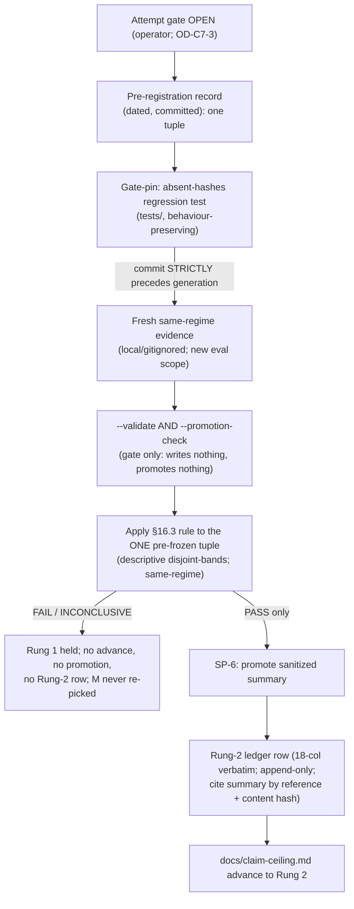

# Cycle-007 SDD — Gated Rung-2 Admission Attempt: Pre-Register, Generate Fresh Same-Regime Evidence, Apply the Verdict

> Planning artifact (SDD). Status: **DRAFT — awaiting operator acceptance + the separate Rung-2 attempt gate.**
> This SDD translates the accepted-input Cycle-007 PRD (`docs/cycles/cycle-007/01-prd.md`) into an
> implementation-level design for a **gated Rung-2 admission attempt**, while preserving every gate. **This
> `/architect` pass authorizes no implementation, generates no fresh evidence, runs no eval, chooses no numeric
> margin `M`, issues no SP-6, promotes no value, writes no Rung-2 ledger row, advances no claim ceiling, and
> applies no PASS/FAIL/INCONCLUSIVE verdict.** Code lands only through `/sprint-plan → /implement →
> /review-sprint → /audit-sprint → operator acceptance` (`docs/operator/turntrace-loop-contract.md` §1, §6;
> OA-2-class build gate), and the Rung-2 *attempt* proceeds only behind the **separate explicit operator gate**
> (`docs/cycles/cycle-006/01-prd.md` §19; `00-pre-prd-research.md` §15). **This SDD writes no sprint plan** —
> sprint shapes, task lists, boundaries, and implementation prompts are an operator-gated step *after* SDD
> review.
>
> **Sanitized note.** No raw traces, card IDs/names, deck lists, hand contents, simulator logs, PDFs/CSVs,
> `deck.csv` rows, run-dir dumps, Pokémon Elements, Daily-Top-Episode data, `cg/` SDK, or Competition Data
> appear here (CC-1/CC-2, ESP; SP-6/SP-9). **No dispersion metric values appear here. No numeric margin `M`
> is chosen or stated.** Runs are referenced by `run_id`/pattern, regimes by `regime_id`, metrics by sanitized
> *name* only, results by claim ceiling and local path/status only. The forbidden agent words
> (*strong / competitive / optimal / calibrated / complete*) and the inferential terms (*std-dev / variance /
> CI / p-value / significance / hypothesis-test / error-bar*) appear only as the negated/forbidden language
> they are.

| Field | Value |
|---|---|
| **Cycle / Type** | Cycle-007 — Software Design Document (planning artifact for a gated Rung-2 admission-attempt cycle) |
| **Status** | DRAFT — awaiting operator acceptance; next Golden-Path step is `/sprint-plan` (separately operator-gated) |
| **Date** | 2026-06-19 |
| **Binding input** | `docs/cycles/cycle-007/01-prd.md` (accepted as the architecture input for this SDD pass; OD-C7-1 posture = Option A) |
| **Build-time HEAD (citation anchor)** | `48a69fc` — *docs: close TurnTrace Cycle-006 Sprint 01* (== `origin/main`) |
| **Tracked code touched (later sprint, under a build gate)** | `analysis/evidence_summary.py` (read-only / no behaviour change expected) + `tests/test_evidence_summary.py` (one new regression check) |
| **Claim ceiling (at open)** | **Rung 1** (held until — and unless — a PASS terminal act) |
| **Ledger invariant** | `docs/ledger.md` byte-unchanged; hash `2a2f1c2dc540b6d7e7a68aad5ab3c6b109dcee4b` |

---

## 0. State verified at authoring (2026-06-19, before drafting)

Read-only `git` inspection; no mutation:

| Assumption | Result |
|---|---|
| HEAD / branch | `main` @ `48a69fcc04bd245dc62495536f8f1ce697969b27` (short `48a69fc`) — no unexpected drift |
| `docs/ledger.md` byte-unchanged | `hash-object = 2a2f1c2dc540b6d7e7a68aad5ab3c6b109dcee4b` (unchanged; the required invariant) |
| `docs/claim-ceiling.md` | unchanged; ceiling = **Rung 1** |
| `.claude/` (System Zone) | untouched; `integrity_enforcement: strict` → no HALT |
| Promotion gate present at HEAD | `analysis/evidence_summary.py` `--promotion-check` live and wired (`main:569`; `_run_promotion_check:511`; empty/absent precheck `:556` = `if not (isinstance(h, dict) and h): return 3`); block-14 (14a–14f) present in `tests/test_evidence_summary.py`; **absent-`hashes` regression test not yet pinned** (carry-forward 1) |
| Staged files | none |
| `.beads/issues.jsonl`, `grimoires/loa/NOTES.md` dirty | both modified, **unstaged** (pre-existing State-Zone housekeeping); **not staged or cleaned** by this pass |

**All assumptions hold. No finding forces a stop.** PRD acceptance, the OA-2 build gate, fresh-evidence
authorization, and the Rung-2 attempt gate are **separate operator acts** this SDD does not self-authorize.

---

## 1. Architecture overview

Cycle-007 is the project's **first gated Rung-2 admission attempt**. The PRD defines *what must hold*; this SDD
defines *how it is realized in design* across five mechanically-separable design surfaces, each with its own
gate. The design's organizing principle is **commit-order precedence**: an irreversible-into-bias act (reading
the bands) is made impossible to perform before the pre-registration that constrains it is committed to git.



**The five design surfaces (each §-mapped below):**

| # | Surface | Design § | Gate it preserves / introduces |
|---|---|---|---|
| 1 | **Attempt mechanics** — pre-registration record + commit-order precedence + anti-contamination | §2 | Commit-order: pre-registration **strictly before** fresh evidence |
| 2 | **Promotion gate** — `--validate` / `--promotion-check` as preconditions; absent-`hashes` pin | §3 | Cycle-006 gate contract (gate only; exit `0/1/2/3`; empty/absent `hashes` → exit 3) |
| 3 | **Fresh evidence** — generate fresh never-observed same-regime batch; local/gitignored | §4 | Fresh-evidence authorization; ESP-1 local-by-default |
| 4 | **Verdict application** — §16.3 rule by reference; apply to exactly one tuple | §5 | Descriptive disjoint-bands; no inferential statistic; no cross-regime |
| 5 | **Terminal PASS-gated acts** — SP-6 → Rung-2 row → ceiling advance | §6 | PASS-only; ledger append-only; ledger is the only ceiling-bearing artifact |

**What this SDD does and does not design.** It designs the *representations, validations, orderings, and
preconditions* that make a clean attempt possible and a contaminated one impossible. It does **not** choose the
candidate, the regime, the numeric `M`, `K`, the justified `n`, or the stopping rule (those are operator
decisions at the pre-registration stage, §8); it does **not** generate evidence or apply a verdict; and it does
**not** decompose the work into sprints (that is `/sprint-plan`).

---

## 2. Attempt-mechanics design (PRD C7-FR-1; §9)

### 2.1 The pre-registration record — representation

The pre-registration is a **single dated, committed, tracked artifact** under `docs/cycles/cycle-007/` (the
binding record; the PRD/SDD/sprint-plan may *reference* it). Its commit timestamp/order — not its prose — is the
load-bearing integrity property (`00-pre-prd-research.md` §6, *"the pre-registration commit must strictly
precede the evidence-generation commit"*). Design-level representation (no values chosen here):

| Field | Type / form | Constraint |
|---|---|---|
| `candidate` | one frozen `agent_version` string | exactly **one**; an *existing* frozen agent (runtime-agent lane closed, NFR-8) |
| `baseline` | `random_legal-vNNN` under the new regime | fixed; Rung 2 is defined as *"beats random-legal"* (`docs/claim-ceiling.md`) |
| `regime` | one new frozen `regime-vNNN` | a new `n`/seed-set is a **new** regime, never an edit of `regime-v001` (NFR-2/NFR-5) |
| `M` | numeric governance threshold | fixed/dated **before** any band exists; **never** against the K=20+20 set; lives **only** in this record (a governance threshold, not a dispersion value) |
| `K` | int `≥ 20` | the disjoint-bands rule consumes per-batch `min`/`max` |
| `n` | int, **justified** | explicit noise-floor reasoning (unseeded RNG; `08-funsearch-forward-compat.md` §3) |
| `stopping rule` | text | read **exactly** the pre-declared `K` batches at the pre-declared `n`; no optional stopping |

The full tuple is `(candidate, baseline, regime, M, K, n, stopping-rule)`. The verdict (§5) is applied to
**exactly this one tuple** — the PRD's "freeze the full tuple, not just `M`" tightening (PRD §11; research §7
tightening 1). **This SDD records the *shape* of the record and chooses none of its values** (PRD C7-FR-1.4).

### 2.2 Validation of the record (design level)

The record is **governance-validated, not machine-validated by a new tool** (Simplicity First — no new
dependency, no `*.schema.json`; ladder rung 1: this does not need to be built as code). The validity conditions,
each checkable by inspection at review/audit:

1. **Completeness** — all seven tuple fields present and non-empty.
2. **Singularity** — exactly one `candidate`, one `baseline`, one `regime`; no list, no "best-of".
3. **Threshold-not-value** — `M` is a governance threshold recorded here and **nowhere else tracked** (no `M`
   in PRD/SDD/sprint-plan; PRD §13). A numeric `M` appearing in any tracked artifact other than this record is
   a posture violation → HALT.
4. **Regime novelty** — `regime-vNNN` is a *new* version id, never `regime-v001` and never an edit of it.
5. **`n` justification** — the noise-floor argument is present and explicit, not assumed.

### 2.3 Commit-order precedence — enforcement / verification

The "`M` before bands" guarantee is enforced **mechanically by git commit order**, not by prose:

- The pre-registration record (§2.1) and the gate-pin (§3.2) are committed and pushed in a slice that **strictly
  precedes** any commit that touches the fresh-evidence-generation surface. The precedence is *tamper-evident*
  in history: the pre-registration commit's hash and date are earlier than the generation commit's.
- **Verification check (design level):** before any band is read, confirm `git log --oneline` shows the
  pre-registration commit ancestral to (strictly before) the generation commit; and confirm the generation
  surface was untouched at the pre-registration commit (`git show <pre-reg-commit> --stat` lists no run-dir /
  evidence path). This is the in-repo realization of the research's commit-order gate (`00-pre-prd-research.md`
  §6, §12 SP-1→SP-2 boundary).
- Because precedence is provable *within one cycle* by commit order, the conservative split (research Option C,
  a full cycle boundary) is **not required** by the design — Option A's intra-cycle commit-order gate is
  sufficient (`00-pre-prd-research.md` §12). *(A-vs-C remains an operator decision; the design supports A.)*

### 2.4 Anti-contamination — how the design forecloses each failure mode

The design makes each contamination class **structurally impossible or commit-order-detectable**, not merely
discouraged:

| Contamination | Foreclosed by (design mechanism) |
|---|---|
| **Post-hoc `M`** | §2.3 commit-order: `M` is committed in the pre-registration *before* any generation commit; reading bands cannot precede the record. `M` never fixed against K=20+20 (§4.4). |
| **Candidate swapping** | §2.1 exactly one `candidate`; §2.2 singularity check; the verdict (§5) binds to the one pre-declared tuple — a different candidate is a different (uncommitted, hence invalid) tuple. |
| **Best-of-N selection** | §2.1 singularity: no list of candidates exists to select from; the runtime-agent lane is closed (NFR-8), so no candidate is *built* to compete. |
| **Optional stopping** | §2.1 stopping rule pre-declared; §4.3 reads exactly the pre-declared `K` at the pre-declared `n`; INCONCLUSIVE remediation = a **new** pre-declared batch, never an extension (§5.3, PRD C7-FR-6.2). |
| **Batch-padding** | same as optional stopping: the batch size is frozen in the record; no appending until a margin appears. |
| **Old-evidence reuse** | §4.4: the existing K=20+20 set is historical context only — excluded from both verdict use and `M` selection; the fresh batch is under a *new* `regime-vNNN`, so the old bands are not even same-regime-comparable. |
| **Cross-regime comparison** | §4.1 single frozen `regime-vNNN`; the validator + `--promotion-check` hard-refuse mixed regimes (exit 2, §3.1); `regime-v002` vs `regime-v001` is barred (NFR-2). |

---

## 3. Promotion-gate design (PRD C7-FR-2, §10; §3.1–§3.3 below)

### 3.1 The Cycle-006 gate contract — preserved verbatim, at HEAD `48a69fc`

`--promotion-check` is **already live and audited** at HEAD (`docs/cycles/cycle-006/07-closeout.md`). Cycle-007
**relies on it unchanged**; the design preserves its full contract. Anchors at `48a69fc` (NFR-10: `/implement`
re-validates every anchor against the build-time HEAD before coding):

| Surface | Location (`48a69fc`) | Contract Cycle-007 preserves |
|---|---|---|
| CLI dispatch + `--promotion-check` arg | `main` `:569`; arg `:582`; precedence note `:594` | promotion-check checked before `--validate` (stricter wins); no change |
| Promotion-check driver | `_run_promotion_check` `:511` | re-reads JSON from disk; full validator wholesale; **writes nothing, promotes nothing** (`:516-517`) |
| Read-failure | `:526`, `:529` → exit 1 | input failure → exit 1 (unchanged) |
| Single-regime guard | `:531-537` → exit 2 | mixed-regime → exit 2 (NFR-2; unchanged) |
| Full hardened validator | `validate_summary` `:394`; violations → exit 3 `:546` | forbidden field/value/word, inferential term, cross-regime marker, non-digest `hashes` → exit 3 (unchanged) |
| Empty/absent-`hashes` precheck | `:556` `if not (isinstance(h, dict) and h): return 3` | empty `{}` **and** absent-key → exit 3 (CF-1 / OD-C5-2 floor) |
| Gate pass | `:566` → exit 0 | exit 0 only when clean **and** `hashes` non-empty digest map |
| Generate-mode empty-`hashes` WARNING | `:622` → exit 0 | preserved (C4; unchanged) |
| `--validate` empty/absent-`hashes` acceptance | `validate_summary` returns `[]`; `_run_validate` `:479` exit 0 | preserved — the precheck is promotion-only |
| Exit-code set | `0/1/2/3` (`:486,489,496,504,508` for validate; `:526,529,537,546,560,566` for promotion-check) | preserved; no new exit code |

**Binding (PRD C7-FR-2.3 / §10.3):** Cycle-007 introduces **no change** to `--promotion-check`, `--validate`, or
generate mode. `--promotion-check` remains a **gate only** — it writes nothing, promotes nothing, never writes
`docs/ledger.md` or any tracked `docs/` path, and the `0/1/2/3` contract and `--validate` / generate-mode
behaviour stay byte-identical. Any behaviour change to these modes is a posture violation → HALT.

### 3.2 The absent-`hashes` regression test — the one sanctioned code change

The **only** sanctioned tracked-code change in Cycle-007 is a regression-test pin (PRD C7-FR-2.1, G2; research
§8). Grounding: block-14 check `14b` exercises **empty** `hashes` (`{}`, `:390-398`), but **no** check constructs
an **absent**-key summary (`del summary["hashes"]`). The absent branch is structurally covered by the precheck's
`isinstance(h, dict)` guard at `:556` (a missing key → `dict.get(...) → None` → `isinstance(None, dict)` is
`False` → exit 3) and was verified manually at review/audit — but it is **not pinned by a dedicated test**, and
Cycle-007 is the first time the gate is relied on in a *real* promotion.

**Design of the pin (test-only; behaviour-preserving):**

- Location: a new check (e.g. `14b''`) in `tests/test_evidence_summary.py`, immediately adjacent to the existing
  empty-`hashes` checks (`:389-403`), reusing the existing harness — `check()` `:36`,
  `make_run_dir(..., manifest_hash="")` `:49-51`, `promotion_check_file_exit()` `:83-91`, the `good` fixture,
  `_HEX64` `:33`. Stdlib-only synthetic fixtures; no K-batch, no raw Competition Data, no run-dir dependency.
- Assertion: build a structurally-valid summary, **delete the `hashes` key entirely** (`del summary["hashes"]`),
  drive `--promotion-check` → **exit 3** (fail-closed). Optionally (carry-forward 2, cheap-to-bundle) an exit-1
  (unreadable input) and a both-flags-precedence check.
- **Conservative-only / preservation obligation:** the new check adds a *test*, not behaviour. All existing
  **12 + block-13 + block-14** checks stay green; `tests/test_import_direction.py` stays green (no new import);
  `eval/hygiene_check.py` stays exit 0 on the two tracked artifacts. `analysis/evidence_summary.py` is expected
  to need **no source change** — the absent branch already passes; the pin closes a *test* gap, not a *code*
  gap. *(If `/implement` discovers the absent branch does not in fact reach exit 3 at build-time HEAD — it
  does at `:556` today — that is a finding for review, not a silent fix.)*
- Lands through `/implement → /review-sprint → /audit-sprint → operator acceptance` like any code, under the
  OA-2 build gate (OD-C7-2), scoped to `tests/` (and `analysis/` only if a real gap is found).

> `[design] → skipped: a second exit-1/precedence test (carry-forward 2, optional); add when bundling is cheap.`

### 3.3 How the gate is invoked as a precondition

The promoted candidate summary MUST pass **both** `--validate` **and** `--promotion-check` before any Rung-2 row
is written (PRD C7-FR-2.2 / §10.2). Design-level invocation order:

1. `python analysis/evidence_summary.py --validate <candidate-summary.json>` → must exit 0 (structurally
   valid, sanitized, single-regime).
2. `python analysis/evidence_summary.py --promotion-check <candidate-summary.json>` → must exit 0 (all of
   `--validate`'s checks **plus** non-empty digest `hashes`). A silently empty/absent `hashes` is fatal here
   (exit 3) precisely because the Rung-2 row cites the summary **by reference + content hash** (§6.2;
   `06-rung-2-ledger-convention.md` §3) — an un-stamped summary cannot be cited.
3. Only after **both** exit 0, and only on a PASS verdict (§5), may the terminal acts (§6) begin.

`--promotion-check` is the **integrity precondition named in the §16.3 PASS criterion** (*"passes `--validate`
and `--promotion-check`"*). It gates; it does not promote.

---

## 4. Fresh-evidence design (PRD C7-FR-3, §9; §4.1–§4.5 below)

### 4.1 Same-regime fresh batch under a new frozen `regime-vNNN`

A fresh, **never-observed** `K ≥ 20` same-regime batch is generated under a **new** frozen `regime-vNNN`, with
**baseline and candidate under the same regime** (PRD C7-FR-3.1; research §5). The generation surface already
exists at HEAD: `build_summary(run_dirs)` (`analysis/evidence_summary.py:137`) reads each run dir's
`manifest.json` **first** (the regime authority, `:112-124`) then `match_results/*` via `aggregate.aggregate_run`
(`:169`), hard-refusing mixed regimes (the single-regime guard, exit 2). **Re-running the two frozen agents
(baseline + candidate) under a new regime to produce fresh run dirs is eval scope (NG12-class), not
agent-building** (NFR-8) — the candidate is an existing frozen agent.

The summary the generator emits conforms to the Cycle-003 schema
(`04-evidence-summary-schema-spec.md`): single `regime_id`; per-metric the seven descriptive statistics only
(`count · min · max · range · mean · median · spread`, `:73`); the two mandatory framing strings; a non-empty
`hashes` digest map (the integrity stamp); and the Rung-1 footer (*"carries no ceiling of its own"*, §2.4). The
disjoint-bands verdict (§5) consumes per-batch `min`/`max` across the `K ≥ 20` batches.

### 4.2 Generated evidence stays local/gitignored by default

`runs/*/` is gitignored (`.gitignore`: *"Generated run trees are LOCAL evidence by default (ESP-1) … NEVER
committed unless the operator explicitly approves a sanitized subset"*). The design **inherits this**:

- The fresh run dirs (`match_results/`, `traces/`, `manifest.json`, `hashes.txt`, dispersion outputs) are
  generated under `runs/<run_id>/…` and stay local — no tracked path receives raw run content (PRD C7-FR-3.4;
  NFR-4).
- The evidence summary itself is written to a **local path** (the `--out <local-path>` generate option, never a
  tracked `docs/` path; the C3 `_refuse_tracked_out` guard `:451` refuses a tracked `--out`). It is promoted to
  tracked status **only** by SP-6 on PASS (§6.1).
- New `run_id`s continue the ledger pattern (`run-0003`+), assigned at generation time; this SDD assigns none.

### 4.3 `K`, `n`, and the stopping rule enforced once pre-registered

Once `(K, n, stopping-rule)` are fixed in the pre-registration (§2.1):

- **Read exactly the pre-declared `K` batches at the pre-declared `n`** (PRD C7-FR-3.2). No K=50 top-up, no
  expansion of any already-observed batch, **no optional stopping / batch-padding**.
- The **justified `n`** must clear the unseeded RNG noise floor: runs are unseeded
  (`seed_controlled=false`, surfaced in the generator framing string `:94`); observed dispersion conflates
  agent behaviour with simulator RNG (`08-funsearch-forward-compat.md` §3); the evaluator averages over enough
  matches/batches to clear the floor before a per-candidate scalar is stable. If the floor is not cleared at the
  pre-declared `n`, the verdict is **INCONCLUSIVE** (an admissibility failure, §5.3), not a re-pick of `n`.

### 4.4 K=20+20 excluded from verdict use and from `M` selection

The existing **K=20+20** set (the Cycle-004 local exercise over sealed run dirs, hence already observed) is
**historical context only** (PRD §9; research §5):

- It **may not be the verdict basis** — the verdict runs on the fresh never-observed batch only.
- It **may not be used to choose `M`** — fixing `M` against an already-observed set is post-hoc thresholding, the
  in-house analogue of **FM-11** (contaminated evidence).
- It is **not same-regime-comparable** to the fresh batch anyway: the fresh batch is under a *new*
  `regime-vNNN`, and `regime-v002`-vs-`regime-v001` comparison is barred (NFR-2). This makes old-evidence reuse
  not just forbidden but structurally inadmissible through the single-regime guard.

### 4.5 Provenance / audit-trail intact

Every fresh run carries the provenance the gate gates on (PRD C7-FR-3.3; criterion 4): source-hash provenance,
per-decision canonical traces, `trace_hash`, regime-tuple stamp. The summary's `hashes` map is the
non-empty digest stamp `--promotion-check` requires (§3.1). Incomplete provenance/hashes → the gate fails
(exit 3) → the verdict is **INCONCLUSIVE** (§5.3), never a PASS.

---

## 5. Verdict-application design (PRD C7-FR-4, §11; §5.1–§5.4 below)

### 5.1 The rule, imported by reference (no drift)

The PASS / FAIL / INCONCLUSIVE criteria and fail-state language are **imported by reference** from
`docs/cycles/cycle-006/01-prd.md` §16.3 (PRD §11). **This SDD authors no competing wording.** The §16.3 rule
binds: under the ratified **8a descriptive disjoint-bands** rule — *candidate `min` > baseline `max` by ≥ `M`
across the fresh `K ≥ 20` same-regime batch* — expressed in the allowed descriptive vocabulary only, with **no
inferential statistic and no cross-regime comparison** (NFR-2, NFR-3; the validator *rejects* inferential terms,
`04-evidence-summary-schema-spec.md` §3).

### 5.2 The PRD tightenings, carried into the design

The three research §7 tightenings (PRD §11) are carried as design constraints, not re-authored:

1. **Freeze the full tuple** — the verdict applies to exactly the one pre-declared
   `(candidate, baseline, regime, M, K, n, stopping-rule)` (§2.1); no candidate swap / best-of-N (§2.4).
2. **No optional stopping** — read exactly the pre-declared batch (§4.3); INCONCLUSIVE remediation = a **new**
   pre-declared batch, never an extension (§5.3).
3. **INCONCLUSIVE = admissibility failure** — scoped to noise-floor-not-cleared / incomplete provenance /
   failing gate (§5.3), not "bands neither cleanly disjoint nor not."

### 5.3 Applying the verdict to exactly one pre-declared tuple

The verdict is applied **once**, to the one tuple of §2.1, on the fresh batch of §4:

- **PASS** requires *all* of (PRD C7-FR-4.2): the margin met under the pre-registered `M`
   (*candidate `min` > baseline `max` by ≥ `M`* across the `K ≥ 20` same-regime batch); the summary passes
   `--validate` **and** `--promotion-check` (§3.3); provenance/audit-trail intact (§4.5); the justified-`n` /
   noise-floor argument satisfied (§4.3).
- **FAIL** — the margin is **not** met → honest negative at Rung 1 (§5.4).
- **INCONCLUSIVE** — an *admissibility* precondition unmet (`n` insufficient to clear the noise floor; incomplete
   provenance/hashes; `--promotion-check` fails) → no advance, no promotion; remediate by generating a **new**
   pre-declared batch under the **same** `M`/rule (§4.3), never an extension and never a post-hoc `M`.

The verdict is recorded as a **same-regime TurnTrace descriptive delta**, never episode-derived (NFR-7 / FM-11);
**no forbidden agent word is applied even on a PASS** (NFR-3).

### 5.4 FAIL / INCONCLUSIVE advance nothing (hard)

On FAIL or INCONCLUSIVE (PRD C7-FR-6, G6): **no ceiling advance, no promotion, no Rung-2 row**; the descriptive
result is recorded honestly at **Rung 1**; `docs/ledger.md` stays byte-unchanged at `2a2f1c2…`;
`docs/claim-ceiling.md` stays unchanged; **`M` and the rule are never relaxed or re-picked** to manufacture a
PASS. A FAIL/INCONCLUSIVE is a non-regressive, valid outcome — the harness producing an honest negative is a
success, not a defect.

---

## 6. Terminal PASS-gated acts (PRD C7-FR-5, §9 of research; §6.1–§6.4 below)

The three terminal acts are **separate explicit operator acts**, in order, **only on PASS, and only after both
`--validate` and `--promotion-check` pass** (§3.3). **None** before the gate passes; **none** on
FAIL/INCONCLUSIVE.

```
PASS verdict  →  --validate AND --promotion-check both exit 0
              →  SP-6 (promote the sanitized summary; §6.1)
              →  Rung-2 ledger row (cite summary by reference + content hash; claim_ceiling advanced; §6.2)
              →  docs/claim-ceiling.md advance to Rung 2 (§6.3)
   (each a SEPARATE operator act; NONE before the gate passes; NONE on FAIL/INCONCLUSIVE)
```

### 6.1 SP-6 — promote the sanitized summary

On PASS only, the operator issues **SP-6** to promote the **sanitized** evidence summary from local/gitignored to
tracked status: reference + content hash + sanitized metric *names* only — **never raw content** (SP-6 / ESP /
reference-not-embed; §7). The promoted artifact carries the seven descriptive statistics and the framing
strings (§4.1); it carries **no ceiling of its own** (`04-evidence-summary-schema-spec.md` §1, §2.4).

### 6.2 The Rung-2 ledger row — convention preserved

On PASS only, after SP-6, the operator writes the **Rung-2 ledger row** (`06-rung-2-ledger-convention.md`):

- **Existing 18-column schema verbatim** — `date · run_id · regime_id · git_rev · sim_version · agent_version ·
  opponent_pool_ref · seed_set_ref · games (n) · win_rate · illegal_action_rate · timeout_rate · error_rate ·
  avg_turns · mode · hypothesis · claim_ceiling · notes` (`06-rung-2-ledger-convention.md` §1). **No new column**
  — the better/worse verdict lives in the existing narrative fields (`hypothesis` / `notes` / `claim_ceiling`);
  there is **no `verdict` column** (§2 of the convention).
- **Append-only; never edit a past row** (`docs/ledger.md` is append-only). The two existing Rung-1
  `regime-v001` rows are untouched.
- **Cite the promoted summary by reference + content hash** in `notes` — never embed raw content (§3 of the
  convention; the row cites the SP-6-promoted summary).
- **Same-regime, agent-only** comparison carrying an explicit `n`/`games` and `K`, with `claim_ceiling` = the
  advanced rung. Never cross-regime.

### 6.3 `docs/claim-ceiling.md` advance

On PASS only, as a **deliberate separate operator decision** (criterion 5), `docs/claim-ceiling.md` advances to
Rung 2. The **ledger remains the only ceiling-bearing artifact**; `claim-ceiling.md` states the standing posture
that bounds every ledger row; the summary carries no ceiling (PRD C7-FR-5.2;
`04-evidence-summary-schema-spec.md` §1; `06-rung-2-ledger-convention.md` §3).

### 6.4 Ordering and gating are hard

The order (SP-6 → row → ceiling) and the PASS+gate precondition are **hard** (PRD C7-FR-5.3). Out-of-order
execution, or any terminal act before the gate passes or on a FAIL/INCONCLUSIVE, is a posture violation → HALT.
**This SDD takes none of these acts and chooses no values for any field of the row.**

---

## 7. Sanitization & data-boundary design (PRD §13, NFR-4)

The standing hygiene rules are **preserved or strengthened, never weakened** (PRD §13; NFR-4;
`docs/operator/turntrace-loop-contract.md` §7-§8):

- **Out of tracked docs (never embedded):** raw traces, simulator logs, deck lists, card IDs/names, Pokémon
  Elements, Competition Data, Daily Top Episodes, run-dir dumps, PDFs/CSVs, `deck.csv`, and `cg/` — all kept
  local under gitignored paths (`grimoires/loa/context/`, `runs/*/`, plus the defense-in-depth `cg/` /
  `deck.csv` / `*.pdf` patterns in `.gitignore`).
- **In tracked docs (reference-only):** `run_id`s, content hashes, sanitized metric *names*, local path/status,
  and references — never raw content (SP-6 / ESP). The **only** numeric `M` lives in the dated pre-registration
  record (a governance threshold; §2.1).
- **Local-by-default:** generated evidence (run dirs + the summary) stays local/gitignored (ESP-1, §4.2) unless
  **explicitly promoted by SP-6 on PASS** (§6.1).
- **Hygiene checks preserved/strengthened:** `eval/hygiene_check.py` remains the mechanical **path-based**
  staging gate (refuses `cg/`, `deck.csv`, `*.pdf`, `grimoires/loa/context/`, `runs/<run_id>/…`); the validator
  + `--promotion-check` remain **content-based**, **parity-or-stricter** with it
  (`05-generator-validator-shape.md` §2.5). The two gates compose: path-based at staging, content-based on the
  summary. **No hygiene check is weakened.**

---

## 8. Open operator decisions — explicitly *not* decided here

This SDD identifies the decisions and designs the seams; it makes **none** of them. Each is an operator decision
at its proper stage (PRD §15; research §15). **This SDD chooses no candidate, regime, `M`, `K`, `n`, or stopping
rule, authorizes no fresh evidence, opens no gate, and takes no terminal act.**

| ID (PRD) | Decision | Stage | This SDD |
|---|---|---|---|
| OD-C7-1 | Accept the PRD (Option A posture) | Before SDD | Treated as accepted input; not re-decided |
| OD-C7-2 | Open the OA-2 build gate (gate-pin scope) | After SDD/sprint-plan | Not opened here |
| OD-C7-3 | Open the **Rung-2 attempt gate** | Before evidence | Not opened here |
| OD-C7-4 | Candidate identity (+ baseline confirm) | In pre-registration | Not chosen (§2.1 shape only) |
| OD-C7-5 | New `regime-vNNN` | In pre-registration | Not chosen (§2.1 constraint only) |
| OD-C7-6 | Numeric `M` mechanics & location | In pre-registration | **No `M` chosen** (§2.1; §7) |
| OD-C7-7 | `K`, justified `n`, stopping rule | In pre-registration | Not chosen (§2.1; §4.3) |
| OD-C7-8 | Verdict-rule tightenings confirmed | Before evidence | Carried by reference (§5.2); not re-authored |
| OD-C7-9 | Fresh-evidence authorization | Before generation | Not authorized here (§4) |
| OD-C7-10 | Terminal PASS-gated acts (SP-6 / row / ceiling) | On PASS only | Not taken here (§6) |

---

## 9. Sanitization & claim-ceiling constraints (held by this SDD)

- **Claim-ceiling invariance until PASS (hard, NFR-5).** `docs/ledger.md` byte-unchanged at
  `2a2f1c2dc540b6d7e7a68aad5ab3c6b109dcee4b`; `docs/claim-ceiling.md` unchanged; **Rung 1 held**; the ledger
  remains the only ceiling-bearing artifact; the summary carries no ceiling of its own.
- **Stdlib-only / analysis-only (NFR-3 of Cycle-006-class; PRD §16.3 invariant).** No new third-party
  dependency, no `*.schema.json`, no second validator module, no promotion mode that writes a tracked path. The
  one sanctioned code change is a **test** (§3.2). **No new dependency is justified** — the pre-registration is
  governance-validated by inspection (§2.2) and the gate already exists (§3.1); stdlib meets every requirement.
- **Claim safety (NFR-3).** Forbidden agent words negated-only; no inferential result produced; OD-6 unrelaxed;
  no cross-regime comparison.
- **Simulator-authoritative (NFR-6 / SP-8 / FM-10).** Any verdict-relevant logic follows the simulator-offered
  legal options and the simulator terminal result; record any divergence as a simulator-behaviour note, not an
  agent failure.
- **No episode/Kaggle proof (NFR-7 / SP-9 / FM-11).** No Daily-Top-Episodes or Kaggle episode ingest; episodes
  are hypothesis-only; the verdict is a same-regime TurnTrace descriptive delta, never episode-derived.
- **Zone discipline (NFR-9).** Tracked code is App Zone (`analysis/`, `tests/`); planning artifacts are
  Docs/State Zone; `.claude/` is never touched; the pre-existing dirty State-Zone files (`.beads/issues.jsonl`,
  `grimoires/loa/NOTES.md`) stay unstaged and uncleaned.
- **Citation revalidation (NFR-10).** Every `:line` anchor in §3.1 / §3.2 / §4 MUST be re-validated against the
  build-time HEAD before coding — anchors accurate now may desync if files move.

---

## 10. Risk register (design-level)

| ID | Risk | Mitigation (design-level) |
|---|---|---|
| R1 | **Post-hoc `M`** | §2.3 commit-order precedence: `M` committed in the pre-registration strictly before any generation commit; never against K=20+20 (§4.4). |
| R2 | **Candidate-selection contamination** (best-of-N / forking paths) | §2.1 exactly one candidate; §2.4 singularity; runtime-agent lane closed (NFR-8) ⇒ candidate is an existing frozen agent. |
| R3 | **Old-evidence contamination** | §4.4: K=20+20 historical-only, excluded from verdict and `M`; fresh batch under a new regime is not even same-regime-comparable. |
| R4 | **Unseeded noise / insufficient `n`** | §4.3 justified `n` + noise-floor reasoning; no optional stopping; INCONCLUSIVE if floor not cleared (§5.3). |
| R5 | **Cross-regime comparison** | §4.1 one frozen `regime-vNNN`; single-regime guard exit 2 (§3.1); new `n` = new regime, never an edit. |
| R6 | **Promotion before gate** | §6 SP-6 + row + ceiling only on PASS, only after `--validate` + `--promotion-check` pass; never on FAIL/INCONCLUSIVE. |
| R7 | **Ledger / claim-ceiling drift** | §9 NFR-5: `docs/ledger.md` byte-unchanged at `2a2f1c2…` until the PASS row (append-only); `docs/claim-ceiling.md` unchanged until a PASS advance; `git diff --exit-code` at every sprint boundary. |
| R8 | **Raw data leakage** | §7: no raw data in tracked docs; `eval/hygiene_check.py` staging gate; validator + `--promotion-check` parity-or-stricter; evidence local/gitignored. |
| R9 | **Gate behaviour drift** | §3.1: `--promotion-check` / `--validate` / generate mode byte-unchanged; the only code change is a test (§3.2); 12 + block-13 + block-14 stay green. |
| R10 | **Gate-trust gap** (absent-`hashes` untested) | §3.2: add the absent-`hashes` regression test before the gate gates the real promotion. |
| R11 | **Scope creep** (runtime-agent / FunSearch / gameplay / inferential / cross-regime / episode) | §11 non-goals; NFR-7/NFR-8; candidate is an existing frozen agent; re-running it to generate evidence is eval scope, not agent-building. |
| R12 | **Optional stopping / batch-padding** | §2.4 / §4.3: pre-register `K`/`n`/stopping rule; read exactly the pre-declared batch; remediation = a new pre-declared batch. |
| R13 | **Premature execution** (M chosen / evidence generated / terminal act before the gate) | §0/§8: PRD acceptance, build gate, fresh-evidence gate, and Rung-2 attempt gate are separate operator acts; HALT if any execution act is attempted out of order. |
| R14 | **Citation rot** | §9 NFR-10: `/implement` re-validates every `:line` anchor at build-time HEAD before coding. |

---

## 11. Implementation boundaries & explicit non-goals

**Boundaries (the later sprint MUST stay inside these).**
- Tracked code touched: `tests/test_evidence_summary.py` (one new regression check; §3.2) — and
  `analysis/evidence_summary.py` **only if** `/implement` finds a real gap (none expected; the absent branch
  passes at `:556` today).
- The pre-registration record + fresh-evidence generation + verdict + terminal acts are governance/eval/ledger
  acts, each behind its own operator gate (§8).
- App Zone code (`analysis/`, `tests/`); planning artifacts are Docs/State Zone; `.claude/` never touched;
  pre-existing dirty State-Zone files stay unstaged and untouched (NFR-9).

**Explicit non-goals (Cycle-007 does NOT do any of these; carried from PRD §6, §16.3, NFR-2/3/7/8).**
- **No runtime-agent work; no gameplay-heuristic work.** The candidate is an existing frozen agent.
- **No FunSearch, RL, self-play, deck-optimizer, value/win-probability model, search/MCTS,
  tournament/leaderboard, or dashboard work.**
- **No OD-6 relaxation; no inferential statistic computed** (the seven descriptive statistics are the entire
  statistical surface).
- **No cross-regime comparison; no edit of `regime-v001`.**
- **No Daily-Top-Episodes or Kaggle episode ingest; no episode-derived improvement claim.**
- **No new third-party dependency, no `*.schema.json`, no second validator module, no promotion mode that
  writes a tracked path, no new exit code.**
- **No change** to `--promotion-check`, `--validate`, or generate-mode behaviour (§3.1).
- **No numeric `M`** in any tracked artifact except the dated pre-registration record; **no `M` chosen in this
  SDD**.
- **No fresh evidence generated, no eval run, no K=50 top-up, no batch expansion** in this SDD.
- **No SP-6, no value promoted, no Rung-2 ledger row, no claim-ceiling advance, no verdict applied** in this
  SDD.
- **No `.claude/` edit; no State-Zone cleanup; no staging / commit / push.**

---

## 12. SDD decisions table

| ID | Decision | Resolution |
|---|---|---|
| SD-C7-1 (pre-registration form) | dedicated dated tracked record vs scattered fields | **One dated, committed, tracked record** under `docs/cycles/cycle-007/`; commit strictly precedes generation; governance-validated by inspection, not a new tool. (§2.1–§2.3) |
| SD-C7-2 (commit-order enforcement) | prose assertion vs git-order gate | **Git commit-order gate** — pre-registration commit ancestral to the generation commit; tamper-evident; Option-A intra-cycle gate sufficient (Option C optional, operator's). (§2.3) |
| SD-C7-3 (gate-pin scope) | code change vs test-only | **Test-only** — add an absent-`hashes` (`del summary["hashes"]`) check in `tests/`; the source branch already passes at `:556`; no behaviour change. (§3.2) |
| SD-C7-4 (gate reuse) | modify the gate vs reuse verbatim | **Reuse `--promotion-check` verbatim** at `48a69fc`; gate only; `0/1/2/3` and `--validate`/generate behaviour preserved. (§3.1) |
| SD-C7-5 (verdict wording) | re-author vs import by reference | **Import §16.3 by reference**; carry the three tightenings as constraints, not re-authored prose. (§5.1–§5.2) |
| SD-C7-6 (fresh-evidence storage) | tracked vs local/gitignored | **Local/gitignored by default (ESP-1)**; summary to a local path; promoted only by SP-6 on PASS. (§4.2, §6.1) |
| SD-C7-7 (dependencies) | add a tool vs stdlib-only | **Stdlib-only**; no new dependency / `*.schema.json` / second module justified — governance validation + the existing gate meet every requirement. (§9) |
| Reaffirmed (operator-gated) | candidate / regime / `M` / `K` / `n` / stopping rule / fresh evidence / SP-6 / row / ceiling | **Not chosen / not authorized / not written / not advanced** — none in this SDD. (§8) |

---

## 13. Sprint-plan handoff (boundary only — no sprint design here)

`/sprint-plan` consumes this SDD to produce `docs/cycles/cycle-007/03-sprint-plan.md` **as a separate
operator-gated step after SDD review**. This SDD deliberately authors **no** sprint shape, task list, sprint
boundary, or implementation prompt. The handoff names only the design surfaces (§2–§6) and their gates; the
sprint planner decomposes them under the operator's gates. The build gate (OD-C7-2) and the Rung-2 attempt gate
(OD-C7-3) are separate operator acts this SDD does not open. `/implement` re-validates every `:line` anchor
(§3.1, §3.2, §4) against the build-time HEAD before coding (NFR-10).

> **Sources:** `docs/cycles/cycle-007/01-prd.md` (binding architecture input; Option A posture; FRs C7-FR-1…6;
> goals G1…G7; NFRs; §9 contamination posture; §11 verdict-by-reference; §13 evidence-storage; §15 operator
> decisions; §16.3 hard invariants); `grimoires/loa/a2a/cycle-007/00-pre-prd-research.md` (gitignored State-Zone
> research input; §3 five-criteria audit; §4 candidate identity; §5 fresh-evidence shape; §6 `M`
> pre-registration; §7 PASS/FAIL/INCONCLUSIVE + tightenings; §8 gate use; §9 promotion/ledger/ceiling order;
> §12 SP-boundary precedence); `docs/cycles/cycle-006/01-prd.md` §16.3 (pre-registered verdict rule — imported
> by reference); `docs/cycles/cycle-006/02-sdd.md` §8–§10 (`M` procedure; fresh-evidence batch design; gate
> design) and `07-closeout.md` (gate live/audited; carry-forwards; §9 Cycle-007 handoff gate);
> `docs/cycles/cycle-003/04-evidence-summary-schema-spec.md` (§2 safe seven-statistic vocabulary + two framing
> strings; §3 forbidden classes; summary carries no ceiling); `05-generator-validator-shape.md` (§2 single-regime
> exit 2 / `0/1/2/3` contract / hygiene parity; NG12 no eval runs); `06-rung-2-ledger-convention.md` (§1
> 18-column schema verbatim; §2 same-regime agent-only verdict, no `verdict` column; §3 row cites summary by
> reference + content hash; §4 append-only, ledger byte-unchanged); `07-od6-criterion-2-proposal.md` (disjoint-
> bands rule; pre-registration procedure); `08-funsearch-forward-compat.md` §3 (unseeded noise floor / justified
> `n`; NG7/NG8/NG10 runtime-agent lane closed); `docs/cycles/cycle-002/04-rung-2-readiness-criteria.md` §2 (five
> conjunctive criteria); `docs/operator/turntrace-loop-contract.md` (§1 loop; §6 OA-2 build gate; §7-§8
> hygiene/claim language); `docs/ledger.md` (two Rung-1 `regime-v001` rows; hash `2a2f1c2…`);
> `docs/claim-ceiling.md` (Rung 1; forbidden words; never compare across regimes); `docs/failure-modes.md`
> (FM-10 simulator-vs-official mismatch; FM-11 contaminated evidence); `analysis/evidence_summary.py` @
> `48a69fc` (`main:569`; `_run_promotion_check:511`; empty/absent precheck `:556`; `validate_summary:394`;
> `_collect_regime_ids:425`; `_refuse_tracked_out:451`; `build_summary:137`; exit set `0/1/2/3`);
> `tests/test_evidence_summary.py` @ `48a69fc` (`check:36`; `make_run_dir:49`; `promotion_check_file_exit:83`;
> block 14 14a–14f `:382-444`; absent-`hashes` regression test **not yet pinned** — carry-forward 1);
> `.gitignore` (ESP-1 `runs/*/` local-by-default; `cg/` / `deck.csv` / `*.pdf` defense-in-depth). Current main
> at authoring: `48a69fc`. Claim ceiling: **Rung 1 (unchanged).** This SDD opens no build gate, builds no code,
> writes no sprint plan, generates no evidence, runs no eval, chooses no `M`, applies no admission verdict,
> issues no SP-6, promotes no value, writes no Rung-2 row, advances no ceiling, mutates no ledger, and edits no
> `.claude/`. **The Rung-2 attempt proceeds only behind a separate explicit operator gate.**

---

> **SDD statement (binding).** Cycle-007 is a **gated Rung-2 admission attempt** (research Option A) translated
> here into implementation-level design across five gated surfaces — attempt mechanics (§2), the promotion gate
> (§3), fresh evidence (§4), verdict application (§5), and the terminal PASS-gated acts (§6) — with every gate
> preserved. The pre-registration freezes the full tuple (one frozen candidate, `random_legal` baseline under a
> new frozen `regime-vNNN`, `M`, `K`≥20, justified `n`, stopping rule) in a dated record whose commit **strictly
> precedes** any fresh-evidence generation; the §16.3 verdict rule is imported by reference and applied to
> exactly that one tuple; FAIL/INCONCLUSIVE advance no ceiling, promote no value, write no Rung-2 row, and never
> re-pick `M`; and SP-6 → Rung-2 row → ceiling advance occur only on PASS, only after `--validate` and
> `--promotion-check` pass, each a separate operator act. **This `/architect` pass chose no `M`, generated no
> evidence, ran no eval, issued no SP-6, wrote no Rung-2 row, advanced no ceiling, applied no verdict, and wrote
> no sprint plan.** `docs/ledger.md` remains byte-unchanged at
> `2a2f1c2dc540b6d7e7a68aad5ab3c6b109dcee4b`; `docs/claim-ceiling.md` is unchanged; `.claude/` is untouched; the
> pre-existing dirty State-Zone files are left unstaged and uncleaned.
