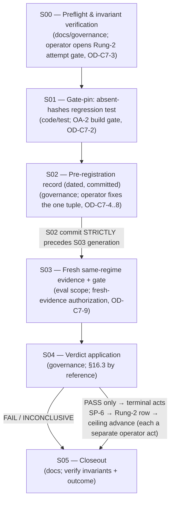
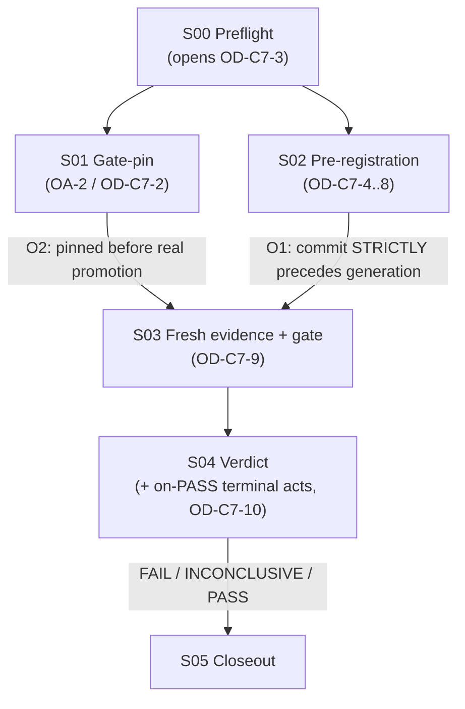

# Cycle-007 Sprint Plan — Gated Rung-2 Admission Attempt: Pre-Register, Pin the Gate, Generate Fresh Same-Regime Evidence, Apply the Verdict

> Planning artifact (Sprint Plan). Status: **DRAFT — awaiting operator acceptance.** This plan decomposes the
> accepted-input Cycle-007 PRD (`docs/cycles/cycle-007/01-prd.md`) and SDD (`docs/cycles/cycle-007/02-sdd.md`)
> into gated, reviewable sprints **while preserving every gate**. **This `/sprint-plan` pass authorizes no
> implementation, generates no fresh evidence, runs no eval, chooses no numeric margin `M`, picks no
> candidate / regime / `K` / `n` / stopping rule, opens no Rung-2 attempt gate, opens no OA-2 build gate, issues
> no SP-6, promotes no value, writes no Rung-2 ledger row, advances no claim ceiling, and applies no
> PASS/FAIL/INCONCLUSIVE verdict.** It writes exactly one artifact (this file) and creates no implementation
> prompts. Each sprint lands only through `/implement → /review-sprint → /audit-sprint → operator acceptance`
> (`docs/operator/turntrace-loop-contract.md` §1, §3, §6), behind the operator gates the PRD/SDD/research require.
>
> **Sanitized note.** No raw traces, card IDs/names, deck lists, hand contents, simulator logs, PDFs/CSVs,
> `deck.csv` rows, run-dir dumps, Pokémon Elements, Daily-Top-Episode data, `cg/` SDK, or Competition Data appear
> here (CC-1/CC-2, ESP; SP-6/SP-9). **No dispersion metric values appear here. No numeric margin `M` is chosen or
> stated.** Runs are referenced by `run_id`/pattern, regimes by `regime_id`, metrics by sanitized *name* only,
> results by claim ceiling and local path/status only. The forbidden agent words (*strong / competitive /
> optimal / calibrated / complete*) and the inferential terms (*std-dev / variance / CI / p-value /
> significance / hypothesis-test / error-bar*) appear only as the negated/forbidden language they are.

| Field | Value |
|---|---|
| **Cycle / Type** | Cycle-007 — Sprint Plan (planning artifact for a gated Rung-2 admission-attempt cycle) |
| **Status** | DRAFT — awaiting operator acceptance; next Golden-Path step (per sprint) is `/implement` behind the operator gates |
| **Date** | 2026-06-19 |
| **Binding inputs** | `docs/cycles/cycle-007/01-prd.md` (FRs C7-FR-1…6; goals G1…G7; NFRs; §9 contamination; §15 operator decisions; §16.3-by-reference) · `docs/cycles/cycle-007/02-sdd.md` (five design surfaces §2–§6; §8 open decisions; §11 boundaries; §12 SDD decisions) |
| **Build-time HEAD (citation anchor)** | `48a69fc` — *docs: close TurnTrace Cycle-006 Sprint 01* (== `origin/main`) |
| **Verdict rule** | imported by reference from `docs/cycles/cycle-006/01-prd.md` §16.3 (no competing wording authored here) |
| **Claim ceiling (at open)** | **Rung 1** (held until — and unless — a PASS terminal act) |
| **Ledger invariant** | `docs/ledger.md` byte-unchanged; hash `2a2f1c2dc540b6d7e7a68aad5ab3c6b109dcee4b` |

---

## 0. State verified at authoring (2026-06-19, before drafting)

Read-only `git` inspection; no mutation:

| Assumption | Result |
|---|---|
| HEAD / branch | `main` @ `48a69fcc04bd245dc62495536f8f1ce697969b27` (short `48a69fc`) — no unexpected drift |
| `docs/ledger.md` byte-unchanged | `hash-object = 2a2f1c2dc540b6d7e7a68aad5ab3c6b109dcee4b` (unchanged; the required invariant) |
| `docs/claim-ceiling.md` | unchanged; `hash-object = b914ca1b89fdd539da4d19d008231ac9f00c45ee`; ceiling = **Rung 1** |
| `.claude/` (System Zone) | untouched; `integrity_enforcement: strict` → no HALT |
| Promotion gate present at HEAD | `analysis/evidence_summary.py` `--promotion-check` live (`main:597` dispatch; `_run_promotion_check:511`; empty/absent precheck `:556` = `if not (isinstance(h, dict) and h): return 3`); block-14 (14a–14f) present in `tests/test_evidence_summary.py`; **absent-`hashes` regression test (`del summary["hashes"]`) not yet pinned** (carry-forward 1) |
| `docs/cycles/cycle-007/` | contains only `01-prd.md`, `02-sdd.md`; no sprint plan yet (this is the first) |
| Staged files | none |
| `.beads/issues.jsonl`, `grimoires/loa/NOTES.md` dirty | both modified, **unstaged** (pre-existing State-Zone housekeeping); **not staged or cleaned** by this pass |

**All assumptions hold. No finding forces a stop.** PRD/SDD acceptance, the OA-2 build gate, fresh-evidence
authorization, and the Rung-2 attempt gate are **separate operator acts** this plan does not self-authorize.

---

## 1. Executive summary

Cycle-007 is the project's **first gated Rung-2 admission attempt**. The SDD's organizing principle is
**commit-order precedence** (`02-sdd.md` §1, §2.3): an irreversible-into-bias act (reading the bands) is made
*impossible to perform before* the pre-registration that constrains it is committed to git. This plan turns the
five design surfaces (`02-sdd.md` §2–§6) into **six sprints**, each behind its own gate, so the contamination
discipline is mechanical, not aspirational.



**The hard ordering spine (binding):**

1. **S01 (gate-pin) before S03 is relied on** — the absent-`hashes` regression test lands and review/audit pass
   **before** `--promotion-check` gates the real promotion (`01-prd.md` C7-FR-2.1; `02-sdd.md` §3.2; research §8).
2. **S02 (pre-registration) commit STRICTLY precedes S03 (fresh-evidence generation)** — tamper-evident in git
   history, so "`M` before bands" is provable, not asserted (`01-prd.md` C7-FR-1.2; `02-sdd.md` §2.3; research §6).
3. **S03 (fresh evidence) only after OD-C7-9** — generation is new eval scope, authorized only after S02 is
   committed and only under the operator's explicit fresh-evidence authorization (`01-prd.md` C7-FR-3.1).
4. **S04 (verdict) only after admissible fresh evidence + both gates pass** — `--validate` AND `--promotion-check`
   both exit 0 are a *precondition* of a PASS, never a substitute for the margin (`01-prd.md` C7-FR-4.2; §16.3).
5. **Terminal acts only on PASS, only after the gate passes, in order** — SP-6 → Rung-2 row → ceiling advance,
   each a separate explicit operator act; **none** on FAIL/INCONCLUSIVE (`01-prd.md` C7-FR-5; `02-sdd.md` §6).

**Sprint inventory.** Six sprints. Three are docs/governance (S00, S02, S05), one is a single code/test slice
(S01), one is eval scope (S03), and one is governance + (on-PASS-only) ledger (S04).

| Sprint | Scope | Type | Operator gate that must precede it | Operator acceptance required before next sprint? |
|---|---|---|---|---|
| **S00 — Preflight & invariant verification** | SMALL (2 tasks) | docs/governance | none to start; **opens OD-C7-3** (Rung-2 attempt gate) as its terminal act | **Yes** — OD-C7-3 must be open before S01/S02 are meaningful |
| **S01 — Gate-pin (absent-`hashes` regression test)** | SMALL (2 tasks) | code/test | **OD-C7-2** (OA-2 build gate, `tests/` scope) | **Yes** — full `/implement → /review-sprint → /audit-sprint → operator acceptance` |
| **S02 — Pre-registration record** | SMALL (3 tasks) | governance | OD-C7-3 open; **operator fixes the tuple** (OD-C7-4…8) | **Yes** — record committed; commit must strictly precede S03 |
| **S03 — Fresh same-regime evidence + gate** | MEDIUM (4 tasks) | eval scope | **OD-C7-9** (fresh-evidence authorization), only after S02 committed | **Yes** — admissibility confirmed before verdict |
| **S04 — Verdict application (+ on-PASS terminal acts)** | MEDIUM (4 tasks + on-PASS sub-acts) | governance + (on-PASS) ledger | none new to apply the verdict; **OD-C7-10** for each terminal act, PASS-only | **Yes** — verdict recorded; on PASS, ceiling advance is irreversible |
| **S05 — Closeout** | SMALL (2 tasks) | docs | none | terminal |

> `[plan] → skipped: a dedicated exit-1 / both-flags-precedence test sprint (carry-forward 2). Folded as an
> optional sub-task into S01; add as its own task only if the operator wants it pinned. Skipped because both
> behaviours are already verified manually (`07-closeout.md` §4 note 2) and are not load-bearing for the
> promotion the way the absent-`hashes` branch is.`

---

## 2. Hard ordering constraints (binding — restated as gates, not preferences)

These are the contamination controls the PRD/SDD/research make non-negotiable. Every one is checkable from
artifacts or command results (see each sprint's acceptance criteria).

| # | Constraint | Enforced by | Source |
|---|---|---|---|
| **O1** | The **S02 pre-registration commit must strictly precede** any S03 fresh-evidence-generation commit. | `git log --oneline` shows the pre-registration commit ancestral to the generation commit; `git show <pre-reg-commit> --stat` lists **no** run-dir / evidence path (S03 surface untouched at S02). | `01-prd.md` C7-FR-1.2; `02-sdd.md` §2.3; research §6, §12 |
| **O2** | The **absent-`hashes` regression test (S01) must land and pass review/audit before `--promotion-check` is relied on for a real promotion (S03/S04).** | S01 closes (review+audit+acceptance) before S03 runs the gate on the candidate summary. | `01-prd.md` C7-FR-2.1, G2; `02-sdd.md` §3.2; research §8 |
| **O3** | Fresh evidence must be **fresh, never-observed, same-regime, under a new frozen `regime-vNNN`.** A larger `n`/new seed-set is a **new** regime, never an edit of `regime-v001`; baseline and candidate under the **same** regime. | S03 generates under a new `regime-vNNN`; the validator + `--promotion-check` hard-refuse mixed regimes (exit 2). | `01-prd.md` C7-FR-3.1, NFR-2; `02-sdd.md` §4.1; research §5 |
| **O4** | The existing **K=20+20 evidence is historical context only** — never the verdict basis, never used to choose `M`. | S02/S03 use the fresh batch only; `M` fixed in S02 before any band exists; the fresh batch's new regime makes the old bands not even same-regime-comparable. | `01-prd.md` §9, NFR-1; `02-sdd.md` §4.4; research §5 (FM-11 analogue) |
| **O5** | **No K=50 top-up, no observed-batch expansion, no optional stopping, no batch-padding.** Read exactly the pre-declared `K` batches at the pre-declared `n`. | S02 fixes `K`/`n`/stopping rule; S03 reads exactly that; INCONCLUSIVE remediation = a **new** pre-declared batch, never an extension. | `01-prd.md` C7-FR-3.2, C7-FR-6.2; `02-sdd.md` §2.4, §4.3; research §7 |
| **O6** | **No candidate swapping, no best-of-N, no post-hoc `M`.** Exactly one candidate is pre-declared; the verdict binds to that one tuple. | S02 singularity (one candidate, one baseline, one regime); the verdict (S04) applies to exactly that tuple. | `01-prd.md` C7-FR-1.3; `02-sdd.md` §2.1, §2.4; research §4, §7 |
| **O7** | **FAIL/INCONCLUSIVE advance no ceiling, promote no value, write no Rung-2 row, and never relax or re-pick `M`/the rule.** | S04 records the honest negative at Rung 1; `docs/ledger.md` byte-unchanged; `docs/claim-ceiling.md` unchanged; `M`/rule untouched. | `01-prd.md` C7-FR-6, §16.3; `02-sdd.md` §5.4; research §7 |

---

## 3. Operator gates and decisions (explicit — this plan decides none of them)

Every open operator decision stays explicit at its proper stage. **This sprint plan chooses no candidate, no
regime, no numeric `M`, no `K`, no `n`, no stopping rule; opens no gate; authorizes no evidence; and takes no
terminal act.** (PRD §15; SDD §8; research §15.)

| ID (PRD §15) | Decision | Stage / sprint | High-consequence? Irreversible? | This plan |
|---|---|---|---|---|
| **OD-C7-1** | Accept the PRD (Option A posture) | before SDD (done as input) | governance | treated as accepted input |
| **OD-C7-2** | Open the **OA-2 build gate** (gate-pin scope, `analysis/`/`tests/`) | before S01 | reversible (code under review+audit) | not opened here |
| **OD-C7-3** | Open the **Rung-2 attempt gate** | S00 terminal act, before S02/S03 | high-consequence (opens the attempt) | not opened here |
| **OD-C7-4** | Candidate identity (one frozen `agent_version`; confirm baseline = `random_legal` under the new regime) | S02 | high-consequence (binds the verdict subject) | **not chosen** |
| **OD-C7-5** | New frozen `regime-vNNN` (new `n`/seed-set is a new regime, never an edit of `regime-v001`) | S02 | high-consequence | **not chosen** |
| **OD-C7-6** | Numeric **`M`** mechanics & location (dated; committed before generation; never against K=20+20; lives only in the pre-registration record) | S02 | high-consequence (post-hoc `M` is the headline contamination) | **no `M` chosen** |
| **OD-C7-7** | **`K` ≥ 20**, justified **`n`** (explicit noise-floor reasoning), stopping rule (no optional stopping) | S02 | high-consequence | **not chosen** |
| **OD-C7-8** | Confirm the §11 verdict-rule tightenings (freeze full tuple; no optional stopping; INCONCLUSIVE = admissibility failure) | S02 (before S03) | governance | carried by reference; not re-authored |
| **OD-C7-9** | **Fresh-evidence authorization** (generate the fresh K≥20 same-regime batch as new eval scope; only after S02 committed) | before S03 | high-consequence (the bands become observable) | **not authorized** |
| **OD-C7-10** | **Terminal PASS-gated acts** — issue SP-6; write the Rung-2 ledger row; advance `docs/claim-ceiling.md` — each a separate explicit act, PASS-only | S04, on PASS only | **irreversible** (ceiling advance; append-only ledger row) | **not taken** |

**Sprints that require operator acceptance before the next can start:** S00, S01, S02, S03, S04 (all of them).
S05 is terminal. The plan is **serial by design** — the contamination controls (O1, O2) depend on strict
ordering, so no two of S01/S02/S03 may run concurrently and no sprint may self-accept past its gate.

**Irreversible / high-consequence actions:** opening the Rung-2 attempt gate (S00/OD-C7-3); observing the fresh
bands (S03, gated behind S02 committed); SP-6 promotion (S04, PASS-gated); the **append-only** Rung-2 ledger row
(S04, PASS + SP-6 + gate); the **`docs/claim-ceiling.md` advance** (S04, PASS + separate operator decision). Each
is named at its sprint and is an operator act, not a sprint side-effect.

---

## 4. Security / data-boundary requirements (apply to every sprint)

Carried verbatim-in-intent from the standing rules (`01-prd.md` §13, NFR-4; `02-sdd.md` §7;
`docs/operator/turntrace-loop-contract.md` §7-§8; SP-6/SP-8/SP-9; FM-10/FM-11). **No hygiene gate is weakened.**

- **Out of tracked docs (never embedded):** raw traces, simulator logs, deck lists, card IDs/names, Pokémon
  Elements, Competition Data, Daily Top Episodes, run-dir dumps, PDFs/CSVs, `deck.csv`, and `cg/` — all kept
  local under gitignored paths (`grimoires/loa/context/`, `runs/*/`, plus the defense-in-depth `cg/` / `deck.csv`
  / `*.pdf` / `__MACOSX/` patterns in `.gitignore`).
- **Generated evidence remains local/gitignored by default (ESP-1).** The fresh run dirs (`match_results/`,
  `traces/`, `manifest.json`, dispersion outputs) and the evidence summary are written under local/gitignored
  paths; the generator's `_refuse_tracked_out` guard (`analysis/evidence_summary.py:451`) refuses a tracked
  `--out`. No tracked path receives raw run content.
- **Tracked artifacts use references only:** `run_id`s, content hashes, sanitized metric *names*, local
  path/status — never raw content (SP-6 / ESP / reference-not-embed). The **only** numeric `M` lives in the
  dated pre-registration record (a governance threshold; S02).
- **SP-6 is required before any sanitized summary is promoted to tracked status, and SP-6 is PASS-only**
  (S04, OD-C7-10). No summary reaches tracked status before a PASS verdict and before `--validate` +
  `--promotion-check` both pass.
- **Preserve / strengthen the hygiene gates.** `eval/hygiene_check.py` remains the mechanical **path-based**
  staging gate (refuses `cg/`, `deck.csv`, `*.pdf`, `grimoires/loa/context/`, `runs/<run_id>/…`); the validator +
  `--promotion-check` remain the **content-based**, **parity-or-stricter** gate. **No hygiene check is weakened
  in any sprint.** Each sprint's acceptance criteria include a hygiene check on the artifacts it touches.

---

## 5. Code / test scope boundaries (apply to every sprint)

From `01-prd.md` §5–§6, NFR-8/NFR-9, §16.3; `02-sdd.md` §11; research §14. **The only sanctioned tracked-code
change in the entire cycle is the absent-`hashes` regression test (S01).**

**In bounds:**
- The **absent-`hashes` regression test** in `tests/test_evidence_summary.py` (S01) — a new check that a summary
  with the `hashes` key **absent** (`del summary["hashes"]`) drives `--promotion-check` → exit 3.
- `analysis/evidence_summary.py` **should remain unchanged.** The absent branch already passes at `:556`
  (`if not (isinstance(h, dict) and h): return 3` — a missing key → `dict.get(...) → None` →
  `isinstance(None, dict)` is `False` → exit 3). **If `/implement` discovers the absent branch does not in fact
  reach exit 3 at build-time HEAD, that is a finding requiring review, not a silent source fix** (`02-sdd.md`
  §3.2).
- **Preserve the Cycle-006 `--promotion-check` contract verbatim:** gate only — writes nothing, promotes nothing,
  never writes `docs/ledger.md` or any tracked `docs/` path; rejects empty/absent `hashes` at promotion (exit 3);
  preserves the `0/1/2/3` exit-code contract; preserves `--validate` empty/absent-`hashes` acceptance at exit 0
  and generate-mode empty-`hashes` WARNING at exit 0 (`01-prd.md` C7-FR-2.3, §10.3; `02-sdd.md` §3.1;
  `07-closeout.md` §2). **Any behaviour change to these modes is a posture violation → HALT.**

**Out of bounds (forbidden in every sprint):**
- **No runtime-agent work; no gameplay-heuristic work.** The candidate is an existing frozen agent
  (re-running a frozen agent to *generate evidence* is eval scope, not agent-building; NFR-8).
- **No FunSearch, RL, self-play, deck optimizer, value/win-probability model, search/MCTS, tournament,
  leaderboard, or dashboard work** (NG7/NG8/NG10).
- **No OD-6 relaxation; no inferential statistic computed** (the seven descriptive statistics are the entire
  statistical surface).
- **No cross-regime comparison; no edit of `regime-v001`.**
- **No episode / Kaggle ingest; no Daily-Top-Episodes proof** (SP-9 / FM-11).
- **No new third-party dependency** (default to stdlib/minimal); no `*.schema.json`; no second validator module;
  no promotion mode that writes a tracked path; no new exit code. **A new dependency requires explicit operator
  justification at review** and is not anticipated by the design (`02-sdd.md` §9; the pre-registration is
  governance-validated by inspection, and the gate already exists).
- **No `.claude/` edit; no State-Zone cleanup; no staging / commit / push unless the operator explicitly
  authorizes it** at that sprint.

---

## 6. Review / audit workflow (every implementation sprint)

Each implementation sprint runs the standing Loa loop (`docs/operator/turntrace-loop-contract.md` §1–§3):

```
/implement sprint-NN  →  /review-sprint sprint-NN  →  /audit-sprint sprint-NN  →  operator acceptance
```

- **`/implement`** is the single patch authority. Review/audit findings re-enter through `/implement`, never fixed
  in place by the reviewer/auditor (§2).
- **Review/audit must verify, for every sprint:** (a) **gate ordering** — that O1–O7 hold for the work in scope;
  (b) **contamination controls** — fresh/never-observed/same-regime, one tuple, no optional stopping, K=20+20
  excluded; (c) **hygiene** — no raw data in tracked artifacts; `eval/hygiene_check.py` clean on the touched
  tracked artifacts; the validator/`--promotion-check` unweakened; (d) **claim-ceiling discipline** —
  `docs/ledger.md` byte-unchanged and `docs/claim-ceiling.md` unchanged except the on-PASS terminal acts in S04.
- **No sprint self-accepts or proceeds past an operator gate.** A sprint closes only when implementation is
  complete, `/review-sprint` passes, `/audit-sprint` passes, **and** the operator accepts (§3). Governance-only
  sprints (S00, S02, S04 reasoning, S05) still produce one review artifact and one audit artifact and still
  require operator acceptance before the next sprint; their "implementation" is the governance/record work, and
  review/audit verify the gate-ordering and invariants rather than code.
- **Citation revalidation (NFR-10):** before any code work, `/implement` re-validates every `:line` anchor in
  this plan and the SDD (`02-sdd.md` §3.1/§3.2/§4) against the build-time HEAD — anchors accurate now may desync
  if files move.

---

## 7. The sprints

Each sprint below states: Sprint Goal, Scope, the operator gate that must precede it, Deliverables, Acceptance
Criteria (every one checkable from artifacts or command results, including explicit **non-occurrence** checks),
Technical Tasks (annotated with goal contributions `→ [G-N]`), Dependencies, Risks & Mitigation, and Success
Metrics. **Goal IDs G1–G7 are taken directly from `01-prd.md` §4** (already ID'd); they are not re-assigned here.

---

### Sprint S00 — Preflight & invariant verification

**Sprint Goal.** Confirm the durable baseline (HEAD, ledger hash, claim ceiling, Cycle-006 closed) and surface the
operator's decision to open — or withhold — the Rung-2 attempt gate, before any pre-registration or evidence work.

**Scope.** SMALL (2 tasks). **Type:** docs/governance. **Operator gate to start:** none. **Terminal act:**
OD-C7-3 (operator opens the Rung-2 attempt gate) — a separate operator decision, not taken by this plan.

**Deliverables.**
- [ ] A preflight verification note (local State-Zone working artifact, or a short tracked governance note under
      `docs/cycles/cycle-007/` at operator discretion) recording the verified baseline.  → **[G7]**
- [ ] An explicit record that OD-C7-3 (the Rung-2 attempt gate) is the operator's to open before S02/S03.  → **[G1]**

**Acceptance Criteria.**
- [ ] `git rev-parse HEAD` == `48a69fcc04bd245dc62495536f8f1ce697969b27` (or drift is reported and the operator
      decides before proceeding).
- [ ] `git hash-object docs/ledger.md` == `2a2f1c2dc540b6d7e7a68aad5ab3c6b109dcee4b` (byte-unchanged).
- [ ] `git hash-object docs/claim-ceiling.md` == `b914ca1b89fdd539da4d19d008231ac9f00c45ee`; ceiling reads **Rung 1**.
- [ ] `git diff --exit-code -- .claude/` is clean (System Zone untouched).
- [ ] `docs/cycles/cycle-006/07-closeout.md` confirms Cycle-006 **CLOSED / accepted / pushed**.
- [ ] **Non-occurrence:** no eval run, no `M` chosen, no candidate/regime/`K`/`n`/stopping rule chosen, no ledger
      mutation, no ceiling advance, no SP-6, no Rung-2 row in this sprint.
- [ ] **Non-occurrence:** `.beads/issues.jsonl` and `grimoires/loa/NOTES.md` remain modified-unstaged (not staged,
      not cleaned) — `git status --porcelain` shows them as ` M`, unstaged.
- [ ] **Gate:** S01/S02 do not begin until the operator has explicitly opened (or withheld) OD-C7-3.

**Technical Tasks.**
- [ ] **S00.1** Run and record the read-only preflight checks (HEAD, ledger hash, claim-ceiling hash, `.claude/`
      clean, Cycle-006 closed, State-Zone dirt unstaged). No mutation.  → **[G7]**
- [ ] **S00.2** Record the operator-gate posture: OD-C7-3 must be opened by the operator before pre-registration
      or evidence work; surface it for the operator's explicit decision (do not decide it here).  → **[G1]**

**Dependencies.** Cycle-006 closed/accepted (✔ `07-closeout.md`); PRD + SDD accepted as input.

**Risks & Mitigation.**
- *Drift since authoring (R7, R14)* → re-verify HEAD/hashes at sprint start; HALT and report if any differ.
- *Premature execution (R14)* → S00 takes no execution act; OD-C7-3 is the operator's, recorded not exercised.

**Success Metrics.** All five invariant checks pass; OD-C7-3 explicitly surfaced; zero execution acts; State-Zone
dirt untouched.

---

### Sprint S01 — Gate-pin: absent-`hashes` regression test

**Sprint Goal.** Pin the load-bearing promotion gate with a dedicated regression test for the **absent-`hashes`**
branch, so `--promotion-check` is fully test-pinned **before** it gates the real Cycle-007 promotion.

**Scope.** SMALL (2 tasks). **Type:** code/test (the only sanctioned tracked-code change in the cycle).
**Operator gate to start:** **OD-C7-2** (OA-2 build gate, scoped to `tests/`; `analysis/` only if a real gap is
found). **Closes through:** `/implement → /review-sprint → /audit-sprint → operator acceptance`.

**Deliverables.**
- [ ] A new regression check in `tests/test_evidence_summary.py` (e.g. `14b''`, adjacent to the existing
      empty-`hashes` checks `:389–403`) that builds a structurally-valid summary, **deletes the `hashes` key
      entirely** (`del summary["hashes"]`), drives `--promotion-check`, and asserts **exit 3** (fail-closed).  → **[G2]**
- [ ] Optionally (carry-forward 2, cheap-to-bundle): an exit-1 (unreadable input) check and a both-flags-precedence
      check.  → **[G2]**
- [ ] An implementation report under `docs/cycles/cycle-007/` documenting that `analysis/evidence_summary.py`
      needed **no source change** (or, if a real gap was found, recording it as a review finding).

**Acceptance Criteria.**
- [ ] The new check exists and **fails if the absent-`hashes` branch ever stops returning exit 3** (it asserts the
      fail-closed exit on `del summary["hashes"]`).
- [ ] `python tests/test_evidence_summary.py` exits 0 — the **existing 12 + block-13 + block-14** checks all stay
      green alongside the new check.
- [ ] `python tests/test_import_direction.py` exits 0 (no new import; stdlib-only / analysis-only preserved).
- [ ] **Behaviour preservation (gate contract):** `--promotion-check`, `--validate`, and generate-mode behaviour
      are byte-identical to HEAD `48a69fc` for all existing inputs — the new code is a **test**, not behaviour.
      Verified by diff inspection: `analysis/evidence_summary.py` is unchanged (expected) or the only change is one
      reviewer-approved finding.
- [ ] `python eval/hygiene_check.py` (or its staging invocation) exits 0 on the two tracked artifacts
      (`analysis/evidence_summary.py`, `tests/test_evidence_summary.py`).
- [ ] **Non-occurrence:** no `*.schema.json`, no second validator module, no third-party dependency, no new exit
      code, no `docs/`-writing promotion mode introduced.
- [ ] **Non-occurrence:** `git hash-object docs/ledger.md` unchanged (`2a2f1c2…`); `docs/claim-ceiling.md`
      unchanged; no `M`; no SP-6; no Rung-2 row; no eval run; no fresh evidence.
- [ ] `/review-sprint` and `/audit-sprint` both pass; operator accepts. The fixtures are **stdlib-only synthetic**
      (no K-batch, no run-dir dependency, no raw Competition Data).

**Technical Tasks.**
- [ ] **S01.1** (`/implement`) Add the absent-`hashes` regression check to `tests/test_evidence_summary.py`,
      reusing the existing harness — `check()` `:36`, `make_run_dir(..., manifest_hash="")` `:49`,
      `promotion_check_file_exit()` `:83`, the `good` fixture `:104`, `_HEX64` `:33`. Construct a structurally-valid
      summary, `del summary["hashes"]`, drive `--promotion-check`, assert exit 3.  → **[G2]**
- [ ] **S01.2** (`/implement`) Run the full suite; confirm `analysis/evidence_summary.py` needs **no** source
      change (the absent branch passes at `:556` today); record the implementation report. If a real gap is found,
      stop and surface it as a review finding rather than patching silently.  → **[G2]**

**Dependencies.** S00 accepted; OD-C7-2 (OA-2 build gate) open. **Must close before S03 runs the gate on the
candidate summary (O2).**

**Risks & Mitigation.**
- *Gate-trust gap — absent-`hashes` untested (R13)* → this sprint exists precisely to close it, **before** the
  first real promotion.
- *Accidental behaviour change to the gate (R9)* → conservative-only test addition; the 12 + block-13 + block-14
  checks stay green; diff inspection confirms `analysis/evidence_summary.py` unchanged.
- *Citation rot (R14)* → `/implement` re-validates the `:line` anchors at build-time HEAD before coding (NFR-10).

**Success Metrics.** New check present and red-on-regression; full suite + import-direction green; gate behaviour
byte-identical; hygiene clean; ledger/ceiling untouched.

---

### Sprint S02 — Pre-registration record (dated, committed)

**Sprint Goal.** Record, in a single dated committed artifact whose commit **strictly precedes** any fresh-evidence
generation, the one frozen comparison tuple the operator fixes — so "`M` before bands" is tamper-evident in git
history and the verdict (S04) binds to exactly one pre-declared subject.

**Scope.** SMALL (3 tasks). **Type:** governance. **Operator gate to start:** OD-C7-3 open (S00); **the operator
must fix the tuple** (OD-C7-4…7) and confirm the tightenings (OD-C7-8). **This plan chooses none of the tuple's
values.**

**Deliverables.**
- [ ] One **dated, committed, tracked** pre-registration record under `docs/cycles/cycle-007/` (the binding
      record; the PRD/SDD/this plan may *reference* it) capturing the seven-field tuple
      `(candidate, baseline, regime, M, K, n, stopping-rule)` **as fixed by the operator**.  → **[G1]**
- [ ] An explicit confirmation in the record of the §11 verdict-rule tightenings (full-tuple freeze; no optional
      stopping; INCONCLUSIVE = admissibility failure).  → **[G1]**

**Acceptance Criteria.**
- [ ] **Completeness** — all seven tuple fields present and non-empty in the record (`02-sdd.md` §2.2.1).
- [ ] **Singularity** — exactly one `candidate`, one `baseline`, one `regime`; no list, no "best-of"
      (`02-sdd.md` §2.2.2; O6).
- [ ] **Threshold-not-value** — the numeric `M` appears in **this record and nowhere else tracked** (no `M` in the
      PRD/SDD/this plan). A numeric `M` in any other tracked artifact is a posture violation → HALT
      (`02-sdd.md` §2.2.3; `01-prd.md` §13).
- [ ] **Regime novelty** — `regime-vNNN` is a *new* version id, never `regime-v001` and never an edit of it
      (`02-sdd.md` §2.2.4; O3).
- [ ] **`n` justification** — the noise-floor argument (unseeded RNG; average over enough matches/batches to clear
      the floor) is present and explicit, not assumed (`02-sdd.md` §2.2.5; `08-funsearch-forward-compat.md` §3).
- [ ] **Baseline confirmed** — baseline = `random_legal` under the new regime (OD-C7-4).
- [ ] **Tightenings present** — the record states the three §11 tightenings as binding for this attempt.
- [ ] **Commit-order (O1, the load-bearing property)** — the record is **committed** in a slice that strictly
      precedes any S03 generation commit; `git show <pre-reg-commit> --stat` lists **no** run-dir / evidence path
      (the S03 surface is untouched at the pre-registration commit). *(Verified again at S03 start.)*
- [ ] **Non-occurrence:** no fresh evidence generated, no eval run, no band read, no SP-6, no Rung-2 row, no
      ceiling advance in this sprint; `docs/ledger.md` byte-unchanged; `docs/claim-ceiling.md` unchanged.
- [ ] **Hygiene:** the record embeds no raw content — references/`run_id`/sanitized names only (except the single
      governance-threshold `M`); `eval/hygiene_check.py` clean on the tracked record.
- [ ] `/review-sprint` + `/audit-sprint` verify completeness, singularity, threshold-not-value, regime novelty,
      `n` justification, and commit-order intent; operator accepts.

**Technical Tasks.**
- [ ] **S02.1** (governance, operator-driven via `/implement` authoring the record) Capture the operator-fixed
      tuple into the dated pre-registration record under `docs/cycles/cycle-007/`. **The values are the operator's
      (OD-C7-4…7); this plan supplies none.**  → **[G1]**
- [ ] **S02.2** Record the §11 tightenings (OD-C7-8) as binding for this attempt.  → **[G1]**
- [ ] **S02.3** Confirm (and prepare to re-confirm at S03 start) that the record's commit will strictly precede the
      generation commit and that the S03 surface is untouched at that commit (O1).  → **[G1]**

**Dependencies.** S00 accepted (OD-C7-3 open); operator has fixed the tuple. Independent of S01's code, but S01
should already be closed so the gate it pins is trustworthy before S03 (O2). **This sprint's commit is the
precedence anchor for O1.**

**Risks & Mitigation.**
- *Post-hoc `M` (R1)* → `M` fixed in this committed dated record **before** any band exists; commit strictly
  precedes generation; never against K=20+20 (O4).
- *Candidate-selection contamination / best-of-N (R2)* → singularity check; exactly one candidate; runtime-agent
  lane closed (NFR-8) ⇒ candidate is an existing frozen agent (O6).
- *`M` leaking into other tracked artifacts (R8)* → threshold-not-value check; HALT on any `M` outside the record.

**Success Metrics.** Record complete, singular, regime-novel, `n`-justified, tightenings present; commit-order
provable; no evidence/verdict/promotion; ledger/ceiling untouched.

---

### Sprint S03 — Fresh same-regime evidence generation + gate

**Sprint Goal.** Generate the fresh, never-observed K≥20 same-regime batch under the new frozen `regime-vNNN` at
the justified `n` (baseline + candidate under the same regime), produce the evidence summary locally, and gate it
on `--validate` AND `--promotion-check` — establishing admissibility for the verdict without applying it.

**Scope.** MEDIUM (4 tasks). **Type:** eval scope (NG12 lifted **only here**, under the gate). **Operator gate to
start:** **OD-C7-9** (fresh-evidence authorization), valid **only after** the S02 record is committed (O1) and S01
is closed (O2). **This plan authorizes no generation.**

**Deliverables.**
- [ ] Fresh run dirs under local/gitignored `runs/<run_id>/…` (new `run_id`s continuing the ledger pattern,
      `run-0003`+), baseline + candidate under the **same** new frozen `regime-vNNN`, exactly the pre-declared `K`
      batches at the pre-declared `n`.  → **[G3]**
- [ ] One evidence summary written to a **local/gitignored** path (the `--out <local-path>` generate option;
      never a tracked `docs/` path), conforming to the Cycle-003 schema.  → **[G3]**
- [ ] Gate-run records: `--validate` exit code and `--promotion-check` exit code for the candidate summary (both
      must be 0 for admissibility).  → **[G3]**
- [ ] An evidence-generation report under `docs/cycles/cycle-007/` recording — **by reference + hash + sanitized
      metric names + local path/status only** — the run IDs, the regime id, the gate exit codes, and confirmation
      of provenance/audit-trail intactness. **No raw content, no dispersion values, no `M`.**

**Acceptance Criteria.**
- [ ] **Commit-order re-check (O1)** — at sprint start, `git log --oneline` shows the S02 pre-registration commit
      ancestral to (strictly before) the first generation commit; the S03 surface was untouched at the
      pre-registration commit. If not, **HALT**.
- [ ] **Authorization (O-gate)** — OD-C7-9 is on record before any generation; the batch was generated **after**
      S02's commit, not before.
- [ ] **Freshness / same-regime (O3)** — the batch is distinct from the already-observed K=20+20 set; baseline and
      candidate run under the **same** new `regime-vNNN`; the generator/validator hard-refuse mixed regimes
      (a mixed-regime input → exit 2). The new regime ≠ `regime-v001` and is not an edit of it.
- [ ] **K / `n` / stopping rule (O5)** — exactly the pre-declared `K` batches at the pre-declared `n` were read;
      **no K=50 top-up, no expansion of an observed batch, no optional stopping, no batch-padding** (the batch
      count and `n` match the S02 record).
- [ ] **Provenance/audit-trail intact (criterion 4)** — every fresh run carries source-hash provenance,
      per-decision canonical traces, `trace_hash`, regime-tuple stamp; the summary's `hashes` map is a non-empty
      digest stamp.
- [ ] **Gate admissibility** — `python analysis/evidence_summary.py --validate <local-summary.json>` exits 0 **and**
      `python analysis/evidence_summary.py --promotion-check <local-summary.json>` exits 0. (An empty/absent
      `hashes` → exit 3 → admissibility fails → INCONCLUSIVE in S04, never a PASS.)
- [ ] **Local-by-default (ESP-1, NFR-4)** — the run dirs and the summary live under gitignored paths;
      `git status --porcelain` shows **no** `runs/…` or summary file staged or tracked; the generator refuses a
      tracked `--out`.
- [ ] **Hygiene** — `eval/hygiene_check.py` clean on the only tracked artifact (the generation report);
      the report embeds no raw traces / deck lists / card IDs / Pokémon Elements / dispersion values / `M` —
      references only.
- [ ] **Non-occurrence:** no verdict applied, no SP-6, no value promoted to tracked status, no Rung-2 row, no
      ceiling advance in this sprint; `docs/ledger.md` byte-unchanged; `docs/claim-ceiling.md` unchanged.
- [ ] `/review-sprint` + `/audit-sprint` verify O1 (commit-order), O3 (freshness/same-regime), O5 (K/`n`/stopping),
      provenance, gate exit codes, and local-by-default storage; operator accepts (admissibility confirmed) before
      S04.

**Technical Tasks.**
- [ ] **S03.1** Re-verify O1 (S02 commit strictly precedes generation; S03 surface untouched at that commit) and
      OD-C7-9 on record; HALT if either fails.  → **[G3]**
- [ ] **S03.2** Generate the fresh K≥20 same-regime batch (baseline + candidate, same new `regime-vNNN`, justified
      `n`) into local/gitignored `runs/<run_id>/…`; read exactly the pre-declared `K` at the pre-declared `n`
      (no optional stopping).  → **[G3]**
- [ ] **S03.3** Build the evidence summary to a local path (`--out`); run `--validate` then `--promotion-check`;
      record both exit codes.  → **[G3]**
- [ ] **S03.4** Write the sanitized generation report (references + hashes + sanitized metric names + local
      path/status; gate exit codes; provenance-intact confirmation). No raw content, no dispersion values, no
      `M`.  → **[G3]**

**Dependencies.** S01 closed (gate pinned, O2); S02 committed (precedence anchor, O1); OD-C7-9 on record. The
candidate/regime/`M`/`K`/`n`/stopping rule are the S02-recorded operator decisions — S03 executes against them, it
chooses nothing.

**Risks & Mitigation.**
- *Old-evidence contamination (R3)* → fresh never-observed batch under a new regime; K=20+20 excluded and not even
  same-regime-comparable (O4).
- *Unseeded noise / insufficient `n` (R4)* → justified `n` from S02; if the noise floor is not cleared at the
  pre-declared `n`, S04 records **INCONCLUSIVE** (admissibility failure), never a re-pick of `n` (O5).
- *Cross-regime comparison (R5)* → one frozen `regime-vNNN`; single-regime guard exit 2 (`02-sdd.md` §3.1, §4.1).
- *Optional stopping / batch-padding (R12)* → read exactly the pre-declared batch; remediation = a new pre-declared
  batch, never an extension (O5).
- *Raw data leakage (R8)* → run dirs/summary local/gitignored; only a sanitized references-only report is tracked;
  hygiene gate clean.

**Success Metrics.** Commit-order re-verified; batch fresh/same-regime/exact-K; provenance intact; both gate exit
codes recorded; nothing raw tracked; ledger/ceiling untouched.

---

### Sprint S04 — Verdict application (and, on PASS only, the terminal acts)

**Sprint Goal.** Apply the pre-registered §16.3 PASS/FAIL/INCONCLUSIVE rule to **exactly the one** pre-frozen tuple
on the fresh batch, and — **only on PASS, only after the gate passes, in order** — take the separate operator
terminal acts (SP-6 → Rung-2 row → ceiling advance); otherwise record the honest non-advancing outcome at Rung 1.

**Scope.** MEDIUM (4 tasks + on-PASS sub-acts). **Type:** governance + (on-PASS-only) ledger. **Operator gate to
apply the verdict:** none new (the rule is pre-registered). **Operator gate for each terminal act:** **OD-C7-10**,
**PASS-only**, each a separate explicit operator decision. **This plan applies no verdict and takes no terminal
act.**

**Deliverables.**
- [ ] A verdict record under `docs/cycles/cycle-007/` applying the §16.3 rule (imported by reference) to the one
      pre-declared `(candidate, baseline, regime, M, K, n, stopping-rule)` tuple on the fresh batch — recorded as a
      **same-regime TurnTrace descriptive delta**, in the allowed descriptive vocabulary, **no inferential
      statistic, no cross-regime comparison, no forbidden agent word (even on PASS)**.  → **[G4]**
- [ ] **On PASS only**, as separate operator acts in order:
      - [ ] SP-6 — promote the **sanitized** summary to tracked status (reference + content hash + sanitized metric
            names; never raw content).  → **[G5]**
      - [ ] The **Rung-2 ledger row** in `docs/ledger.md` — append-only, reusing the existing **18-column schema
            verbatim** (no new column; verdict in the existing narrative fields; **no `verdict` column**), citing
            the promoted summary **by reference + content hash** in `notes`, `claim_ceiling` = the advanced rung,
            same-regime agent-only with explicit `n`/`games` and `K`.  → **[G5]**
      - [ ] The **`docs/claim-ceiling.md` advance** to Rung 2.  → **[G5]**
- [ ] **On FAIL/INCONCLUSIVE:** an honest Rung-1 record (no advance, no promotion, no Rung-2 row); for
      INCONCLUSIVE, a note that remediation is a **new** pre-declared batch under the **same** `M`/rule (loops back
      to a fresh S02-style pre-declaration + S03 generation), never an extension, never a post-hoc `M`.  → **[G6]**

**Acceptance Criteria.**
- [ ] **Single-tuple application** — the verdict is applied **once**, to exactly the S02-pre-declared tuple, on the
      S03 fresh batch; no candidate swap, no best-of-N (O6).
- [ ] **PASS requires all of** (`01-prd.md` C7-FR-4.2; §16.3): the margin met under the pre-registered `M`
      (*candidate `min` > baseline `max` by ≥ `M`* across the K≥20 same-regime batch); the summary passed
      `--validate` **and** `--promotion-check` (S03); provenance/audit-trail intact; the justified-`n` argument
      satisfied. If any is unmet, the verdict is **not** PASS.
- [ ] **FAIL** (margin not met) and **INCONCLUSIVE** (admissibility precondition unmet: `n` insufficient,
      incomplete provenance/hashes, `--promotion-check` failed) → **no advance, no promotion, no Rung-2 row**;
      recorded honestly at Rung 1; `M`/rule **never** relaxed or re-picked (O7).
- [ ] **Ordering & gating of terminal acts (hard)** — on PASS, SP-6 → Rung-2 row → ceiling advance, in that order,
      **each only after `--validate` + `--promotion-check` pass**; **none** before the gate passes; **none** on
      FAIL/INCONCLUSIVE. Out-of-order or premature execution is a posture violation → HALT (`01-prd.md` C7-FR-5.3;
      `02-sdd.md` §6.4).
- [ ] **Ledger discipline** — if a Rung-2 row is written: it is **appended** (the two existing Rung-1 `regime-v001`
      rows are untouched — verified by diff); it adds **no column**; it cites the promoted summary **by reference +
      content hash**; it is same-regime agent-only with explicit `n`/`games` and `K`. The **ledger remains the only
      ceiling-bearing artifact**; the summary carries no ceiling.
- [ ] **Conditional invariant checks:**
      - On FAIL/INCONCLUSIVE: `git hash-object docs/ledger.md` == `2a2f1c2…` (byte-unchanged);
        `docs/claim-ceiling.md` unchanged; no tracked summary promoted.
      - On PASS: `docs/ledger.md` changes **only** by the appended Rung-2 row (diff shows append-only, no past-row
        edit); `docs/claim-ceiling.md` changes **only** by the deliberate Rung-2 advance; the SP-6-promoted summary
        is the **only** newly-tracked evidence artifact, sanitized (references + hashes + sanitized names only).
- [ ] **Hygiene** — every tracked artifact this sprint touches (verdict record; on PASS, the promoted summary, the
      ledger row, the claim-ceiling text) embeds no raw content / no dispersion values / no `M`-leak / no Pokémon
      Elements; `eval/hygiene_check.py` clean; no forbidden agent word, no inferential term (the validator would
      reject either in a promoted summary).
- [ ] **Non-occurrence (always):** no cross-regime comparison; no inferential statistic; no OD-6 relaxation; no
      episode-derived claim; no second validator module / `*.schema.json` / new dependency / new exit code.
- [ ] `/review-sprint` + `/audit-sprint` verify single-tuple application, the PASS conjunction (or the honest
      negative), terminal-act ordering/gating, ledger append-only discipline, and claim-ceiling discipline;
      operator accepts. **The ceiling advance is irreversible — it is a separate explicit operator decision
      (OD-C7-10), not a sprint side-effect.**

**Technical Tasks.**
- [ ] **S04.1** Apply the §16.3 rule (by reference) to the one pre-declared tuple on the S03 fresh batch; record
      the descriptive verdict (same-regime delta; allowed vocabulary; no forbidden word; no inferential term).  → **[G4]**
- [ ] **S04.2** Branch on the outcome:
      - **PASS** → S04.3 (terminal acts, operator-gated).
      - **FAIL** → record the honest Rung-1 negative; stop (no advance/promotion/row).  → **[G6]**
      - **INCONCLUSIVE** → record the admissibility failure at Rung 1; note remediation = a **new** pre-declared
        batch under the **same** `M`/rule (re-enter S02-style pre-declaration → S03), never an extension, never a
        post-hoc `M`.  → **[G6]**
- [ ] **S04.3** *(PASS only — each a separate operator act, OD-C7-10, in order, only after the gate passed)*
      (a) issue SP-6 to promote the sanitized summary; (b) append the Rung-2 ledger row (18-col verbatim; cite by
      reference + content hash; no `verdict` column; never edit a past row); (c) advance
      `docs/claim-ceiling.md` to Rung 2.  → **[G5]**
- [ ] **S04.4** Record the verdict-and-actions summary (what was applied; on PASS, the exact terminal acts and
      their order; on FAIL/INCONCLUSIVE, confirmation that nothing advanced/promoted).  → **[G4]/[G5]/[G6]**

**Dependencies.** S03 accepted (admissible fresh evidence; both gates exit 0); S02 tuple on record; S01 gate
pinned. **On PASS, each terminal act additionally requires its own OD-C7-10 operator authorization.**

**Risks & Mitigation.**
- *Promotion before gate (R6)* → SP-6 + row + ceiling only on PASS, only after `--validate` + `--promotion-check`
  pass; never on FAIL/INCONCLUSIVE (O7).
- *Ledger / claim-ceiling drift (R7)* → on FAIL/INCONCLUSIVE the ledger stays byte-unchanged at `2a2f1c2…` and the
  ceiling unchanged; on PASS the only changes are the appended row and the deliberate advance; `git diff` at the
  sprint boundary.
- *Re-picking `M` to manufacture a PASS (R1, R12)* → `M`/rule never relaxed; INCONCLUSIVE remediation is a new
  pre-declared batch, not an extension (O5, O7).
- *Episode/Kaggle overfitting (R10)* → the verdict is a same-regime TurnTrace descriptive delta, never
  episode-derived (NFR-7 / FM-11).
- *Simulator-vs-official mismatch (R9)* → verdict-relevant logic follows the simulator-offered legal options and
  terminal result; record divergence as a simulator-behaviour note, not an agent failure (NFR-6 / SP-8).

**Success Metrics.** Verdict applied once to the pre-declared tuple; outcome honest; on PASS the three terminal
acts taken in order behind the gate and OD-C7-10; on FAIL/INCONCLUSIVE nothing advanced/promoted; ledger/ceiling
discipline provable by diff.

---

### Sprint S05 — Closeout

**Sprint Goal.** Close Cycle-007 by stating the outcome (PASS / FAIL / INCONCLUSIVE / stopped-before-verdict),
verifying the gate ordering held, and confirming the invariants — including, on PASS, that the terminal acts were
taken in order, and otherwise that no ceiling advance / value promotion / Rung-2 row occurred.

**Scope.** SMALL (2 tasks). **Type:** docs. **Operator gate to start:** none. Terminal sprint.

**Deliverables.**
- [ ] A closeout artifact `docs/cycles/cycle-007/07-closeout.md` (mirroring the Cycle-006 closeout shape) stating
      the cycle outcome and verifying invariants.  → **[G7]**

**Acceptance Criteria.**
- [ ] **Outcome stated** — the closeout states whether Cycle-007 ended **PASS**, **FAIL**, **INCONCLUSIVE**, or
      **stopped before verdict** (e.g. operator withheld OD-C7-3, OD-C7-9, or an OD-C7-10).
- [ ] **If PASS:** the closeout records the **exact terminal acts taken** (SP-6 reference; the appended Rung-2 row;
      the ceiling advance) and **verifies they were taken in order** (SP-6 → row → ceiling), each behind the gate
      and OD-C7-10. `docs/ledger.md` shows exactly one appended Rung-2 row (no past-row edit; diff-verified);
      `docs/claim-ceiling.md` reads Rung 2.
- [ ] **If FAIL/INCONCLUSIVE (or stopped):** the closeout confirms **no ceiling advance, no value promotion, no
      Rung-2 row** — `git hash-object docs/ledger.md` == `2a2f1c2dc540b6d7e7a68aad5ab3c6b109dcee4b`;
      `git hash-object docs/claim-ceiling.md` == `b914ca1b89fdd539da4d19d008231ac9f00c45ee`; ceiling reads **Rung
      1**; no summary promoted to tracked status.
- [ ] **Gate-ordering audit (all cases)** — the closeout confirms O1 (pre-registration commit strictly preceded
      generation), O2 (gate-pin landed before the real promotion), and that no terminal act preceded its gate.
- [ ] **In all cases:** `git diff --exit-code -- .claude/` clean (System Zone untouched);
      `.beads/issues.jsonl` and `grimoires/loa/NOTES.md` remain modified-unstaged (pre-existing State-Zone dirt
      not staged or cleaned casually) — confirmed via `git status --porcelain`.
- [ ] **Final HEAD/status recorded** — the closeout records the final HEAD and `git status`, and states whether
      anything was committed/pushed; commits/pushes are recorded **only** where the operator explicitly authorized
      them at the relevant sprint.
- [ ] `/review-sprint` + `/audit-sprint` verify the closeout's invariant claims against actual command results;
      operator accepts.

**Technical Tasks.**
- [ ] **S05.1** Run the invariant verification (ledger hash, claim-ceiling hash, `.claude/` clean, State-Zone dirt
      unstaged, gate-ordering) and capture the actual command results.  → **[G7]**
- [ ] **S05.2** Author `07-closeout.md`: state the outcome; on PASS record the ordered terminal acts; on
      FAIL/INCONCLUSIVE/stopped confirm no advance/promotion/row; record final HEAD/status and any
      operator-authorized commit/push.  → **[G7]**

**Dependencies.** S04 accepted (verdict applied or attempt stopped).

**Risks & Mitigation.**
- *Unverified closeout claims (R7)* → every invariant claim is backed by a command result quoted in the closeout.
- *Casual State-Zone staging (NFR-9)* → the closeout explicitly checks the two dirty files remain unstaged.

**Success Metrics.** Outcome unambiguous; invariants verified against real command output; gate-ordering audited;
System Zone and State-Zone dirt untouched; final HEAD/status recorded.

---

## 8. Appendix A — Sprint dependency graph



> S01 and S02 are both unblocked once S00 is accepted, but S01 **should** close before S03 so the gate it pins is
> trustworthy before the first real promotion (O2). S02's commit is the precedence anchor for O1. The plan runs
> **serially** — no concurrency across S01/S02/S03 — because the contamination controls depend on strict ordering.

## 9. Appendix B — Operator-gate / irreversibility map

| Action | Sprint | Gate required | Irreversible / high-consequence |
|---|---|---|---|
| Open the Rung-2 attempt gate | S00 (terminal) | operator (OD-C7-3) | high-consequence (opens the attempt) |
| Open the OA-2 build gate (gate-pin) | before S01 | operator (OD-C7-2) | reversible (code under review+audit) |
| Fix the comparison tuple (`M`, candidate, regime, `K`, `n`, stopping rule) | S02 | operator (OD-C7-4…7) | high-consequence (binds the verdict; `M` is the headline contamination axis) |
| Authorize fresh-evidence generation | before S03 | operator (OD-C7-9) | high-consequence (bands become observable) |
| Observe the fresh bands | S03 | gated behind S02 committed (O1) | irreversible-into-bias (why O1 exists) |
| Issue SP-6 (promote sanitized summary) | S04 | operator (OD-C7-10), PASS-only, after gate | irreversible (tracked promotion) |
| Append the Rung-2 ledger row | S04 | operator (OD-C7-10), PASS + SP-6 + gate | irreversible (append-only ledger) |
| Advance `docs/claim-ceiling.md` to Rung 2 | S04 | operator (OD-C7-10), PASS + separate decision | **irreversible** (ceiling advance) |

## 10. Appendix C — Goal traceability (PRD §4 goals → sprints/tasks)

PRD goal IDs are used directly (already ID'd in `01-prd.md` §4; not re-assigned).

| Goal (from `01-prd.md` §4) | Contributing sprints / tasks |
|---|---|
| **G1 — Pre-registration of the single comparison (before any fresh evidence)** | S00.2, **S02.1, S02.2, S02.3** |
| **G2 — Promotion-gate pinning precondition (absent-`hashes` test; `--validate` + `--promotion-check`)** | **S01.1, S01.2** (pin) → applied at S03.3 / S04 PASS conjunction |
| **G3 — Fresh same-regime evidence generated (gated, new eval scope)** | **S03.1, S03.2, S03.3, S03.4** |
| **G4 — Verdict applied to the single pre-frozen tuple** | **S04.1**, S04.4 |
| **G5 — Terminal acts on PASS only (each a separate operator act)** | **S04.3** (a/b/c), S04.4 |
| **G6 — Honest fail-state handling** | **S04.2** (FAIL/INCONCLUSIVE branches), S04.4 |
| **G7 — Invariants held until PASS (hard)** | S00.1, **S05.1, S05.2** (verified every sprint via the per-sprint non-occurrence + ledger/ceiling acceptance criteria) |

**Goal-coverage check.** Every PRD goal G1–G7 has at least one contributing task. ✓
**E2E validation check.** The terminal sprint **S05** verifies the end-to-end outcome and invariants for the whole
attempt (gate ordering O1/O2; on-PASS terminal-act ordering; on-FAIL/INCONCLUSIVE non-advance), and **S04**
applies the pre-registered verdict to the one tuple — together these are the end-to-end goal validation for a
gated admission attempt (the "did the attempt hold every gate and reach an honest outcome?" check). No separate
synthetic E2E task is added because the verdict (S04) + invariant-and-ordering audit (S05) *are* the end-to-end
validation; an additional eval-running E2E task would constitute a second evidence run, which O5 forbids. ✓

## 11. Self-review checklist

- [x] All PRD goals G1–G7 mapped to sprints/tasks (Appendix C); each task annotated with goal contributions.
- [x] Sprints build logically and **serially**; each is feasible as a single iteration (SMALL/MEDIUM, ≤4 tasks).
- [x] All deliverables and acceptance criteria are checkboxes; every acceptance criterion is checkable from
      artifacts or command results, including explicit **non-occurrence** checks (no eval before authorization, no
      `M` before the pre-registration stage, no ledger mutation before PASS, no ceiling advance before PASS).
- [x] Hard ordering constraints O1–O7 stated and wired into per-sprint acceptance criteria.
- [x] Operator gates/decisions (OD-C7-2…10) kept explicit at their stages; **this plan decides none of them**.
- [x] Security/data-boundary requirements (§4) and code/test scope boundaries (§5) bind every sprint; no hygiene
      gate weakened; SP-6 is PASS-only.
- [x] The only sanctioned code change is the absent-`hashes` regression test (S01); `analysis/evidence_summary.py`
      stays unchanged unless a real gap is found (→ review finding); the `--promotion-check` contract preserved.
- [x] Review/audit workflow (`/implement → /review-sprint → /audit-sprint → operator acceptance`) bound for every
      implementation sprint; no sprint self-accepts or proceeds past an operator gate.
- [x] Closeout (S05) states the outcome and verifies invariants in all cases (PASS / FAIL / INCONCLUSIVE /
      stopped), including `.claude/` untouched and State-Zone dirt unstaged.
- [x] **This pass chose no `M`, generated no evidence, ran no eval, issued no SP-6, wrote no Rung-2 row, advanced
      no ceiling, and applied no verdict.**

---

> **Sources:** `docs/cycles/cycle-007/01-prd.md` (FRs C7-FR-1…6; goals G1…G7; NFRs; §9 contamination posture;
> §11 verdict-by-reference; §13 evidence-storage; §15 operator decisions OD-C7-1…10; §16 success criteria + §16.3
> hard invariants); `docs/cycles/cycle-007/02-sdd.md` (five design surfaces §2–§6; §2.1–§2.4 pre-registration
> shape + commit-order + anti-contamination; §3.1 gate contract preserved verbatim at `48a69fc`; §3.2
> absent-`hashes` test design; §4 fresh-evidence design + local-by-default; §5 verdict-by-reference; §6 terminal
> PASS-gated acts; §7 sanitization; §8 open decisions; §11 boundaries/non-goals; §12 SDD decisions; §13 sprint
> handoff); `grimoires/loa/a2a/cycle-007/00-pre-prd-research.md` (gitignored State-Zone research input; §3
> five-criteria audit; §4 candidate identity; §5 fresh-evidence shape; §6 `M` pre-registration; §7
> PASS/FAIL/INCONCLUSIVE + three tightenings; §8 gate use + carry-forward-1 confirmed genuinely missing; §9
> promotion/ledger/ceiling order; §12 proposed SP-0…SP-4 boundaries; §15 operator decisions);
> `docs/cycles/cycle-006/07-closeout.md` (Cycle-006 CLOSED/accepted/pushed; `--promotion-check` live; carry-forwards;
> §9 Cycle-007 handoff gate); `docs/cycles/cycle-006/01-prd.md` §16.3 (pre-registered PASS/FAIL/INCONCLUSIVE rule
> — imported by reference); `docs/cycles/cycle-003/04-evidence-summary-schema-spec.md` (summary carries no ceiling;
> seven-statistic vocabulary); `docs/cycles/cycle-003/05-generator-validator-shape.md` (single-regime exit 2 /
> `0/1/2/3` contract / hygiene parity; NG12 no eval runs); `docs/cycles/cycle-003/06-rung-2-ledger-convention.md`
> (18-column schema verbatim; same-regime agent-only verdict, no `verdict` column; row cites summary by reference +
> content hash; append-only, ledger byte-unchanged); `docs/cycles/cycle-003/07-od6-criterion-2-proposal.md`
> (disjoint-bands rule; pre-registration procedure); `docs/cycles/cycle-003/08-funsearch-forward-compat.md` §3
> (unseeded noise floor / justified `n`; NG7/NG8/NG10 runtime-agent lane closed);
> `docs/cycles/cycle-002/04-rung-2-readiness-criteria.md` §2 (five conjunctive criteria);
> `docs/operator/turntrace-loop-contract.md` (§1–§3 loop; §6 OA-2 build gate; §7-§8 hygiene/claim language);
> `docs/ledger.md` (two Rung-1 `regime-v001` rows; hash `2a2f1c2…`); `docs/claim-ceiling.md` (Rung 1; forbidden
> words; never compare across regimes; hash `b914ca1b…`); `docs/failure-modes.md` (FM-10 simulator-vs-official
> mismatch; FM-11 contaminated evidence); `analysis/evidence_summary.py` @ `48a69fc` (`main:597` dispatch;
> `_run_promotion_check:511`; empty/absent precheck `:556`; `validate_summary:394`; `_refuse_tracked_out:451`;
> `build_summary:137`; exit set `0/1/2/3`); `tests/test_evidence_summary.py` @ `48a69fc` (`check:36`;
> `make_run_dir:49`; `promotion_check_file_exit:83`; block 14 14a–14f `:382-444`; absent-`hashes` regression test
> **not yet pinned** — carry-forward 1); `.gitignore` (ESP-1 `runs/*/` local-by-default; `cg/` / `deck.csv` /
> `*.pdf` defense-in-depth). Current main at authoring: `48a69fc`. Claim ceiling: **Rung 1 (unchanged).** This
> sprint plan opens no build gate, opens no Rung-2 attempt gate, builds no code, generates no evidence, runs no
> eval, chooses no `M`, picks no candidate/regime/`K`/`n`/stopping rule, applies no admission verdict, issues no
> SP-6, promotes no value, writes no Rung-2 row, advances no ceiling, mutates no ledger, and edits no `.claude/`.
> **The Rung-2 attempt proceeds only behind a separate explicit operator gate.**

---

> **Sprint-plan statement (binding).** Cycle-007 is a **gated Rung-2 admission attempt** decomposed here into six
> serial, individually-gated sprints — **S00 Preflight** (opens the Rung-2 attempt gate, OD-C7-3), **S01 Gate-pin**
> (the absent-`hashes` regression test; the only sanctioned code change), **S02 Pre-registration** (the dated
> committed tuple whose commit strictly precedes generation), **S03 Fresh evidence + gate** (fresh never-observed
> same-regime K≥20 batch, local/gitignored, gated on `--validate` + `--promotion-check`), **S04 Verdict** (the
> §16.3 rule by reference applied to the one tuple; on PASS only, SP-6 → Rung-2 row → ceiling advance, each a
> separate operator act), and **S05 Closeout** (outcome + invariant + gate-ordering audit). The hard spine: the
> pre-registration commit strictly precedes any fresh-evidence generation; the gate-pin lands before the gate is
> relied on; fresh evidence is fresh/never-observed/same-regime under a new frozen `regime-vNNN` with K=20+20
> historical-only and no top-up/expansion/optional-stopping; FAIL/INCONCLUSIVE advance no ceiling, promote no
> value, write no Rung-2 row, and never re-pick `M`; every terminal act is PASS-only, behind the gate and an
> explicit operator decision. **This `/sprint-plan` pass chose no `M`, generated no evidence, ran no eval, picked
> no candidate/regime/`K`/`n`/stopping rule, issued no SP-6, wrote no Rung-2 row, advanced no ceiling, applied no
> verdict, and created no implementation prompts.** `docs/ledger.md` remains byte-unchanged at
> `2a2f1c2dc540b6d7e7a68aad5ab3c6b109dcee4b`; `docs/claim-ceiling.md` is unchanged at `b914ca1b…`; `.claude/` is
> untouched; the pre-existing dirty State-Zone files are left unstaged and uncleaned.
