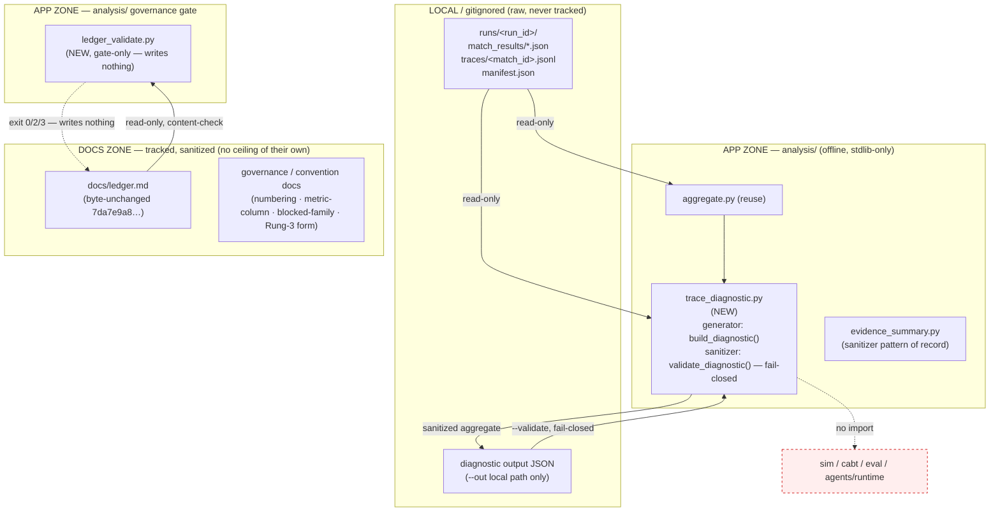

# Cycle-008 SDD — Diagnostics & Rung-3 Readiness: Trace-Safe Descriptive Eyes, a Ledger-Row Validator, and D-lite Governance

> Software Design Document (planning artifact). Status: **DRAFT — awaiting operator acceptance.** This SDD
> translates the Cycle-008 PRD (`docs/cycles/cycle-008/01-prd.md`) into a technical blueprint for `/sprint-plan` and
> `/implement`. It **builds no code, runs no eval, generates no evidence, chooses no candidate or numeric margin `M`,
> issues no SP-6, promotes no value, writes no ledger row, and advances no claim ceiling.** It designs *how* the
> Cycle-008 deliverables are shaped; the build itself lands only through
> `/sprint-plan → /implement → /review-sprint → /audit-sprint → operator acceptance` (OA-2-class build gate,
> `docs/operator/turntrace-loop-contract.md` §6; OD-C8-6).
>
> **Sanitized note.** No raw traces, card IDs/names, deck lists, hand contents, simulator logs, run-dir dumps, Pokémon
> Elements, episode data, `deck.csv` rows, or Competition Data appear here. No dispersion metric values appear here. **No
> numeric margin `M` is chosen or stated.** Runs are referenced by `run_id`/pattern, regimes by `regime_id`, metrics by
> sanitized *name* only. The forbidden agent words (*strong / competitive / optimal / calibrated / complete*) and the
> inferential terms (*std-dev / variance / CI / p-value / significance / hypothesis-test / error-bar*) appear only as the
> negated/forbidden language they are.

## 0. State verified at authoring (2026-06-20, before drafting)

| Assumption to verify | Result |
|---|---|
| Current HEAD / branch | `main` @ `95d4811` — *docs: clean TurnTrace README and Butterfree Zone* (== `origin/main`) |
| `docs/ledger.md` byte-unchanged | **byte-unchanged**; `git hash-object = 7da7e9a8dbed6561669d1569445eb9fe67a953fb` |
| `docs/claim-ceiling.md` unchanged | **unchanged**; ceiling = **Rung 2**; `git hash-object = 3d99759b919f7d75bc41ea81cd82e5f1fb974be7` |
| PRD present and accepted (Option A + D-lite) | `docs/cycles/cycle-008/01-prd.md` (DRAFT — awaiting operator acceptance) |
| `analysis/` modules at HEAD | `aggregate.py`, `delta_report.py`, `dispersion_report.py`, `e2e_validate.py`, `evidence_summary.py`, `failure_report.py`, `replay_check.py` — only `replay_check.py` opens sidecars (opaquely, for hash recompute) |
| Trace schema authority | `eval/schemas.md` — decision row carries `public_state_summary` (counts both sides), terminal row carries `final_prize_counts [p0,p1]` and `ending_cause` |
| Sanitizer/validator pattern of record | `analysis/evidence_summary.py` (`build_summary` generator + `validate_summary` fail-closed allow-list; exit `0/1/2/3`) and `eval/hygiene_check.py` (path rules) |
| Import-direction guard green | `tests/test_import_direction.py` — `analysis/` imports run-dir + intra-`analysis/` only; no `sim`/`cabt`/`eval` |
| `.claude/` integrity | **no drift**; `integrity_enforcement: strict` → no HALT |

**All assumptions hold. No finding forces a stop.** SDD acceptance and the OA-2 build gate are **separate operator acts**
this SDD does not self-authorize.

| Field | Value |
|---|---|
| **Cycle** | Cycle-008 |
| **Working title** | Diagnostics & Rung-3 Readiness: Trace-Safe Descriptive Eyes, Not Instincts |
| **Type** | Software Design Document (planning artifact for a diagnostics + governance-hardening cycle) |
| **Status** | DRAFT — awaiting operator acceptance; next Golden-Path step is `/sprint-plan` |
| **Date** | 2026-06-20 |
| **Source PRD** | `docs/cycles/cycle-008/01-prd.md` |
| **Posture** | Diagnostics + Rung-3 readiness + D-lite governance. **Rung 2 holds at open and is preserved.** Build instruments, not instincts. |
| **Claim ceiling (at open)** | **Rung 2 — "beats random-legal"** (bounded to `scripted-v001` over `random_legal-v001` under `regime-v003`); unchanged this cycle |

## Required posture (binding — inherited verbatim-in-intent from PRD §"Required posture")

- Cycle-008 is a **diagnostics + governance-hardening cycle**, not a Rung-3 attempt, target-selection, or agent-building.
- **Descriptive-only — instruments, not instincts.** The diagnostic reports *what happened*; it MUST NOT judge play
  quality, score a decision, assert a "should-have," recommend a move, or act as coach / evaluator / policy recommender
  (PRD NFR-3, NFR-10).
- **Prefer existing sealed runs;** any fresh diagnostic run is explicitly non-ceiling-bearing (PRD C8-FR-7).
- **No numeric margin `M` anywhere;** **no new simulator instrumentation;** **no per-decision quality detector** for
  FM-03/04/06/08 (PRD NFR-7, NFR-9, NFR-10).
- **The runtime-agent lane stays closed.** No agent, pilot, heuristic, candidate, value model, search/FunSearch/RL/MCTS,
  tournament harness, deck optimizer, or dashboard.
- **`docs/ledger.md` stays byte-unchanged (`7da7e9a8…`); `docs/claim-ceiling.md` stays unchanged (`3d99759b…`).**
- **`.claude/` is never edited; no State-Zone cleanup is performed.**

---

## 1. Architecture overview

Cycle-008 adds **five tracked deliverables** — one new App-Zone diagnostic that for the first time reads decision-trace
sidecars *for content*, its fail-closed output sanitizer (co-located in the same module, mirroring the
generator+validator pattern of `analysis/evidence_summary.py`), a tracked ledger-row validator, and four governance docs
— **without** widening the runtime contract, adding a dependency, or moving any ceiling-bearing artifact.



### 1.1 What is new vs reused

| Element | New / Reuse | Rationale |
|---|---|---|
| `analysis/trace_diagnostic.py` (diagnostic + co-located sanitizer) | **NEW** | First `analysis/` module to read `traces/<match_id>.jsonl` rows *for content* (PRD problem §2.1). Co-locates generator + fail-closed validator like `evidence_summary.py` (OD-C4-1 pattern). |
| `aggregate.aggregate_run` (per-run sanitized summary stats) | **Reuse** | The single source of per-run outcome aggregates; the diagnostic's outcome surface (C8-FR-2.1) leans on it, not on a re-implementation. |
| Hygiene path rules + inferential/forbidden-word/cross-regime/SHA-256 checks | **Reuse-by-copy** (parity-tested, NOT an `eval/` import) | `evidence_summary.py:233-290` already holds a parity-tested stdlib copy of `eval/hygiene_check.py` rules; the new sanitizer reuses that proven surface (import direction forbids `analysis/`→`eval/`). |
| `analysis/ledger_validate.py` (ledger-row schema/append-only gate) | **NEW** | No tracked validator content-checks `docs/ledger.md` today (Cycle-007 carry-forward 3); gate-only, writes nothing (C8-FR-4). |
| Governance/convention docs (numbering, metric-column, blocked-family, Rung-3 form) | **NEW** docs | Formalize carry-forwards 1–2 and author the bounded Rung-3 form + blocked-family map (C8-FR-5/6). |

### 1.2 Invariants the architecture preserves (hard)

- **Import direction.** `trace_diagnostic.py` and `ledger_validate.py` import run-dir artifacts + intra-`analysis/`
  helpers + stdlib only. **No `sim`, `cabt`, `eval`, or `agents/runtime` import** (PRD NFR-2;
  `tests/test_import_direction.py`). Reused hygiene rules are a copied, parity-tested stdlib surface, never an `eval/`
  import (the documented `# loa:shortcut` in `evidence_summary.py:33-36`).
- **Offline + stdlib-only.** No third-party runtime dependency (PRD NFR-1).
- **Descriptive-only.** The diagnostic emits only the allowed descriptive vocabulary (`count`, `min`, `max`, `range`,
  `mean`, `median`, `spread`); no scorer, quality label, "should-have," or recommendation field exists in any output
  path (PRD NFR-3, C8-FR-1.2). Verified by an assertion that the output key-set is a subset of the allow-list (§2.4).
- **Ledger / ceiling invariance.** `ledger_validate.py` is gate-only — it opens `docs/ledger.md` read-only and never
  has a write path to it or any tracked `docs/` path (PRD NFR-6, C8-FR-4.3). `docs/ledger.md` stays `7da7e9a8…`;
  `docs/claim-ceiling.md` stays `3d99759b…`.
- **No numeric `M`.** No artifact in this cycle holds a numeric promotion margin; the sanitizer actively rejects an
  `M`-shaped governance threshold token (§3, PRD C8-FR-3.2, NFR-7).

---

## 2. Diagnostic design (PRD C8-FR-1/2; §9)

### 2.1 Read surface — and the one structural first

The diagnostic reads, per `run_id`, exactly two artifact families, both read-only:

1. `runs/<run_id>/match_results/*.json` — match-summary records (schema `eval/schemas.md:17-52`), consumed through
   `aggregate.aggregate_run` for the outcome surface, and read directly for per-match `ending_cause` / `result` /
   `wall_clock_ms` / `invalid_action_count` / `timeout` distributions.
2. `runs/<run_id>/traces/<match_id>.jsonl` — the per-decision sidecars (schema `eval/schemas.md:54-92`). This is the
   **structural first**: no prior `analysis/` module reads these rows for content (`replay_check.py` opens them only to
   recompute `trace_hash`). The diagnostic reads the **decision rows** for `public_state_summary` (`active_present`,
   `bench_count` per side) and `decision_latency_ms`, and the **terminal row** for `final_prize_counts` and `ending_cause`.

`manifest.json` is read **first** as the `regime_id` authority (mirroring `dispersion_report.py` / `evidence_summary.py:147-161`),
before any aggregation, so the single-regime guard fires before content is touched.

### 2.2 Authorized descriptive surfaces (the bounded output shape)

The diagnostic emits a JSON-first, single-regime object bounded to the five PRD C8-FR-2 surfaces, each computed from
already-recorded fields (no new instrumentation, NFR-9):

| # | Surface (C8-FR-2) | Source field(s) | Descriptive form emitted |
|---|---|---|---|
| 1 | Outcome aggregates | `result`, `ending_cause` (match-summary) | counts/rates over `{win,loss,draw,error}` and `{no-active,deck-out,prize-out,card-effect,error}` |
| 2 | Board-shape distributions | `public_state_summary.active_present` (bool), `.bench_count` (int) per side, per decision row | `count` of decisions; per-side `min/max/range/mean/median/spread` of `bench_count`; rate of `active_present` |
| 3 | Prize trajectory | per-row `prize_count` trajectory; terminal `final_prize_counts [p0,p1]` | `min/max/range/mean/median/spread` of the trajectory; terminal counts per side |
| 4 | Decision-latency distribution | `decision_latency_ms` (decision row); `wall_clock_ms` (match) | `min/max/range/mean/median/spread` (aggregate stats only — never raw rows) |
| 5 | Error / illegal / malformed-selection regression | `result==error` presence, `invalid_action_count` (where `invalid_action_detectable`), `timeout` | error-presence count; illegal total; `timeout` reported as the soft, undetectable signal it is (`timeout=null`) |

Every surface is descriptive of **what occurred**. None is framed as a mistake, fault, or quality score; none requires
energy, per-Pokémon state, card identity, retreat cost, or decoded OptionType semantics (PRD C8-FR-2.6, NFR-9, NFR-10).

### 2.3 Descriptive-statistics helper — reuse, do not recompute

The seven-statistic surface (`count/min/max/range/mean/median/spread`) is the same family already proven in
`analysis/dispersion_report.py` (`STAT_COLUMNS` / `descriptive_stats`, reused by `evidence_summary.py:66-68`). The
diagnostic SHOULD import that helper rather than re-implement statistics, so **no new statistic and no inferential
statistic can enter** through this module — the same structural guarantee `evidence_summary.py` relies on. No sample
standard deviation, variance, CI, or p-value is computed anywhere; their absence is structural, not promised.

> Sprint-plan boundary: whether to import `dispersion_report.descriptive_stats` directly or via a thin shared helper is
> a sprint-level call; either way the constraint is "no new statistic enters," verified by a test (§7).

### 2.4 The no-quality-judgment guarantee (mechanical, not promised)

The output object's allowed top-level key-set is fixed (a `SAFE_FIELDS`-style allow-list co-located in the module,
mirroring `evidence_summary.py:78-90`). A test asserts the generated output's full key-set (at every nesting depth) is a
**subset** of that allow-list, and that no key matches a quality/score/recommendation/"should-have"/optimal-action
pattern. This makes "descriptive-only" a checked property: a future edit that adds a scorer field fails the build
(PRD C8-FR-1.2, NFR-3, success-criterion 16.2 "emits no quality/score/recommendation field (asserted absent)").

### 2.5 Single-regime hard-refusal (exit 2)

A mixed-regime invocation hard-refuses with exit 2 **before any aggregation**, parity with
`evidence_summary.py:153-160` / `dispersion_report.py` (PRD NFR-5, C8-FR-1.4). The regime identity is read from each
run's `manifest.json` first; >1 distinct `regime_id` → refusal. No cross-regime comparison, deck change, or new regime
is reachable from this module.

### 2.6 Synthetic-fixture acceptance (no dependence on a local run dir)

The diagnostic MUST be exercisable and acceptance-tested against **synthetic** sealed-run fixtures committed under
`tests/` (sanitized, schema-shaped `match_results/*.json` + `traces/*.jsonl` + `manifest.json`), so it does not depend
on any gitignored local run dir being present (PRD C8-FR-1.5, C8-FR-7, R11). The fixtures carry no card data, no Pokémon
Elements, no raw deck content — only the schema-shaped counts/booleans/outcomes the surfaces consume.

### 2.7 Offline import + stdlib + CLI contract

`analysis/`-zone imports only; stdlib only; `tests/test_import_direction.py` stays green (PRD NFR-1, NFR-2). CLI shape
mirrors the existing diagnostics:

```
python analysis/trace_diagnostic.py <run_dir> [<run_dir> ...] [--json] [--out <local-path>]
python analysis/trace_diagnostic.py --validate <diagnostic.json>     # the co-located sanitizer
```

Exit-code contract (parity with `evidence_summary.py:46-48`): `0` clean/valid · `1` input failure · `2` mixed-regime
refusal · `3` forbidden-field/value/word leak (fail-closed; never `0` on a leak). `--out` refuses any tracked `docs/`
path (reuse the `_refuse_tracked_out` guard pattern, `evidence_summary.py:451-476`); output is local/gitignored by
default (ESP-1; PRD §10.1).

---

## 3. Output sanitizer design (PRD C8-FR-3; §10)

The sanitizer is **co-located in `trace_diagnostic.py`** (the `--validate` mode + a pure `validate_diagnostic(obj)`
function), exactly as `evidence_summary.py` co-locates `validate_summary`. It is **parity-or-stricter** with
`eval/hygiene_check.py` and `analysis/evidence_summary.py`'s validator, and is **fail-closed**.

### 3.1 Rejection classes (each fail-closed; each with a poisoned fixture)

| Class | Rule (reused/adapted from `evidence_summary.py`) | Poisoned fixture rejected |
|---|---|---|
| Competition-Data paths | `_HYGIENE_PATH_RULES` (parity copy, `:233-243`) | a `cg/`, `deck.csv`, `runs/.../`, `.pdf` path string |
| Card IDs/names or Pokémon Elements | every `hashes`-keyed value must be SHA-256-shaped (`:349-365`, `_SHA256_RE`) | a raw, non-digest token under any `hashes` map |
| Raw per-decision-row field names/values | `_DECISION_BODY_MARKERS` set (`:285-290`): `public_state_summary`, `selected_action`, `legal_actions_sample`, `decision_latency_ms` as raw rows, `private_state_summary`, `post_decision_observation`, etc. | an output object carrying a raw decision-row field |
| Inferential vocabulary | `_INFERENTIAL_RULES` (`:248-259`): std-dev / variance / CI / p-value / significance / hypothesis-test / error-bar | a value containing an inferential term |
| Affirmative forbidden agent words | `_affirmative_forbidden_words` (`:309-322`): *strong/competitive/optimal/calibrated/complete*, suppressed only by an immediately-preceding negation | a value affirmatively using a forbidden word |
| Cross-regime field/value markers | `_CROSSREGIME_KEY_RE` / `_CROSSREGIME_VALUE_RE` (`:278-281`) | a `cross-regime` / `regime-vNNN vs regime-vMMM` marker |
| Numeric-`M`-shaped governance threshold | **NEW rule for this cycle** — reject a key/value pair shaped like a promotion margin (`margin`/`M=`/`threshold` carrying a numeric governance value) | a value asserting a numeric promotion margin |
| Non-SHA-256 hash where a digest is required | the `hashes`-shape rule above | a `hashes` value that is not 64 hex chars |

The numeric-`M` rule is the one rejection class genuinely new to Cycle-008 (PRD C8-FR-3.2, NFR-7): the diagnostic
carries no ceiling and no margin, so any `M`-shaped governance token in its output is a posture leak and is rejected
fail-closed, riding the existing exit-3 path (no new exit code).

### 3.2 Allow-list, fail-closed at every nesting level

Like `validate_summary`, the sanitizer walks the object and rejects any field outside the diagnostic's `SAFE_FIELDS`
allow-list **at every depth**, with the most-specific reason (decision-body marker > cross-regime > generic
out-of-allow-list). A clean fixture is accepted (exit 0); each poisoned-fixture class is rejected (exit 3). The
sanitizer is exit-code-disciplined consistent with the existing validator contract (PRD C8-FR-3.3).

### 3.3 Why co-located, not a separate module

The generator and its validator sharing one `SAFE_FIELDS` constant is the property that keeps the doc↔code allow-list
from drifting — the same reasoning `evidence_summary.py:71-90` records (a divergence fails a test). A separate sanitizer
module would re-introduce the drift seam the existing pattern was designed to close.

---

## 4. Ledger-row validator design (PRD C8-FR-4; D-lite governance rider)

A **new tracked module `analysis/ledger_validate.py`**, gate-only: it content-checks `docs/ledger.md` and **writes
nothing, promotes nothing, and never mutates any tracked `docs/` path** (PRD C8-FR-4.3, NFR-6). It closes Cycle-007
carry-forward 3 (the Rung-2 row was appended by a guarded binary-append script with no tracked content-check).

### 4.1 The 18-column schema, verbatim

The validator pins the column order verbatim from the PRD and `eval/schemas.md:114-119` / `aggregate.py:38-42`:

```
date | run_id | regime_id | git_rev | sim_version | agent_version | opponent_pool_ref |
seed_set_ref | games | win_rate | illegal_action_rate | timeout_rate | error_rate |
avg_turns | mode | hypothesis | claim_ceiling | notes
```

### 4.2 Checks (each a rejection class with a poisoned fixture)

| Check | Rule | Poisoned fixture rejected |
|---|---|---|
| Column count | each data row has exactly 18 pipe-delimited cells | a row with the wrong column count |
| Non-empty `claim_ceiling` | the `claim_ceiling` cell is present and non-empty (`eval/schemas.md:119`) | a row with an empty `claim_ceiling` |
| Append-only | no previously-present row is edited (content-hash the current tracked rows; an altered prior row is rejected) | an edited prior row |
| Single `regime_id` per row | exactly one `regime_id` value per row (no cross-regime row, NFR-5) | a row carrying two regimes |
| SHA-256-shaped hash references | where a row cites a summary **by hash**, that reference is 64 hex chars (`_SHA256_RE`) | a non-SHA-256 hash where a digest is required |

The `see cited summary` by-reference convention (carry-forward 2, §6.2 doc) is explicitly **allowed** in the numeric
metric columns: the validator does not require numeric values there — it accepts the reference-not-embed pattern the
Rung-2 row already uses (`docs/ledger.md` row 3). It rejects only a malformed *schema/append* property, never the
no-embed safety pattern.

### 4.3 Acceptance: the current valid ledger passes

The validator MUST **accept the current valid `docs/ledger.md`** (the three existing rows at `7da7e9a8…`) and **reject a
malformed row** (wrong column count, empty `claim_ceiling`, edited past row, bad hash) — PRD C8-FR-4.2, success-criterion
16.2. Append-only detection works against a tracked baseline (the at-HEAD ledger rows); the design records the baseline
as "the current tracked rows," verified by a fixture pair (valid current ledger → exit 0; one mutated prior row → reject).

### 4.4 Exit-code contract and zone

CLI: `python analysis/ledger_validate.py [docs/ledger.md]` (defaults to the tracked path, read-only). Exit `0` valid ·
`1` input failure · `2` cross-regime/structural refusal · `3` malformed-row rejection — parity with the existing
validator family. The module is App Zone (`analysis/`); it reads a Docs-Zone file but has **no write path** to it
(verified by a source-grep test that the module names no write/append call against `docs/`).

---

## 5. Fresh-run posture (PRD C8-FR-7)

The diagnostic **prefers existing sealed run artifacts** and is acceptance-tested against synthetic fixtures (§2.6), so
the cycle needs **no fresh run** to land. If a fresh diagnostic run is ever proposed, the design requires it to be
explicitly **non-ceiling-bearing**, to justify why existing sealed runs are insufficient, and to never feed a ledger row
or touch the claim ceiling — it would be descriptive instrumentation only (PRD C8-FR-7.2). **This SDD proposes no fresh
run.**

---

## 6. Governance & convention docs (PRD C8-FR-5/6; D-lite)

Four tracked, sanitized docs under `docs/` (exact filenames are a sprint-plan boundary; the `NNa-` numbering convention
they formalize governs their own placement). Each carries **no ceiling of its own** and embeds no raw content.

### 6.1 SP-6 / promoted-summary numbering convention (carry-forward 1)
Document the `NNa-` insertion convention (e.g. `06a-sp6-promoted-summary.md`, as used in `docs/cycles/cycle-007/`) so
future cycles avoid `07-`/closeout path ambiguity (PRD C8-FR-5.1).

### 6.2 Ledger metric-column convention (carry-forward 2)
Document the "see cited summary" by-reference + content-hash pattern for the numeric metric columns (the pattern the
Rung-2 row already uses), preserving the no-embed safety pattern (PRD C8-FR-5.2). This is the convention the
ledger-row validator (§4.2) explicitly honors.

### 6.3 Blocked-family map (PRD C8-FR-5.3; §9)
A tracked, sanitized map classifying each scouting-inspired surface into one of three classes, naming no card data and
embedding no raw content:

| Class | Examples (sanitized, named only) | Status |
|---|---|---|
| **Measurable now** (this cycle) | outcome/ending-cause aggregates; `active_present`/`bench_count` distributions; `prize_count` trajectory; decision-latency; error/illegal regression | built in §2 |
| **Needs future sim instrumentation** | backup-attacker readiness, attach/energy tempo, attack-vs-setup timing, contextual-retreat semantics | documented, **not built** (OD-C8-5; NFR-9) — no energy field / no per-Pokémon state / raw OptionType tokens only |
| **Requires separate operator authorization** | per-decision quality of prize trades (FM-03), wasted resources (FM-04), missed lethals (FM-06), bad search targets (FM-08) | documented, **not built** (`detector: forbidden`; NFR-10) |

### 6.4 Rung-3 ladder semantics (PRD C8-FR-6; OD-C8-3 resolved — docs-only, form only)
A docs-only definition of the Rung-3 comparison **form only**: *a future candidate must beat the current non-trivial
incumbent under a same-regime, fresh-evidence, pre-registered comparison.* The doc MUST **freeze nothing** — no candidate
identity, no numeric `M`, no `K`/`n` values, no regime id, no target feature family, no threshold — and **open no
attempt** (PRD C8-FR-6.2). Its sole purpose is governance clarity, to keep Cycle-009 from conflating "what does Rung 3
mean?" with "what candidate should we try?" (PRD C8-FR-6.3, §11). The incumbent named by the *form* is descriptive
context only; naming it freezes no baseline and authorizes no attempt.

A test/lint asserts the doc carries no candidate / `M` / `K`/`n` / regime id / feature family (success-criterion 16.2).

---

## 7. Testing strategy (design level)

All tests are stdlib `unittest` / plain-assert, parity with the existing suite (`tests/test_evidence_summary.py`,
`tests/test_import_direction.py`, `tests/test_smokes.py`). PRD NFR-12: any line anchor a sprint relies on is
re-validated against build-time HEAD before coding.

| Target | Test obligation | Maps to |
|---|---|---|
| Diagnostic — surfaces | given a synthetic sealed-run fixture, emits the five §2.2 surfaces | C8-FR-1/2; 16.2 |
| Diagnostic — descriptive-only | output key-set ⊆ allow-list; no quality/score/recommendation/"should-have" key present (asserted absent) | C8-FR-1.2, NFR-3; 16.2 |
| Diagnostic — single-regime | mixed-regime fixture → exit 2 | NFR-5; 16.2 |
| Diagnostic — import direction | AST/source lint: imports no `sim`/`cabt`/`eval`/`agents.runtime`; stdlib-only | NFR-1, NFR-2 |
| Diagnostic — fixture independence | runs against committed synthetic fixtures, no local run dir needed | C8-FR-1.5, R11 |
| Sanitizer — each poisoned class | card name · raw decision row · inferential term · forbidden agent word · cross-regime field · non-SHA-256 hash · numeric-`M`-shaped token → fail-closed exit 3 | C8-FR-3; 16.2 |
| Sanitizer — clean fixture | accepted (exit 0) | C8-FR-3.3 |
| Sanitizer — parity | path-rule parity vs `eval/hygiene_check.find_violations` (mirror the existing parity test) | C8-FR-3.1 |
| Ledger validator — reject | wrong column count · empty `claim_ceiling` · edited past row · bad hash → reject | C8-FR-4.2; 16.2 |
| Ledger validator — accept | current valid `docs/ledger.md` → exit 0 | C8-FR-4.2; 16.2 |
| Ledger validator — writes nothing | source-grep: no write/append against `docs/`; ledger hash unchanged after a run | C8-FR-4.3, NFR-6 |
| Docs — Rung-3 form / blocked-family | lint: Rung-3 doc freezes nothing (no candidate/`M`/`K`/`n`/regime/feature-family); blocked-family map present + classified | C8-FR-5/6; 16.2 |
| Invariants | `docs/ledger.md` == `7da7e9a8…`; `docs/claim-ceiling.md` == `3d99759b…`; `.claude/` clean; State-Zone dirt unstaged | C8-FR-8; 16.3 |

Non-trivial logic that MUST leave a runnable failing-on-break check (Karpathy §4): the descriptive-stats computation,
the single-regime guard, every sanitizer rejection branch, and every ledger-validator rejection branch. Trivial
pass-throughs need none.

---

## 8. Development phases (sprint-plan handoff — boundary only)

Logical sequencing for `/sprint-plan`; this SDD designs *what*, not the task breakdown. A natural ordering:

1. **Diagnostic core + synthetic fixtures** — `build_diagnostic()`, the five surfaces, reused descriptive-stats helper,
   single-regime guard, committed fixtures, descriptive-only key-set assertion.
2. **Co-located sanitizer** — `validate_diagnostic()` + `--validate` mode, all rejection classes incl. the new
   numeric-`M` rule, poisoned fixtures, parity test.
3. **Ledger-row validator** — `analysis/ledger_validate.py`, 18-column schema, append-only/single-regime/hash checks,
   accept-current-ledger fixture, writes-nothing source-grep.
4. **Governance/convention docs** — numbering, metric-column, blocked-family map, Rung-3 form; freezes-nothing lint.
5. **Invariant verification** — hashes pinned, `.claude/` clean, State-Zone dirt unstaged.

Phases 1–3 are App-Zone code behind the OA-2 build gate (OD-C8-6); phase 4 is Docs Zone; phase 5 is verification only.

---

## 9. Risk register (design-level — inherits PRD §14)

| ID | Risk | Design mitigation |
|---|---|---|
| R1 | Scouting treated as proof (FM-11) | No episode/peer signal enters any module or tracked doc; diagnostic measures same-regime observables only (§2). |
| R2 | Diagnostic drifts into a coach / scorer | §2.4 mechanical key-set allow-list (asserted-absent quality fields); reused descriptive-stats helper (§2.3); FM-03/04/06/08 detectors not built (§6.3). |
| R3 | Sim-instrumentation creep | §2.1 read surface is already-recorded fields only; blocked families documented not built (§6.3); import-direction lint (§1.2). |
| R4 | Tracked-doc leakage of raw data | §3 fail-closed sanitizer parity-or-stricter with `evidence_summary`/`hygiene_check`; poisoned-fixture per class; `--out` refuses tracked paths. |
| R5 | Cross-regime comparison / deck change | §2.5 single-regime hard-refusal (exit 2); ledger validator rejects multi-regime row (§4.2). |
| R6 | Numeric `M` leakage | §3.1 new numeric-`M` rejection rule; no `M` in any module or doc (NFR-7). |
| R7 | Rung-3 scope creep | §6.4 form-only doc, freezes-nothing lint; opens no attempt. |
| R8 | Ledger / claim-ceiling drift | §4 validator is gate-only (writes nothing); §1.2 hashes pinned (`7da7e9a8…`/`3d99759b…`); invariant test (§7). |
| R9 | Overclaim beyond Rung 2 | Forbidden words negated-only (§3.1); diagnostic/validator/docs carry no ceiling (§1.2). |
| R10 | Runtime-agent / search / optimizer creep | Lane closed; this SDD adds only offline `analysis/` readers + docs (§1). |
| R11 | Diagnostic depends on absent local run dirs | §2.6 synthetic committed fixtures; prefer-existing-sealed-runs posture (§5). |
| R12 | `.claude/` / State-Zone pollution | App/Docs/State-Zone discipline (§8); System Zone untouched; pre-existing dirt unstaged (§7 invariant test). |

---

## 10. Implementation boundaries & explicit non-goals (held by this SDD)

This SDD designs **only**: one offline descriptive diagnostic with a co-located fail-closed sanitizer; one gate-only
ledger-row validator; four governance/convention docs; their stdlib tests + synthetic fixtures. It does **not** design,
and the build gate does **not** authorize:

- Any Rung-3 attempt, target/candidate selection, pre-registration, or numeric `M`.
- Any fresh promotion evidence, SP-6, ledger row, claim-ceiling advance, or PASS/FAIL/INCONCLUSIVE verdict.
- Any runtime agent, pilot, heuristic, candidate, value/win-probability model, search/FunSearch/RL/self-play/MCTS,
  tournament harness, deck optimizer, or dashboard.
- Any per-decision quality detector/scorer for FM-03/04/06/08, move-quality judgment, "should-have," coaching, or policy
  recommendation.
- Any new simulator instrumentation (energy/attach, per-Pokémon state, card semantics, attack-cost, OptionType decode).
- Any new regime, deck change, cross-regime comparison, or inferential statistic.
- Any episode ingest; any raw Competition Data / Pokémon Elements / deck lists / traces / logs in tracked docs.
- Any `.claude/` edit or State-Zone cleanup.

---

## 11. SDD decisions table

| ID | Decision | Rationale / PRD anchor |
|---|---|---|
| SDD-C8-1 | Co-locate the diagnostic generator + its sanitizer in one module (`analysis/trace_diagnostic.py`), sharing one `SAFE_FIELDS` allow-list | Closes the doc↔code drift seam; the proven `evidence_summary.py` pattern (OD-C4-1); C8-FR-1/3 |
| SDD-C8-2 | Reuse `aggregate.aggregate_run` (outcome surface) and `dispersion_report.descriptive_stats` (the seven stats) rather than re-implement | No new statistic / no inferential statistic can enter; C8-FR-2, NFR-3 |
| SDD-C8-3 | The diagnostic is the first `analysis/` module to read `traces/*.jsonl` rows for content; read surface bounded to the §2.2 fields | Closes problem §2.1 without new instrumentation; C8-FR-1, NFR-9 |
| SDD-C8-4 | "Descriptive-only" enforced mechanically by an output key-set ⊆ allow-list test, not by prose | C8-FR-1.2, NFR-3; success-criterion 16.2 |
| SDD-C8-5 | Add one new sanitizer rejection class: numeric-`M`-shaped governance threshold token | C8-FR-3.2, NFR-7 |
| SDD-C8-6 | `analysis/ledger_validate.py` is a new gate-only validator: read-only on `docs/ledger.md`, no write path, accepts the current ledger, rejects malformed rows | Carry-forward 3; C8-FR-4 |
| SDD-C8-7 | Ledger validator honors (does not reject) the "see cited summary" by-reference + content-hash convention in numeric columns | Carry-forward 2; preserves no-embed safety pattern; C8-FR-4, C8-FR-5.2 |
| SDD-C8-8 | Acceptance via committed synthetic fixtures; no dependence on any gitignored local run dir; no fresh run proposed | C8-FR-1.5, C8-FR-7, R11 |
| SDD-C8-9 | Rung-3 ladder semantics is a docs-only "form only" definition with a freezes-nothing lint; opens no attempt | OD-C8-3 (resolved); C8-FR-6 |
| SDD-C8-10 | Invariants are checked, not assumed: ledger `7da7e9a8…` / ceiling `3d99759b…` pinned; `.claude/` clean; State-Zone dirt unstaged | C8-FR-8, NFR-6, NFR-11; 16.3 |

---

## 12. Sources and traceability

> **Source PRD:** `docs/cycles/cycle-008/01-prd.md` (Option A + D-lite; G1–G6; C8-FR-1..8; NFR-1..12; §9 surface scope;
> §14 risks; OD-C8-1..6).
> **Tracked governance authorities:** `docs/claim-ceiling.md` (Rung 2; forbidden words; never compare across regimes;
> `3d99759b…`); `docs/ledger.md` (the only ceiling-bearing artifact; 18-column schema; three rows incl. the Rung-2
> `regime-v003` row; `7da7e9a8…`); `docs/cycles/cycle-007/07-closeout.md` (Rung-2 closeout; carry-forwards 1–4);
> `docs/operator/turntrace-loop-contract.md` (§1 loop; §6 OA-2 build gate; §7-§8 hygiene / claim language);
> `docs/failure-mode-taxonomy-v001.md` (FM-03/04/06/08 `detector: forbidden`); `docs/failure-modes.md` (FM-10/FM-11).
> **Tracked frozen authorities:** `frozen/README.md` (regime = `{seed_set, opponent_pool, deck_pool, metrics_spec}`);
> `frozen/regimes/regime-v003.json` (the Rung-2 regime); `frozen/metrics/metrics-spec-v001.json`.
> **Tracked code (reality grounding at `95d4811`):** `eval/schemas.md` (trace + match-summary + ledger schema authority);
> `analysis/evidence_summary.py` (generator+validator + sanitizer rule set, the pattern of record); `analysis/aggregate.py`
> (per-run outcome stats + 18-column `LEDGER_COLUMNS`); `analysis/dispersion_report.py` (`STAT_COLUMNS` /
> `descriptive_stats`); `analysis/failure_report.py` (outcome/ending-cause distributions); `analysis/replay_check.py`
> (the only existing sidecar reader, opaque/hash-only); `eval/hygiene_check.py` (path-rule parity baseline);
> `tests/test_import_direction.py`, `tests/test_evidence_summary.py`, `tests/test_smokes.py`.
> Current main at authoring: `95d4811`. Claim ceiling: **Rung 2 (unchanged).** This SDD builds no code, runs no eval,
> generates no evidence, chooses no `M`, selects no candidate, opens no Rung-3 attempt, issues no SP-6, promotes no
> value, writes no ledger row, advances no ceiling, mutates no ledger, and edits no `.claude/`.

---

> **SDD statement (binding).** Cycle-008 designs **trace-safe, descriptive, same-regime diagnostic eyes** — a new offline
> `analysis/trace_diagnostic.py` that, for the first time, reads decision-trace sidecars *for content* over five bounded
> descriptive surfaces, with a co-located fail-closed output sanitizer (parity-or-stricter with `evidence_summary.py` /
> `hygiene_check.py`, plus one new numeric-`M` rejection rule) — a **gate-only `analysis/ledger_validate.py`** that
> content-checks `docs/ledger.md` against the 18-column schema and append-only discipline while writing nothing, and four
> **governance/convention docs** including a **docs-only Rung-3 ladder-semantics** definition that states the comparison
> *form only* and freezes nothing. "Descriptive-only" is enforced mechanically (output key-set ⊆ allow-list), not
> promised. **This SDD attempts no Rung 3, selects no target, freezes no candidate / numeric `M` / `K` / `n` / regime id /
> feature family, adds no simulator instrumentation, builds no per-decision quality scorer, builds no runtime
> agent/optimizer/search/learning surface, generates no promotion evidence, issues no SP-6, writes no ledger row, and
> advances no ceiling.** Existing sealed runs are preferred; acceptance is via committed synthetic fixtures; any fresh run
> would be non-ceiling-bearing. **This drafting pass built no code, ran no eval, generated no evidence, chose no `M`, and
> took no terminal act.** `docs/ledger.md` remains byte-unchanged at `7da7e9a8dbed6561669d1569445eb9fe67a953fb`;
> `docs/claim-ceiling.md` is unchanged at `3d99759b919f7d75bc41ea81cd82e5f1fb974be7`.
