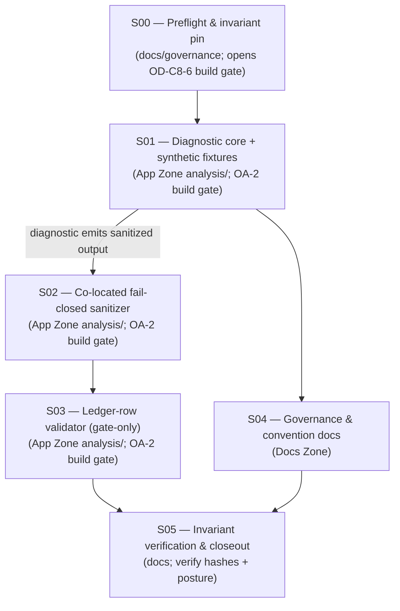
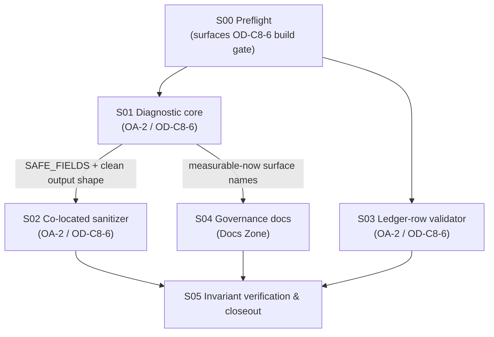

# Cycle-008 Sprint Plan — Diagnostics & Rung-3 Readiness: Build Trace-Safe Descriptive Eyes, a Ledger-Row Validator, and D-lite Governance

> Planning artifact (Sprint Plan). Status: **DRAFT — awaiting operator acceptance.** This plan decomposes the
> accepted-input Cycle-008 PRD (`docs/cycles/cycle-008/01-prd.md`) and SDD (`docs/cycles/cycle-008/02-sdd.md`)
> into narrow, gated, reviewable sprints **while preserving every invariant**. **This `/sprint-plan` pass
> authorizes no implementation, builds no code, runs no eval, generates no fresh evidence, chooses no candidate
> or numeric margin `M`, selects no Rung-3 target, freezes no `K`/`n`/regime id/feature family, issues no SP-6,
> promotes no value, writes no ledger row, advances no claim ceiling, and applies no PASS/FAIL/INCONCLUSIVE
> verdict.** It writes exactly one artifact (this file) and creates no implementation prompts. Each sprint lands
> only through `/implement → /review-sprint → /audit-sprint → operator acceptance`
> (`docs/operator/turntrace-loop-contract.md` §1, §6; OA-2-class build gate, OD-C8-6).
>
> **Sanitized note.** No raw traces, card IDs/names, deck lists, hand contents, simulator logs, run-dir dumps,
> Pokémon Elements, Daily-Top-Episode data, Kaggle episode data, Discord/peer screenshots, `deck.csv` rows, `cg/`
> SDK, PDFs/CSVs, or Competition Data appear here (CC-1/CC-2, ESP; SP-6/SP-9). **No dispersion metric values
> appear here. No numeric margin `M` is chosen or stated.** Runs are referenced by `run_id`/pattern, regimes by
> `regime_id`, metrics by sanitized *name* only. The forbidden agent words (*strong / competitive / optimal /
> calibrated / complete*) and the inferential terms (*std-dev / variance / CI / p-value / significance /
> hypothesis-test / error-bar*) appear only as the negated/forbidden language they are.

| Field | Value |
|---|---|
| **Cycle / Type** | Cycle-008 — Sprint Plan (planning artifact for a diagnostics + governance-hardening cycle) |
| **Status** | DRAFT — awaiting operator acceptance; next Golden-Path step (per sprint) is `/implement` behind the OA-2 build gate |
| **Date** | 2026-06-20 |
| **Binding inputs** | `docs/cycles/cycle-008/01-prd.md` (FRs C8-FR-1…8; goals G1…G6; NFR-1…12; §9 surface scope; §14 risks; OD-C8-1…6) · `docs/cycles/cycle-008/02-sdd.md` (architecture §1; diagnostic §2; sanitizer §3; ledger-row validator §4; fresh-run posture §5; governance docs §6; testing §7; phases §8; boundaries §10; SDD decisions §11) |
| **Build-time HEAD (citation anchor)** | `95d4811` — *docs: clean TurnTrace README and Butterfree Zone* (== `origin/main`; not behind) |
| **Claim ceiling (at open)** | **Rung 2 — "beats random-legal"** (bounded to `scripted-v001` over `random_legal-v001` under `regime-v003`); **held and preserved this cycle** |
| **Ledger invariant** | `docs/ledger.md` byte-unchanged; `git hash-object = 7da7e9a8dbed6561669d1569445eb9fe67a953fb` |
| **Ceiling invariant** | `docs/claim-ceiling.md` unchanged; `git hash-object = 3d99759b919f7d75bc41ea81cd82e5f1fb974be7` |

---

## 0. State verified at authoring (2026-06-20, before drafting)

Read-only `git` inspection; no mutation:

| Assumption | Result |
|---|---|
| HEAD / branch | `main` @ `95d4811e068066c7df898de1f03d6530cd2a781e` (short `95d4811`) — `== origin/main`; not behind |
| `docs/ledger.md` byte-unchanged | `git hash-object = 7da7e9a8dbed6561669d1569445eb9fe67a953fb` (unchanged; the required invariant) |
| `docs/claim-ceiling.md` | unchanged; `git hash-object = 3d99759b919f7d75bc41ea81cd82e5f1fb974be7`; ceiling = **Rung 2** |
| `.claude/` (System Zone) | untouched; `integrity_enforcement: strict` → no HALT |
| `analysis/` modules at HEAD | `aggregate.py`, `delta_report.py`, `dispersion_report.py`, `e2e_validate.py`, `evidence_summary.py`, `failure_report.py`, `replay_check.py` — **only `replay_check.py` opens sidecars (opaquely, for hash recompute)**; no module reads trace rows for content |
| Sanitizer/validator pattern of record | `analysis/evidence_summary.py` — `build_summary` (`:137`) + `validate_summary` (`:394`) fail-closed allow-list (`SAFE_FIELDS` `:85`); `_refuse_tracked_out` (`:451`); exit set `0/1/2/3` (`:46-48`) |
| Descriptive-stats helper at HEAD | `analysis/dispersion_report.py` — `STAT_COLUMNS` (`:76`) = `[count, min, max, range, mean, median, spread]`; `descriptive_stats` (`:94`) |
| Outcome-aggregate readers at HEAD | `analysis/aggregate.py` `aggregate_run` (`:56`), `LEDGER_COLUMNS` (`:35`, 18 columns); `analysis/failure_report.py` `aggregate_failures` (`:78`) — result/ending-cause distributions over `match_results/*.json` |
| Decision-body marker set at HEAD | `analysis/evidence_summary.py` `_DECISION_BODY_MARKERS` (`:285-290`) **includes `decision_latency_ms`, `public_state_summary`, `selected_action`, `legal_actions_sample`, `private_state_summary`, `post_decision_observation`** (load-bearing for §6 below) |
| Trace schema authority | `eval/schemas.md` — decision row carries `public_state_summary` (counts both sides; `active_present`/`bench_count`, no card IDs), `decision_latency_ms` (`:76`); terminal row carries `final_prize_counts [p0,p1]` (`:90`) and `ending_cause` (`:33,:88`); match summary carries `result`, `ending_cause`, `wall_clock_ms` (`:42`), `invalid_action_count` (`:36`), `invalid_action_detectable` (`:37`), `timeout` null (`:35`) |
| Import-direction guard green | `tests/test_import_direction.py` — AST check; `analysis` allowed cross-zone set = `set()` (intra-`analysis/` + stdlib only); **no `sim`/`cabt`/`eval`/`agents.runtime`** |
| Ledger row structure | three data rows; row 3 (Rung-2 `regime-v003`) uses **"see cited summary"** in the numeric metric columns (the carry-forward-2 by-reference pattern) |
| `06a-` numbering example present | `docs/cycles/cycle-007/06a-sp6-promoted-summary.md` exists (the `NNa-` convention G4 formalizes is already in use) |
| Staged files | none |
| `.beads/issues.jsonl`, `grimoires/loa/NOTES.md`, `grimoires/loa/README.draft.md` dirty | modified/untracked, **unstaged** (pre-existing State-Zone housekeeping); **must not be staged or cleaned** by this pass or any sprint |

**All assumptions hold. No finding forces a stop.** PRD/SDD acceptance and the OA-2 build gate (OD-C8-6) are
**separate operator acts** this plan does not self-authorize.

---

## 1. Executive summary

Cycle-008 is a **diagnostics + governance-hardening cycle** — research Option A spine + a bounded D-lite
governance rider (PRD §1; SDD §1). It **builds instruments, not instincts**: trace-safe descriptive eyes over
existing sealed runs, a gate-only ledger-row validator, and four governance docs — **without** widening the
runtime contract, adding a dependency, attempting a rung, selecting a target, or moving any ceiling-bearing
artifact. **Rung 2 holds at open and is preserved.**

This plan turns the SDD's five design surfaces (`02-sdd.md` §2–§6) and its phase sketch (`02-sdd.md` §8) into
**five narrow, individually-gated sprints**, ordered so the diagnostic's safety property (descriptive-only,
fail-closed) is *mechanical and tested before* anything tracked depends on it.



**The ordering spine (binding, but lighter than Cycle-007 — there is no irreversible terminal act this cycle):**

1. **S00 (preflight) before any code** — the ledger/ceiling hashes and `.claude/`-clean baseline are pinned, and
   the operator opens (or withholds) OD-C8-6, before any App-Zone work begins.
2. **S01 (diagnostic core) before S02 (sanitizer)** — the generator and its `SAFE_FIELDS` allow-list exist first,
   so the co-located sanitizer in S02 validates a real output shape, not a hypothetical one (`02-sdd.md` §3.3).
   Because the sanitizer is **co-located in the same module** (SDD-C8-1), S01 and S02 are two slices of one file;
   S01 lands the generator + the allow-list + the descriptive-only key-set test, S02 lands `validate_diagnostic()`
   + the `--validate` mode + every rejection class + poisoned fixtures.
3. **S02 (sanitizer) before S03 is unnecessary** — the ledger-row validator (S03) is an independent module
   (`analysis/ledger_validate.py`); it may proceed in parallel with S02 once S01's reused helpers exist, but is
   sequenced after S02 here to keep the App-Zone review surface serial and small.
4. **S04 (docs) is Docs-Zone only** and depends on S01 only for the blocked-family map's "measurable now" column to
   name surfaces the diagnostic actually emits; it takes no code and may overlap S02/S03.
5. **S05 (closeout) verifies invariants** — ledger `7da7e9a8…` / ceiling `3d99759b…` unchanged, `.claude/` clean,
   State-Zone dirt unstaged — and states the cycle outcome.

**Sprint inventory.** Five sprints. Three are App-Zone code behind the OA-2 build gate (S01, S02, S03), one is
Docs-Zone governance (S04), and S00/S05 are docs/governance preflight and closeout (S00 doubles the role of
opening OD-C8-6; S05 is verification only).

| Sprint | Scope | Type | Operator gate that must precede it | Operator acceptance required before next sprint? |
|---|---|---|---|---|
| **S00 — Preflight & invariant pin** | SMALL (2 tasks) | docs/governance | none to start; **surfaces OD-C8-6** (OA-2 build gate) as its terminal act | **Yes** — OD-C8-6 must be open before S01–S03 (App-Zone code) begin |
| **S01 — Diagnostic core + synthetic fixtures** | MEDIUM (5 tasks) | App-Zone code/test | **OD-C8-6** (OA-2 build gate, scoped to `analysis/` + `tests/`) | **Yes** — full `/implement → /review-sprint → /audit-sprint → operator acceptance` |
| **S02 — Co-located fail-closed sanitizer** | MEDIUM (4 tasks) | App-Zone code/test | OD-C8-6 (same gate); S01 closed (allow-list exists) | **Yes** — same loop |
| **S03 — Ledger-row validator (gate-only)** | MEDIUM (4 tasks) | App-Zone code/test | OD-C8-6 (same gate) | **Yes** — same loop |
| **S04 — Governance & convention docs** | MEDIUM (4 tasks) | Docs Zone | none new (Docs Zone, not OA-2 code) | **Yes** — review/audit verify freezes-nothing + no-embed |
| **S05 — Invariant verification & closeout** | SMALL (2 tasks) | docs | none | terminal |

> `[plan] → skipped: a separate "fresh diagnostic run" sprint. The SDD proposes no fresh run (`02-sdd.md` §5);
> acceptance is via committed synthetic fixtures (S01.4). Add a fresh-run sprint only if the operator later
> authorizes one as explicitly non-ceiling-bearing (PRD C8-FR-7.2) — out of scope for this plan.`

---

## 2. Sprint-plan resolution notes (the two mandated clarifications)

The PRD/SDD defer two implementation specifics to the sprint plan. Both are resolved here **without rewriting the
SDD** — neither is a blocking inconsistency; each is a sprint-level mechanism choice the SDD explicitly left to
`/sprint-plan` (`02-sdd.md` §2.3 boundary note; §4.3).

### RN-1 — Ledger append-only edit detection: compare working tree against `git show HEAD:docs/ledger.md`

**SDD obligation.** `analysis/ledger_validate.py` must reject an **edited prior row** (`02-sdd.md` §4.2,
append-only check; PRD C8-FR-4.1). The SDD records the baseline as "the current tracked rows" (`02-sdd.md` §4.3)
but leaves the concrete baseline mechanism to the sprint plan.

**Resolution (preferred mechanism, adopted).** The validator detects prior-row edits by comparing the **working
tree `docs/ledger.md`** against its **committed baseline at HEAD**, read **read-only** via
`git show HEAD:docs/ledger.md` (a `subprocess` call to `git`, stdlib only — `subprocess` is in the standard
library, NFR-1 holds). The check is:

- Parse both the working-tree ledger rows and the `HEAD:docs/ledger.md` rows.
- Every row present at HEAD MUST appear **byte-identical** (per-row) in the working tree, in the same order
  (append-only: the committed prefix is immutable).
- New rows may be **appended** after the HEAD prefix; an appended row is then schema/column/regime/hash-checked
  like any row. A working-tree ledger whose HEAD-prefix rows differ from `git show HEAD:docs/ledger.md` is an
  edited prior row → **reject** (exit 3).

**Why this mechanism (over the alternatives).** It catches prior-row edits **without adding a new committed
manifest** (no sidecar hash file to keep in sync, no second source of truth that can itself drift), and it reuses
git's own object store as the tamper-evident baseline — the same "git history is the tamper-evidence" principle
Cycle-007's commit-order spine relied on (`docs/cycles/cycle-007/03-sprint-plan.md` O1). Rejected alternatives:
(a) a committed `ledger.sha256` manifest — adds a tracked artifact that must be regenerated on every legitimate
append and can desync; (b) an in-file embedded per-row hash column — changes the 18-column schema, which
C8-FR-4.1 forbids verbatim; (c) hashing the whole file — cannot distinguish a legitimate append from a prior-row
edit. The `git show HEAD:…` comparison is the smallest mechanism that distinguishes *append* (allowed) from
*edit* (rejected).

**Degradation discipline (sprint-level).** If `git` is unavailable or `docs/ledger.md` does not exist at HEAD
(e.g. a brand-new ledger not yet committed), the append-only check cannot establish a baseline. The validator
MUST treat "no committed baseline reachable" as an **input failure (exit 1)** — it does **not** silently pass
(fail-closed posture; never exit 0 when the append-only property cannot be evaluated). The schema/column/regime/
hash checks (which need no baseline) still run; only the append-only comparison is gated on the baseline being
reachable. This is recorded as a `# loa:shortcut` in-code: *git-HEAD baseline for append-only; a committed
manifest only if the team later wants baseline detection without git available.*

### RN-2 — Diagnostic output keys vs raw decision-body markers: emit safe aggregate names, never the raw field name

**The hazard.** The sanitizer's `_DECISION_BODY_MARKERS` set (verified at HEAD, `analysis/evidence_summary.py`
`:285-290`) **includes `decision_latency_ms`** (alongside `public_state_summary`, `selected_action`,
`legal_actions_sample`, `private_state_summary`, `post_decision_observation`). The diagnostic legitimately
**reads** `decision_latency_ms` from the decision rows internally (SDD §2.2 surface 4), and reads
`public_state_summary.active_present` / `.bench_count` for surface 2. If the diagnostic emitted those **literal
field names as output keys**, the co-located sanitizer would reject the diagnostic's own legitimate output as a
raw decision-body leak (exit 3) — a self-inflicted false positive.

**Resolution (binding for S01 and S02).** The diagnostic's **sanitized aggregate output MUST use safe aggregate
key names, never the literal raw decision-body field names.** Concretely:

| Surface (SDD §2.2) | Raw field READ internally (a `_DECISION_BODY_MARKERS` member or sub-field) | Safe aggregate output key (emitted; in `SAFE_FIELDS`, NOT a marker) |
|---|---|---|
| 4 — decision latency | `decision_latency_ms` (raw decision-row field; **a marker**) | `latency_ms_stats` (a `{count,min,max,range,mean,median,spread}` object) |
| 2 — board shape | `public_state_summary` (**a marker**), `.active_present`, `.bench_count` | `bench_count_stats` (per side), `active_present_rate` (per side) — derived names, no `public_state_summary` key |
| 3 — prize trajectory | `prize_count` (per-row), `final_prize_counts` (terminal) | `prize_trajectory_stats`, `final_prize_counts_by_side` (safe derived names) |
| 1 — outcomes | `result`, `ending_cause` (match-summary enums — **not** decision-body markers) | `outcome_counts`, `ending_cause_counts` (reuse `failure_report` naming) |
| 5 — error/illegal | `result==error`, `invalid_action_count`, `timeout` | `error_presence_count`, `illegal_action_total`, `timeout` reported as `null` (the soft signal) |

The **`SAFE_FIELDS` allow-list** (S01) is the single source of truth for these safe key names; the **sanitizer**
(S02) enforces *both* "every output key ∈ `SAFE_FIELDS`" *and* "no output key ∈ `_DECISION_BODY_MARKERS`". Because
the safe aggregate names (e.g. `latency_ms_stats`) are deliberately **disjoint** from the raw marker set (e.g.
`decision_latency_ms`), the diagnostic's clean output passes its own sanitizer (exit 0), while any regression that
leaks a raw marker name fails (exit 3). A test in S02 asserts exactly this: the clean diagnostic output is
accepted, and an output mutated to carry `decision_latency_ms` (or any other marker) as a key is rejected.

> This is a sprint-plan resolution note, not an SDD change. The SDD already says the output is "aggregate stats
> only — never raw rows" (`02-sdd.md` §2.2 surface 4) and that the marker set is a rejection class
> (`02-sdd.md` §3.1); RN-2 makes the **key-naming discipline** that reconciles those two explicit so the
> diagnostic does not reject its own output.

---

## 3. Operator gates and decisions (explicit — this plan decides none of them)

Every open operator decision stays explicit at its proper stage. **This sprint plan builds no code, runs no eval,
selects no Rung-3 target, freezes no candidate / `M` / `K` / `n` / regime id / feature family, opens no Rung-3
attempt, writes no ledger row, advances no ceiling, and takes no terminal act.** (PRD §15; SDD §11.)

| ID (PRD §15) | Decision | Stage / sprint | High-consequence? | This plan |
|---|---|---|---|---|
| **OD-C8-1** | Open Cycle-008 as a diagnostics + governance-hardening cycle only | before SDD (input) | governance | treated as accepted input |
| **OD-C8-2** | Authorize descriptive trace-safe aggregate diagnostics only; **withhold** any quality scoring / per-decision gameplay judgment (FM-03/04/06/08) | before SDD (input) | governance | treated as accepted input; **no quality scorer built** in any sprint |
| **OD-C8-3** | Rung-3 ladder semantics scope — **RESOLVED**: bounded docs-only, comparison form only, freezes nothing | resolved (input) | governance | carried as resolved; S04 authors the form-only doc and freezes nothing |
| **OD-C8-4** | No new regime / no deck change / no Rung-3 evidence | operator confirm, before SDD | governance | confirmed-by-construction; **no sprint mints a regime, changes a deck, or generates Rung-3 evidence** |
| **OD-C8-5** | Blocked families documented, not built | operator confirm, before SDD | governance | S04 documents them (blocked-family map); **no sprint builds them** |
| **OD-C8-6** | **Open the OA-2-class build gate** (sanctioned code: diagnostic + sanitizer + ledger-row validator + tests; scoped to `analysis/` / `tests/`) | **S00 terminal act, before S01–S03** | reversible (code under review+audit) | **not opened here** — surfaced for the operator at S00 |

**Sprints that require operator acceptance before the next can start:** S00, S01, S02, S03, S04 (all of them).
S05 is terminal. There is **no irreversible terminal act** in this cycle (no ledger row, no ceiling advance, no
SP-6, no verdict) — the highest-consequence operator act is opening OD-C8-6 (the build gate), which is reversible
because the code lands only under review + audit + acceptance.

**Irreversible / high-consequence actions:** **none this cycle.** Opening OD-C8-6 (S00) is reversible. The ledger
and claim-ceiling are **not touched by any sprint**; the ledger-row validator (S03) is read-only on
`docs/ledger.md` and has no write path to it (S03 acceptance asserts this by source-grep and by an unchanged
hash after a run).

---

## 4. Security / data-boundary requirements (apply to every sprint)

Carried verbatim-in-intent from the standing rules (PRD §10, §13, NFR-4; SDD §3, §7;
`docs/operator/turntrace-loop-contract.md` §7-§8; SP-6/SP-8/SP-9; FM-10/FM-11). **No hygiene gate is weakened.**

- **Out of tracked docs (never embedded):** raw traces, simulator logs, deck lists, card IDs/names, Pokémon
  Elements, Competition Data, Daily Top Episodes, Kaggle episode data, Discord/peer screenshots, run-dir dumps,
  PDFs/CSVs, `deck.csv`, and `cg/` — all kept local under gitignored paths (`grimoires/loa/context/`, `runs/*/`,
  plus the defense-in-depth `cg/` / `**/cg/` / `deck.csv` / `**/deck.csv` / `*.pdf` patterns in `.gitignore`,
  verified at HEAD).
- **Generated runs and diagnostic raw output remain local/gitignored by default (ESP-1).** The diagnostic writes
  its output JSON only to a **local/gitignored** path via `--out <local-path>`; it MUST reuse the
  `_refuse_tracked_out` guard pattern (`analysis/evidence_summary.py:451`) so a tracked `docs/` `--out` is refused
  (S01 acceptance). No tracked path receives raw run content.
- **Tracked artifacts use references only:** `run_id`s, content hashes, sanitized metric *names*, local
  path/status — never raw content (SP-6 / ESP / reference-not-embed). **No numeric `M`** appears in any tracked
  Cycle-008 artifact (NFR-7); the sanitizer actively rejects an `M`-shaped governance threshold token (S02).
- **The diagnostic's tracked-eligible output is sanitized before any tracked use.** The S02 co-located sanitizer
  is the mechanical gate; it is **parity-or-stricter** with `eval/hygiene_check.py` and
  `analysis/evidence_summary.py`'s validator, and is **fail-closed** (never exit 0 on a leak).
- **Synthetic fixtures carry no raw content.** The committed synthetic sealed-run fixtures (S01.4) carry no card
  data, no Pokémon Elements, no raw deck content — only the schema-shaped counts/booleans/outcomes the surfaces
  consume (SDD §2.6).
- **Preserve / strengthen the hygiene gates.** `eval/hygiene_check.py` remains the mechanical path-based staging
  gate; the validators remain the content-based parity-or-stricter gate. **No hygiene check is weakened in any
  sprint.** Each sprint's acceptance criteria include a hygiene check on the tracked artifacts it touches.

---

## 5. Code / test scope boundaries (apply to every sprint)

From PRD §5–§6, NFR-1/2/3/9/10/11, §16.3; SDD §1.2, §10, §11. **The only sanctioned tracked-code surface in the
cycle is two new `analysis/` modules + their `tests/` (S01–S03); everything else is Docs-Zone or verification.**

**In bounds:**
- **`analysis/trace_diagnostic.py`** (NEW; S01 generator + S02 co-located sanitizer) — the first `analysis/` module
  to read `traces/<match_id>.jsonl` rows **for content** (SDD-C8-3), bounded to the five §2.2 descriptive surfaces,
  emitting only the `SAFE_FIELDS` allow-listed safe aggregate keys (RN-2), with a co-located fail-closed
  `validate_diagnostic()` + `--validate` mode (SDD-C8-1).
- **`analysis/ledger_validate.py`** (NEW; S03) — gate-only ledger-row validator; reads `docs/ledger.md`
  **read-only**; **no write path** to it or any tracked `docs/` path (SDD-C8-6; PRD C8-FR-4.3).
- **Reuse, do not re-implement** (SDD-C8-2): `aggregate.aggregate_run` (outcome surface) and
  `dispersion_report.descriptive_stats` / `STAT_COLUMNS` (the seven stats) — so **no new statistic and no
  inferential statistic can enter** through these modules. Whether to import `descriptive_stats` directly or via a
  thin shared helper is a sprint-level call (`02-sdd.md` §2.3); either way the constraint is "no new statistic
  enters," verified by a test (S01.5).
- **Reuse-by-copy (NOT an `eval/` import):** the hygiene path rules + inferential / forbidden-word / cross-regime /
  SHA-256 / decision-body-marker checks already live as a parity-tested stdlib copy in `evidence_summary.py`
  (`:233-365`); the new sanitizer reuses that proven surface (import direction forbids `analysis/`→`eval/`; the
  documented `# loa:shortcut` at `evidence_summary.py:33-36`).
- **Tests** in `tests/` (stdlib `unittest` / plain-assert, parity with `tests/test_evidence_summary.py`,
  `tests/test_import_direction.py`, `tests/test_smokes.py`), plus committed synthetic fixtures under `tests/`.
- **Docs** under `docs/` (S04): numbering convention, ledger metric-column convention, blocked-family map, Rung-3
  ladder-semantics form-only doc.

**Out of bounds (forbidden in every sprint):**
- **No runtime agent, pilot, heuristic, candidate, value/win-probability model, search loop, FunSearch, RL,
  self-play, MCTS, tournament harness, deck optimizer, or dashboard** (PRD §6; SDD §10). The lane stays closed.
- **No per-decision quality detector/scorer for FM-03 / FM-04 / FM-06 / FM-08; no move-quality label,
  "should-have," missed-lethal / bad-trade / wasted-resource detector, coaching, or policy recommendation**
  (NFR-3, NFR-10; OD-C8-2). The diagnostic reports **what happened** only.
- **No new simulator instrumentation:** no energy / attach, no per-Pokémon state, no card semantics, no
  attack-cost decoding, no OptionType semantic decoding (NFR-9). Only already-recorded fields are read.
- **No new regime; no deck change; no cross-regime comparison; no inferential statistic** (NFR-5; the seven
  descriptive statistics are the entire statistical surface).
- **No `sim` / `cabt` / `eval` / `agents.runtime` import** in either new module; `tests/test_import_direction.py`
  stays green (NFR-1, NFR-2).
- **No numeric `M`** in any module, test, fixture, or doc (NFR-7); the sanitizer rejects an `M`-shaped token (S02).
- **No fresh promotion evidence, no SP-6, no ledger row, no claim-ceiling advance, no PASS/FAIL/INCONCLUSIVE
  verdict** (PRD §6; SDD §10).
- **No episode / Kaggle ingest; no Daily-Top-Episodes proof** (SP-9 / FM-11).
- **No new third-party dependency** (stdlib-only; `subprocess` for the git baseline in RN-1 is stdlib). A new
  dependency requires explicit operator justification at review and is not anticipated by the design.
- **No `.claude/` edit; no State-Zone cleanup; no staging / commit / push unless the operator explicitly
  authorizes it** at that sprint.

---

## 6. Review / audit workflow (every implementation sprint)

Each implementation sprint runs the standing Loa loop (`docs/operator/turntrace-loop-contract.md` §1, §6):

```
/implement sprint-NN  →  /review-sprint sprint-NN  →  /audit-sprint sprint-NN  →  operator acceptance
```

- **`/implement`** is the single patch authority. Review/audit findings re-enter through `/implement`, never fixed
  in place by the reviewer/auditor.
- **Review/audit must verify, for every sprint:** (a) **posture** — descriptive-only (no quality/score/
  recommendation field; key-set ⊆ allow-list); single-regime; no new instrumentation; no `M`; (b) **import
  direction & stdlib-only** — no `sim`/`cabt`/`eval`/`agents.runtime`; `tests/test_import_direction.py` green;
  (c) **hygiene** — no raw data in tracked artifacts; `eval/hygiene_check.py` clean on touched tracked artifacts;
  the validators unweakened and fail-closed; (d) **invariant discipline** — `docs/ledger.md` byte-unchanged
  (`7da7e9a8…`), `docs/claim-ceiling.md` unchanged (`3d99759b…`), `.claude/` clean, State-Zone dirt unstaged.
- **No sprint self-accepts or proceeds past an operator gate.** A sprint closes only when implementation is
  complete, `/review-sprint` passes, `/audit-sprint` passes, **and** the operator accepts. The Docs-Zone sprint
  (S04) and the docs sprints (S00, S05) still produce one review artifact and one audit artifact and still require
  operator acceptance; their "implementation" is the governance/record work, and review/audit verify the
  freezes-nothing / no-embed / invariant properties rather than code behaviour.
- **Citation revalidation (NFR-12):** before any code work, `/implement` re-validates every `:line` anchor in this
  plan and the SDD against the build-time HEAD — anchors accurate at `95d4811` may desync if files move. The §0
  table records the anchors this plan relies on; each is to be re-confirmed at the build-time HEAD.

---

## 7. The sprints

Each sprint below states: Sprint Goal, Scope, the operator gate that must precede it, Deliverables, Acceptance
Criteria (every one checkable from artifacts or command results, including explicit **non-occurrence** checks),
Technical Tasks (annotated with goal contributions `→ [G-N]`), Dependencies, Risks & Mitigation, and Success
Metrics. **Goal IDs G1–G6 are taken directly from `01-prd.md` §4** (already ID'd: G1 diagnostic, G2 sanitizer,
G3 ledger-row validator, G4 governance/convention docs, G5 Rung-3 ladder semantics, G6 preserve invariants); they
are not re-assigned here.

---

### Sprint S00 — Preflight & invariant pin

**Sprint Goal.** Confirm the durable baseline (HEAD, ledger hash, claim-ceiling hash, Cycle-007 closed,
`.claude/` clean, State-Zone dirt unstaged) and surface the operator's decision to open — or withhold — the OA-2
build gate (OD-C8-6), before any App-Zone code begins.

**Scope.** SMALL (2 tasks). **Type:** docs/governance. **Operator gate to start:** none. **Terminal act:**
OD-C8-6 (operator opens the OA-2 build gate, scoped to `analysis/` + `tests/`) — a separate operator decision, not
taken by this plan.

**Deliverables.**
- [ ] A preflight verification note (local State-Zone working artifact, or a short tracked governance note under
      `docs/cycles/cycle-008/` at operator discretion) recording the verified baseline.  → **[G6]**
- [ ] An explicit record that OD-C8-6 (the OA-2 build gate) is the operator's to open before S01–S03.  → **[G6]**

**Acceptance Criteria.**
- [ ] `git rev-parse HEAD` == `95d4811e068066c7df898de1f03d6530cd2a781e` (or drift is reported and the operator
      decides before proceeding).
- [ ] `git hash-object docs/ledger.md` == `7da7e9a8dbed6561669d1569445eb9fe67a953fb` (byte-unchanged).
- [ ] `git hash-object docs/claim-ceiling.md` == `3d99759b919f7d75bc41ea81cd82e5f1fb974be7`; ceiling reads
      **Rung 2**.
- [ ] `git diff --exit-code -- .claude/` is clean (System Zone untouched).
- [ ] `docs/cycles/cycle-007/07-closeout.md` confirms Cycle-007 **CLOSED / accepted / pushed** (Rung 2 earned/held).
- [ ] **Non-occurrence:** no code written, no eval run, no fixture created, no `M` chosen, no Rung-3 target chosen,
      no candidate/regime/`K`/`n` chosen, no ledger mutation, no ceiling advance, no SP-6, no ledger row in this
      sprint.
- [ ] **Non-occurrence:** `.beads/issues.jsonl`, `grimoires/loa/NOTES.md`, and `grimoires/loa/README.draft.md`
      remain modified/untracked-unstaged (not staged, not cleaned) — `git status --porcelain` shows them unstaged.
- [ ] **Gate:** S01–S03 (App-Zone code) do not begin until the operator has explicitly opened (or withheld)
      OD-C8-6.

**Technical Tasks.**
- [ ] **S00.1** Run and record the read-only preflight checks (HEAD, ledger hash, claim-ceiling hash, `.claude/`
      clean, Cycle-007 closed, State-Zone dirt unstaged). No mutation.  → **[G6]**
- [ ] **S00.2** Record the operator-gate posture: OD-C8-6 must be opened by the operator before any App-Zone code;
      surface it for the operator's explicit decision (do not decide it here).  → **[G6]**

**Dependencies.** Cycle-007 closed/accepted (✔ `07-closeout.md`); PRD + SDD accepted as input.

**Risks & Mitigation.**
- *Drift since authoring (R8, R12)* → re-verify HEAD/hashes at sprint start; HALT and report if any differ.
- *Premature execution (R10)* → S00 takes no execution act; OD-C8-6 is the operator's, recorded not exercised.
- *Casual State-Zone staging (R12)* → S00 explicitly checks the three dirty paths remain unstaged.

**Success Metrics.** All four invariant checks pass; Cycle-007 confirmed closed; OD-C8-6 explicitly surfaced; zero
code/execution acts; State-Zone dirt untouched.

---

### Sprint S01 — Diagnostic core + synthetic fixtures

**Sprint Goal.** Land the offline, stdlib-only, single-regime descriptive diagnostic `analysis/trace_diagnostic.py`
(generator path only) that reads existing sealed run artifacts and emits the five §2.2 descriptive surfaces under
**safe aggregate key names** (RN-2), with the `SAFE_FIELDS` allow-list and a **mechanical descriptive-only**
key-set test — exercised against committed synthetic fixtures so it depends on no local run dir.

**Scope.** MEDIUM (5 tasks). **Type:** App-Zone code/test. **Operator gate to start:** **OD-C8-6** (OA-2 build
gate, scoped to `analysis/` + `tests/`). **Closes through:** `/implement → /review-sprint → /audit-sprint →
operator acceptance`.

**Deliverables.**
- [ ] `analysis/trace_diagnostic.py` (NEW) — `build_diagnostic(run_dirs)` generator that reads, per `run_id`:
      `runs/<run_id>/match_results/*.json` (via `aggregate.aggregate_run` for outcomes, and directly for
      per-match `ending_cause`/`result`/`wall_clock_ms`/`invalid_action_count`/`timeout`) and
      `runs/<run_id>/traces/<match_id>.jsonl` decision + terminal rows (for `public_state_summary`,
      `decision_latency_ms`, `prize_count`, `final_prize_counts`, `ending_cause`); emits the five §2.2 surfaces as
      a single-regime JSON object using **safe aggregate keys only** (RN-2 table).  → **[G1]**
- [ ] An in-module `SAFE_FIELDS`-style allow-list (mirroring `evidence_summary.py:85`) — the single source of truth
      for the diagnostic's output keys, disjoint from `_DECISION_BODY_MARKERS` (RN-2).  → **[G1]**, **[G2]**
- [ ] Reuse of `dispersion_report.descriptive_stats` / `STAT_COLUMNS` for every `{count,min,max,range,mean,median,
      spread}` surface (no re-implemented statistic; no inferential statistic), and `aggregate.aggregate_run` for
      the outcome surface.  → **[G1]**
- [ ] The `manifest.json`-first single-regime guard: a mixed-regime invocation hard-refuses with **exit 2** before
      any aggregation (parity with `evidence_summary.py:496` / `:537`, `dispersion_report.py`).  → **[G1]**
- [ ] Committed **synthetic sealed-run fixtures** under `tests/` (sanitized, schema-shaped `match_results/*.json` +
      `traces/*.jsonl` + `manifest.json`; carry no card data / Pokémon Elements / raw deck content).  → **[G1]**
- [ ] CLI shape mirroring the existing diagnostics:
      `python analysis/trace_diagnostic.py <run_dir> [<run_dir> ...] [--json] [--out <local-path>]`; `--out` refuses
      any tracked `docs/` path (reuse the `_refuse_tracked_out` pattern, `evidence_summary.py:451`); output is
      local/gitignored by default (ESP-1).  → **[G1]**

**Acceptance Criteria.**
- [ ] **Surfaces (C8-FR-1/2; 16.2):** given a committed synthetic sealed-run fixture, `build_diagnostic` emits all
      five §2.2 surfaces; each statistical surface uses `{count,min,max,range,mean,median,spread}`.
- [ ] **Descriptive-only, mechanical (C8-FR-1.2, NFR-3; SDD §2.4):** a test asserts the generated output's full
      key-set (at **every nesting depth**) is a **subset of `SAFE_FIELDS`**, and that **no key** matches a
      quality/score/recommendation/"should-have"/optimal-action pattern. **No quality/score/recommendation field is
      present (asserted absent).**
- [ ] **Safe aggregate names (RN-2):** the output carries **none** of `_DECISION_BODY_MARKERS` as a key
      (`decision_latency_ms`, `public_state_summary`, `selected_action`, `legal_actions_sample`,
      `private_state_summary`, `post_decision_observation`); latency is emitted as `latency_ms_stats`, board shape
      as `bench_count_stats` / `active_present_rate`, etc. (A test asserts the marker set ∩ output-key-set = ∅.)
- [ ] **Single-regime (NFR-5; 16.2):** a mixed-regime synthetic fixture → **exit 2**, before any aggregation.
- [ ] **Import direction & stdlib (NFR-1, NFR-2):** `python tests/test_import_direction.py` exits 0; an AST/source
      lint confirms `trace_diagnostic.py` imports **no** `sim`/`cabt`/`eval`/`agents.runtime` and is stdlib + intra-
      `analysis/` only.
- [ ] **Fixture independence (C8-FR-1.5, R11):** the diagnostic runs against the committed synthetic fixtures with
      **no local run dir present** (verified by running with only `tests/` fixtures on PATH).
- [ ] **No new statistic (SDD-C8-2):** a test confirms the statistical surface is exactly `STAT_COLUMNS` (no
      std-dev/variance/CI/p-value computed anywhere; their absence is structural via the reused helper).
- [ ] **Local-by-default (ESP-1, NFR-4):** `--out` to a tracked `docs/` path is refused; default output is
      local/gitignored; `git status --porcelain` shows no diagnostic output staged/tracked.
- [ ] **Hygiene:** `eval/hygiene_check.py` clean on the tracked artifacts (`analysis/trace_diagnostic.py`, the
      test file, the synthetic fixtures); the fixtures embed no raw content.
- [ ] **Non-occurrence:** no `sim`/`cabt`/`eval` import; no new dependency; no new instrumentation; no quality
      scorer; no `M`; no fresh evidence; `git hash-object docs/ledger.md` unchanged (`7da7e9a8…`);
      `docs/claim-ceiling.md` unchanged.
- [ ] `/review-sprint` + `/audit-sprint` both pass; operator accepts.

**Technical Tasks.**
- [ ] **S01.1** (`/implement`) Re-validate the SDD/plan `:line` anchors at build-time HEAD (NFR-12); scaffold
      `analysis/trace_diagnostic.py` with the `manifest.json`-first single-regime guard (exit 2) and the
      stdlib-only / intra-`analysis/` import surface.  → **[G1]**
- [ ] **S01.2** (`/implement`) Implement `build_diagnostic`: read the two artifact families read-only; compute the
      five §2.2 surfaces via reused `aggregate.aggregate_run` + `dispersion_report.descriptive_stats`; emit under
      **safe aggregate keys** (RN-2), defined once in the in-module `SAFE_FIELDS` allow-list.  → **[G1]**
- [ ] **S01.3** (`/implement`) Add the descriptive-only key-set test (output keys ⊆ `SAFE_FIELDS` at every depth;
      no quality/score key; marker-set ∩ output-keys = ∅) and the no-new-statistic test.  → **[G1]**, **[G2]**
- [ ] **S01.4** (`/implement`) Author the committed synthetic sealed-run fixtures (clean single-regime + a
      mixed-regime fixture for the exit-2 test); wire the surfaces test and the fixture-independence test.  → **[G1]**
- [ ] **S01.5** (`/implement`) Wire the CLI (`--json`, `--out` with `_refuse_tracked_out`); run the full
      `tests/` suite + `test_import_direction.py` + `hygiene_check.py`; record the implementation report under
      `docs/cycles/cycle-008/`.  → **[G1]**

**Dependencies.** S00 accepted; OD-C8-6 open. Provides the `SAFE_FIELDS` allow-list and the output shape that S02
validates, and the "measurable now" surface names S04's blocked-family map references.

**Risks & Mitigation.**
- *Diagnostic drifts into a coach/scorer (R2)* → the mechanical key-set ⊆ allow-list test (S01.3); reused
  descriptive-stats helper (no quality statistic can enter); FM-03/04/06/08 detectors not built.
- *Self-rejection via raw marker names (RN-2)* → safe aggregate keys disjoint from `_DECISION_BODY_MARKERS`;
  asserted by the marker-intersection test.
- *Sim-instrumentation creep (R3)* → read surface is already-recorded fields only; import-direction lint green.
- *Dependence on absent local run dirs (R11)* → committed synthetic fixtures; fixture-independence test.
- *Citation rot (R8/NFR-12)* → re-validate `:line` anchors at build-time HEAD before coding (S01.1).

**Success Metrics.** Five surfaces emitted from a synthetic fixture; key-set ⊆ allow-list and marker-disjoint
(both asserted); mixed-regime → exit 2; import-direction + full suite + hygiene green; output local-by-default;
ledger/ceiling untouched.

---

### Sprint S02 — Co-located fail-closed sanitizer

**Sprint Goal.** Add the **co-located** fail-closed output sanitizer to `analysis/trace_diagnostic.py` — a pure
`validate_diagnostic(obj)` + a `--validate` mode — that is parity-or-stricter with `evidence_summary.py` /
`hygiene_check.py`, rejects every PRD C8-FR-3 class (including the **new numeric-`M`** rule) with the
`0/1/2/3` exit contract, and **accepts the clean diagnostic output** (proving RN-2's safe-key discipline holds).

**Scope.** MEDIUM (4 tasks). **Type:** App-Zone code/test. **Operator gate to start:** **OD-C8-6** (same build
gate). **Depends on:** S01 closed (the `SAFE_FIELDS` allow-list and a real output shape exist).

**Deliverables.**
- [ ] `validate_diagnostic(obj)` co-located in `analysis/trace_diagnostic.py` (sharing the one `SAFE_FIELDS`
      constant with the generator — SDD-C8-1, closing the doc↔code drift seam) + a `--validate <diagnostic.json>`
      CLI mode.  → **[G2]**
- [ ] Every rejection class wired (reusing the parity-tested stdlib surface in `evidence_summary.py:233-365`):
      Competition-Data paths (`_HYGIENE_PATH_RULES`); non-SHA-256 hash where a digest is required (`_SHA256_RE`);
      raw decision-body field names/values (`_DECISION_BODY_MARKERS`); inferential vocabulary (`_INFERENTIAL_RULES`);
      affirmative forbidden agent words (`_affirmative_forbidden_words`); cross-regime markers (`_CROSSREGIME_*`);
      **and the NEW numeric-`M`-shaped governance-threshold rule** (SDD-C8-5; riding the existing exit-3 path, no
      new exit code).  → **[G2]**
- [ ] An allow-list walk that rejects any field outside `SAFE_FIELDS` **at every nesting depth**, with the
      most-specific reason (decision-body marker > cross-regime > generic out-of-allow-list), mirroring
      `validate_summary` (`evidence_summary.py:394`).  → **[G2]**
- [ ] **Poisoned fixtures** — one per rejection class — and a **clean fixture** (the actual S01 diagnostic output),
      plus a path-rule **parity test** against `eval/hygiene_check.find_violations`.  → **[G2]**

**Acceptance Criteria.**
- [ ] **Each poisoned class rejected fail-closed (C8-FR-3; 16.2):** card name · raw decision-body field
      (e.g. `decision_latency_ms` as a key) · inferential term · affirmative forbidden agent word · cross-regime
      field · non-SHA-256 hash · **numeric-`M`-shaped token** → **exit 3** (never exit 0 on a leak).
- [ ] **Clean fixture accepted (C8-FR-3.3; RN-2):** `python analysis/trace_diagnostic.py --validate
      <clean-diagnostic.json>` exits **0** — the diagnostic's own legitimate output (safe aggregate keys) passes
      its own sanitizer.
- [ ] **Parity (C8-FR-3.1):** a test mirrors the existing parity test — the path-rule surface matches
      `eval/hygiene_check.find_violations` for the path-rule class (parity-or-stricter), without importing `eval/`.
- [ ] **Exit-code contract:** `0` clean/valid · `1` input failure · `2` mixed-regime refusal · `3`
      forbidden-field/value/word leak — identical in shape to `evidence_summary.py:46-48`; **no new exit code**.
- [ ] **Import direction & stdlib (NFR-1, NFR-2):** `test_import_direction.py` exits 0; the sanitizer reuses the
      **copied** hygiene surface, not an `eval/` import.
- [ ] **Generator behaviour unchanged:** S01's `build_diagnostic` output is byte-identical for the existing
      fixtures (the new code is the validator + `--validate` mode, not a generator change) — verified by diff /
      re-running the S01 surfaces test green.
- [ ] **Hygiene:** `eval/hygiene_check.py` clean on the touched tracked artifacts; poisoned fixtures live under
      `tests/` as test inputs (no raw real data — synthetic poison strings only).
- [ ] **Non-occurrence:** no second validator module; no `*.schema.json`; no `eval/`/`sim`/`cabt` import; no new
      dependency; no new exit code; no `M` in any tracked artifact except as a rejected token in a poisoned fixture;
      `docs/ledger.md` unchanged (`7da7e9a8…`); `docs/claim-ceiling.md` unchanged.
- [ ] `/review-sprint` + `/audit-sprint` both pass; operator accepts.

**Technical Tasks.**
- [ ] **S02.1** (`/implement`) Add `validate_diagnostic(obj)` sharing the S01 `SAFE_FIELDS` constant; implement the
      depth-walk allow-list rejection with most-specific reason (parity with `validate_summary`).  → **[G2]**
- [ ] **S02.2** (`/implement`) Wire each rejection class from the copied `evidence_summary.py:233-365` surface, and
      add the **new numeric-`M`-shaped governance-threshold** rule on the exit-3 path (SDD-C8-5).  → **[G2]**
- [ ] **S02.3** (`/implement`) Add the `--validate` CLI mode (exit `0/1/2/3`); author one poisoned fixture per
      class + the clean fixture (the S01 output); add the path-rule parity test.  → **[G2]**
- [ ] **S02.4** (`/implement`) Run the full suite + `test_import_direction.py` + `hygiene_check.py`; confirm the
      generator is unchanged; record the implementation report under `docs/cycles/cycle-008/`.  → **[G2]**

**Dependencies.** S01 closed (the `SAFE_FIELDS` allow-list and a real clean output exist). Independent of S03.

**Risks & Mitigation.**
- *Tracked-doc leakage (R4)* → fail-closed sanitizer parity-or-stricter; one poisoned fixture per class; clean
  fixture accepted.
- *Numeric `M` leakage (R6)* → the new numeric-`M` rejection rule; poisoned `M` fixture rejected at exit 3.
- *Doc↔code allow-list drift (SDD-C8-1)* → generator and validator share one `SAFE_FIELDS`; a divergence fails the
  S01 key-set test.
- *Accidental `eval/` import (NFR-2)* → reuse the copied stdlib surface; import-direction lint green.

**Success Metrics.** Every poisoned class → exit 3; clean S01 output → exit 0; parity test green; exit contract
preserved (no new code); import-direction + full suite + hygiene green; ledger/ceiling untouched.

---

### Sprint S03 — Ledger-row validator (gate-only)

**Sprint Goal.** Land `analysis/ledger_validate.py` — a gate-only validator that content-checks `docs/ledger.md`
against the **18-column schema verbatim**, append-only discipline (via the `git show HEAD:docs/ledger.md` baseline,
RN-1), single-regime-per-row, and SHA-256-shaped hash references — **accepting the current valid ledger**,
**rejecting malformed rows**, and **writing nothing**.

**Scope.** MEDIUM (4 tasks). **Type:** App-Zone code/test. **Operator gate to start:** **OD-C8-6** (same build
gate). **Closes Cycle-007 carry-forward 3.**

**Deliverables.**
- [ ] `analysis/ledger_validate.py` (NEW) — gate-only; CLI
      `python analysis/ledger_validate.py [docs/ledger.md]` (defaults to the tracked path, read-only).  → **[G3]**
- [ ] The 18-column schema pinned **verbatim** from PRD C8-FR-4.1 / `eval/schemas.md:118` / `aggregate.py:35`
      (`date | run_id | regime_id | git_rev | sim_version | agent_version | opponent_pool_ref | seed_set_ref |
      games | win_rate | illegal_action_rate | timeout_rate | error_rate | avg_turns | mode | hypothesis |
      claim_ceiling | notes`).  → **[G3]**
- [ ] The checks (each a rejection class with a poisoned fixture): exact 18-cell column count; non-empty
      `claim_ceiling`; **append-only via the `git show HEAD:docs/ledger.md` baseline** (RN-1) — HEAD-prefix rows
      byte-identical and in order, appends allowed, prior-row edit rejected; single `regime_id` per row (no
      cross-regime row); SHA-256-shaped hash where a row cites a summary by hash. The **"see cited summary"**
      by-reference convention (carry-forward 2) is explicitly **allowed** in the numeric metric columns — the
      validator does **not** require numeric values there (SDD-C8-7).  → **[G3]**
- [ ] Fixtures: the **current valid ledger** (accept → exit 0) and one malformed-row fixture per class (reject).
      The append-only fixture uses a **mutated copy** of a HEAD prior row to prove edit-detection.  → **[G3]**

**Acceptance Criteria.**
- [ ] **Accept current ledger (C8-FR-4.2; 16.2):** `python analysis/ledger_validate.py docs/ledger.md` exits **0**
      against the three existing rows at `7da7e9a8…` (including row 3's "see cited summary" by-reference numeric
      columns — accepted, not rejected).
- [ ] **Reject malformed rows (C8-FR-4.2; 16.2):** wrong column count · empty `claim_ceiling` · **edited prior row**
      (a HEAD-prefix row altered vs `git show HEAD:docs/ledger.md`) · two `regime_id`s in one row · non-SHA-256 hash
      where a digest is required → **reject** (exit 3, or exit 2 for the cross-regime/structural class, parity with
      the validator family).
- [ ] **Append-only mechanism (RN-1):** the validator reads its baseline via `git show HEAD:docs/ledger.md`
      (`subprocess`, stdlib); an appended row after the HEAD prefix is allowed and then schema-checked; a changed
      HEAD-prefix row is rejected. If no committed baseline is reachable (git unavailable, or ledger absent at
      HEAD), the append-only check returns **exit 1** (input failure), never a silent exit 0.
- [ ] **Writes nothing (C8-FR-4.3, NFR-6):** a source-grep test confirms the module names **no** write/append/open-
      for-write call against `docs/`; and `git hash-object docs/ledger.md` is **unchanged** before and after a run.
- [ ] **Gate-only / no write path:** the module reads a Docs-Zone file but has no mutation path to it or any tracked
      `docs/` path (asserted by the source-grep test).
- [ ] **Import direction & stdlib (NFR-1, NFR-2):** `test_import_direction.py` exits 0; the module imports
      stdlib + intra-`analysis/` only (no `sim`/`cabt`/`eval`/`agents.runtime`).
- [ ] **Hygiene:** `eval/hygiene_check.py` clean on the tracked artifacts; fixtures carry no raw real data (synthetic
      schema-shaped rows; the "current ledger" acceptance test runs against the real tracked `docs/ledger.md`
      read-only).
- [ ] **Non-occurrence:** no write to `docs/ledger.md` or any tracked `docs/` path; no ledger row appended; no new
      column; no new dependency; no new exit code beyond the `0/1/2/3` family; `docs/ledger.md` byte-unchanged
      (`7da7e9a8…`); `docs/claim-ceiling.md` unchanged.
- [ ] `/review-sprint` + `/audit-sprint` both pass; operator accepts.

**Technical Tasks.**
- [ ] **S03.1** (`/implement`) Scaffold `analysis/ledger_validate.py` (read-only CLI; `0/1/2/3` exit contract;
      stdlib + intra-`analysis/` imports); pin the 18-column schema verbatim.  → **[G3]**
- [ ] **S03.2** (`/implement`) Implement the schema/column-count, non-empty-`claim_ceiling`, single-regime, and
      SHA-256-hash checks; **allow** the "see cited summary" by-reference convention in the numeric columns
      (SDD-C8-7).  → **[G3]**
- [ ] **S03.3** (`/implement`) Implement append-only via the `git show HEAD:docs/ledger.md` baseline (RN-1):
      HEAD-prefix byte-identical + ordered; appends allowed; prior-row edit rejected; unreachable baseline → exit 1.
      Add the `# loa:shortcut` marker naming the git-HEAD baseline and its committed-manifest upgrade trigger.  → **[G3]**
- [ ] **S03.4** (`/implement`) Author fixtures (current valid ledger accept; one malformed-row reject per class;
      the append-only edit-detection fixture); add the writes-nothing source-grep + unchanged-hash test; run the
      full suite + `test_import_direction.py` + `hygiene_check.py`; record the implementation report.  → **[G3]**

**Dependencies.** S00 accepted; OD-C8-6 open. Independent of S01/S02 (separate module) but sequenced after S02 to
keep the App-Zone review surface serial and small.

**Risks & Mitigation.**
- *Ledger / claim-ceiling drift (R8)* → gate-only (writes nothing); writes-nothing source-grep + unchanged-hash
  test; `7da7e9a8…` pinned.
- *Cross-regime row slips through (R5)* → single-regime-per-row check; a two-regime row is rejected.
- *Append-only mis-detection (RN-1)* → `git show HEAD:docs/ledger.md` baseline distinguishes append from edit;
  unreachable baseline fails closed (exit 1), never silent pass.
- *Rejecting the legitimate by-reference convention (SDD-C8-7)* → the validator explicitly accepts "see cited
  summary" in numeric columns; the current-ledger acceptance test (row 3) proves it.

**Success Metrics.** Current ledger → exit 0; each malformed class rejected; edited-prior-row rejected via the
git-HEAD baseline; writes-nothing proven (source-grep + unchanged hash); import-direction + full suite + hygiene
green; ledger/ceiling untouched.

---

### Sprint S04 — Governance & convention docs

**Sprint Goal.** Author the four tracked, sanitized governance/convention docs under `docs/` — the SP-6/promoted-
summary `NNa-` numbering convention, the ledger metric-column "see cited summary" convention, the blocked-family
map, and the **bounded docs-only Rung-3 ladder-semantics** definition (comparison **form only**, freezing nothing)
— each carrying **no ceiling of its own** and embedding **no raw content**.

**Scope.** MEDIUM (4 tasks). **Type:** Docs Zone. **Operator gate to start:** none new (Docs Zone, not OA-2 code).
**Depends on:** S01 closed (so the blocked-family map's "measurable now" column names the surfaces the diagnostic
actually emits).

**Deliverables.**
- [ ] **Numbering convention doc** — the `NNa-` insertion convention (e.g. `06a-sp6-promoted-summary.md`, as
      already used in `docs/cycles/cycle-007/`) so future cycles avoid `07-`/closeout path ambiguity (C8-FR-5.1,
      carry-forward 1). The doc's own filename follows the convention it formalizes.  → **[G4]**
- [ ] **Ledger metric-column convention doc** — the "see cited summary" by-reference + content-hash pattern for the
      numeric metric columns (the pattern row 3 of `docs/ledger.md` already uses), preserving the no-embed safety
      pattern; this is the convention the S03 ledger-row validator explicitly honors (C8-FR-5.2, carry-forward 2,
      SDD-C8-7).  → **[G4]**
- [ ] **Blocked-family map** — a tracked, sanitized map classifying each scouting-inspired surface into one of:
      **measurable now** (this cycle's §2.2 surfaces, named); **needs future sim instrumentation** (backup-attacker
      readiness, attach/energy tempo, attack-vs-setup timing, contextual-retreat semantics — documented, **not
      built**); **requires separate operator authorization** (per-decision quality of prize trades FM-03, wasted
      resources FM-04, missed lethals FM-06, bad search targets FM-08 — `detector: forbidden`, documented, **not
      built**). Names no card data; embeds no raw content (C8-FR-5.3; OD-C8-5; §9).  → **[G4]**
- [ ] **Rung-3 ladder-semantics doc** (OD-C8-3 resolved) — a docs-only definition of the Rung-3 comparison **form
      only**: *a future candidate must beat the current non-trivial incumbent under a same-regime, fresh-evidence,
      pre-registered comparison.* Freezes **no** candidate / numeric `M` / `K`/`n` / regime id / target feature
      family / threshold; opens **no** attempt (C8-FR-6).  → **[G5]**

**Acceptance Criteria.**
- [ ] **Rung-3 form-only, freezes nothing (C8-FR-6; 16.2):** a lint/test asserts the Rung-3 doc contains **no**
      candidate identity, **no** numeric `M`, **no** `K`/`n` values, **no** regime id, **no** target feature family,
      **no** threshold, and **opens no attempt** — it states the comparison *form* only.
- [ ] **Blocked-family map present + classified (C8-FR-5.3):** all three classes present; "measurable now" names
      the §2.2 surfaces the S01 diagnostic emits; "needs instrumentation" and "requires authorization" families are
      documented as future candidates, **not built**; the map names no card data and embeds no raw content.
- [ ] **Conventions written down (C8-FR-5.1/5.2):** the `NNa-` numbering convention and the ledger metric-column
      "see cited summary" convention are each documented; the metric-column doc matches what S03 honors (SDD-C8-7).
- [ ] **No ceiling of their own (C8-FR-8.2):** none of the four docs asserts or advances a claim ceiling; the
      ledger remains the only ceiling-bearing artifact.
- [ ] **Hygiene / no-embed (NFR-4):** `eval/hygiene_check.py` clean on all four docs; **no** raw traces / card IDs/
      names / Pokémon Elements / deck lists / dispersion values / **numeric `M`** / inferential term / affirmative
      forbidden agent word appears (forbidden words appear only as negated/forbidden language).
- [ ] **Non-occurrence:** no Rung-3 target selected; no candidate/`M`/`K`/`n`/regime/feature-family frozen; no
      ledger row; no ceiling advance; no `.claude/` edit; `docs/ledger.md` byte-unchanged (`7da7e9a8…`);
      `docs/claim-ceiling.md` unchanged.
- [ ] `/review-sprint` + `/audit-sprint` verify freezes-nothing, no-embed, no-ceiling, and the blocked-family
      classification; operator accepts.

**Technical Tasks.**
- [ ] **S04.1** Author the `NNa-` numbering convention doc (its own filename follows the convention).  → **[G4]**
- [ ] **S04.2** Author the ledger metric-column "see cited summary" convention doc (the pattern S03 honors).  → **[G4]**
- [ ] **S04.3** Author the blocked-family map (three classes; "measurable now" names the S01 surfaces; the other
      two documented-not-built; no card data, no raw content).  → **[G4]**
- [ ] **S04.4** Author the Rung-3 ladder-semantics form-only doc; add the freezes-nothing lint/test.  → **[G5]**

**Dependencies.** S01 closed (so the blocked-family map's "measurable now" column is grounded in the emitted
surfaces). Independent of S02/S03 code; may overlap them. OD-C8-3 resolved (Rung-3 scope authorized form-only).

**Risks & Mitigation.**
- *Rung-3 scope creep — defining a target while defining the form (R7)* → form-only doc; freezes-nothing lint; opens
  no attempt.
- *Sim-instrumentation creep mislabeled as buildable (R3)* → blocked-family map records the needs-instrumentation
  and requires-authorization families as future candidates, explicitly **not built** (OD-C8-5).
- *Raw-data leakage into docs (R4)* → no-embed discipline; hygiene clean on all four docs; references/sanitized
  names only.
- *Numeric `M` leakage (R6)* → no `M` in any doc; hygiene + freezes-nothing lint reject an `M`-shaped token.

**Success Metrics.** Four docs present and sanitized; Rung-3 doc form-only and freezes-nothing (asserted);
blocked-family map classified with "measurable now" grounded in S01; conventions written; no ceiling asserted;
hygiene clean; ledger/ceiling untouched.

---

### Sprint S05 — Invariant verification & closeout

**Sprint Goal.** Close Cycle-008 by verifying the hard invariants against actual command results — `docs/ledger.md`
byte-unchanged at `7da7e9a8…`, `docs/claim-ceiling.md` unchanged at `3d99759b…` (still Rung 2), `.claude/` clean,
State-Zone dirt unstaged — and stating the cycle outcome (the diagnostic + sanitizer + ledger-row validator + docs
landed, or which sprints stopped before completion), with **no ledger row, no ceiling advance, no SP-6, no value
promoted, and no Rung-3 attempt** anywhere in the cycle.

**Scope.** SMALL (2 tasks). **Type:** docs. **Operator gate to start:** none. Terminal sprint.

**Deliverables.**
- [ ] A closeout artifact under `docs/cycles/cycle-008/` (mirroring the Cycle-007 closeout shape,
      `docs/cycles/cycle-007/07-closeout.md`) stating the cycle outcome and verifying the invariants, with any
      carry-forwards for Cycle-009.  → **[G6]**

**Acceptance Criteria.**
- [ ] **Outcome stated** — the closeout records which deliverables landed (diagnostic S01; sanitizer S02;
      ledger-row validator S03; the four docs S04) and which, if any, sprints stopped before completion (e.g. the
      operator withheld OD-C8-6).
- [ ] **Hard invariants verified against command output (C8-FR-8; 16.3):**
      `git hash-object docs/ledger.md` == `7da7e9a8dbed6561669d1569445eb9fe67a953fb` (byte-unchanged);
      `git hash-object docs/claim-ceiling.md` == `3d99759b919f7d75bc41ea81cd82e5f1fb974be7`; ceiling reads
      **Rung 2**; the ledger remains the **only** ceiling-bearing artifact; the diagnostic/sanitizer/validator/docs
      carry **no ceiling of their own**.
- [ ] **Posture confirmed (whole cycle):** no value promoted; no SP-6; no ledger row; no ceiling advance; no
      Rung-3 attempt; no Rung-3 target/candidate/`M`/`K`/`n`/regime/feature-family frozen; no new simulator
      instrumentation; no per-decision quality scorer (FM-03/04/06/08); no `M` in any tracked artifact; stdlib-only;
      `analysis/` offline (no `sim`/`cabt`/`eval`/`agents.runtime` import; `test_import_direction.py` green).
- [ ] **System & State Zone:** `git diff --exit-code -- .claude/` clean; `.beads/issues.jsonl`,
      `grimoires/loa/NOTES.md`, and `grimoires/loa/README.draft.md` remain modified/untracked-unstaged (not staged,
      not cleaned) — confirmed via `git status --porcelain`.
- [ ] **Final HEAD/status recorded** — the closeout records the final HEAD and `git status`, and states whether
      anything was committed/pushed; commits/pushes are recorded **only** where the operator explicitly authorized
      them at the relevant sprint.
- [ ] `/review-sprint` + `/audit-sprint` verify the closeout's invariant claims against actual command results;
      operator accepts.

**Technical Tasks.**
- [ ] **S05.1** Run the invariant verification (ledger hash, claim-ceiling hash, `.claude/` clean, State-Zone dirt
      unstaged, import-direction green, no `M` in tracked artifacts) and capture the actual command results.  → **[G6]**
- [ ] **S05.2** Author the closeout: state the outcome; confirm no advance/promotion/row/attempt and the hard
      invariants; record final HEAD/status and any operator-authorized commit/push; list Cycle-009 carry-forwards
      (e.g. the blocked families remaining future candidates).  → **[G6]**

**Dependencies.** S01–S04 accepted (or explicitly stopped).

**Risks & Mitigation.**
- *Unverified closeout claims (R8)* → every invariant claim is backed by a command result quoted in the closeout.
- *Casual State-Zone staging (R12, NFR-11)* → the closeout explicitly checks the three dirty paths remain unstaged.
- *Overclaim beyond Rung 2 (R9)* → the closeout asserts the diagnostic/validator/docs carry no ceiling; Rung 2 held.

**Success Metrics.** Outcome unambiguous; hard invariants verified against real command output; posture confirmed
(no advance/promotion/attempt; no `M`; stdlib-only; analysis-offline); System Zone and State-Zone dirt untouched;
final HEAD/status recorded.

---

## 8. Appendix A — Sprint dependency graph



> S01 and S03 are both unblocked once S00 is accepted and OD-C8-6 is open. S02 depends on S01 (it validates S01's
> real output shape via the shared `SAFE_FIELDS`). S04 depends on S01 only for the blocked-family map's
> "measurable now" column. **There is no irreversible terminal act this cycle** — the plan is sequenced serially
> across the App-Zone code (S01→S02→S03) only to keep each review surface small, not because of a contamination
> spine; S04 (Docs Zone) may overlap S02/S03.

## 9. Appendix B — Operator-gate / irreversibility map

| Action | Sprint | Gate required | Irreversible / high-consequence |
|---|---|---|---|
| Open the OA-2 build gate (diagnostic + sanitizer + ledger-row validator + tests; `analysis/`/`tests/`) | S00 (terminal) → before S01–S03 | operator (OD-C8-6) | **reversible** (code under review + audit + acceptance) |
| Land `analysis/trace_diagnostic.py` generator + fixtures | S01 | OD-C8-6 | reversible (App-Zone code, reviewed) |
| Land the co-located sanitizer | S02 | OD-C8-6 | reversible (App-Zone code, reviewed) |
| Land `analysis/ledger_validate.py` (gate-only) | S03 | OD-C8-6 | reversible (reads ledger read-only; writes nothing) |
| Author the four governance/convention docs | S04 | none new (Docs Zone) | reversible (Docs Zone; freezes nothing; no ceiling) |
| Verify invariants + closeout | S05 | none | terminal; verification only |
| **Append a ledger row / advance the ceiling / issue SP-6 / select a Rung-3 target / freeze `M`** | **— (none)** | **— not in this cycle** | **N/A — explicitly out of scope (PRD §6; SDD §10)** |

## 10. Appendix C — Goal traceability (PRD §4 goals → sprints/tasks)

PRD goal IDs are used directly (already ID'd in `01-prd.md` §4; not re-assigned).

| Goal (from `01-prd.md` §4) | Contributing sprints / tasks |
|---|---|
| **G1 — Trace-safe descriptive diagnostic** | **S01.1, S01.2, S01.3, S01.4, S01.5** |
| **G2 — Output sanitizer (fail-closed)** | S01.3 (allow-list), **S02.1, S02.2, S02.3, S02.4** |
| **G3 — Ledger-row validator (D-lite)** | **S03.1, S03.2, S03.3, S03.4** |
| **G4 — Governance & convention docs (D-lite)** | **S04.1, S04.2, S04.3** |
| **G5 — Rung-3 ladder semantics (bounded docs-only)** | **S04.4** |
| **G6 — Preserve all invariants (hard)** | S00.1, **S05.1, S05.2** (verified every sprint via the per-sprint non-occurrence + ledger/ceiling acceptance criteria) |

**Goal-coverage check.** Every PRD goal G1–G6 has at least one contributing task. ✓

**E2E validation check.** The terminal sprint **S05** verifies the end-to-end invariants and posture for the whole
cycle (ledger `7da7e9a8…` / ceiling `3d99759b…` unchanged; analysis-offline; no `M`; no advance/promotion/attempt;
the diagnostic/validator/docs carry no ceiling). Because Cycle-008 generates **no evidence, runs no eval, and takes
no terminal act**, the appropriate E2E validation is an **invariant-and-posture audit** (S05), not an evidence run:
an additional eval/run-based E2E task would constitute fresh evidence, which PRD §6 / SDD §5 forbid (the SDD
proposes no fresh run). S05 is therefore the cycle's E2E validation task (P0). ✓

## 11. Self-review checklist

- [x] All PRD goals G1–G6 mapped to sprints/tasks (Appendix C); each task annotated with goal contributions.
- [x] Sprints are narrow and reviewable; each is feasible as a single iteration (SMALL/MEDIUM, ≤5 tasks);
      App-Zone code is split into three small, separately-reviewed slices (S01 generator, S02 sanitizer, S03
      ledger-row validator).
- [x] All deliverables and acceptance criteria are checkboxes; every acceptance criterion is checkable from
      artifacts or command results, including explicit **non-occurrence** checks (no quality scorer, no `M`, no
      ledger row, no ceiling advance, no Rung-3 attempt/target, no new instrumentation, analysis-offline).
- [x] **RN-1 (ledger append-only)** resolved: compare working tree against `git show HEAD:docs/ledger.md`
      read-only; appends allowed, prior-row edits rejected; unreachable baseline fails closed (exit 1); rationale
      and rejected alternatives recorded (§2 RN-1).
- [x] **RN-2 (output keys vs raw markers)** resolved: the diagnostic emits **safe aggregate key names**
      (`latency_ms_stats`, `bench_count_stats`, …) disjoint from `_DECISION_BODY_MARKERS`, so it does not reject
      its own output; asserted by a marker-intersection test (S02) and a clean-fixture-accepted test (§2 RN-2).
- [x] The SDD's minimal architecture is preserved: `analysis/trace_diagnostic.py` with co-located fail-closed
      sanitizer (S01+S02); synthetic sealed-run fixtures (S01.4); tests for diagnostic surfaces, descriptive-only
      output, single-regime refusal, import direction, sanitizer rejection classes, and clean-fixture acceptance
      (S01/S02); `analysis/ledger_validate.py` gate-only validator (S03); governance/convention docs for numbering,
      ledger metric-column, blocked-family map, and form-only Rung-3 ladder semantics (S04); invariant verification
      (S00/S05).
- [x] Security/data-boundary requirements (§4) and code/test scope boundaries (§5) bind every sprint; no hygiene
      gate weakened; stdlib-only; `analysis/` imports no `sim`/`cabt`/`eval`/`agents.runtime`.
- [x] Operator gates/decisions (OD-C8-1…6) kept explicit at their stages; **this plan opens none of them** — the
      only gate to open is OD-C8-6 (build gate), surfaced at S00 for the operator.
- [x] Review/audit workflow (`/implement → /review-sprint → /audit-sprint → operator acceptance`) bound for every
      implementation sprint; no sprint self-accepts or proceeds past an operator gate.
- [x] Closeout (S05) states the outcome and verifies the hard invariants against command output (ledger/ceiling
      hashes, `.claude/` clean, State-Zone dirt unstaged, analysis-offline, no `M`, no advance/promotion/attempt).
- [x] **This pass built no code, ran no eval, generated no evidence, chose no `M`, selected no Rung-3 target,
      froze no candidate/`K`/`n`/regime/feature-family, issued no SP-6, wrote no ledger row, advanced no ceiling,
      and created no implementation prompts.**

---

> **Sources:** `docs/cycles/cycle-008/01-prd.md` (Option A + D-lite; goals G1–G6; FRs C8-FR-1…8; NFR-1…12; §9
> diagnostic surface scope; §10 sanitization; §11 Rung-3 readiness; §12 claim-ceiling posture; §13 evidence-storage;
> §14 risks R1–R13; §15 operator decisions OD-C8-1…6; §16 success criteria + §16.3 hard invariants);
> `docs/cycles/cycle-008/02-sdd.md` (architecture §1 + §1.1/§1.2; diagnostic §2.1–§2.7; sanitizer §3.1–§3.3;
> ledger-row validator §4.1–§4.4; fresh-run posture §5; governance docs §6.1–§6.4; testing §7; phases §8; risk
> register §9; boundaries §10; SDD decisions SDD-C8-1…10 §11); `docs/cycles/cycle-007/07-closeout.md` (Cycle-007
> CLOSED/accepted/pushed; Rung 2 earned and held; carry-forwards 1–4 incl. carry-forward 3 the ledger-row validator
> closes); `docs/cycles/cycle-007/03-sprint-plan.md` (house-style template; gate/ordering/non-occurrence-criteria
> conventions); `docs/cycles/cycle-007/06a-sp6-promoted-summary.md` (the `NNa-` numbering convention already in use,
> S04.1); `docs/operator/turntrace-loop-contract.md` (§1, §6 OA-2 build gate; §7-§8 hygiene/claim language);
> `docs/failure-mode-taxonomy-v001.md` (FM-03/04/06/08 `detector: forbidden`, S04 blocked-family map);
> `docs/failure-modes.md` (FM-10 simulator-vs-official; FM-11 contaminated evidence/scouting-as-proof);
> `docs/claim-ceiling.md` (Rung 2; forbidden words; never compare across regimes; `git hash-object 3d99759b…`);
> `docs/ledger.md` (the only ceiling-bearing artifact; 18-column schema; three rows incl. the Rung-2 `regime-v003`
> row whose numeric columns use "see cited summary"; `git hash-object 7da7e9a8…`);
> `frozen/regimes/regime-v003.json` (the Rung-2 regime); `frozen/metrics/metrics-spec-v001.json`. **Tracked code
> (reality grounding at `95d4811`):** `eval/schemas.md` (trace + match-summary + 18-column ledger schema authority;
> decision-row `public_state_summary`/`decision_latency_ms`, terminal `final_prize_counts`/`ending_cause`);
> `analysis/evidence_summary.py` (`build_summary:137`, `validate_summary:394`, `SAFE_FIELDS:85`,
> `_DECISION_BODY_MARKERS:285-290` incl. `decision_latency_ms`, `_HYGIENE_PATH_RULES:233`, `_INFERENTIAL_RULES:248`,
> `_CROSSREGIME_*:278-281`, `_affirmative_forbidden_words:309`, `_SHA256_RE:109`, `_refuse_tracked_out:451`, exit set
> `0/1/2/3` `:46-48` — the generator+validator+sanitizer pattern of record); `analysis/aggregate.py`
> (`aggregate_run:56`, `LEDGER_COLUMNS:35`); `analysis/dispersion_report.py` (`STAT_COLUMNS:76`,
> `descriptive_stats:94` — the seven stats); `analysis/failure_report.py` (`aggregate_failures:78` — result/
> ending-cause distributions); `analysis/replay_check.py` (the only existing sidecar reader, opaque/hash-only);
> `eval/hygiene_check.py` (path-rule parity baseline); `.gitignore` (ESP-1 `runs/*/` local-by-default; `cg/`/
> `**/cg/`/`deck.csv`/`**/deck.csv`/`*.pdf` defense-in-depth); `tests/test_import_direction.py` (AST guard;
> `analysis` cross-zone allowed set = `set()`); `tests/test_evidence_summary.py`, `tests/test_smokes.py`. Current
> main at authoring: `95d4811`. Claim ceiling: **Rung 2 (unchanged).** This sprint plan opens no build gate,
> builds no code, runs no eval, generates no evidence, chooses no `M`, selects no Rung-3 target, freezes no
> candidate/`K`/`n`/regime/feature-family, applies no verdict, issues no SP-6, promotes no value, writes no ledger
> row, advances no ceiling, mutates no ledger, and edits no `.claude/`. **The sanctioned code work proceeds only
> behind the operator's OA-2 build gate (OD-C8-6).**

---

> **Sprint-plan statement (binding).** Cycle-008 is a **diagnostics + governance-hardening cycle** decomposed here
> into five narrow, individually-gated sprints — **S00 Preflight** (pins the invariants; surfaces the OA-2 build
> gate OD-C8-6), **S01 Diagnostic core** (the offline, stdlib-only, single-regime descriptive diagnostic
> `analysis/trace_diagnostic.py` reading sealed-run sidecars for content over five §2.2 surfaces, emitting **safe
> aggregate key names** disjoint from the raw decision-body markers, with a mechanical descriptive-only key-set
> test and committed synthetic fixtures), **S02 Co-located sanitizer** (the fail-closed `validate_diagnostic()` +
> `--validate` mode, every rejection class incl. the new numeric-`M` rule, poisoned fixtures, and a clean-fixture-
> accepted test proving the diagnostic does not reject its own output), **S03 Ledger-row validator** (the gate-only
> `analysis/ledger_validate.py` checking the 18-column schema verbatim and append-only discipline via the
> `git show HEAD:docs/ledger.md` baseline, accepting the current ledger, rejecting malformed rows, writing nothing),
> **S04 Governance docs** (numbering convention, ledger metric-column convention, blocked-family map, and the
> form-only Rung-3 ladder-semantics doc that freezes nothing), and **S05 Closeout** (invariant verification +
> posture audit). The two mandated clarifications are resolved as sprint-plan notes (§2): **RN-1** uses
> `git show HEAD:docs/ledger.md` read-only as the append-only baseline (appends allowed, prior-row edits rejected,
> unreachable baseline fails closed); **RN-2** emits safe aggregate output keys so the diagnostic's legitimate
> output passes its own sanitizer. **Rung 2 holds at open and is preserved.** **This `/sprint-plan` pass built no
> code, ran no eval, generated no evidence, chose no `M`, selected no Rung-3 target, froze no candidate / `K` / `n`
> / regime id / feature family, attempted no Rung 3, built no per-decision quality scorer (FM-03/04/06/08), added
> no simulator instrumentation, built no runtime agent/optimizer/search/learning surface, issued no SP-6, promoted
> no value, wrote no ledger row, advanced no ceiling, and created no implementation prompts.** `docs/ledger.md`
> remains byte-unchanged at `7da7e9a8dbed6561669d1569445eb9fe67a953fb`; `docs/claim-ceiling.md` is unchanged at
> `3d99759b919f7d75bc41ea81cd82e5f1fb974be7`; `.claude/` is untouched; the pre-existing dirty State-Zone files
> (`.beads/issues.jsonl`, `grimoires/loa/NOTES.md`, `grimoires/loa/README.draft.md`) are left unstaged and
> uncleaned.
