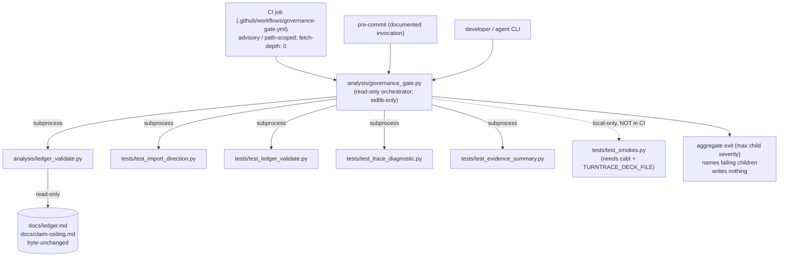

# Cycle-009 SDD — Mechanical Governance Floor: One Read-Only Gate Over the Existing Validators and Tests

> Software Design Document (planning artifact). Status: **ACCEPTED by operator; PRD accepted.** This SDD
> translates the accepted Cycle-009 PRD (`grimoires/loa/a2a/cycle-009/01-prd.md`) into a technical blueprint for
> `/sprint-plan` and `/implement`. It **builds no code, runs no eval, generates no evidence, chooses no candidate or
> numeric margin `M`, freezes no `K`/`n`/regime/feature-family/threshold, issues no SP-6, promotes no value, writes no
> ledger row, and advances no claim ceiling.** It designs *how* the Cycle-009 deliverables are shaped; the build itself
> lands only through `/sprint-plan → /implement → /review-sprint → /audit-sprint → operator acceptance` (OD-C9-7 build
> gate, `docs/operator/turntrace-loop-contract.md` §6).
>
> **Sanitized note.** No raw traces, card IDs/names, deck lists, hand contents, simulator logs, run-dir dumps, Pokémon
> Elements, episode data, `deck.csv` rows, `cg/` SDK, or Competition Data appear here. **No numeric margin `M` is chosen
> or stated.** The forbidden agent words (*strong / competitive / optimal / calibrated / complete*) and the inferential
> terms (*std-dev / variance / CI / p-value / significance / hypothesis-test / error-bar*) appear only as the
> negated/forbidden language they are. Any freezes-nothing-lint fixtures this cycle would produce use **synthetic tokens
> only** — never a real candidate, `M`, `K`/`n`, regime id, feature family, or threshold.
>
> **Posture (binding, carried from the PRD).** A green gate is **well-formedness only, never authorization.** The ledger
> (`docs/ledger.md`) remains the **only** ceiling-bearing artifact. The gate and the conditional lint **write nothing**
> and **carry no ceiling of their own.** The standing claim ceiling **remains Rung 2 — "beats random-legal."**

## 0. Baseline pinned (verified at SDD authoring, 2026-06-21)

| Pin | Value | Source |
|---|---|---|
| HEAD / branch | `main` @ `20aa6e2a9d6daad8f099448b4aba1f5c0ef07f6c` | `git rev-parse HEAD` |
| `origin/main` | `== local HEAD == 20aa6e2…` | task baseline |
| `docs/ledger.md` `git hash-object` | `7da7e9a8dbed6561669d1569445eb9fe67a953fb` | task baseline; PRD §0 |
| `docs/claim-ceiling.md` `git hash-object` | `3d99759b919f7d75bc41ea81cd82e5f1fb974be7` | task baseline; PRD §0 |
| Standing ceiling | **Rung 2 — beats random-legal** | `docs/claim-ceiling.md:10` |
| `.claude/` | untouched; `integrity_enforcement: strict` → no HALT | PRD §0 |
| Existing workflows | `.github/workflows/post-merge.yml` only (no validator/test invocation) | PRD §1; verified |
| Build config | **none** (no `pytest.ini`/`Makefile`/`conftest.py`/`tox.ini`/`setup.cfg`/`pyproject.toml`) | PRD §1; verified |
| Protected State-Zone dirt | `.beads/issues.jsonl`, `grimoires/loa/NOTES.md`, `grimoires/loa/README.draft.md` — unstaged, untouched | PRD §0 |

This SDD opens no implementation gate. PRD acceptance is recorded at `grimoires/loa/a2a/cycle-009/ACCEPTED.md`
(gitignored). No tracked `docs/cycles/cycle-009/` artifact is created at this step (operator-deferred promotion).

---

## 1. System overview

Cycle-008 wrote the governance controls (validators + conventions) and the tests; **nothing automatically runs them as
one gate**. Cycle-009 adds exactly one orchestration layer — a read-only **governance gate** — that invokes the
already-tested children, aggregates their `0/1/2/3` exits into a single pass/fail, names the failing children, fails
closed on an unreachable required prerequisite, and writes nothing. A CI job and/or documented pre-commit step invokes
the gate so the controls run on change rather than on memory. A **conditional** freezes-nothing lint is gated behind a
feasibility spike and ships only if the spike proves the negation-clause discriminator is not brittle.

The gate is **pure orchestration**: it contributes no new validation logic. It runs the existing children as
subprocesses, reads their exit codes, and reports an aggregate. This keeps the import-direction invariant intact and
makes "writes nothing" a structural property rather than a discipline.



**Zone placement.** The gate, lint, and tests live in `analysis/` and `tests/` (App Zone). The CI workflow lives in
`.github/workflows/` (App/CI Zone, **not** System Zone — in scope). `.claude/` is never touched.

---

## 2. Governance-gate placement (resolves PRD §9 / open-decision 1)

**Decision: the gate lives at `analysis/governance_gate.py`.**

Rationale:
- The research recommends `analysis/` (`00-pre-prd-research.md` §6 C9-MG-1); the validator family already lives there.
- It is stdlib-only and offline by construction, consistent with the whole `analysis/` zone (NFR-1).
- **Import-direction safety (C9-FR-2.3):** `analysis/` may import `analysis/` only (`tests/test_import_direction.py`
  `ALLOWED["analysis"] = set()`). The gate **MUST NOT** import `sim`, `cabt`, `eval`, or `agents.runtime`. Because the
  gate invokes its children as **subprocesses** (§3), it imports none of them — `test_import_direction.py` will continue
  to pass for `governance_gate.py` exactly as it does for the other `analysis/` modules. A grep-style assertion in the
  gate's own test pins that `governance_gate.py` imports stdlib only.

A shell-wrapper alternative (`scripts/governance-gate.sh`) was rejected: it would split logic between Python and shell,
complicate the writes-nothing test, and be harder to invoke uniformly across Windows-local and Linux-CI. A single Python
entrypoint is the smallest correct surface.

---

## 3. Child invocation model (resolves PRD §9 / open-decision 2; C9-FR-2.3)

**Decision: subprocess invocation only. The gate spawns each child as `python <path> [args]` and reads its exit code.**

Why subprocess over import:
1. **Import-direction invariant is preserved by construction.** The test children import `eval`/`sim`/`run_match`
   (verified: `tests/test_smokes.py:30-40`). If the gate *imported* a test module, `analysis/governance_gate.py` would
   transitively pull `eval`/`sim` into the `analysis/` zone — a hard import-direction violation. Subprocess invocation
   means the gate's own import graph stays stdlib-only; each child runs in its own interpreter with its own import graph.
2. **Writes-nothing is easier to prove.** A child subprocess that exits `0/1` cannot leak state into the gate's process;
   the gate only reads `returncode` and captured stdout/stderr.
3. **Exit codes are the existing contract.** Every child already exposes `raise SystemExit(main())` with `main() -> int`
   (verified for all five test modules and the three validators) — subprocess `returncode` reads that contract directly,
   with no need to refactor any child to be import-friendly.

**Invocation shape (per child):**
```
subprocess.run([sys.executable, "<child path>", *args],
               cwd=REPO_ROOT, capture_output=True, text=True,
               encoding="utf-8", timeout=<per-child>)
```
- `sys.executable` (not bare `"python"`) pins the same interpreter cross-platform.
- `cwd=REPO_ROOT` so children resolve `docs/ledger.md` and `REPO_ROOT`-relative paths identically.
- **`encoding="utf-8"` is mandatory on every subprocess (C9-FR-3.4; CF-D).** Windows defaults to cp1252, which mangles
  the ledger's UTF-8 em-dashes; the gate's reads MUST match the pin already in `ledger_validate.py:310-311`. A test
  asserts the gate passes `encoding="utf-8"` (source-grep, mirroring `test_ledger_validate.py`'s writes-nothing grep).
- `capture_output=True` so the gate can surface each child's diagnostic when it fails (it names the failing child and
  echoes the child's stderr tail).
- A per-child `timeout` (default e.g. 120s) so a hung child fails closed rather than blocking forever.

**Child registry (data, not code branches).** Children are declared as a list of records:
`(name, argv, subset, required)` where `subset ∈ {ci, local}` and `required ∈ {True, False}`. The gate iterates the
registry filtered by an invocation mode (`--mode ci` | `--mode local`, default `local`). This makes the CI/local
partition a one-line data edit and keeps OD-C9-4 (exact child list) a confirmable table rather than scattered logic.

---

## 4. Child check inventory (resolves PRD §9 / open-decision 3; C9-FR-2; OD-C9-4)

The child set is partitioned by prerequisite. Validators that require a *target file argument*
(`trace_diagnostic --validate <file>`, `evidence_summary --validate <file>`) are **already exercised end-to-end by their
dedicated test modules** over the committed fixture corpus — so the v1 gate invokes the **test modules** (which run the
validators against fixtures and assert behavior) plus the **whole-repo** `ledger_validate.py` (which needs no target
argument and reads the live tracked governance docs). This avoids the gate having to invent fixture paths.

### 4.1 CI-runnable subset (stdlib-only, simulator-free; `required: true`, `subset: ci`)

| # | Child | Invocation | What it checks | Exit |
|---|---|---|---|---|
| C1 | `analysis/ledger_validate.py` | `python analysis/ledger_validate.py` | live `docs/ledger.md` append-only + schema + single-regime + Rung-2 ceiling anchor; reads committed baseline via `git show HEAD:docs/ledger.md` | `0/1/2/3` |
| C2 | `tests/test_import_direction.py` | `python tests/test_import_direction.py` | `analysis/` imports `analysis/` only (AST) — protects the gate's own import-direction invariant | `0/1` |
| C3 | `tests/test_ledger_validate.py` | `python tests/test_ledger_validate.py` | exercises `ledger_validate` over poisoned/clean fixtures + writes-nothing + pinned-hash invariants | `0/1` |
| C4 | `tests/test_trace_diagnostic.py` | `python tests/test_trace_diagnostic.py` | exercises `trace_diagnostic --validate` (fail-closed sanitizer) over the poisoned fixture corpus | `0/1` |
| C5 | `tests/test_evidence_summary.py` | `python tests/test_evidence_summary.py` | exercises `evidence_summary` forbidden-word / one-regime validator over fixtures | `0/1` |

The three validators are thus covered: `ledger_validate` directly (C1) and behaviorally (C3); `trace_diagnostic`
behaviorally (C4); `evidence_summary` behaviorally (C5). A standalone `trace_diagnostic --validate <file>` /
`evidence_summary --validate <file>` invocation is **not** added to the v1 registry because it would require the gate to
choose a target file — redundant with C4/C5, which already validate over the curated corpus. (Adding direct validator
invocations is a documented future extension if a repo-wide scan target is ever defined.)

### 4.2 Local-only simulator-dependent subset (`required: true` in `--mode local`, **excluded from CI**; `subset: local`)

| # | Child | Invocation | Prerequisite | Exit |
|---|---|---|---|---|
| L1 | `tests/test_smokes.py` | `python -m unittest tests.test_smokes` (or `python tests/test_smokes.py`) | `cabt` + `TURNTRACE_DECK_FILE` (Competition Data — local/gitignored) | unittest `0/1` |

`test_smokes.py` imports `run_match`/`run_eval`/`scripted_baseline` and sets `TURNTRACE_DECK_FILE`
(verified `tests/test_smokes.py:30-40, 89-99`); these need the simulator and the deck file, which are **never in CI**
(`docs/cycles/cycle-008/01-prd.md` §13; `grimoires/loa/NOTES.md`). The gate MUST NOT include L1 in `--mode ci`. In
`--mode local`, the gate MUST detect prerequisite-unreachability (see §6 fail-closed) and **fail closed** rather than
silently skip when the local invocation declares the smokes required.

### 4.3 Optional / future children (NOT in v1)

- Direct `trace_diagnostic --validate <fixture>` / `evidence_summary --validate <fixture>` scans (redundant with C4/C5).
- `tests/test_e2e_validate.py` (does not yet exist — `e2e_validate.py` has no behavioral test, CF-F; out of scope §6).
- The freezes-nothing lint's own test (`tests/test_freezes_nothing.py`) — added **only if** the spike succeeds (§8).

**OD-C9-4 confirmation point:** the operator confirms the v1 registry is exactly {C1–C5} CI + {L1} local before
`/implement`. Membership is data in the gate's registry; the partition principle (CI = simulator-free) is binding.

---

## 5. Exit-code model (resolves PRD §9 / open-decision 4; C9-FR-1.4)

**Decision: the aggregate exit is the MAX child severity within the existing `0/1/2/3` family.**

| Aggregate exit | Meaning |
|---|---|
| `0` | every required child in the active mode exited `0` (gate green = well-formedness only) |
| `1` | at least one child exited `1` (input/prerequisite failure, fail-closed) and none exited `2`/`3` |
| `2` | at least one child exited `2` (structural refusal) and none exited `3` |
| `3` | at least one child exited `3` (governance/leak refusal) |

Properties (all test-pinned, §9):
- **Non-zero iff any required child is non-zero** (C9-FR-1.4). The aggregate is `max(child_exit for required children)`;
  it is `0` only when all required children are `0`.
- **Max-severity is preferred over a dedicated aggregate code** because it preserves the project's `0/1/2/3` semantics
  (an outside reader already knows `3 = governance refusal`); a novel aggregate code would discard that signal. The
  research and PRD both leave this open and note either is acceptable (C9-FR-1.4) — max-severity is the smaller, more
  legible choice.
- **An unexpected child exit (e.g. `4`, `127`, a crash/timeout) is clamped to a failure** — treated as `≥1` (fail-closed),
  never silently mapped to `0`. The gate records the raw code in its output for diagnosis.
- **Output names every failing child** (C9-FR-1.4): the gate prints, per failing child, `FAIL[<exit>] <name> — <argv>`
  plus the child's stderr tail, and a final `gate: FAIL (exit N) — failing: <names>` (or `gate: PASS (exit 0)`).
  Non-required children that fail are reported as `WARN`, not counted in the aggregate.

A human-readable summary goes to stderr; the aggregate integer is the process exit code. An optional `--json` flag emits
a machine-readable `{aggregate, children:[{name,exit,required,subset}]}` for CI log parsing (stdlib `json`; reads
nothing it did not already capture).

---

## 6. Read-only enforcement & fail-closed (resolves PRD §9 / open-decisions 5; C9-FR-1.3, C9-FR-1.5)

### 6.1 Read-only by construction

- The gate has **no `--fix`/`--write` mode**, performs no `open(..., 'w')`, no `Path.write_*`, no `mkdir`, no run-dir
  creation, no mutation of any `docs/` path, and no git mutation (`add`/`commit`/`push`/`reset`/`checkout`). Its only
  side effects are: subprocess spawns of read-only children, and reading their captured output.
- Because children run as subprocesses (§3), the gate cannot accidentally mutate `docs/ledger.md` itself; only
  `ledger_validate.py` touches the governance docs, and it is itself read-only (verified: `ledger_validate.py` docstring
  + `test_ledger_validate.py::t_writes_nothing`).
- A source-grep test asserts `governance_gate.py` contains no write/append/`open(...'w')`/`mkdir`/git-mutation call —
  the same grep pattern used by `test_ledger_validate.py`.

### 6.2 Hash-preservation proof (C9-FR-5.1; AC 5.2)

A test records `git hash-object docs/ledger.md` and `git hash-object docs/claim-ceiling.md`, runs the gate end-to-end,
re-reads both hashes, and asserts they are **byte-unchanged** at `7da7e9a8…` / `3d99759b…`. This is the mechanical
"writes nothing" proof carried over from the Cycle-008 S05 closeout pattern. The gate MAY also self-assert (opt-in) by
invoking `ledger_validate.py --expected-ledger-hash 7da7e9a8… --expected-ceiling-hash 3d99759b…` in a local mode — but
that pin is **off by default** in the gate registry because a *legitimate future ledger append* changes the hash and the
gate must remain reusable across cycles (mirroring `ledger_validate.py` docstring §6).

### 6.3 Fail-closed on unreachable required prerequisite (C9-FR-1.5)

The gate distinguishes "child reported a clean pass" from "child could not run":
- **Ledger baseline unreachable** (e.g. shallow CI checkout where `git show HEAD:docs/ledger.md` fails) → `ledger_validate`
  returns exit `1` (verified fail-closed path, `ledger_validate.py:370-374`). The gate **propagates** that `1` into the
  aggregate; it never swallows it. (CI mitigates the *cause* with full-history checkout, §7 — but the gate's behavior is
  correct even when the cause occurs.)
- **Local simulator prerequisite missing** (`cabt`/`TURNTRACE_DECK_FILE` absent) for a *required* local child →
  the child fails to import / errors. The gate maps a non-zero child exit (or a spawn/`ModuleNotFoundError` surfaced as a
  non-zero return) to a failure, never to `0`. A `--mode local` invocation that includes L1 as required therefore fails
  closed when the simulator is absent; an operator who runs the gate on a simulator-free machine selects `--mode ci`.
- **Child spawn failure / timeout / unexpected exit code** → clamped to failure (§5), with the raw cause in output.

The invariant: **a green gate requires that every required child actually ran and returned `0`** — an unreachable
prerequisite is a red gate, never a silent green.

---

## 7. CI / pre-commit design (resolves PRD §9 / open-decision 6; C9-FR-3; OD-C9-1, OD-C9-2)

### 7.1 CI workflow (App/CI Zone — `.github/workflows/governance-gate.yml`)

| Decision | Value | Source |
|---|---|---|
| Advisory vs required | **Advisory or path-scoped first** (does not block merge); promote to required only after it proves stable on HEAD | OD-C9-1; operator default; C9-FR-3.2 |
| Path scoping | trigger on changes under `analysis/**`, `tests/**`, `docs/ledger.md`, `docs/claim-ceiling.md`, `docs/cycles/**`, `.github/workflows/governance-gate.yml` | operator default (App/CI paths) |
| Checkout depth | **`fetch-depth: 0`** (full history) so `git show HEAD:docs/ledger.md` is reachable | OD-C9-2; C9-FR-3.3; R2 |
| Invocation | `python analysis/governance_gate.py --mode ci` | §3/§4 |
| CI child subset | C1–C5 only; **L1 (`test_smokes`) excluded** — `cabt`/deck never in CI | C9-FR-2.2; R3 |
| Encoding | runner is Linux (native UTF-8); the `encoding="utf-8"` pin is asserted cross-platform by C2/C3 | C9-FR-3.4; open-question 5 |
| Python | a pinned `actions/setup-python` (stdlib-only; no `pip install` of runtime deps) | NFR-1 |

The workflow is **separate from `post-merge.yml`** (which stays untouched — it does classify/semver/changelog/release).
The governance-gate workflow runs on PR / push to the scoped paths.

**Advisory mechanic.** "Advisory" is realized by **not** adding the workflow to branch-protection required-checks; the job
still runs and surfaces red/green in the PR checks UI. Promotion to "required" is a later operator act in repo settings,
out of this cycle's code scope. (Path-scoping via `on.paths` is the alternative/companion mechanic.)

### 7.2 Pre-commit (documented, not enforced)

A documented local invocation (in the cycle doc / README Tests section) rather than a committed `.pre-commit-config.yaml`
hook for v1:
```
# local pre-commit (documented; run before committing governance changes)
python analysis/governance_gate.py --mode local   # includes test_smokes if cabt+deck present
python analysis/governance_gate.py --mode ci       # the simulator-free subset
```
A committed pre-commit hook is deferred (it would interact with the stash-safety rules and is not required to close the
prose-vs-mechanical gap). The CI job is the binding "runs on change" mechanism; the documented hook is the developer
convenience.

---

## 8. Freezes-nothing feasibility spike (resolves PRD §9; C9-FR-4.1–4.3; OD-C9-3, OD-C9-5)

**The spike is a separate, read-only investigation that runs BEFORE any lint code is written.** Its only output is a
recorded build/defer recommendation; it writes no lint, freezes nothing, and adds no tracked fixture with real values.

### 8.1 The discriminator problem

`08c`/`08d` are saturated with **negation clauses** that literally enumerate `M` / `K` / `n` / regime id / feature
family / threshold as the things **NOT** frozen (verified `08d-rung3-form-only-semantics.md:20-21, §4`). A naive matcher
that flags any mention of these tokens would flag the very sentences asserting nothing is frozen — a false positive on
the freezes-nothing prose itself (R4). The spike must determine whether a discriminator can separate
**"token inside a declines-to-freeze clause"** from **"token as an actual freeze assertion."**

### 8.2 Spike method (read-only)

1. **Corpus read.** Read `08d` (and `08c` for breadth assessment) as the *clean* corpus — every freeze-token mention in
   them is, by construction, inside a negation/declines-to-freeze clause.
2. **Synthetic poisoned fixtures.** Construct in-memory (not tracked) synthetic *frozen-shape* sentences using
   **synthetic tokens only** — e.g. `candidate := <SYNTH-CAND>`, `M := <SYNTH-NUM>`, `K := <SYNTH-K>`,
   `regime := <SYNTH-REGIME>`, `feature-family := <SYNTH-FF>`, `threshold := <SYNTH-THRESH>` — phrased as affirmative
   freezes ("we freeze X to <synthetic value>").
3. **Discriminator candidates.** Evaluate a negation-aware rule: a freeze-token match counts as a *freeze* only when it
   is **not** within a bounded negation window (e.g. governed by "no", "not", "freezes no", "does not freeze",
   "without freezing", "explicitly does NOT freeze"). This is the same negation-window shape the sanitizer already uses
   for forbidden-word detection — the spike checks whether that shape transfers.
4. **Redundancy check.** Inspect whether `eval/hygiene_check.py` (or any existing validator) **already** asserts part of
   the freezes-nothing surface over `08d`, so the lint targets only the delta (C9-FR-4.2; open-question 2).

### 8.3 Decision gate (operator-visible; OD-C9-3)

- **FEASIBLE** ⇔ the discriminator **rejects every synthetic poisoned fixture** AND produces **zero false positives** on
  the existing `08c`/`08d` freezes-nothing text used as clean fixtures → **build the lint** (§9.1) scoped to `08d` v1.
- **BRITTLE** ⇔ any false positive on clean `08d`/`08c` text, or any synthetic freeze slips through → **defer the lint**;
  Cycle-009 ships the **governance-gate runner alone as the terminal deliverable** (AC 5.2; the cycle is complete and
  successful with the runner alone). The defer recommendation is recorded in the spike output and the cycle closeout.
- **Breadth (OD-C9-5).** Lint v1 target is **`08d` only** unless the spike proves the discriminator is also clean on
  `08c` with zero false positives; broadening to future Rung-3 form docs is a later decision.

The spike is its own sprint task (read-only; no build gate beyond reading repo files), sequenced **before** the
conditional lint task.

---

## 9. Freezes-nothing lint design — conditional, only if the spike succeeds (C9-FR-4.4–4.7)

If and only if §8 returns FEASIBLE, the lint is built as `analysis/freezes_nothing_lint.py`.

### 9.1 Lint contract

- **Read-only, stdlib-only.** Reads the target doc(s); writes nothing; exits `0/1/2/3` in the existing family
  (`0` = froze nothing / clean; `3` = a concrete freeze detected — governance refusal; `1` = unreadable target,
  fail-closed).
- **Scope v1 = `docs/cycles/cycle-008/08d-rung3-form-only-semantics.md`** (broaden to `08c` only if §8 proves it clean).
- **Rejects** a document that freezes a concrete **candidate identity / numeric `M` / `K`/`n` value / regime id /
  feature family / threshold** (C9-FR-4.5).
- **Accepts** the existing form-only `08d` (which freezes none of these) — proven by running the lint over the real
  tracked `08d` and asserting exit `0`.
- **Green output framing:** "froze no parameter," **never** "Rung 3 authorized" (C9-FR-4.6; carries no ceiling).

### 9.2 Fixtures (synthetic tokens only — NFR-7; C9-FR-4.6; R5)

| Class | Poisoned fixture (lint rejects) | Clean fixture (lint accepts) |
|---|---|---|
| candidate identity | `<SYNTH-CAND>` frozen as the target | negation clause naming `<…>` as NOT frozen |
| numeric `M` | `M := <SYNTH-NUM>` | "freezes no numeric margin `M`" |
| `K`/`n` | `K := <SYNTH-K>`, `n := <SYNTH-N>` | "no `K`/`n` is frozen" |
| regime id | `regime := <SYNTH-REGIME>` | "no regime id is selected" |
| feature family | `feature-family := <SYNTH-FF>` | "freezes no feature family" |
| threshold | `threshold := <SYNTH-THRESH>` | "no threshold is frozen" |

**No real candidate, real `M`, real `K`/`n`, real regime, real feature-family, or real threshold may enter any tracked
fixture.** Fixtures live under `tests/fixtures/freezes_nothing/{poisoned,clean}/` and use synthetic placeholder tokens
exclusively. A test asserts the fixture files contain none of the real-value shapes (e.g. no 40/64-hex, no real
`regime-vNNN` token matching the live ledger, no decimal margin) — a self-guard against accidental real-value leak.

### 9.3 Parity pin if regexes are reused (C9-FR-4.7; R6)

If the lint reuses any `M`/governance regex family from `analysis/trace_diagnostic.py`, it copies them (import-direction
forbids `analysis/` cross-imports of non-`analysis/` modules, but intra-`analysis/` import IS allowed — the lint may
`from trace_diagnostic import <PATTERN>` since both are in `analysis/`). **Preferred:** import the shared pattern from
`trace_diagnostic` directly (no copy → no drift). If a copy is unavoidable, a **pinned parity test** binds the copy to
its source so it cannot silently drift (mirrors the existing pairwise parity tests, CF-H).

---

## 10. Test strategy (resolves PRD §9 / open-decision 9; C9-FR-1/2/3, AC 5.2)

New test module `tests/test_governance_gate.py` (stdlib `unittest` or plain-assert, parity with the existing suite;
`raise SystemExit(main())` so it is itself a gate child-eligible module). All tests are offline, stdlib-only, and use
synthetic injected children where failure injection is needed.

| # | Test | Asserts | PRD AC |
|---|---|---|---|
| TG1 | **Child failure injection** | a synthetic child that exits `1`/`2`/`3` makes the aggregate non-zero | 5.2 "non-zero when a child fails" |
| TG2 | **Nonzero aggregation = max severity** | mixed child exits `{0,1,3}` → aggregate `3`; `{0,0}` → `0`; an exit `127`/crash → clamped to failure | C9-FR-1.4; §5 |
| TG3 | **Failed-check naming** | output names each failing child + its argv; passing children are not named as failures | C9-FR-1.4 |
| TG4 | **Writes-nothing (source grep)** | `governance_gate.py` contains no write/`open('w')`/`mkdir`/git-mutation call; imports stdlib only | C9-FR-1.3; §6.1 |
| TG5 | **Hash-preservation (end-to-end)** | `git hash-object` of `docs/ledger.md` (`7da7e9a8…`) and `docs/claim-ceiling.md` (`3d99759b…`) byte-unchanged before/after a real gate run | 5.2; §6.2 |
| TG6 | **Fail-closed on unreachable prerequisite** | a child that reports baseline-unreachable (exit `1`) is propagated, not swallowed → aggregate non-zero | C9-FR-1.5; §6.3 |
| TG7 | **CI/local partition** | `--mode ci` registry excludes L1 (`test_smokes`); `--mode local` includes it; the CI subset names only simulator-free children | C9-FR-2.2; §4 |
| TG8 | **Encoding pin** | the gate passes `encoding="utf-8"` on every subprocess (source grep) | C9-FR-3.4 |
| TG9 | **Import-direction preserved** | `tests/test_import_direction.py` passes with `governance_gate.py` present (it imports `analysis/`-stdlib only) | C9-FR-2.3 |
| TG10 | **Self-test as child** | running the gate over a registry that includes the live C1–C5 returns `0` on HEAD (green-on-HEAD smoke) | 10.1 |

**Conditional (only if the lint ships) — `tests/test_freezes_nothing.py`:**

| # | Test | Asserts | PRD AC |
|---|---|---|---|
| FN1 | **Poisoned-fixture rejection** | each synthetic frozen-shape fixture → lint exit `3` (one per class: candidate/`M`/`K`-`n`/regime/feature-family/threshold) | 5.2; C9-FR-4.5 |
| FN2 | **Clean-fixture acceptance** | each synthetic negation-clause fixture → lint exit `0` | 5.2; C9-FR-4.5 |
| FN3 | **Real-`08d` acceptance** | lint over the tracked `08d` → exit `0` (no false positive on the freezes-nothing prose) | 5.2; C9-FR-4.5 |
| FN4 | **No-real-value guard** | fixtures contain no real candidate/`M`/`K`-`n`/regime/feature-family/threshold shapes | C9-FR-4.6; R5 |
| FN5 | **Parity pin (if regex reused)** | reused pattern equals its `trace_diagnostic` source | C9-FR-4.7; R6 |

**Spike has no shipped test artifact** beyond its recorded recommendation (it is read-only investigation); its synthetic
fixtures are in-memory and not tracked unless the lint ships (then they become FN1/FN2 fixtures).

---

## 11. Non-goals (restated — C9-FR-5; PRD §6)

Cycle-009 does **NOT**: attempt Rung 3; select a Rung-3 target or candidate; freeze `M`/`K`/`n`/regime id/feature
family/threshold; create SP-6; write or modify a ledger row; advance the claim ceiling; introduce a numeric `M` into any
tracked artifact; run fresh eval / generate fresh evidence / create any run dir; modify any runtime agent
(`agents/runtime/*`), `sim/*`, or the heuristic surface; build any FunSearch / RL / self-play / MCTS / value-model /
deck-optimizer / tournament / dashboard / Kaggle-submission surface; build a pre-registration template or commit-order
verifier; fill the strategy-report with evidence-dependent content or build a per-decision quality detector; add
simulator instrumentation; edit `.claude/` (System Zone); or stage/clean/reconcile the protected State-Zone dirt
(`.beads/issues.jsonl`, `grimoires/loa/NOTES.md`, `grimoires/loa/README.draft.md`) — those stay unstaged/untouched
unless a separate operator decision (OD-C9-6) authorizes it. **State-Zone reconciliation is out of scope for Cycle-009.**

`docs/ledger.md` stays byte-unchanged at `7da7e9a8…`; `docs/claim-ceiling.md` unchanged at `3d99759b…`; ceiling stays
**Rung 2**. The gate and lint carry **no ceiling of their own**; a green result is **well-formedness, not
authorization.**

---

## 12. Acceptance mapping (resolves PRD §9 / open-decision 11)

Every PRD functional requirement and acceptance criterion mapped to an SDD component and a proposed test/check.

| PRD requirement | SDD component | Proposed test/check |
|---|---|---|
| **C9-FR-1.1** one tracked gate entrypoint | §2 `analysis/governance_gate.py` | TG10 (runs, reports single pass/fail) |
| **C9-FR-1.2** stdlib-only | §2 placement; §3 subprocess | TG4/TG9 (imports stdlib only) |
| **C9-FR-1.3** read-only (no `--fix`/writes/git-mutation) | §6.1 | TG4 (source grep) |
| **C9-FR-1.4** aggregate exits + name failures; non-zero iff any child non-zero | §5 max-severity model | TG1, TG2, TG3 |
| **C9-FR-1.5** fail closed on unreachable prerequisite | §6.3 | TG6 |
| **C9-FR-2.1** include existing validators + test modules | §4.1/§4.2 registry | TG10 (live C1–C5 green on HEAD) |
| **C9-FR-2.2** partition CI-runnable vs local-only; `test_smokes` not CI-required | §4.1/§4.2; §7.1 | TG7 |
| **C9-FR-2.3** preserve import-direction (subprocess, no `sim`/`eval` import) | §3 subprocess model | TG9, C2 child |
| **C9-FR-3.1** CI and/or pre-commit invocation | §7.1 workflow; §7.2 documented hook | workflow green on HEAD (TG10 mirror in CI) |
| **C9-FR-3.2** advisory vs required surfaced; default advisory/path-scoped | §7.1 OD-C9-1 | workflow not in required-checks (advisory) |
| **C9-FR-3.3** full-history checkout if ledger validator in CI | §7.1 `fetch-depth: 0` | CI config review |
| **C9-FR-3.4** `encoding='utf-8'` on git subprocess preserved | §3 invocation; §6.2 | TG8 (source grep) |
| **C9-FR-4.1** feasibility spike on negation-clause discriminator | §8 | spike recommendation recorded |
| **C9-FR-4.2** check `hygiene_check.py` overlap | §8.2 step 4 | spike redundancy note |
| **C9-FR-4.3** build-vs-defer decision gate | §8.3 OD-C9-3 | spike output (FEASIBLE/BRITTLE) |
| **C9-FR-4.4** lint read-only/stdlib, v1 scope `08d` | §9.1 | FN3 (real `08d` accepted) |
| **C9-FR-4.5** reject concrete freeze; accept form-only `08d` | §9.1/§9.2 | FN1, FN2, FN3 |
| **C9-FR-4.6** synthetic-token fixtures; green ≠ authorization | §9.2 | FN4 (no-real-value guard) |
| **C9-FR-4.7** pinned parity test if regex reused | §9.3 | FN5 |
| **C9-FR-5.1** ledger/ceiling byte-unchanged; no row/SP-6/ceiling move | §6.2; §11 | TG5 (hash preservation) |
| **C9-FR-5.2** ledger only ceiling-bearing; green = well-formedness | §1/§5/§11 posture | doc framing + TG10 |
| **AC 5.2 governance gate** (writes nothing; nonzero on child fail; fail-closed; full-history; no cabt in CI) | §2–§7 | TG1, TG4, TG5, TG6, TG7, TG8 |
| **AC 5.2 freezes-nothing lint (if ships)** | §9 | FN1–FN5 |
| **AC 5.2 spike fail → defer allowed, runner terminal** | §8.3 | spike decision gate |
| **AC 5.3 hard invariants** | §11 | TG5 + closeout hash assertions |
| **AC 10.1 mechanical closeout** | §6.2; §7.1; §8.3 | TG5, TG10, CI-green, spike record |

---

## 13. Open issues for sprint planning (deferred to `/sprint-plan`)

These are SDD-resolved at the *design* level but require sprint-decomposition or an operator confirmation:

1. **Sprint decomposition.** Suggested shape: **SP-A** governance-gate runner + tests (C1–C5 CI, L1 local, TG1–TG10);
   **SP-B** CI workflow + documented pre-commit (§7); **SP-C** freezes-nothing **spike** (read-only, §8) →
   **SP-D conditional** freezes-nothing lint + fixtures + tests (§9, only if SP-C returns FEASIBLE). `/sprint-plan` owns
   the final breakdown and ordering (SP-C **must** precede SP-D).
2. **OD-C9-4 confirmation.** Operator confirms the exact v1 child registry {C1–C5 CI; L1 local} before `/implement`.
3. **OD-C9-1 final mechanic.** Whether the CI job ships purely advisory, purely path-scoped, or both, at `/sprint-plan`.
4. **OD-C9-5 lint breadth.** `08d`-only vs `08d`+`08c` — decided by the SP-C spike output, not pre-committed here.
5. **OD-C9-3 terminal-deliverable acceptance.** If SP-C returns BRITTLE, the cycle ships SP-A/SP-B alone as terminal;
   the operator accepts the runner as the complete deliverable.
6. **Promotion of planning artifacts.** Whether/when `01-prd.md` / `02-sdd.md` / sprint-plan are promoted from the
   gitignored a2a area into tracked `docs/cycles/cycle-009/` (operator-deferred; not done at this step).
7. **OD-C9-7 build gate.** Opens after sprint-plan, scoped to `analysis/` / `tests/` / `.github/`.

---

## 14. Risks (carried from PRD §7, mapped to SDD mitigations)

| ID | Risk | SDD mitigation |
|---|---|---|
| R1 | Gate drifts into a writer/authorizer | §6.1 no `--fix`/writes; TG4 source grep; posture framing §1/§11 |
| R2 | CI false-failure on shallow checkout | §7.1 `fetch-depth: 0`; §6.3 fail-closed is correct even if it occurs |
| R3 | Competition-Data leak into CI | §4.1/§4.2 partition; §7.1 CI excludes L1; TG7 |
| R4 | Lint false-positives on freezes-nothing prose | §8 spike first; build only if zero false positives; FN3 |
| R5 | Real frozen parameter in a tracked fixture | §9.2 synthetic tokens only; FN4 no-real-value guard |
| R6 | Parity-copy drift | §9.3 prefer intra-`analysis/` import; pinned parity test FN5 |
| R7 | Encoding regression (cp1252) | §3/§6.2 `encoding="utf-8"` on every subprocess; TG8 |
| R8 | Scope creep toward Rung 3 | §11 non-goals; lint detects freezes, introduces none |
| R9 | Ledger / claim-ceiling drift | §6.2 hash pins; TG5; gate writes nothing |
| R10 | Required CI blocks legitimate merges before proven stable | §7.1 advisory/path-scoped first (OD-C9-1) |
| R11 | `.claude/` / State-Zone pollution | §11 System Zone untouched; protected dirt unstaged/uncleaned |
| R12 | Overclaim — green gate misread as strength/admission | §1/§5/§11 green = well-formedness only; ledger remains evidence-admission authority |

---

## 15. Sources and traceability

> **Accepted planning inputs (gitignored State Zone):** `grimoires/loa/a2a/cycle-009/01-prd.md` (accepted PRD);
> `grimoires/loa/a2a/cycle-009/00-pre-prd-research.md` (accepted pre-PRD research — C9-MG-1 runner + deferred S04.4 lint
> behind a feasibility spike); `grimoires/loa/a2a/cycle-009/ACCEPTED.md` (operator acceptance record).
> **Tracked governance authorities:** `docs/claim-ceiling.md:10` (Rung 2; forbidden words; no cross-regime);
> `docs/ledger.md` (the only ceiling-bearing artifact; 18-column schema); `docs/cycles/cycle-008/09-s05-closeout.md`
> (§8.6 UTF-8 pin; §8.7/§8.9 deferred lint + conventions not mechanically enforced);
> `docs/cycles/cycle-008/08b-ledger-metric-column-convention.md` §6–§7 (validator is a gate, green = well-formedness,
> not authorization); `docs/cycles/cycle-008/08c-blocked-family-map.md` §3 (blocked families);
> `docs/cycles/cycle-008/08d-rung3-form-only-semantics.md` (the form-only Rung-3 doc the lint targets; §4 freezes-nothing);
> `docs/cycles/cycle-008/01-prd.md` §13 (Competition-Data containment); `docs/operator/turntrace-loop-contract.md` §1/§6.
> **Tracked code (reality grounding at `20aa6e2`):** `analysis/ledger_validate.py` (read-only `0/1/2/3` gate;
> `encoding='utf-8'` git reads at L310-311; fail-closed unreachable baseline L370-374; pinned hash constants L86-87);
> `analysis/trace_diagnostic.py` (`--validate` fail-closed sanitizer; `main()` L681; `0/1/2/3`);
> `analysis/evidence_summary.py` (`--validate` forbidden-word validator; `main()` L569);
> `tests/test_import_direction.py` (`analysis/` may import `analysis/` only; `ALLOWED["analysis"]=set()`);
> `tests/test_ledger_validate.py` / `test_trace_diagnostic.py` / `test_evidence_summary.py` (each `main()->int`,
> `raise SystemExit(main())` — subprocess-runnable, exit `0/1`); `tests/test_smokes.py` (unittest; imports
> `run_match`/`run_eval`/`scripted_baseline`, sets `TURNTRACE_DECK_FILE` L89-99 — simulator-dependent, local-only);
> `.github/workflows/post-merge.yml` (only existing workflow; invokes no validator/test).
> Current main at authoring: `20aa6e2` (== `origin/main`). Claim ceiling: **Rung 2 (unchanged).** This SDD opens no
> implementation gate, builds no code, runs no eval, chooses no `M`, selects no candidate, issues no SP-6, writes no
> ledger row, advances no ceiling, mutates no ledger, and edits no `.claude/`.

---

> **SDD statement (binding).** Cycle-009 builds **one read-only governance gate** —
> `analysis/governance_gate.py`, stdlib-only, that **subprocess-invokes** the existing validators and stdlib test
> modules (CI subset C1–C5 simulator-free; local-only L1 `test_smokes` excluded from CI), **aggregates their `0/1/2/3`
> exits as max severity** (non-zero iff any required child is non-zero), **names every failing child**, **fails closed**
> on an unreachable required prerequisite, **passes `encoding="utf-8"` on every git subprocess**, and **writes nothing**
> (proven by a source-grep writes-nothing test and a `git hash-object` byte-unchanged test). A **separate, path-scoped /
> advisory CI workflow** (`.github/workflows/governance-gate.yml`, `fetch-depth: 0`) and a **documented pre-commit
> invocation** run the gate on change. A **freezes-nothing lint** is **conditional**: a read-only **feasibility spike**
> tests whether a negation-clause discriminator can separate an actual freeze from the freezes-nothing negation clauses
> in `08d`; the lint (read-only, stdlib-only, v1-scoped to `08d`, synthetic-token fixtures only) ships **only if** the
> spike returns FEASIBLE — otherwise the runner ships **alone** as the terminal deliverable. The gate and the lint
> **carry no ceiling**; a green gate is **well-formedness, not authorization.** `docs/ledger.md` stays byte-unchanged at
> `7da7e9a8dbed6561669d1569445eb9fe67a953fb`; `docs/claim-ceiling.md` is unchanged at
> `3d99759b919f7d75bc41ea81cd82e5f1fb974be7`; the standing claim ceiling **remains Rung 2 — "beats random-legal."**
