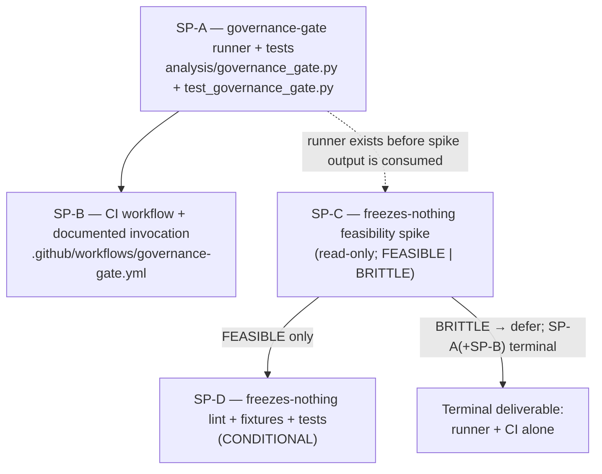
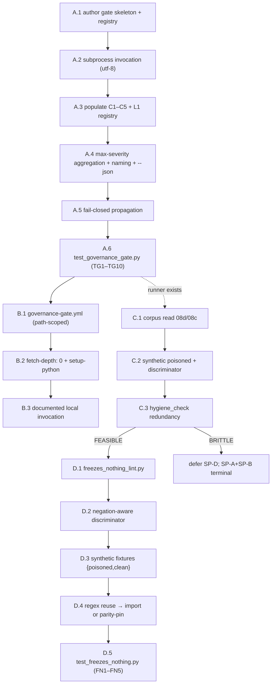
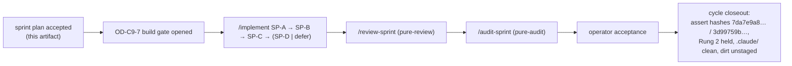

# Cycle-009 Sprint Plan — Mechanical Governance Floor: One Read-Only Gate Over the Existing Validators and Tests

> Planning artifact (Sprint Plan). Status: **ACCEPTED by operator; PRD accepted, SDD accepted.** This sprint
> plan converts the accepted Cycle-009 SDD (`grimoires/loa/a2a/cycle-009/02-sdd.md`) into an implementation-ready
> sprint decomposition for `/implement → /review-sprint → /audit-sprint → operator acceptance`. It **builds no code,
> runs no eval, generates no evidence, creates no run dir, chooses no candidate or numeric margin `M`, freezes no
> `K`/`n`/regime/feature-family/threshold, issues no SP-6, promotes no value, writes no ledger row, advances no claim
> ceiling, edits no `.claude/`, and stages/commits/pushes nothing.** It designs *what each sprint must hold*; the build
> itself lands only behind the OD-C9-7 build gate (`docs/operator/turntrace-loop-contract.md` §6).
>
> **Sanitized note.** No raw traces, card IDs/names, deck lists, hand contents, simulator logs, run-dir dumps, Pokémon
> Elements, episode data, `deck.csv` rows, `cg/` SDK, or Competition Data appear here. **No numeric margin `M` is chosen
> or stated.** The forbidden agent words (*strong / competitive / optimal / calibrated / complete*) and the inferential
> terms (*std-dev / variance / CI / p-value / significance / hypothesis-test / error-bar*) appear only as the
> negated/forbidden language they are. Any freezes-nothing-lint fixtures Cycle-009 would produce use **synthetic tokens
> only** — never a real candidate, `M`, `K`/`n`, regime id, feature family, or threshold.
>
> **Posture (binding, carried from PRD/SDD).** A green gate is **well-formedness only, never authorization.** The ledger
> (`docs/ledger.md`) remains the **only** ceiling-bearing artifact. The gate and the conditional lint **write nothing**
> and **carry no ceiling of their own.** The standing claim ceiling **remains Rung 2 — "beats random-legal."**

## 0. Baseline pinned (verified at sprint-plan authoring, 2026-06-21)

| Pin | Value | Source |
|---|---|---|
| HEAD / branch | `main` @ `20aa6e2a9d6daad8f099448b4aba1f5c0ef07f6c` | task baseline; PRD §0; SDD §0 |
| `origin/main` | `== local HEAD == 20aa6e2…` | task baseline |
| `docs/ledger.md` `git hash-object` | `7da7e9a8dbed6561669d1569445eb9fe67a953fb` | task baseline; PRD §0 |
| `docs/claim-ceiling.md` `git hash-object` | `3d99759b919f7d75bc41ea81cd82e5f1fb974be7` | task baseline; PRD §0 |
| Standing ceiling | **Rung 2 — beats random-legal** | `docs/claim-ceiling.md:10` |
| `.claude/` | untouched; `integrity_enforcement: strict` → no HALT | PRD §0 |
| Existing workflows | `.github/workflows/post-merge.yml` only (invokes no validator/test) | PRD §1; verified |
| Build config | **none** (no `pytest.ini`/`Makefile`/`conftest.py`/`tox.ini`/`setup.cfg`/`pyproject.toml`) | PRD §1; verified |
| Existing `analysis/` modules | `aggregate, delta_report, dispersion_report, e2e_validate, evidence_summary, failure_report, ledger_validate, replay_check, trace_diagnostic` | verified `ls analysis/*.py` |
| Existing `tests/` modules | `test_evidence_summary, test_import_direction, test_ledger_validate, test_smokes, test_trace_diagnostic` | verified `ls tests/*.py` |
| Protected State-Zone dirt | `.beads/issues.jsonl`, `grimoires/loa/NOTES.md`, `grimoires/loa/README.draft.md` — unstaged, untouched | PRD §0 |

**SDD acceptance is recorded** at `grimoires/loa/a2a/cycle-009/ACCEPTED.md` (PRD acceptance marker; the operator task that
delivered this sprint plan states "The SDD is accepted as the architecture direction"). No tracked `docs/cycles/cycle-009/`
artifact is created at this step (operator-deferred promotion — OD-C9 promotion decision in §6 below). This sprint plan
opens no implementation gate.

### 0.1 Grounding re-verified for this plan (live code at `20aa6e2`)

The SDD's reality claims were independently re-checked so the per-sprint acceptance criteria below cite real behavior:

- **`analysis/ledger_validate.py`** — `git_show`/`git_hash_object` pin `encoding="utf-8"` (lines 311, 324); unreachable
  committed baseline returns `EXIT_INPUT` (exit 1) fail-closed (lines 370–374); `validate()` aggregates as max severity
  (lines 347–353); opt-in `--expected-ledger-hash`/`--expected-ceiling-hash` pins exist (lines 386+); `main()` accepts
  both positional `[REAL_LEDGER]` and `--ledger/--claim-ceiling` shapes; `raise SystemExit(main())`.
- **`tests/test_import_direction.py`** — `ALLOWED["analysis"] = set()` (line 36); exposes `_module_zone_map()`,
  `_top_imports(path)`, `check()`; `main()` returns 0/1; `raise SystemExit(main())`. A new `analysis/*.py` is auto-scanned
  by `_module_zone_map()`'s `glob("*.py")`, so `governance_gate.py` (and a conditional `freezes_nothing_lint.py`) enter
  the import-direction lint's scanned set **automatically**.
- **`tests/test_smokes.py`** — imports `run_match`/`run_eval`/`scripted_baseline`/`adapter` from `sim`/`eval`/`agents/runtime`
  (lines 26–42) and sets `TURNTRACE_DECK_FILE`; `unittest`-based; runs as `python tests/test_smokes.py`. Confirms it
  transitively needs the simulator + deck file → correctly **local-only, excluded from CI**.
- **C4/C5 CLI coverage (operator review note #2) — already satisfied, verified:**
  - `tests/test_trace_diagnostic.py` drives the **actual CLI/main validator** over the real fixture corpus:
    `td.main(["--validate", <fixture>])` asserting clean→exit 0 (line 310), missing→exit 1 (line 364),
    multi-regime→exit 2 (line 371), poisoned→exit 3 (lines 377, 432). This is real `main()`/CLI behavior over fixtures,
    not internal-helper-only coverage.
  - `tests/test_evidence_summary.py` drives `es.main(["--validate", <fixture>])` and `es.main(["--promotion-check", …])`
    over fixtures (lines 80, 91, 242, 452), including mixed-regime→exit 2 (line 452). Real `main()`/CLI coverage.
  - Both validators expose real argparse `main()` with `--validate` (`trace_diagnostic.py:681`, `evidence_summary.py:569`)
    and `raise SystemExit(main())`. **Conclusion:** C4 and C5 already exercise the CLI validator behavior over fixtures;
    Cycle-009 must only *preserve* that (no new validator logic). See §3 SP-A acceptance and §9 review/audit focus.
- **`tests/test_ledger_validate.py`** — already carries the writes-nothing source-grep (`t_writes_nothing`, lines 348–360:
  asserts no `write_text`/`open(`/etc. and only read-only git `show`+`hash-object`) and a real-ledger-byte-unchanged
  before/after-run check (lines 171–173). These are the exact patterns SP-A's gate tests mirror.
- **Fixture corpus** — `tests/fixtures/diagnostic/{clean,mixed,poisoned}` (poisoned = 11 files; clean/mixed generated at
  runtime by the tests) + `tests/fixtures/ledger_validate` (2 files). Confirms the SDD §4 decision: the gate invokes the
  **test modules** (which build/validate fixtures themselves) rather than inventing fixture paths.

---

## Executive summary

**MVP scope.** One read-only governance gate (`analysis/governance_gate.py`) that subprocess-invokes the existing
validators + stdlib test modules, aggregates their `0/1/2/3` exits as max severity, names every failing child, fails
closed on an unreachable required prerequisite, and writes nothing — plus its test module, an advisory/path-scoped CI
workflow with `fetch-depth: 0`, a documented local invocation, a read-only feasibility spike for the deferred S04.4
freezes-nothing lint, and **conditionally** (only if the spike returns FEASIBLE) the lint itself with synthetic-token
fixtures and tests.

**Total sprints: four (SP-A … SP-D), SP-D conditional.** There is **no SP-6** (the SP-* identifiers here are sprint ids
local to Cycle-009; "SP-6" in the constraints refers to the Cycle-007 promotion act, which is forbidden — these sprint
ids do not collide with that meaning and none of them promote anything).

| Sprint | Title | Scope | Tasks | Gate? | Precedes |
|---|---|---|---|---|---|
| **SP-A** | Governance-gate runner + tests | MEDIUM | 6 | App-Zone (`analysis/`, `tests/`) | required by SP-B, SP-D |
| **SP-B** | CI workflow + documented local invocation | SMALL | 3 | App/CI-Zone (`.github/`, docs) | depends on SP-A |
| **SP-C** | Freezes-nothing feasibility spike (read-only) | SMALL | 3 | Read-only investigation (no build gate) | gates SP-D |
| **SP-D** | Freezes-nothing lint + fixtures + tests (**conditional**) | SMALL/MEDIUM | 5 | App-Zone (`analysis/`, `tests/`) | **only if SP-C = FEASIBLE** |

**Dependency spine.** SP-A → SP-B (CI invokes the gate SP-A builds). SP-A → SP-C (spike reads repo files; can run in
parallel with SP-A/SP-B but its output is consumed after the runner exists). **SP-C → SP-D is hard**: the lint MUST NOT
be built before its feasibility spike returns FEASIBLE. If SP-C returns BRITTLE, SP-D is **deferred** and SP-A (+SP-B)
ship **alone** as the **terminal deliverable** (AC 5.2; OD-C9-3).

**What this cycle does not do** is restated as a hard invariant block applied to *every* sprint in §8.

---

## SP-A — Governance-gate runner + tests

| Field | Value |
|---|---|
| **Sprint id** | SP-A (Cycle-009) |
| **Title** | Governance-gate runner + tests |
| **Scope** | **MEDIUM** (6 tasks) |
| **Sprint Goal** | Land one read-only, stdlib-only `analysis/governance_gate.py` that subprocess-invokes the existing validators + stdlib test modules, aggregates their `0/1/2/3` exits as max severity, names failing children, fails closed on unreachable required prerequisites, writes nothing, and is proven by a new test module. |

### Files / directories in scope (SP-A)
- **Create:** `analysis/governance_gate.py` (the read-only orchestrator).
- **Create:** `tests/test_governance_gate.py` (TG1–TG10).
- **Read-only references (not modified):** `analysis/ledger_validate.py`, `analysis/trace_diagnostic.py`,
  `analysis/evidence_summary.py`, `tests/test_import_direction.py`, `tests/test_ledger_validate.py`,
  `tests/test_trace_diagnostic.py`, `tests/test_evidence_summary.py`, `tests/test_smokes.py`, `docs/ledger.md`,
  `docs/claim-ceiling.md`.

### Non-goals (SP-A)
- No new validation logic — the gate is **pure orchestration** (SDD §1). It adds no rule, no regex, no allow-list.
- No `--fix`/`--write` mode; no file writes; no `mkdir`; no run-dir creation; no git mutation
  (`add`/`commit`/`push`/`reset`/`checkout`).
- Does **not** modify any child validator or test module (C4/C5 already cover the CLI — SP-A must not "improve" them).
- Does **not** add a direct `trace_diagnostic --validate <file>` / `evidence_summary --validate <file>` child to the v1
  registry (redundant with C4/C5; SDD §4.1/§4.3). Documented as a future extension only.
- Does **not** wire CI (that is SP-B).

### Implementation tasks (SP-A)
- [ ] **A.1 → [G-1][G-4]** Author `analysis/governance_gate.py` as a stdlib-only read-only orchestrator. Child registry is
  **data, not branches**: a list of records `(name, argv, subset, required)` with `subset ∈ {ci, local}`,
  `required ∈ {True, False}` (SDD §3). Invocation mode via `--mode {ci,local}` (default per OD-C9-D-default in §10 —
  **recommended default `ci`**, the simulator-free subset; see §10 OD).
- [ ] **A.2 → [G-1]** Implement the per-child subprocess call exactly per SDD §3:
  `subprocess.run([sys.executable, "<child path>", *args], cwd=REPO_ROOT, capture_output=True, text=True,
  encoding="utf-8", timeout=<per-child default e.g. 120s>)`. Use `sys.executable` (not bare `"python"`). **`encoding="utf-8"`
  is mandatory on every subprocess** (C9-FR-3.4; mirrors `ledger_validate.py:311`).
- [ ] **A.3 → [G-2]** Populate the v1 registry with the SDD §4 child inventory (pending OD-C9-4 confirmation):
  - CI subset (`subset: ci`, `required: True`): **C1** `analysis/ledger_validate.py` (whole-repo, no target arg);
    **C2** `tests/test_import_direction.py`; **C3** `tests/test_ledger_validate.py`; **C4** `tests/test_trace_diagnostic.py`;
    **C5** `tests/test_evidence_summary.py`.
  - Local subset (`subset: local`, `required: True` in `--mode local`, **excluded from `--mode ci`**): **L1**
    `tests/test_smokes.py` (needs `cabt` + `TURNTRACE_DECK_FILE`).
- [ ] **A.4 → [G-3]** Implement max-severity aggregation in the `0/1/2/3` family (SDD §5): aggregate =
  `max(child_exit for required children in the active mode)`; non-zero **iff** any required child is non-zero. Clamp any
  unexpected child exit (`4`, `127`, crash, timeout) to a **failure** (≥1, never silent 0), recording the raw code. Emit a
  human-readable summary to stderr (`FAIL[<exit>] <name> — <argv>` + child stderr tail; final
  `gate: FAIL (exit N) — failing: <names>` or `gate: PASS (exit 0)`); non-required failing children reported as `WARN`,
  not counted. Add an optional `--json` flag (`{aggregate, children:[{name,exit,required,subset}]}`, stdlib `json`).
- [ ] **A.5 → [G-1][G-3]** Implement fail-closed propagation (SDD §6.3): an unreachable required prerequisite (e.g.
  `ledger_validate` returns exit 1 on an unreachable `git show HEAD:docs/ledger.md` baseline; or a required local child
  errors because `cabt`/`TURNTRACE_DECK_FILE` is absent) is **propagated** into the aggregate, never swallowed to 0. A
  child spawn failure / `ModuleNotFoundError` surfaced as a non-zero return maps to a failure.
- [ ] **A.6 → [G-1][G-2][G-3][G-4]** Author `tests/test_governance_gate.py` (TG1–TG10 below), stdlib `unittest` or
  plain-assert with `raise SystemExit(main())` so the module is itself gate-child-eligible. Failure injection uses
  **synthetic injected children** (tiny throwaway scripts in a tempdir that `sys.exit(N)`), never a real child mutated to
  fail.

### Required tests / checks (SP-A) — `tests/test_governance_gate.py`

| # | Test | Asserts | PRD AC |
|---|---|---|---|
| **TG1** | Child failure injection | a synthetic child exiting `1`/`2`/`3` makes the aggregate non-zero | 5.2 "non-zero when a child fails" |
| **TG2** | Nonzero aggregation = max severity | mixed `{0,1,3}` → `3`; `{0,0}` → `0`; exit `127`/crash → clamped to failure | C9-FR-1.4; SDD §5 |
| **TG3** | Failed-check naming | output names each failing child + its argv; passing children not named as failures | C9-FR-1.4 |
| **TG4** | Writes-nothing (source grep) | `governance_gate.py` contains no `write_text`/`write_bytes`/`open(...'w')`/`mkdir`/git-mutation call; imports stdlib only (mirror `test_ledger_validate.py::t_writes_nothing`) | C9-FR-1.3; SDD §6.1 |
| **TG5** | Hash-preservation (end-to-end) | `git hash-object docs/ledger.md` (`7da7e9a8…`) and `docs/claim-ceiling.md` (`3d99759b…`) byte-unchanged before/after a real gate run | 5.2; SDD §6.2 |
| **TG6** | Fail-closed on unreachable prerequisite | a child reporting baseline-unreachable (exit 1) is propagated, not swallowed → aggregate non-zero | C9-FR-1.5; SDD §6.3 |
| **TG7** | CI/local partition | `--mode ci` registry excludes L1; `--mode local` includes it; CI subset names only simulator-free children | C9-FR-2.2; SDD §4 |
| **TG8** | Encoding pin | the gate passes `encoding="utf-8"` on every subprocess (source grep) | C9-FR-3.4 |
| **TG9** | Import-direction preserved | `tests/test_import_direction.py` passes with `governance_gate.py` present (imports `analysis/`+stdlib only) | C9-FR-2.3 |
| **TG10** | Self-test as child / green-on-HEAD | running the gate `--mode ci` over the live C1–C5 returns `0` on HEAD | 10.1 |

### Acceptance criteria (SP-A)
- [ ] `analysis/governance_gate.py` exists, is **stdlib-only** and **read-only by construction** (TG4, TG9 green).
- [ ] The gate runs the C1–C5 CI subset and reports a single pass/fail; **non-zero iff any required child is non-zero**;
  aggregate is **max child severity** in the `0/1/2/3` family (TG1, TG2, TG3 green).
- [ ] The gate **writes nothing** and leaves `docs/ledger.md` (`7da7e9a8…`) and `docs/claim-ceiling.md` (`3d99759b…`)
  byte-unchanged when run (TG5 green).
- [ ] The gate **fails closed** on an unreachable required prerequisite — never a silent 0 (TG6 green).
- [ ] `--mode ci` excludes L1 (`test_smokes`); `--mode local` includes it; the CI subset is simulator-free (TG7 green).
- [ ] `encoding="utf-8"` is passed on every subprocess (TG8 green); import-direction holds (TG9 green; `governance_gate.py`
  auto-enters the scanned set).
- [ ] `python analysis/governance_gate.py --mode ci` is **green on HEAD** (TG10 green) — the CI subset passes with no
  Competition Data present.
- [ ] No child validator/test was modified; C4/C5's existing `--validate`-over-fixtures CLI coverage is intact and
  unmodified (review confirms — §9).

### Review / audit focus (SP-A)
- **`/review-sprint`:** confirm the gate is pure orchestration (no validation logic, no new regex); confirm TG1–TG10 are
  present and assert what their names claim; confirm failure injection uses **synthetic** children (no real child mutated);
  confirm the registry is data (not scattered `if` branches); confirm C4/C5 modules are untouched and still drive
  `--validate` over fixtures (operator review note #2). May propose alternative aggregation framing only as SPECULATION
  (the SDD's max-severity choice is binding for v1).
- **`/audit-sprint`:** confirm **read-only by construction** — grep the source for any write/`open('w')`/`mkdir`/git-mutation
  shape (TG4 is the mechanical gate; the audit re-verifies); confirm `encoding="utf-8"` pin (TG8); confirm the
  hash-preservation test actually re-reads `git hash-object` after a real run (TG5); confirm fail-closed cannot be bypassed
  (TG6); confirm no `cabt`/Competition-Data prerequisite in `--mode ci`. A green gate must be documented as
  **well-formedness, not authorization**.

### Claim-boundary notes (SP-A)
- The gate carries **no ceiling of its own**; a green gate is **well-formedness, not authorization** (`08b` §6–§7). No
  forbidden agent word (*strong/competitive/optimal/calibrated/complete*) may describe the gate or its output.
- The opt-in `--expected-ledger-hash`/`--expected-ceiling-hash` pin (available in `ledger_validate.py`) is **off by default**
  in the gate registry (SDD §6.2): a legitimate *future* ledger append changes the hash, and the gate must stay reusable
  across cycles. SP-A pins the hash only inside **TG5** (the test), not in the shipped gate's default registry.
- `docs/ledger.md` and `docs/claim-ceiling.md` remain byte-unchanged; no ledger row; no ceiling advance; no SP-6.

---

## SP-B — CI workflow + documented local invocation

| Field | Value |
|---|---|
| **Sprint id** | SP-B (Cycle-009) |
| **Title** | CI workflow + documented local invocation |
| **Scope** | **SMALL** (3 tasks) |
| **Sprint Goal** | Wire the SP-A gate to run on change via a separate, advisory/path-scoped CI workflow with full-history checkout, and document the local pre-commit invocation, so the controls run on change rather than on memory — with CI green = well-formedness only. |
| **Depends on** | SP-A (the workflow invokes `analysis/governance_gate.py --mode ci`). |

### Files / directories in scope (SP-B)
- **Create:** `.github/workflows/governance-gate.yml` (App/CI Zone — **not** System Zone).
- **Modify (documentation only, if the operator promotes cycle docs):** a documented-invocation note — see §6 promotion
  decision. The default is to document the local invocation in the tracked cycle doc **only if** planning artifacts are
  promoted to `docs/cycles/cycle-009/`; otherwise the documented invocation lives in the gate's `--help` / module
  docstring authored in SP-A. **No `README.md` edit is required by this cycle** (README freshness is out of scope, §8).
- **Untouched:** `.github/workflows/post-merge.yml` (stays as-is — it does classify/semver/changelog/release).

### Non-goals (SP-B)
- No branch-protection / required-check change (advisory is realized by **not** adding the workflow to required-checks;
  promotion to required is a later operator act in repo settings, out of code scope — SDD §7.1).
- No committed `.pre-commit-config.yaml` hook for v1 (deferred — interacts with stash-safety rules; the CI job is the
  binding "runs on change" mechanism; the documented hook is developer convenience — SDD §7.2).
- No `pip install` of runtime dependencies (stdlib-only; `actions/setup-python` only — NFR-1).
- L1 (`test_smokes`) is **excluded** from CI (no `cabt`/deck in CI).

### Implementation tasks (SP-B)
- [ ] **B.1 → [G-5]** Author `.github/workflows/governance-gate.yml`, **separate** from `post-merge.yml`, triggering on
  PR / push **path-scoped** to: `analysis/**`, `tests/**`, `docs/ledger.md`, `docs/claim-ceiling.md`, `docs/cycles/**`,
  `.github/workflows/governance-gate.yml` (SDD §7.1). Job step: `python analysis/governance_gate.py --mode ci`.
- [ ] **B.2 → [G-5]** Set **`fetch-depth: 0`** on the checkout step (full history) so `git show HEAD:docs/ledger.md` is
  reachable and `ledger_validate` does not fail-closed on a legitimate run (C9-FR-3.3; OD-C9-2; R2). Pin
  `actions/setup-python` (stdlib only; no dependency install). The runner is Linux (native UTF-8); the `encoding="utf-8"`
  pin is asserted cross-platform by C2/C3 (no extra CI step needed).
- [ ] **B.3 → [G-5]** Provide the **documented local invocation** (SDD §7.2) — authored in the gate's module docstring /
  `--help` (SP-A) and, if cycle docs are promoted (§6), restated in the tracked cycle doc:
  ```
  # local pre-commit (documented; run before committing governance changes)
  python analysis/governance_gate.py --mode local   # includes test_smokes if cabt+deck present
  python analysis/governance_gate.py --mode ci       # the simulator-free subset
  ```
  Include the explicit statement: **CI green = well-formedness only, never authorization.**

### Required tests / checks (SP-B)
- [ ] The workflow YAML is syntactically valid (lint / `yaml.safe_load` or a YAML linter; stdlib `yaml` is not in stdlib —
  use a CI-side validation or a plain structural assertion in the PR review, **no third-party runtime dependency added**).
  *Primary acceptance is the workflow running green on HEAD's CI subset, mirroring SP-A's TG10.*
- [ ] **CI-green-on-HEAD smoke:** the workflow, when it runs, executes `governance_gate.py --mode ci` and passes (the
  same green-on-HEAD property TG10 proves locally).
- [ ] **No-simulator-in-CI check (review-level):** confirm the workflow does not reference `cabt`, `TURNTRACE_DECK_FILE`,
  `test_smokes`, or any Competition-Data path.

### Acceptance criteria (SP-B)
- [ ] `.github/workflows/governance-gate.yml` exists, is **separate** from `post-merge.yml`, and invokes
  `python analysis/governance_gate.py --mode ci`.
- [ ] The workflow is **advisory / path-scoped** (not added to required-checks; triggers on the scoped paths) per OD-C9-1
  default.
- [ ] The checkout uses **`fetch-depth: 0`** (full history) so the ledger baseline is reachable (OD-C9-2).
- [ ] The CI subset is **simulator-free** — no `cabt`/deck/`test_smokes` prerequisite.
- [ ] The local invocation is **documented** (gate docstring/`--help`; cycle doc if promoted), including the explicit
  "**CI green = well-formedness only, never authorization**" statement.
- [ ] `post-merge.yml` is **unchanged**.

### Review / audit focus (SP-B)
- **`/review-sprint`:** confirm path-scoping matches SDD §7.1; confirm `fetch-depth: 0` present; confirm no required-check
  / branch-protection change is smuggled in; confirm no third-party dependency install; confirm `post-merge.yml` untouched;
  confirm the documented invocation includes the well-formedness statement.
- **`/audit-sprint`:** confirm no Competition-Data reference in CI; confirm the workflow cannot mutate the repo (it only
  runs a read-only gate); confirm the advisory mechanic does not silently become a merge blocker; confirm no `.claude/`
  reference.

### Claim-boundary notes (SP-B)
- CI green is **well-formedness only** — never an authorization, a rung blessing, or a ledger/ceiling signal. The
  documented invocation must say so explicitly.
- The workflow touches no ceiling-bearing artifact; it reads `docs/ledger.md`/`docs/claim-ceiling.md` only via the gate's
  read-only children. No ledger row; no ceiling advance.

---

## SP-C — Freezes-nothing feasibility spike (read-only)

| Field | Value |
|---|---|
| **Sprint id** | SP-C (Cycle-009) |
| **Title** | Freezes-nothing feasibility spike (read-only investigation) |
| **Scope** | **SMALL** (3 tasks) |
| **Sprint Goal** | Determine, by read-only investigation, whether a negation-aware discriminator can separate an actual parameter freeze from the freezes-nothing negation clauses saturating `08c`/`08d`, and record a FEASIBLE-or-BRITTLE build/defer recommendation that gates SP-D. |
| **Gates** | **SP-D** (the lint MUST NOT be built unless SP-C returns FEASIBLE). |

### Files / directories in scope (SP-C)
- **Read-only references (read, never modified):** `docs/cycles/cycle-008/08d-rung3-form-only-semantics.md` (primary
  clean corpus), `docs/cycles/cycle-008/08c-blocked-family-map.md` (breadth assessment), `eval/hygiene_check.py` (and any
  other existing validator) for the redundancy check.
- **Output:** a recorded spike recommendation. Because review/audit skills are pure-review/pure-audit and do not write
  files, the **orchestrator/main loop** persists the spike record under the **gitignored** Cycle-009 a2a path (e.g.
  `grimoires/loa/a2a/cycle-009/03a-spike-result.md` or an equivalent path the operator chooses). No tracked-doc write at
  this step; no fixture is tracked unless SP-D ships.

### Non-goals (SP-C)
- **Writes no lint code**, no fixture file, no tracked artifact. Synthetic poisoned examples are **in-memory only**.
- Freezes nothing; introduces no real candidate/`M`/`K`/`n`/regime/feature-family/threshold anywhere.
- Does **not** open the SP-D build gate — that is an operator act after the spike (OD-C9-3).
- Does not run any eval or create any run dir; it only reads repo files.

### Implementation tasks (SP-C)
- [ ] **C.1 → [G-6]** **Corpus read (clean):** read `08d` (and `08c` for breadth) as the clean corpus — every freeze-token
  mention in them is, by construction, inside a negation/declines-to-freeze clause (SDD §8.2 step 1; verified
  `08d` §4 saturated with negation clauses). Catalogue the negation-clause shapes ("no", "not", "freezes no",
  "does not freeze", "without freezing", "explicitly does NOT freeze").
- [ ] **C.2 → [G-6]** **Synthetic poisoned examples (in-memory):** construct synthetic *frozen-shape* affirmative
  sentences using **synthetic tokens only** — `candidate := <SYNTH-CAND>`, `M := <SYNTH-NUM>`, `K := <SYNTH-K>`,
  `n := <SYNTH-N>`, `regime := <SYNTH-REGIME>`, `feature-family := <SYNTH-FF>`, `threshold := <SYNTH-THRESH>` (SDD §8.2
  step 2). Evaluate a **negation-aware** discriminator: a freeze-token match counts as a freeze only when **not** within a
  bounded negation window — the same negation-window shape the sanitizer already uses for forbidden-word detection (SDD
  §8.2 step 3). Test it against the clean corpus (must yield zero false positives) and the synthetic poisoned set (must
  reject each).
- [ ] **C.3 → [G-6]** **Redundancy check:** inspect whether `eval/hygiene_check.py` (or any existing validator) **already**
  asserts part of the freezes-nothing surface over `08d`, so a future lint targets only the delta (C9-FR-4.2;
  open-question 2; SDD §8.2 step 4). Record the overlap.

### Required tests / checks (SP-C)
- [ ] **Spike has no shipped test artifact** beyond its recorded recommendation — it is read-only investigation (SDD §10
  note). Its synthetic fixtures are in-memory; they become FN1/FN2 fixtures **only if** SP-D ships.
- [ ] The recorded recommendation MUST state, explicitly:
  - **FEASIBLE** ⇔ the discriminator **rejects every synthetic poisoned fixture** AND produces **zero false positives** on
    the real `08c`/`08d` freezes-nothing text → **build SP-D** (scoped to `08d` v1; OD-C9-5 breadth).
  - **BRITTLE** ⇔ any false positive on clean `08d`/`08c` text **or** any synthetic freeze slips through → **defer SP-D**;
    SP-A(+SP-B) ship alone as the terminal deliverable (AC 5.2; OD-C9-3).
  - **Breadth recommendation (OD-C9-5):** `08d`-only unless the discriminator is also clean on `08c` with zero false
    positives.
  - The redundancy finding (what `hygiene_check.py` already covers).

### Acceptance criteria (SP-C)
- [ ] A read-only spike recommendation is recorded (gitignored a2a path), reading only repo files, writing no lint and no
  tracked fixture.
- [ ] The clean-corpus check ran against the **real `08d`** text (and optionally `08c` if grounded), reporting
  false-positive count.
- [ ] In-memory **synthetic** poisoned examples were evaluated (synthetic tokens only — no real value).
- [ ] The redundancy check against `eval/hygiene_check.py` (or related validators) is recorded.
- [ ] The recommendation is an **explicit FEASIBLE vs BRITTLE** verdict, with breadth (`08d`-only vs `08d`+`08c`).
- [ ] If **BRITTLE**, the record states that SP-D is deferred and the governance gate (SP-A+SP-B) is the terminal
  deliverable.

### Review / audit focus (SP-C)
- **`/review-sprint`:** confirm the spike is genuinely read-only (no lint code, no tracked fixture); confirm the
  discriminator was tested against the **real** `08d`/`08c` text, not a paraphrase; confirm synthetic examples used no real
  value; confirm the FEASIBLE/BRITTLE verdict is stated and justified; confirm the redundancy finding is present. May
  record SPECULATION on discriminator design (planning/review scope).
- **`/audit-sprint`:** confirm no real candidate/`M`/`K`/`n`/regime/feature-family/threshold entered the spike record;
  confirm nothing was frozen; confirm the verdict gates SP-D mechanically (BRITTLE ⇒ no SP-D). Since the spike writes only
  a gitignored a2a record, audit confirms no tracked artifact and no `docs/` mutation.

### Claim-boundary notes (SP-C)
- The spike **detects** freezes; it introduces none. It carries no ceiling; its output authorizes nothing beyond the
  build/defer decision for SP-D.
- A FEASIBLE verdict is **not** authorization to advance any rung — it only permits building a read-only lint whose green
  output means "froze no parameter," never "Rung 3 authorized."

---

## SP-D — Freezes-nothing lint + fixtures + tests (CONDITIONAL — only if SP-C = FEASIBLE)

| Field | Value |
|---|---|
| **Sprint id** | SP-D (Cycle-009) |
| **Title** | Freezes-nothing lint + synthetic fixtures + tests |
| **Scope** | **SMALL–MEDIUM** (5 tasks) |
| **Sprint Goal** | If and only if SP-C returned FEASIBLE: land a read-only, stdlib-only `analysis/freezes_nothing_lint.py` that rejects a doc freezing a concrete candidate/`M`/`K`/`n`/regime/feature-family/threshold and accepts the form-only `08d`, with synthetic-token-only fixtures and tests FN1–FN5. |
| **Precondition (HARD)** | **SP-C verdict = FEASIBLE.** If BRITTLE, SP-D is **not executed**; SP-A(+SP-B) are the terminal deliverable (OD-C9-3). |

### Files / directories in scope (SP-D)
- **Create:** `analysis/freezes_nothing_lint.py` (read-only, stdlib-only lint).
- **Create:** `tests/test_freezes_nothing.py` (FN1–FN5).
- **Create:** `tests/fixtures/freezes_nothing/{poisoned,clean}/…` (synthetic-token fixtures only).
- **Read-only references:** `docs/cycles/cycle-008/08d-rung3-form-only-semantics.md` (the v1 target; accepted clean),
  `analysis/trace_diagnostic.py` (source of any reused `M`/governance regex family — intra-`analysis/` import allowed).

### Non-goals (SP-D)
- **Builds nothing unless SP-C = FEASIBLE.**
- No real candidate / real `M` / real `K`/`n` / real regime / real feature-family / real threshold in **any** tracked
  fixture (synthetic tokens only — NFR-7; C9-FR-4.6; R5).
- No `--fix`/write mode; read-only, stdlib-only; exits in the existing `0/1/2/3` family.
- v1 target is **`08d` only** unless SP-C proved the discriminator clean on `08c` (OD-C9-5). No broadening to future docs.
- The lint carries **no ceiling**; green = "froze no parameter," never "Rung 3 authorized."

### Implementation tasks (SP-D)
- [ ] **D.1 → [G-7]** Author `analysis/freezes_nothing_lint.py` (read-only, stdlib-only): reads the target doc; writes
  nothing; exits `0` = froze nothing / clean, `3` = a concrete freeze detected (governance refusal), `1` = unreadable
  target (fail-closed). Scope v1 = `08d` (broaden to `08c` only if SP-C proved it clean). Pin `encoding="utf-8"` on any
  file/subprocess read (CF-D parity).
- [ ] **D.2 → [G-7]** Implement the **negation-aware discriminator** the SP-C spike validated: reject a doc that freezes a
  concrete candidate/`M`/`K`/`n`/regime/feature-family/threshold (C9-FR-4.5); accept the form-only `08d` which freezes none
  of these.
- [ ] **D.3 → [G-7]** Create `tests/fixtures/freezes_nothing/{poisoned,clean}/` with **synthetic tokens only** (SDD §9.2
  table): one poisoned fixture per frozen-shape class (candidate / `M` / `K`-`n` / regime / feature-family / threshold) and
  a clean negation-clause fixture per class. No real value anywhere.
- [ ] **D.4 → [G-7]** If the lint **reuses** any `M`/governance regex family from `analysis/trace_diagnostic.py`: prefer a
  direct intra-`analysis/` import (`from trace_diagnostic import <PATTERN>` — allowed, both in `analysis/`; no copy → no
  drift). If a copy is unavoidable, add a **pinned parity test** binding the copy to its source (FN5; C9-FR-4.7; R6).
- [ ] **D.5 → [G-7]** Author `tests/test_freezes_nothing.py` (FN1–FN5 below); `raise SystemExit(main())` so it is itself
  gate-child-eligible. (Adding it to the gate registry as a CI child is an **optional follow-up**, not required by SP-D —
  the lint's own test green is the acceptance bar.)

### Required tests / checks (SP-D) — `tests/test_freezes_nothing.py`

| # | Test | Asserts | PRD AC |
|---|---|---|---|
| **FN1** | Poisoned-fixture rejection | each synthetic frozen-shape fixture → lint exit `3` (one per class) | 5.2; C9-FR-4.5 |
| **FN2** | Clean-fixture acceptance | each synthetic negation-clause fixture → lint exit `0` | 5.2; C9-FR-4.5 |
| **FN3** | Real-`08d` acceptance | lint over the tracked `08d` → exit `0` (no false positive on the freezes-nothing prose) | 5.2; C9-FR-4.5 |
| **FN4** | No-real-value guard | fixtures contain no real candidate/`M`/`K`-`n`/regime/feature-family/threshold shapes (e.g. no 40/64-hex, no live `regime-vNNN` token, no decimal margin) | C9-FR-4.6; R5 |
| **FN5** | Parity pin (if regex reused) | the reused pattern equals its `trace_diagnostic` source | C9-FR-4.7; R6 |

### Acceptance criteria (SP-D)
- [ ] **Gating precondition met:** SP-C returned **FEASIBLE** (else SP-D is not executed and this section is void).
- [ ] `analysis/freezes_nothing_lint.py` exists, is **read-only, stdlib-only**, exits `0/1/3` as specified, v1-scoped to
  `08d` (or `08d`+`08c` per OD-C9-5).
- [ ] Poisoned synthetic fixtures (one per frozen-shape class) are **rejected** (FN1); clean negation-clause fixtures are
  **accepted** (FN2); the **real tracked `08d`** is **accepted** (FN3).
- [ ] Fixtures contain **no real** candidate/`M`/`K`-`n`/regime/feature-family/threshold (FN4 green).
- [ ] If any regex is reused from `trace_diagnostic`, a **pinned parity test** binds it (FN5 green) — or it is imported
  directly (no copy).
- [ ] Green output is documented as **"froze no parameter," not "Rung 3 authorized."**

### Review / audit focus (SP-D)
- **`/review-sprint`:** confirm the lint is read-only/stdlib-only; confirm FN1–FN5 assert what they claim; confirm the
  fixture corpus is synthetic-token-only and matches the SDD §9.2 class table; confirm the real-`08d`-accepted test (FN3)
  uses the **tracked** `08d`; confirm regex reuse is import-not-copy (or parity-pinned).
- **`/audit-sprint`:** run the **no-real-value guard** mentally and mechanically (FN4) — grep the fixtures for hex/`regime-vNNN`/
  decimal-margin shapes; confirm the lint freezes nothing and introduces no real value; confirm green output framing carries
  no ceiling; confirm `docs/ledger.md`/`docs/claim-ceiling.md` byte-unchanged.

### Claim-boundary notes (SP-D)
- The lint carries **no ceiling**. A green lint means **"froze no parameter,"** never **"Rung 3 authorized."** No forbidden
  agent word may describe it.
- Fixtures are **synthetic-token-only**; a real frozen parameter in a tracked fixture is an R5 / NFR-7 violation and a HALT
  condition.
- The lint *detects* freezes; it introduces none. `08d` is read, never edited.

---

## Dependency / order logic



1. **SP-A precedes SP-B (hard).** SP-B's CI workflow invokes `analysis/governance_gate.py --mode ci`; the gate must exist
   first. SP-B is otherwise trivial (one workflow file + documented invocation).
2. **SP-A precedes SP-D (hard, transitively).** SP-D's lint is gate-child-eligible and reuses the same stdlib/read-only
   conventions SP-A establishes; more importantly SP-D cannot start until SP-C (which can begin once the runner context
   exists) returns FEASIBLE.
3. **SP-C → SP-D is the load-bearing gate (hard).** **The freezes-nothing lint MUST NOT be built before its feasibility
   spike.** SP-C is a read-only investigation; only a **FEASIBLE** verdict authorizes SP-D. A **BRITTLE** verdict **defers**
   SP-D to a future cycle and makes SP-A(+SP-B) the **terminal deliverable** (the cycle is complete and successful with the
   runner + CI alone — AC 5.2; OD-C9-3). This ordering is the central risk control of the cycle (R4).
4. **SP-C may run in parallel with SP-A/SP-B** (it only reads `08c`/`08d`/`hygiene_check.py`), but its output is consumed
   *after* the runner is in place, so the natural sequence is SP-A → SP-B → SP-C → (SP-D | defer).
5. **No sprint depends on a fresh eval, run dir, or ledger row** — none are produced (§8).

---

## Build-gate scope (sanctioned surfaces only)

Implementation is limited to sanctioned App/CI surfaces:

| Surface | Sprints | What lands |
|---|---|---|
| `analysis/` | SP-A, SP-D | `governance_gate.py`; (conditional) `freezes_nothing_lint.py` |
| `tests/` | SP-A, SP-D | `test_governance_gate.py`; (conditional) `test_freezes_nothing.py` + `tests/fixtures/freezes_nothing/**` |
| `.github/` | SP-B | `governance-gate.yml` (App/CI Zone, **not** System Zone) |
| tracked docs | SP-B (only if promoted) | a documented-invocation note in `docs/cycles/cycle-009/**` **iff** the operator promotes the planning artifacts (§6); otherwise the documented invocation lives in the gate docstring/`--help` |

**Explicitly NOT in build-gate scope:** `.claude/` (System Zone — never edited); protected State-Zone cleanup
(`.beads/issues.jsonl`, `grimoires/loa/NOTES.md`, `grimoires/loa/README.draft.md` — stay unstaged/untouched);
`agents/runtime/*`, `sim/*`, `eval/*` runtime/agent logic (read-only references only; `sim/` remains the only
simulator/Competition-Data boundary; `analysis/` stays offline and imports `analysis/`+stdlib only); `docs/ledger.md`;
`docs/claim-ceiling.md`; `docs/strategy-report.md` (evidence-dependent sections stay TODO).

---

## Governance-gate acceptance (consolidated tests/checks — C9-FR-1/2/3)

The gate's acceptance surface (all in SP-A unless noted), mapped to the task's required checklist:

| Required check | Test | Sprint |
|---|---|---|
| Child failure injection | TG1 | SP-A |
| Nonzero aggregation | TG1, TG2 | SP-A |
| Max-severity behavior | TG2 | SP-A |
| Failed-check naming | TG3 | SP-A |
| Source-level writes-nothing guard | TG4 (source grep, mirrors `test_ledger_validate.py::t_writes_nothing`) | SP-A |
| Ledger/claim-ceiling hash preservation | TG5 (`git hash-object` byte-unchanged before/after a real run) | SP-A |
| Unreachable-prerequisite fail-closed | TG6 | SP-A |
| CI/local child partition | TG7 | SP-A |
| `encoding="utf-8"` pin | TG8 (source grep) | SP-A |
| Import-direction preservation | TG9 (+ `governance_gate.py` auto-enters `test_import_direction` scanned set) | SP-A |
| Green-on-HEAD smoke (CI subset) | TG10 (local) + the CI run (SP-B) | SP-A / SP-B |

---

## CI / pre-commit acceptance (consolidated — C9-FR-3; OD-C9-1, OD-C9-2)

| Required check | Where | Sprint |
|---|---|---|
| Advisory / path-scoped workflow | not in required-checks; `on.paths` = `analysis/**`, `tests/**`, `docs/ledger.md`, `docs/claim-ceiling.md`, `docs/cycles/**`, the workflow file | SP-B |
| `fetch-depth: 0` (ledger validator included) | checkout step | SP-B |
| No simulator / Competition-Data prerequisite in CI | `--mode ci` excludes L1; no `cabt`/`TURNTRACE_DECK_FILE`/`test_smokes` reference | SP-B |
| Documented local invocation | gate docstring/`--help` (SP-A); cycle doc if promoted (SP-B) | SP-A / SP-B |
| CI green = well-formedness only, never authorization | explicit statement in the documented invocation | SP-B |

---

## Freezes-nothing spike acceptance (consolidated — C9-FR-4.1–4.3; OD-C9-3, OD-C9-5)

| Required check | Where | Sprint |
|---|---|---|
| Read-only spike output | recorded recommendation (gitignored a2a path); no lint, no tracked fixture | SP-C |
| Clean-corpus check vs real `08d` (and optionally `08c` if grounded) | C.1 + C.2 | SP-C |
| In-memory synthetic poisoned examples | C.2 (synthetic tokens only) | SP-C |
| Redundancy check vs `eval/hygiene_check.py` / related validators | C.3 | SP-C |
| Explicit FEASIBLE vs BRITTLE outcome | recorded verdict (+ breadth `08d` vs `08d`+`08c`) | SP-C |
| If BRITTLE → lint deferred, gate is terminal deliverable | recorded in the spike output + cycle closeout | SP-C |

---

## Conditional lint acceptance (only if FEASIBLE — C9-FR-4.4–4.7)

| Required check | Test | Sprint |
|---|---|---|
| `analysis/freezes_nothing_lint.py` only if FEASIBLE | D.1 (gated on SP-C verdict) | SP-D |
| Synthetic fixtures only | `tests/fixtures/freezes_nothing/{poisoned,clean}/**` | SP-D |
| No real candidate/`M`/`K`-`n`/regime/feature-family/threshold in fixtures | FN4 (no-real-value guard) | SP-D |
| Poisoned fixture rejection | FN1 | SP-D |
| Clean negation-clause fixture acceptance | FN2 | SP-D |
| Real `08d` acceptance | FN3 | SP-D |
| No-real-value guard | FN4 | SP-D |
| Parity pin if regexes reused | FN5 (or import-not-copy) | SP-D |

---

## Hard invariants for every sprint (SP-A … SP-D)

Applied to **every** sprint; verified at each sprint's review/audit and at cycle closeout (mirroring the Cycle-008 S05
pattern):

- `docs/ledger.md` `git hash-object` remains **`7da7e9a8dbed6561669d1569445eb9fe67a953fb`** (byte-unchanged).
- `docs/claim-ceiling.md` `git hash-object` remains **`3d99759b919f7d75bc41ea81cd82e5f1fb974be7`** (byte-unchanged).
- Claim ceiling remains **Rung 2 — beats random-legal** (`docs/claim-ceiling.md:10`).
- **No SP-6** (the Cycle-007 promotion act); **no ledger row**; **no claim-ceiling advance**.
- **No fresh eval; no fresh evidence; no run-dir creation.**
- **No runtime-agent edit** (`agents/runtime/*`), no `sim/*` edit, no heuristic-surface edit.
- **No** heuristic / candidate / search-loop / FunSearch / RL / self-play / MCTS / value-model / deck-optimizer /
  tournament / dashboard / Kaggle-submission work.
- **No `.claude/` edit** (System Zone).
- Protected State-Zone dirt (`.beads/issues.jsonl`, `grimoires/loa/NOTES.md`, `grimoires/loa/README.draft.md`) remains
  **unstaged/uncleaned** unless separately authorized (OD-C9-6).
- **stdlib-only**; `analysis/` imports only `analysis/`+stdlib (import-direction preserved); any git subprocess pins
  `encoding="utf-8"`; no numeric `M` in any tracked artifact; no raw traces / simulator logs / card IDs / deck lists /
  Competition Data in any tracked artifact.
- Every App-Zone change routes through `/implement → /review-sprint → /audit-sprint`.
- A green gate / green lint is **well-formedness, not authorization**; the ledger remains the only ceiling-bearing artifact.

---

## Review / audit plan (cross-sprint)

Review (`/review-sprint`) and audit (`/audit-sprint`) skills are **pure-review / pure-audit** — they validate code against
acceptance criteria and security/posture; **they do not edit files**. After those skills return their findings, the
**orchestrator / main loop** may persist artifacts (e.g. feedback, the spike record, the cycle closeout) under the
**gitignored** Cycle-009 a2a path. Per-sprint focus is listed in each sprint above; the cross-cutting checks every sprint
inherits:

- **Read-only / writes-nothing:** every shipped Python entrypoint (gate, conditional lint) passes a source-grep
  writes-nothing check and leaves both governance hashes byte-unchanged (TG4/TG5; FN-side via no-real-value + read-only).
- **Posture framing:** no forbidden agent word describes any deliverable; "green = well-formedness, not authorization" is
  stated wherever a green result is surfaced (gate output, CI doc, lint output).
- **Boundary integrity:** no `.claude/` reference; no protected State-Zone file staged/cleaned; `analysis/` import-direction
  intact; no Competition-Data prerequisite in CI; `sim/` remains the only simulator boundary; `analysis/` stays offline.
- **No terminal act:** no ledger row, no ceiling advance, no SP-6, no fresh eval/evidence/run-dir — re-asserted against
  actual command output at closeout.
- **C4/C5 preservation (operator review note #2):** review explicitly confirms `test_trace_diagnostic.py` and
  `test_evidence_summary.py` still drive `--validate`/`main()` over fixtures (verified present at lines cited in §0.1) and
  were not reduced to internal-helper-only coverage.

---

## Operator decisions (surface before / during implementation)

| ID | Decision | Recommended default | When |
|---|---|---|---|
| **OD-C9-1 — CI advisory vs required** | Advisory (reports, no merge block) vs required (blocks merge); path-scoping details | **Advisory + path-scoped** (`on.paths` per §SP-B); promote to required only after stable on HEAD | Before/at SP-B |
| **OD-C9-2 — CI full-history checkout** | `fetch-depth: 0` so `git show HEAD:docs/ledger.md` is reachable | **Yes — `fetch-depth: 0`** (required since `ledger_validate` is in the CI subset) | Before/at SP-B |
| **OD-C9-4 — Exact v1 child registry** | Confirm the precise child set and the local/CI partition for `test_smokes` | **CI = {C1 `ledger_validate`, C2 `test_import_direction`, C3 `test_ledger_validate`, C4 `test_trace_diagnostic`, C5 `test_evidence_summary`}; local = {L1 `test_smokes`}** | Before SP-A `/implement` |
| **OD-C9-D-default — Default invocation mode** | Bare `governance_gate.py` (no `--mode`) behaves as `ci` (simulator-free) vs `local` | **`ci`** — the safest default is simulator-free / Competition-Data-free; `--mode local` is **explicit opt-in** for including `test_smokes`. *(This refines SDD §3's stated default of `local`; the operator review note #1 directs the CI-safe subset as the bare default. Flag this deviation from the SDD default — see §"Deviations".)* | Before SP-A `/implement` |
| **OD-C9-3 — Lint build vs defer** | After SP-C: build SP-D (FEASIBLE) or defer (BRITTLE), accepting the runner as terminal | Decided by the SP-C verdict (not pre-committed) | After SP-C |
| **OD-C9-5 — Lint target breadth** | `08d`-only vs `08d`+`08c` for the v1 lint | **`08d`-only** unless SP-C proves `08c` clean | After SP-C |
| **OD-C9-promote — Promote planning artifacts** | Whether/when `01-prd.md` / `02-sdd.md` / `03-sprint-plan.md` are promoted from gitignored a2a into tracked `docs/cycles/cycle-009/` | **Operator-deferred** (not done by this plan; affects whether SP-B writes a tracked documented-invocation note) | Operator act, separate |
| **OD-C9-6 — Protected State-Zone reconciliation** | Whether `turntrace-4by` / `README.draft.md` / NOTES.md drift are reconciled later, **outside** this cycle | **Out of scope** for Cycle-009 (left unstaged/untouched) | Operator decision, separate |
| **OD-C9-7 — Build gate (OD-C8-6-class)** | Open the build gate for SP-A/SP-B (+ SP-C read-only; + SP-D if FEASIBLE), scoped to `analysis/` / `tests/` / `.github/` | **Open after this sprint plan is accepted** | After sprint-plan acceptance |

---

## Deviations from PRD / SDD (and why)

1. **Default invocation mode (`ci`, not `local`).** The SDD §3 states the gate's default mode is `local`. This sprint plan
   **recommends the bare/default invocation behave as `ci`** (the simulator-free, Competition-Data-free subset), with
   `--mode local` as explicit opt-in. This follows **operator review note #1** ("the safest default should be
   simulator-free / Competition-Data-free … `--mode local` should be explicit opt-in"). It is surfaced as **OD-C9-D-default**
   for the operator to ratify. Both behaviors are otherwise identical to the SDD's registry/partition design; only the
   default selector flips. **No other SDD decision is altered** (placement `analysis/governance_gate.py`, subprocess model,
   max-severity exits, fail-closed, C1–C5/L1 partition all preserved exactly).
2. **C4/C5 coverage confirmed already-CLI, not re-specified.** Operator review note #2 asked the plan to ensure the C4/C5
   tests exercise the **actual CLI/main validator** over fixtures or explain equivalence. Investigation (§0.1) confirms
   they **already do** (`td.main(["--validate", …])` and `es.main(["--validate"/"--promotion-check", …])` over the real
   fixture corpus). The plan therefore **preserves** that coverage and forbids reducing it, rather than adding redundant
   direct-validator children to the gate registry (which the SDD §4.3 also rejects as redundant). This is an
   *interpretation*, not a deviation — it satisfies the note via the existing behavior, explicitly documented.

No other deviations. The gate entrypoint (`analysis/governance_gate.py`), subprocess-not-import child model, stdlib-only /
read-only / writes-nothing posture, `0/1/2/3` max-severity aggregation, failed-child naming, fail-closed-on-unreachable,
`encoding="utf-8"` pin, import-direction preservation, advisory/path-scoped CI with `fetch-depth: 0`, `test_smokes`
local-only exclusion, and the spike-before-lint ordering are all preserved exactly as the SDD specifies.

---

## Self-review checklist

- [x] All MVP deliverables from the PRD/SDD are accounted for (gate + tests + CI + documented invocation + spike +
  conditional lint).
- [x] Sprints build logically; SP-A → SP-B; SP-C gates SP-D (lint never before its spike).
- [x] Each sprint is feasible as a single iteration (SMALL/MEDIUM; ≤6 tasks each; ≤10 cap respected).
- [x] All deliverables have checkboxes; acceptance criteria are testable and tied to named tests (TG1–TG10, FN1–FN5).
- [x] Technical approach aligns with the SDD (placement, subprocess model, exit model, fail-closed, CI design, spike).
- [x] Risks (R1–R12) carry into per-sprint claim-boundary notes and the hard-invariant block.
- [x] Dependencies explicit (mermaid + prose); the conditional SP-D precondition is stated as HARD.
- [x] All PRD goals mapped to tasks (Appendix C); every task annotated `→ [G-N]`.
- [x] An end-to-end / green-on-HEAD validation exists (TG10 + the CI run) and the cycle-closeout hash assertions are named.
- [x] No code implemented; no eval; no run dir; no ledger/ceiling edit; no `.claude/` edit; nothing staged/committed/pushed.

---

## Appendix A — Task dependency graph



---

## Appendix B — Sprint workflow



---

## Appendix C — Goal traceability (PRD goals → tasks)

**Goal extraction.** The PRD has no explicit `| ID | Goal | … |` table; goals are auto-assigned from the PRD's functional
requirements (C9-FR-1 … C9-FR-5) and mission (§2), per the planning protocol. Auto-assigned IDs (logged to trajectory):

| ID | Goal (from PRD) | Source |
|---|---|---|
| **G-1** | One read-only, stdlib-only, writes-nothing governance-gate entrypoint exists | C9-FR-1.1/1.2/1.3; §2 mission |
| **G-2** | The gate includes the existing validators + stdlib test modules, partitioned CI vs local | C9-FR-2.1/2.2 |
| **G-3** | The gate aggregates `0/1/2/3` exits as max severity, names failing children, fails closed on unreachable prerequisites | C9-FR-1.4/1.5; C9-FR-2.3 |
| **G-4** | The gate preserves import-direction and `encoding="utf-8"` and is read-only by construction | C9-FR-1.2/1.3; C9-FR-2.3; C9-FR-3.4 |
| **G-5** | A CI workflow and/or documented pre-commit invocation runs the gate on change (advisory/path-scoped, `fetch-depth: 0`, simulator-free) | C9-FR-3.1/3.2/3.3/3.4 |
| **G-6** | A read-only feasibility spike decides whether the freezes-nothing lint is buildable (FEASIBLE/BRITTLE), checking redundancy | C9-FR-4.1/4.2/4.3 |
| **G-7** | (Conditional) A read-only, stdlib-only freezes-nothing lint rejects concrete freezes and accepts form-only `08d`, with synthetic-token fixtures | C9-FR-4.4/4.5/4.6/4.7 |

**Goal → task mapping:**

| Goal | Contributing tasks | Validating tests/checks |
|---|---|---|
| **G-1** | A.1, A.2, A.5, A.6 | TG4, TG5, TG10 |
| **G-2** | A.3 | TG7, TG10 |
| **G-3** | A.4, A.5 | TG1, TG2, TG3, TG6 |
| **G-4** | A.2, A.6 | TG4, TG8, TG9 |
| **G-5** | B.1, B.2, B.3 | CI green-on-HEAD; no-simulator-in-CI; documented invocation |
| **G-6** | C.1, C.2, C.3 | spike FEASIBLE/BRITTLE record; redundancy note |
| **G-7** | D.1, D.2, D.3, D.4, D.5 | FN1, FN2, FN3, FN4, FN5 |

**End-to-End validation (final-sprint, P0).** Because Cycle-009 is a floor-hardening cycle whose "end-to-end" success is
mechanical well-formedness (not an evidence claim), the E2E validation is realized as:

- **Task A.6/TG10 (green-on-HEAD smoke, P0):** `python analysis/governance_gate.py --mode ci` returns `0` over the live
  C1–C5 on HEAD — proves the whole gate path works end-to-end against real children.
- **CI run (SP-B, P0):** the workflow executes the same gate green on HEAD — proves the on-change mechanism end-to-end.
- **SP-C verdict (P0 for the lint track):** the spike's FEASIBLE/BRITTLE record is the terminal decision point;
  BRITTLE makes SP-A+SP-B the complete, successful deliverable.
- **Cycle-closeout hash assertions (P0):** `git hash-object docs/ledger.md` = `7da7e9a8…` and `docs/claim-ceiling.md` =
  `3d99759b…` byte-unchanged, `docs/claim-ceiling.md:10` still **Rung 2**, `.claude/` clean, protected dirt unstaged —
  asserted against actual command output (mirrors Cycle-008 S05).

**Goal-coverage warnings:** none. Every PRD goal G-1…G-7 has ≥1 contributing task. (G-7 is contingent on SP-C = FEASIBLE;
if BRITTLE, G-7 is deferred by design, not unmet — OD-C9-3 makes the runner the accepted terminal deliverable.)

---

## Sources and traceability

> **Accepted planning inputs (gitignored State Zone):** `grimoires/loa/a2a/cycle-009/02-sdd.md` (accepted SDD — the
> architecture direction this plan decomposes); `grimoires/loa/a2a/cycle-009/01-prd.md` (accepted PRD);
> `grimoires/loa/a2a/cycle-009/ACCEPTED.md` (operator acceptance record); `grimoires/loa/a2a/cycle-009/00-pre-prd-research.md`
> (accepted pre-PRD research).
> **Tracked governance authorities:** `docs/claim-ceiling.md:10` (Rung 2; forbidden words; no cross-regime);
> `docs/ledger.md` (the only ceiling-bearing artifact); `docs/cycles/cycle-008/09-s05-closeout.md` (§8.6 UTF-8 pin;
> §8.7/§8.9 deferred lint + conventions not mechanically enforced); `docs/cycles/cycle-008/08b-ledger-metric-column-convention.md`
> §6–§7 (validator is a gate, green = well-formedness, not authorization); `docs/cycles/cycle-008/08d-rung3-form-only-semantics.md`
> §4 (the form-only doc the lint targets; freezes-nothing negation clauses); `docs/operator/turntrace-loop-contract.md` §1/§6.
> **Tracked code (reality grounding re-verified at `20aa6e2` for this plan):** `analysis/ledger_validate.py`
> (`encoding="utf-8"` git reads L311/L324; fail-closed unreachable baseline L370–374; max-severity `validate()`;
> opt-in hash pins); `analysis/trace_diagnostic.py` (`--validate` `main()` L681; `0/1/2/3`); `analysis/evidence_summary.py`
> (`--validate`/`--promotion-check` `main()` L569); `tests/test_import_direction.py` (`ALLOWED["analysis"]=set()` L36;
> `_module_zone_map`/`_top_imports`/`check`; auto-scans new `analysis/*.py`); `tests/test_trace_diagnostic.py`
> (`td.main(["--validate", …])` over fixtures: clean L310 / missing L364 / multi-regime L371 / poisoned L377,L432 —
> real CLI coverage); `tests/test_evidence_summary.py` (`es.main(["--validate"/"--promotion-check", …])` over fixtures
> L80/L91/L242/L452 — real CLI coverage); `tests/test_ledger_validate.py` (writes-nothing grep L348–360; real-ledger
> byte-unchanged L171–173); `tests/test_smokes.py` (imports `run_match`/`run_eval`/`scripted_baseline` L26–42; sets
> `TURNTRACE_DECK_FILE`; simulator-dependent, local-only); `tests/fixtures/diagnostic/{clean,mixed,poisoned}` (poisoned=11;
> clean/mixed runtime-generated) + `tests/fixtures/ledger_validate` (2); `.github/workflows/post-merge.yml` (only existing
> workflow; invokes no validator/test).
> Current main at authoring: `20aa6e2` (== `origin/main`). Claim ceiling: **Rung 2 (unchanged).** This sprint plan opens no
> implementation gate, builds no code, runs no eval, generates no evidence, creates no run dir, chooses no `M`, selects no
> candidate, issues no SP-6, writes no ledger row, advances no ceiling, mutates no ledger, and edits no `.claude/`.

---

> **Sprint-plan statement (binding).** Cycle-009 decomposes into **SP-A** (governance-gate runner `analysis/governance_gate.py`
> + `tests/test_governance_gate.py`, TG1–TG10), **SP-B** (advisory/path-scoped `.github/workflows/governance-gate.yml` with
> `fetch-depth: 0` + documented local invocation), **SP-C** (read-only freezes-nothing feasibility spike → FEASIBLE|BRITTLE),
> and **SP-D conditional** (`analysis/freezes_nothing_lint.py` + synthetic-token fixtures + `tests/test_freezes_nothing.py`,
> FN1–FN5 — **only if SP-C returns FEASIBLE**; otherwise SP-A+SP-B ship alone as the terminal deliverable). The gate is
> read-only, stdlib-only, subprocess-invokes the existing children (CI subset C1–C5 simulator-free; L1 `test_smokes`
> local-only/excluded from CI), aggregates `0/1/2/3` exits as **max severity** (non-zero iff any required child is non-zero),
> names every failing child, fails closed on an unreachable required prerequisite, passes `encoding="utf-8"` on every
> subprocess, and **writes nothing** (proven by a source-grep writes-nothing test and a `git hash-object` byte-unchanged
> test). The bare/default invocation is recommended to behave as `--mode ci` (simulator-free), with `--mode local` as
> explicit opt-in (OD-C9-D-default). The gate and the lint **carry no ceiling**; a green gate is **well-formedness, not
> authorization.** `docs/ledger.md` stays byte-unchanged at `7da7e9a8dbed6561669d1569445eb9fe67a953fb`; `docs/claim-ceiling.md`
> is unchanged at `3d99759b919f7d75bc41ea81cd82e5f1fb974be7`; the standing claim ceiling **remains Rung 2 — "beats
> random-legal."** Cycle-009 attempts no Rung 3, selects no target/candidate, freezes no `M`/`K`/`n`/regime/feature-family/
> threshold, builds no runtime agent or optimization/search/learning surface, generates no evidence, issues no SP-6, writes
> no ledger row, advances no ceiling, edits no `.claude/`, and cleans no State-Zone dirt.
